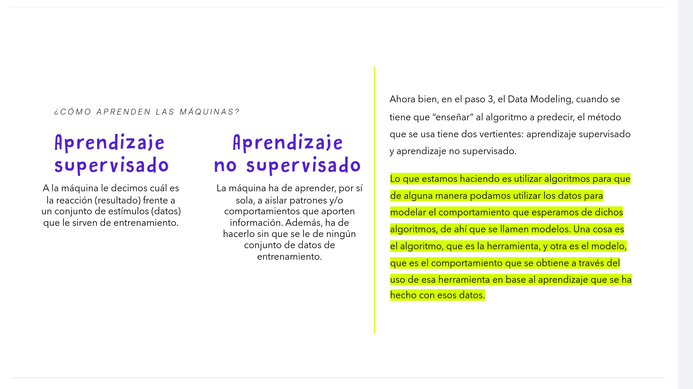
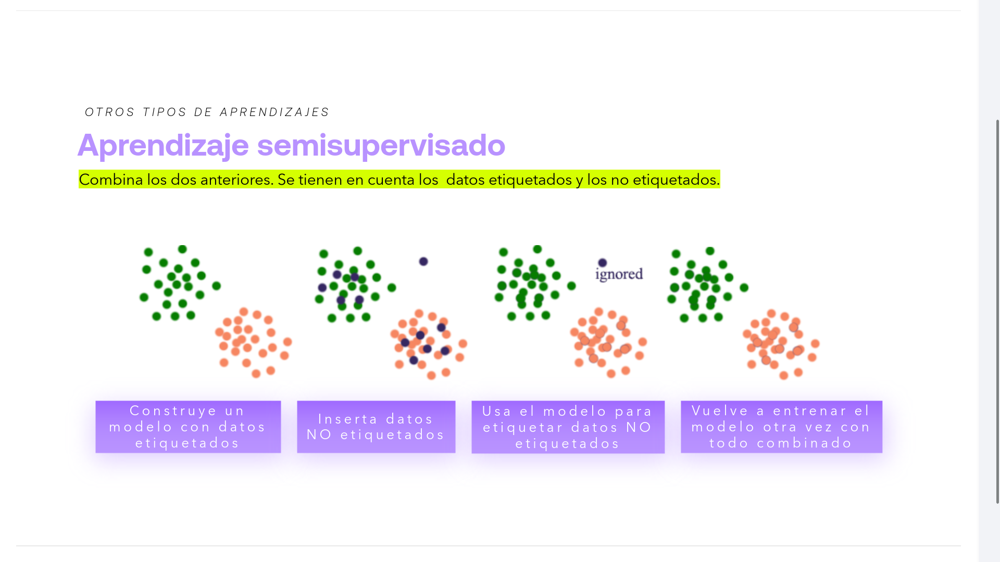
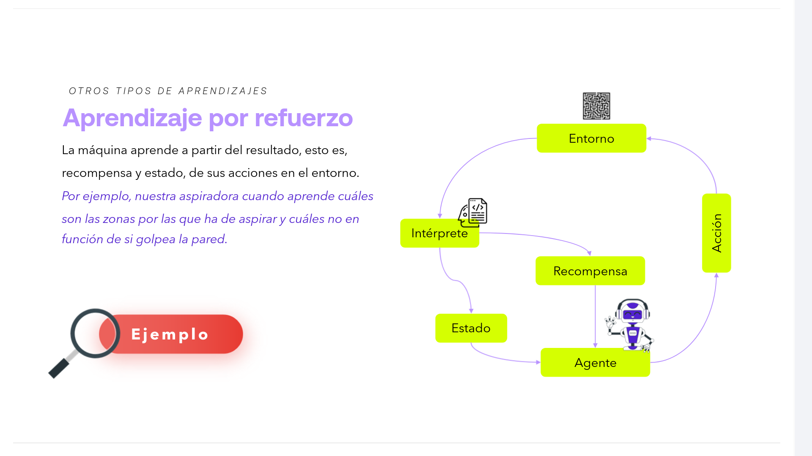
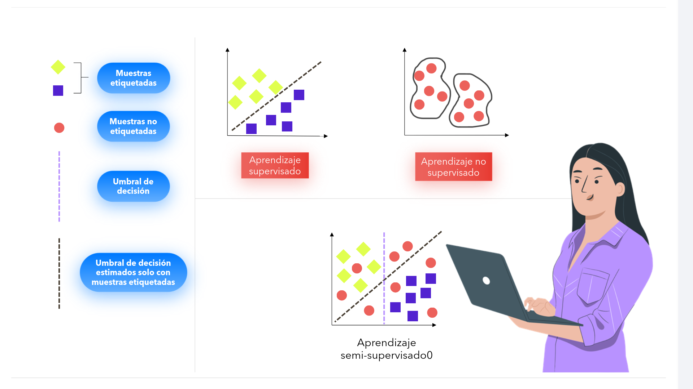

# 02-006:	Machine Learning (2)

## ¿Cómo aprenden las máquinas?

Hemos visto cuales son las 5 fases que involucran un proyecto de ML.  
Ahora vamos a ver qué tipos de metodos existen para hacer que los distintos algortimos aprendan y lleguen a generar los modelos que se utilizan para realizar los prototipos que nos interesan.

Existen distintos procecimientos.

1.  Aprendizaje **Supervisado**
    > En el supervisado el aprendizaje tiene lugar a partir de la imitación.

    A la máquina le decimos cuál es la reacción (resultado) frente a un conjunto de estímulos (datos) que le sirven de entrenamiento.

2.  Aprendizaje **No Supervisado**

    > El en no supervisado directamente desde el uso de la herramienta se deduce cuál es el mejor comportamiento

    La máquina ha de aprender, por sí sola, a aislar patrones y/o comportamientos que aporten información. Además, ha de hacerlo sin que se le dé ningún conjunto de datos de entrenamiento.

Ahora bien, en el paso 3, el *Data Modeling*, cuando se tiene que "enseñar" al algoritmo a predecir, el método que se usa tiene dos vertientes: **aprendizaje supervisado** y **aprendizaje no supervisado**.

> Lo que estamos haciendo es utilizar algoritmos para que de alguna manera podamos utilizar los datos para modelar el comportamiento que esperamos de dichos algoritmos, de ahí que se llamen **modelos**.  
> 
> Una cosa es el **algoritmo**, que es la herramienta, y otra es el **modelo**, que es el comportamiento que se obtiene a través del uso de esa herramienta en base al aprendizaje que se ha hecho con esos datos.

---

### 1.  Aprendizaje Supervisado

La máquina aprende a tomar decisiones a partir de ejemplos de datos anteriores disponibles.

> **Ejemplos de problemas:** Determinar si un correo es *spam*, lo cual es un problema de clasificación, o determinar el precio de un piso teniendo a otros de referencia, problema de regresión.

---

### 2.  Aprendizaje No Supervisado

La máquina de aprendizaje aprende a identificar patrones o tendencias dentro de los datos sin contar con ejemplos previos, es decir, lo hace por su cuenta.

> Algunos ejemplos que veremos después son agrupamiento por *k-medias*, análisis de componentes principales, etc.

---

## Otros tipos de aprendizajes

### 3.  Aprendizaje SEMISUPERVISADO

Combina los dos anteriores. Se tienen en cuenta los **datos etiquetados y los no etiquetados**.

1. **Construye un modelo** con datos etiquetados.
2. **Inserta datos** NO etiquetados.
3. **Usa el modelo** para etiquetar datos NO etiquetados.
4. **Vuelve a entrenar** el modelo otra vez con todo combinado.

---

### 4.  Aprendizaje POR REFUERZO

La máquina aprende a partir del resultado, esto es, recompensa y estado, de sus acciones en el entorno.

> *Por ejemplo, nuestra aspiradora cuando aprende cuáles son las zonas por las que ha de aspirar y cuáles no en función de si golpea la pared.*

- Ejemplo Video:  [ AI Learns to Park - Deep Reinforcement Learning ](https://www.youtube.com/watch?v=VMp6pq6_QjI)

---

Finalmente, comparamos todos los tipos de aprendizaje, y la combinación de todos:  

