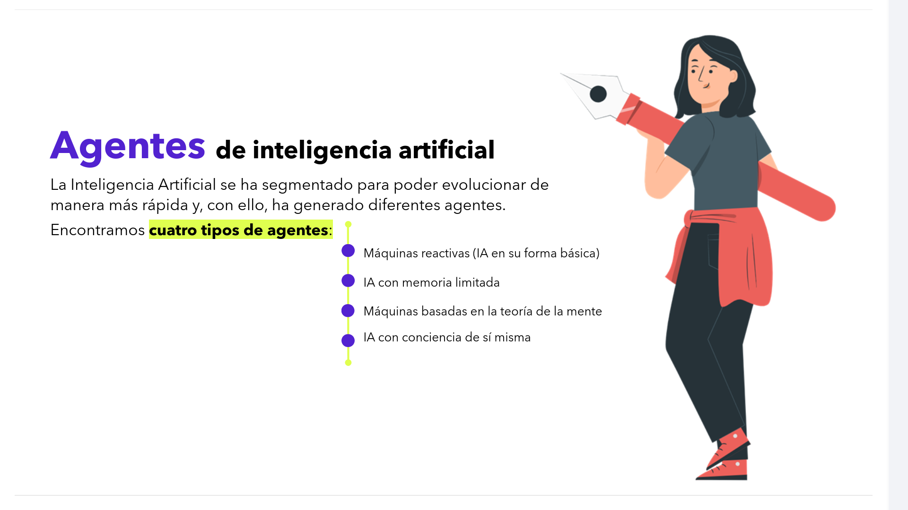
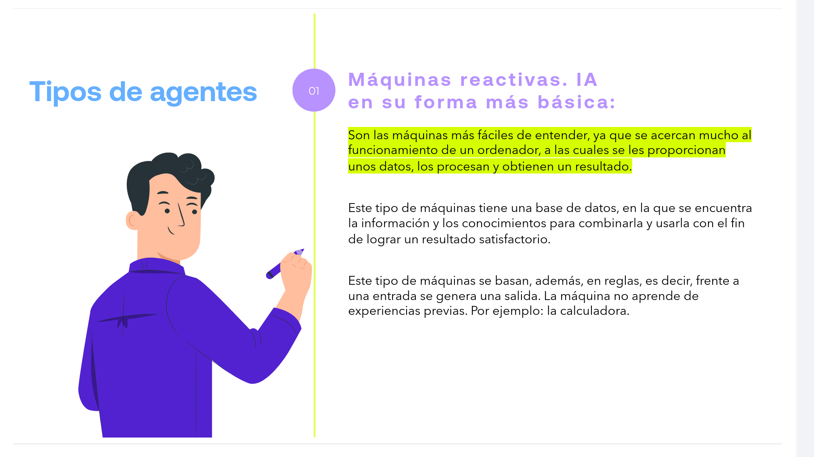
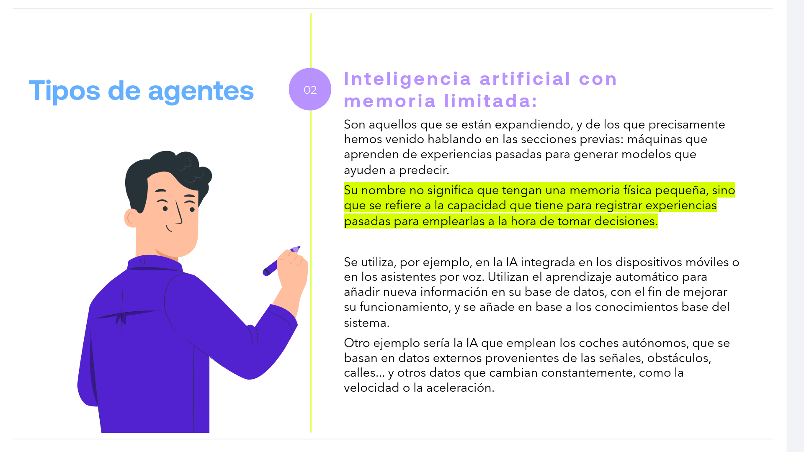
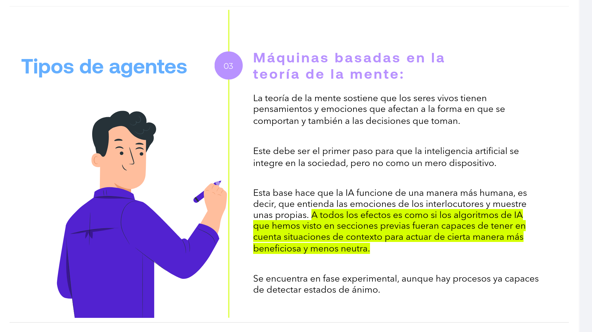
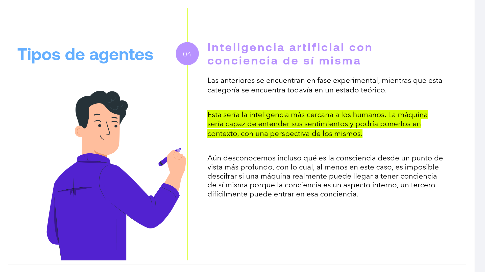

# 02-007:   Agentes de Inteligencia Artificial

La Inteligencia Artificial se ha segmentado para poder evolucionar de manera más rápida y, con ello, ha generado diferentes agentes.

Encontramos **cuatro tipos de agentes**:

*   Máquinas reactivas (IA en su forma básica)
*   IA con memoria limitada
*   Máquinas basadas en la teoría de la mente
*   IA con conciencia de sí misma

---

## Tipos de agentes

###  1. Máquinas reactivas. IA en su forma más básica:

==Son las máquinas más fáciles de entender, ya que se acercan mucho al funcionamiento de un ordenador, a las cuales se les proporcionan unos datos, los procesan y obtienen un resultado.==

Este tipo de máquinas tiene una base de datos, en la que se encuentra la información y los conocimientos para combinarla y usarla con el fin de lograr un resultado satisfactorio.

Este tipo de máquinas se basan, además, en reglas, es decir, frente a una entrada se genera una salida. La máquina no aprende de experiencias previas. Por ejemplo: la calculadora.

### 2. Inteligencia artificial con memoria limitada:

Son aquellos que se están expandiendo, y de los que precisamente hemos venido hablando en las secciones previas: máquinas que aprenden de experiencias pasadas para generar modelos que ayuden a predecir.

==Su nombre no significa que tengan una memoria física pequeña, sino que se refiere a la capacidad que tiene para registrar experiencias pasadas para emplearlas a la hora de tomar decisiones.==

Se utiliza, por ejemplo, en la IA integrada en los dispositivos móviles o en los asistentes por voz. Utilizan el aprendizaje automático para añadir nueva información en su base de datos, con el fin de mejorar su funcionamiento, y se añade en base a los conocimientos base del sistema.

Otro ejemplo sería la IA que emplean los coches autónomos, que se basan en datos externos provenientes de las señales, obstáculos, calles... y otros datos que cambian constantemente, como la velocidad o la aceleración.

### 3. Máquinas basadas en la teoría de la mente:

La teoría de la mente sostiene que los seres vivos tienen pensamientos y emociones que afectan a la forma en que se comportan y también a las decisiones que toman.

Este debe ser el primer paso para que la inteligencia artificial se integre en la sociedad, pero no como un mero dispositivo.

Esta base hace que la IA funcione de una manera más humana, es decir, que entienda las emociones de los interlocutores y muestre unas propias. ==A todos los efectos es como si los algoritmos de IA que hemos visto en secciones previas fueran capaces de tener en cuenta situaciones de contexto para actuar de cierta manera más beneficiosa y menos neutra.==

Se encuentra en fase experimental, aunque hay procesos ya capaces de detectar estados de ánimo.

### 4. Inteligencia artificial con conciencia de sí misma

Las anteriores se encuentran en fase experimental, mientras que esta categoría se encuentra todavía en un estado teórico.

==Esta sería la inteligencia más cercana a los humanos. La máquina sería capaz de entender sus sentimientos y podría ponerlos en contexto, con una perspectiva de los mismos.==

Aún desconocemos incluso qué es la conciencia desde un punto de vista más profundo, con lo cual, al menos en este caso, es imposible descifrar si una máquina realmente puede llegar a tener conciencia de sí misma porque la conciencia es un aspecto interno, un tercero difícilmente puede entrar en esa conciencia.

---

