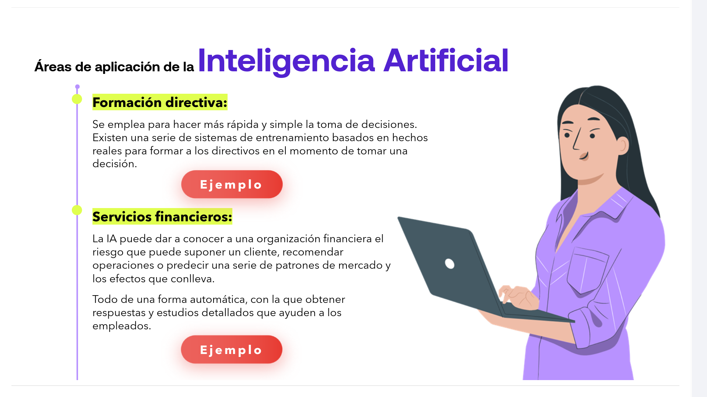
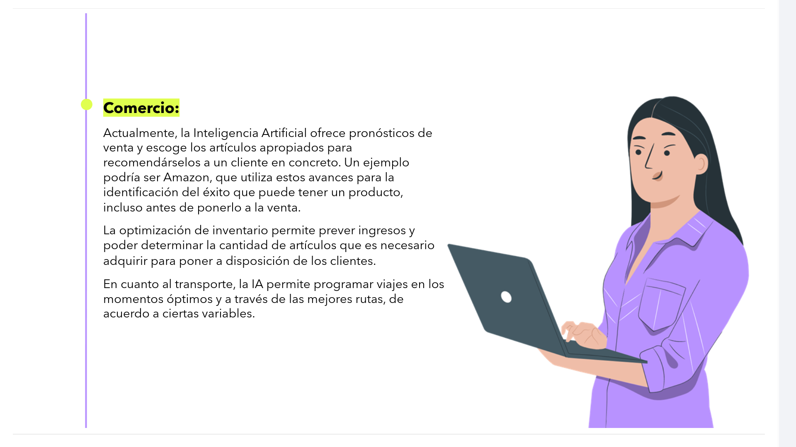
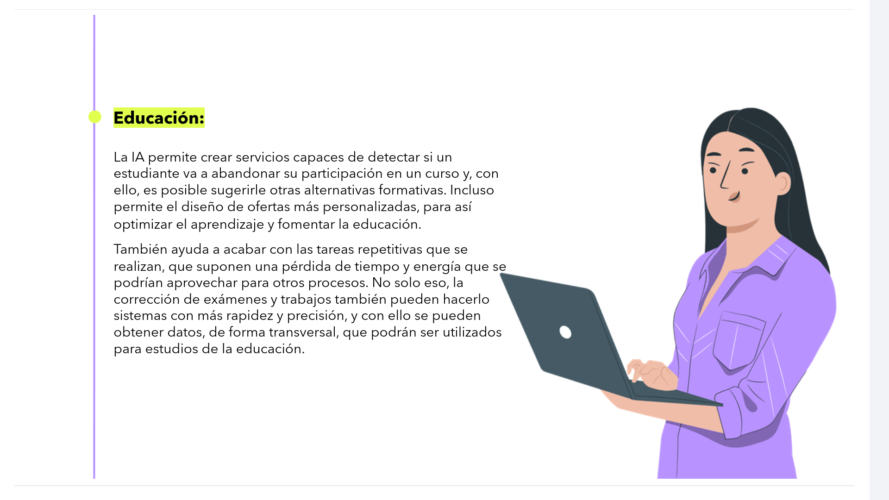
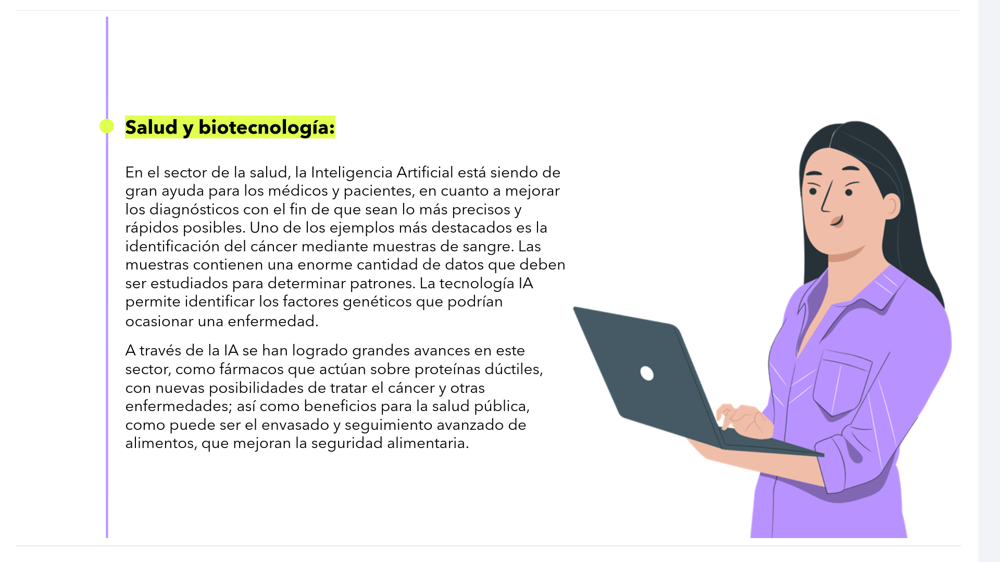
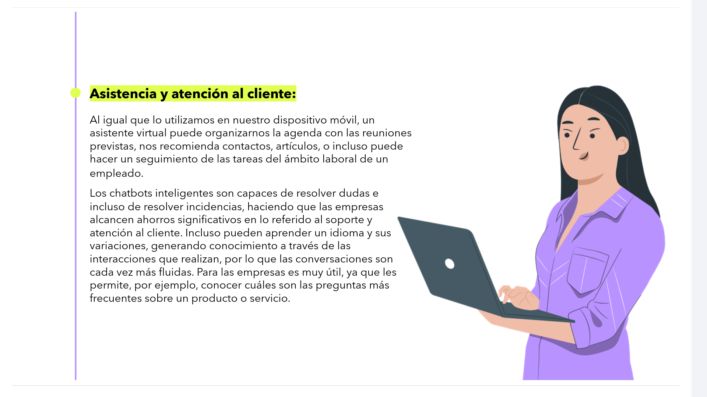
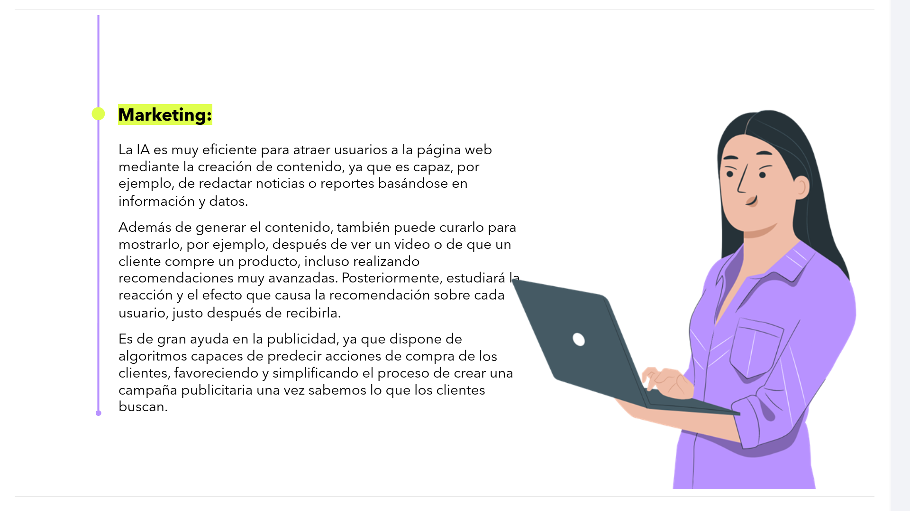
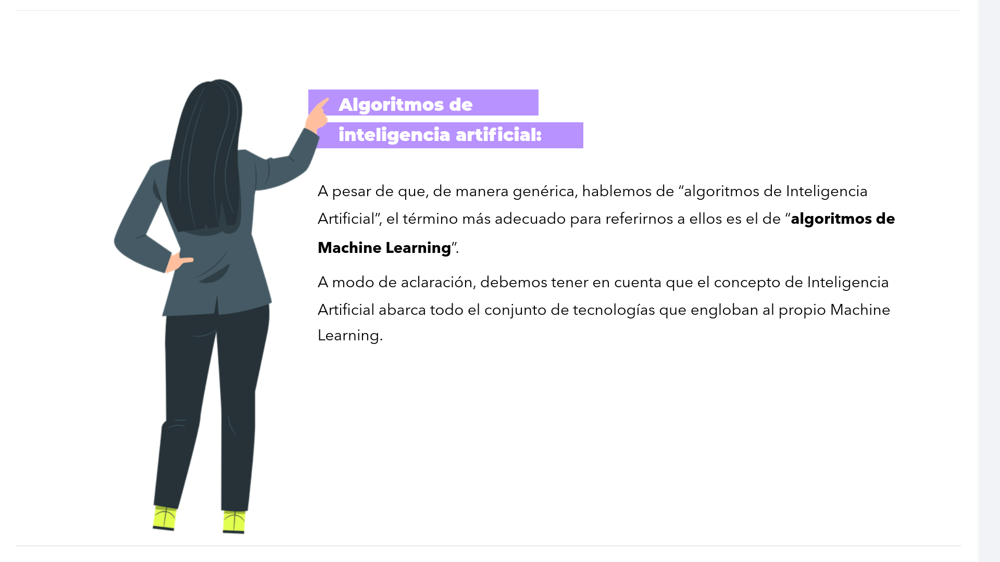

# 02-008:    Áreas de aplicación de la Inteligencia Artificial

1.  **Formación directiva:**

Se emplea para hacer más rápida y simple la toma de decisiones. Existen una serie de sistemas de entrenamiento basados en hechos reales para formar a los directivos en el momento de tomar una decisión.

2.  **Servicios financieros:**

La IA puede dar a conocer a una organización financiera el riesgo que puede suponer un cliente, recomendar operaciones o predecir una serie de patrones de mercado y los efectos que conlleva.  

Todo de una forma automática, con la que obtener respuestas y estudios detallados que ayuden a los empleados.

3.  **Comercio:**

Actualmente, la Inteligencia Artificial ofrece pronósticos de venta y escoge los artículos apropiados para recomendárselos a un cliente en concreto. Un ejemplo podría ser Amazon, que utiliza estos avances para la identificación del éxito que puede tener un producto, incluso antes de ponerlo a la venta.  

La optimización de inventario permite prever ingresos y poder determinar la cantidad de artículos que es necesario adquirir para poner a disposición de los clientes.  

En cuanto al transporte, la IA permite programar viajes en los momentos óptimos y a través de las mejores rutas, de acuerdo a ciertas variables.  

4.   **Educación:**

La IA permite crear servicios capaces de detectar si un estudiante va a abandonar su participación en un curso y, con ello, es posible sugerirle otras alternativas formativas. Incluso permite el diseño de ofertas más personalizadas, para así optimizar el aprendizaje y fomentar la educación.  

También ayuda a acabar con las tareas repetitivas que se realizan, que suponen una pérdida de tiempo y energía que se podrían aprovechar para otros procesos. No solo eso, la corrección de exámenes y trabajos también pueden hacerlo sistemas con más rapidez y precisión, y con ello se pueden obtener datos, de forma transversal, que podrán ser utilizados para estudios de la educación.  

5.  **Salud y biotecnología:**

En el sector de la salud, la Inteligencia Artificial está siendo de gran ayuda para los médicos y pacientes, en cuanto a mejorar los diagnósticos con el fin de que sean lo más precisos y rápidos posibles. Uno de los ejemplos más destacados es la identificación del cáncer mediante muestras de sangre. Las muestras contienen una enorme cantidad de datos que deben ser estudiados para determinar patrones. La tecnología IA permite identificar los factores genéticos que podrían ocasionar una enfermedad.  

A través de la IA se han logrado grandes avances en este sector, como fármacos que actúan sobre proteínas dúctiles, con nuevas posibilidades de tratar el cáncer y otras enfermedades; así como beneficios para la salud pública, como puede ser el envasado y seguimiento avanzado de alimentos, que mejoran la seguridad alimentaria.  

6.  **Asistencia y atención al cliente:**

Al igual que lo utilizamos en nuestro dispositivo móvil, un asistente virtual puede organizarnos la agenda con las reuniones previstas, nos recomienda contactos, artículos, o incluso puede hacer un seguimiento de las tareas del ámbito laboral de un empleado.  

Los chatbots inteligentes son capaces de resolver dudas e incluso de resolver incidencias, haciendo que las empresas alcancen ahorros significativos en lo referido al soporte y atención al cliente.  

Incluso pueden aprender un idioma y sus variaciones, generando conocimiento a través de las interacciones que realizan, por lo que las conversaciones son cada vez más fluidas.  

Para las empresas es muy útil, ya que les permite, por ejemplo, conocer cuáles son las preguntas más frecuentes sobre un producto o servicio.

7.   **Marketing:**

La IA es muy eficiente para atraer usuarios a la página web mediante la creación de contenido, ya que es capaz, por ejemplo, de redactar noticias o reportes basándose en información y datos.  

Además de generar el contenido, también puede curarlo para mostrarlo, por ejemplo, después de ver un video o de que un cliente compre un producto, incluso realizando recomendaciones muy avanzadas. Posteriormente, estudiará la reacción y el efecto que causa la recomendación sobre cada usuario, justo después de recibirla.  

Es de gran ayuda en la publicidad, ya que dispone de algoritmos capaces de predecir acciones de compra de los clientes, favoreciendo y simplificando el proceso de crear una campaña publicitaria una vez sabemos lo que los clientes buscan.

---

## Algoritmos de inteligencia artificial

A pesar de que, de manera genérica, hablemos de “algoritmos de Inteligencia Artificial”, el término más adecuado para referirnos a ellos es el de **“algoritmos de Machine Learning”**.

A modo de aclaración, debemos tener en cuenta que el concepto de Inteligencia Artificial abarca todo el conjunto de tecnologías que engloban al propio Machine Learning.
