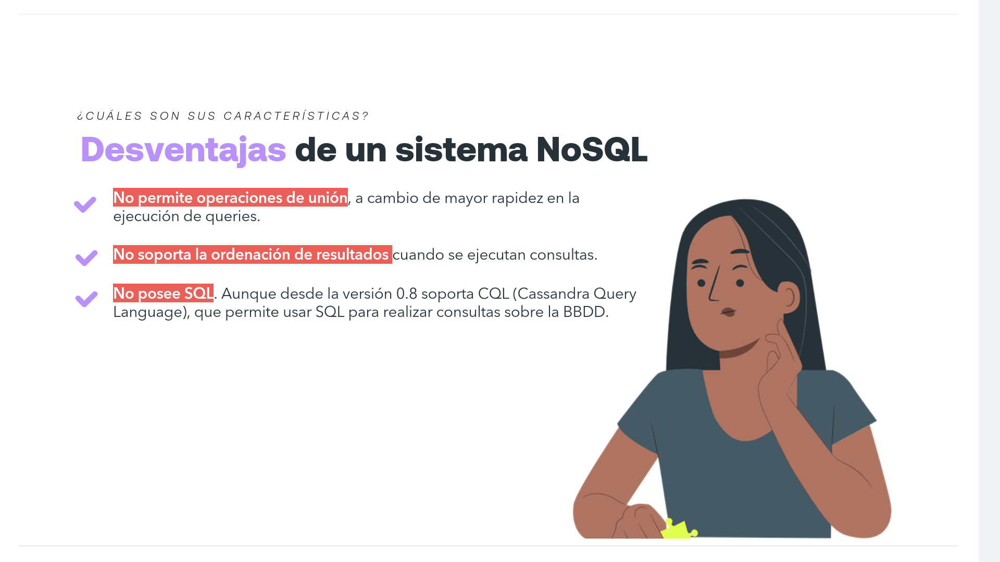
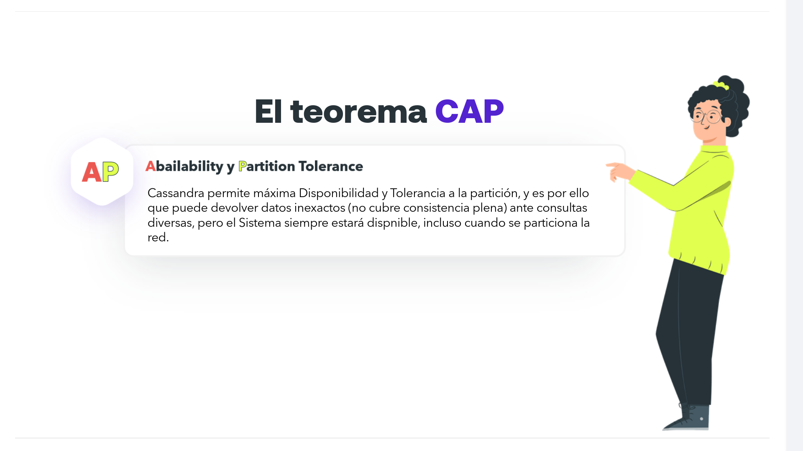
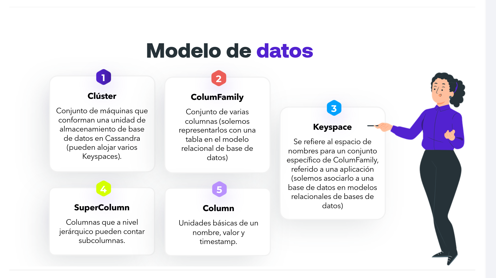
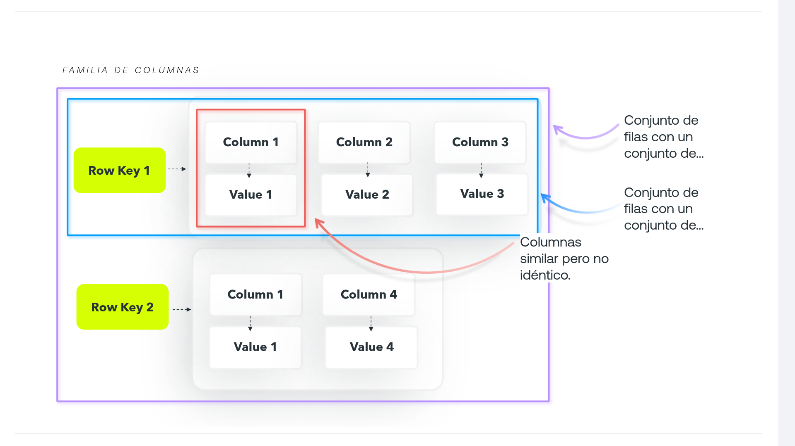
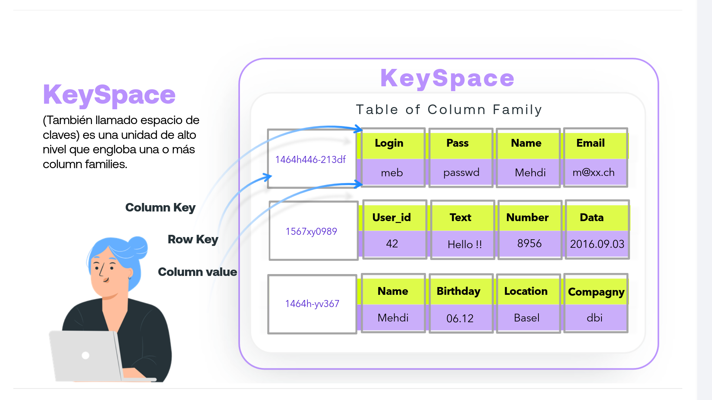
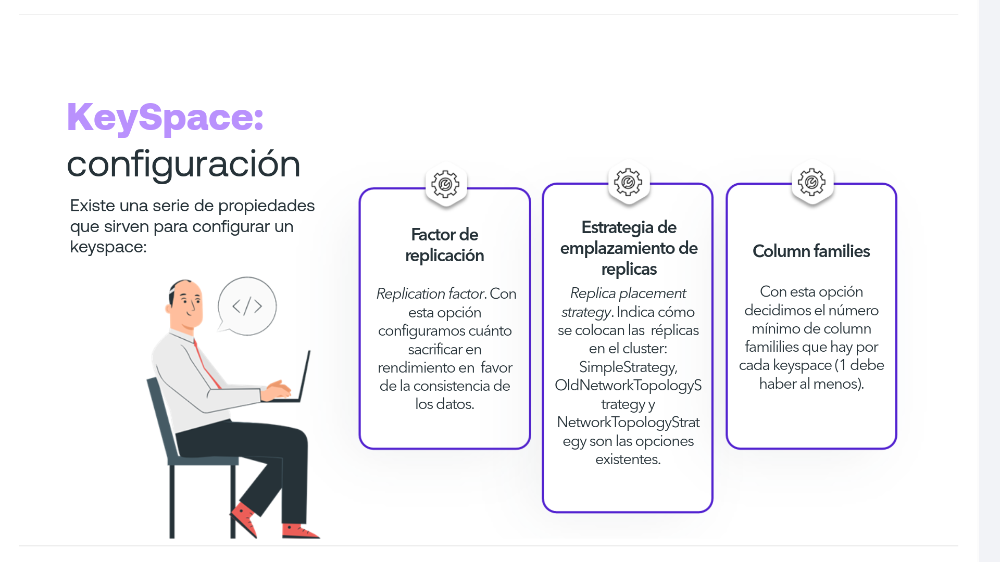
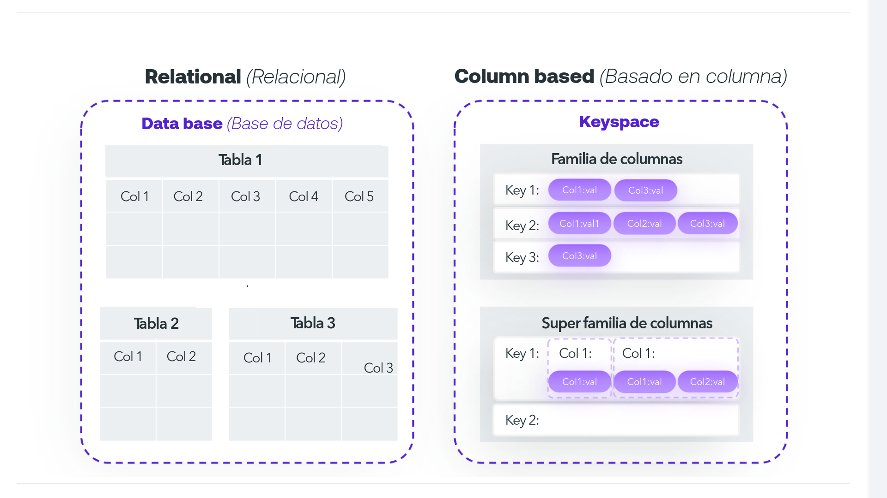

# 03-003:   Apache Cassandra


> **Apache Cassandra** es un motor de almacenamiento **NoSQL** altamente escalable, consistente y distribuido de estructuras *clave-valor*.

## Datos Clave

* **Origen:** Iniciado por *Facebook*.
* **Modelo:** Código abierto (*Open Source*).
* **Ecosistema:** Proyecto de la *Apache Software Foundation*.
* **Licencia:** *Apache License 2.0*.
* **Lenguaje:** Escrito en *Java*.
* **Compatibilidad:** Multiplataforma.

---

## Casos de Uso y Clientes


Algunos de los clientes más relevantes que utilizan Cassandra en producción incluyen:

* **Netflix**
* **Twitter**
* **Cisco**
* **Digg**

> 💡 **Nota:** Apache Cassandra destaca principalmente por su **escalabilidad masiva** y **consistencia**, fundamentándose en un modelo de datos orientado a *clave-valor*.

---


## Características


### Ventajas para Desarrolladores

*   📈 **Escalabilidad:** Gracias a su alta capacidad de escalado, Cassandra garantiza la disponibilidad del servicio en todo momento, incluso durante picos críticos de tráfico.

*   🔄 **Alta Disponibilidad:** A través de la replicación de datos en diversas ubicaciones geográficas y distintos centros de datos (*Data Centers*), asegura la redundancia del sistema.

*   🛡️ **Alta Tolerancia a Fallos:** Mediante su arquitectura *Peer-to-Peer* (P2P) y sus mecanismos de replicación, las aplicaciones mantienen su rendimiento sin degradación ni caídas cuando uno o varios nodos se desconectan.


### Rendimiento e Infraestructura


* ⚡ **Alto Rendimiento:** Es uno de sus pilares fundamentales. La arquitectura está optimizada para ofrecer la máxima velocidad posible en operaciones de lectura y escritura.

* 🌐 **Soporte Multi-Centro de Datos y Nube Híbrida:** Permite operar entre múltiples centros de datos físicos y entornos de nube híbrida de forma nativa, facilitando el despliegue distribuido a gran escala.


### Limitaciones de un Sistema NoSQL



*   ❌ **Sin operaciones de Unión (`JOIN`):** Prescinde de las uniones relacionales a cambio de maximizar la velocidad de ejecución en las consultas.

*   ❌ **Sin ordenación nativa arbitraria:** No soporta la ordenación dinámica de resultados durante el tiempo de ejecución de las consultas.

*   ⚠️ **Ausencia de SQL Tradicional:** No utiliza SQL estándar; sin embargo, desde la versión `0.8` implementa **CQL** (*Cassandra Query Language*), ofreciendo una sintaxis similar a SQL para consultar la base de datos.

---


## Arquitectura Interna


### 1️⃣ Protocolo Gossip

* Implementa el protocolo peer-to-peer **Gossip**, mediante el cual cada nodo intercambia información de estado periódicamente con los demás nodos de la red.
* Otorga descentralización total y alta tolerancia a la partición de datos.

> ℹ️ *A ojos del cliente, la red distribuida de nodos actúa de forma transparente como si fuese un único equipo centralizado.*


### 2️⃣ Arquitectura en Clúster

* La topología estándar de Cassandra se basa en un **Clúster**, donde cada máquina o nodo almacena réplicas para rangos específicos de datos.
* Ante el fallo o caída de un nodo, las réplicas secundarias asumen la carga y responden a las peticiones sin interrupción.

> ℹ️ *El cliente recibe la respuesta de manera transparente, sin necesidad de conocer qué nodo específico procesó la solicitud.*

---

##  El teorema CAP




### **Availability** y **Partition Tolerance** (AP)

> Cassandra permite **máxima Disponibilidad** y **Tolerancia a la partición**. Es por ello que puede devolver datos inexactos (no cubre consistencia plena de forma nativa e inmediata) ante consultas diversas, pero el sistema siempre estará disponible, incluso cuando se particiona o cae la red.

-   Según el Teorema CAP una base de datos distribuida solo puede garantizar 2 de 3 propiedades a la vez: 

    -   Consistencia (*Consistency*)
    -   Disponibilidad (*Availability*)
    -   Tolerancia a particiones (*Partition Tolerance*). 

Cassandra prioriza ser un sistema **AP**: ante un corte de comunicación entre nodos, el sistema nunca rechaza una petición y sigue respondiendo rápidamente, sacrificando la consistencia estricta instantánea (*eventual consistency*).

---


## Modelo de datos



La arquitectura de datos en Cassandra sigue una jerarquía clara organizada de la siguiente manera:

1.  **Clúster:** Conjunto de máquinas que conforman una unidad de almacenamiento de base de datos en Cassandra (pueden alojar varios Keyspaces).

2.  **Keyspace:** Se refiere al espacio de nombres para un conjunto específico de ColumnFamily, referido a una aplicación (solemos asociarlo a una base de datos en modelos relacionales).

3.  **ColumnFamily:** Conjunto de varias columnas (solemos representarlos con una tabla en el modelo relacional de base de datos).

4.  **SuperColumn:** Columnas que a nivel jerárquico pueden contar con subcolumnas.

5.  **Column:** Unidades básicas compuestas por un nombre, un valor y un *timestamp*.


### Column


Es un par **nombre-valor** que, además, contiene una marca de tiempo o *timestamp*.

*   En los pares se almacenan arrays de bytes.

*   El *timestamp* establece la vez más reciente que una columna fue modificada (crucial para resolver conflictos de escritura en entornos distribuidos).

*   **Tripleta:** `name:value:timestamp`  
    *Ejemplo:* `Nombre:Pedro Martínez Pérez:987654321`

- **Ejemplo en formato JSON:**

```json
{  
  "name": "Nombre",  
  "value": "Pedro Martínez Pérez",  
  "timestamp": 987654321  
}
```


### Contenedor de columnas (Column Family)


Mismo concepto que las tablas en bases de datos relacionales tipo SQL.

* Aloja una lista de columnas ordenada.
* Cada *column family* se almacena en un fichero independiente en disco, el cual se ordena internamente por la **clave de fila** (*Row Key*).


#### Estructura de Familia de Columnas



En el modelo de datos de Cassandra, las filas de una misma *Column Family* no necesitan compartir el mismo esquema de columnas:

*   **Row Key 1** ➔ Contiene `Column 1: Value 1`, `Column 2: Value 2` y `Column 3: Value 3`.

*   **Row Key 2** ➔ Contiene únicamente `Column 1: Value 1` y `Column 4: Value 4`.

> 💡     A diferencia de SQL donde todas las filas comparten columnas fijas (incluso si son nulas), en Cassandra cada registro o *Row Key* solo almacena las columnas que realmente necesita. Son estructuras dinámicas y con esquemas flexibles.


### KeySpace



(También llamado espacio de claves) Es una unidad de alto nivel que engloba una o más *column families*.

En la representación interna:

*   **Row Key:** Clave identificadora de la fila (ej. `1464h446-213df`).
*   **Column Key:** Nombre o identificador del campo (ej. `Login`, `Pass`, `Name`, `Email`).
*   **Column Value:** Valor guardado en dicho campo (ej. `meb`, `passwd`, `Mehdi`, `m@xx.ch`).


#### KeySpace: Configuración



Existe una serie de propiedades que sirven para configurar un *keyspace*:

*   **Factor de replicación (*Replication factor*):** Con esta opción configuramos cuánto sacrificar en rendimiento en favor de la consistencia de los datos (indica el número exacto de copias de los datos en distintos nodos).

*   **Estrategia de emplazamiento de réplicas (*Replica placement strategy*):** Indica cómo se colocan las réplicas en el clúster. Las opciones existentes son `SimpleStrategy`, `OldNetworkTopologyStrategy` y `NetworkTopologyStrategy`.

*   **Column families:** Con esta opción decidimos el número mínimo de *column families* que hay por cada *keyspace* (debe haber al menos 1).

---


## BBDD Relacionales vs. Cassandra


### **BBDD Relacionales**

*   Cassandra no ofrece un lenguaje de consulta relacional tradicional, aunque sí existe desde la versión 0.8 **CQL** (*Cassandra Query Language*), basado en sintaxis SQL.

*   Cassandra no implementa integridad referencial (no existen comandos `JOIN`), aunque se puede emular alojando datos duplicados en otras filas dentro de un *column family*.

### **Cassandra**
*   Cassandra ofrece un rendimiento muy superior trabajando con **datos desnormalizados**.
*   Permite modelar primero las consultas específicas de la aplicación y luego definir la estructura de datos a su alrededor.

> 💡  **Cassandra tiene un modelo orientado al diseño de consultas primero, no a las entidades.**





| Concepto Relacional | Concepto en Cassandra |
| :--- | :--- |
| **Database** (Base de datos) | **Keyspace** |
| **Tabla** (Filas fijas y rígidas) | **Familia de columnas** (*Column Family*) |
| **Relaciones/Subtablas** | **Super familia de columnas** (*SuperColumn*) |

* **Modelado Relacional:** Datos estructurados en tablas strictly compuestas por columnas predefinidas (`Col 1`, `Col 2`, `Col 3`).
* **Modelado Basado en Columnas:** Datos almacenados dinámicamente como mapa de mapas (`Key 1` ➔ `Col1:val1`, `Col3:val3`). Cada *Row Key* guarda de forma independiente sus pares clave-valor.

