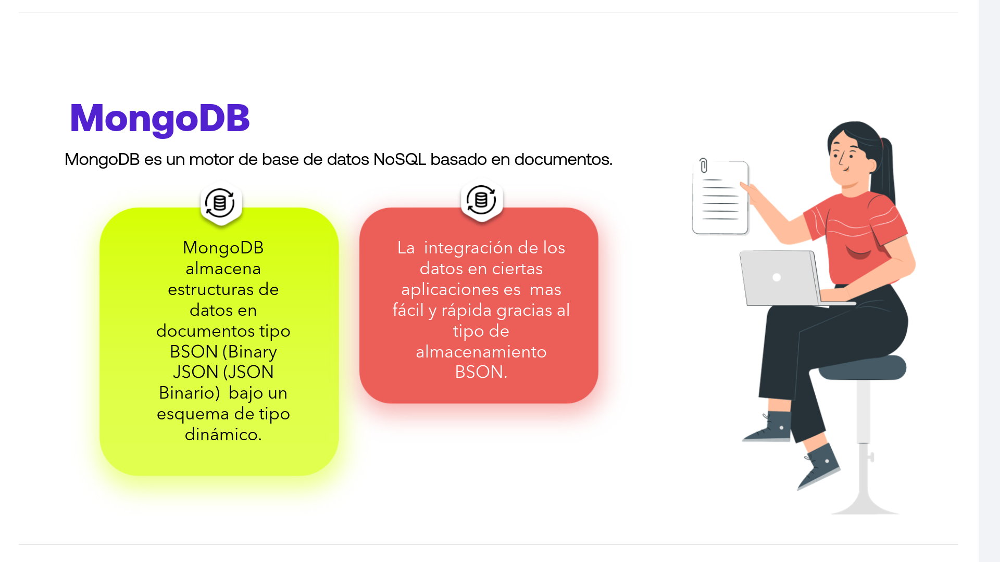
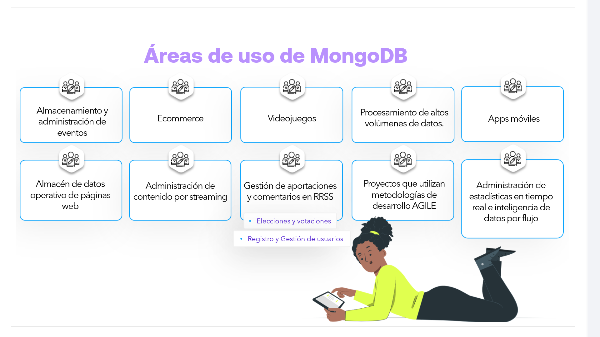
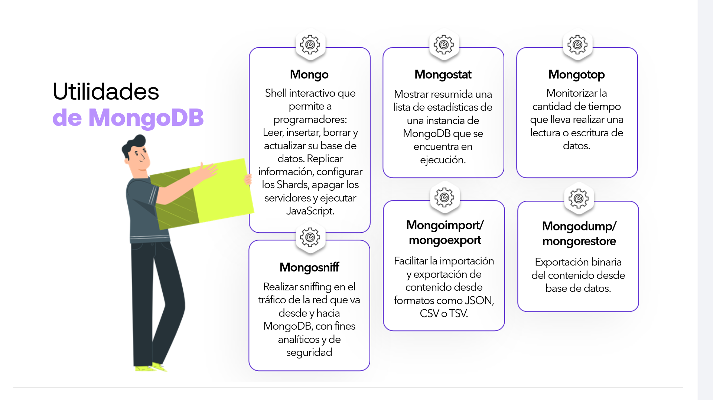

# 03-004:   MongoDB

Combina lo mejor de los motores de almacenamiento clave/valor, bases de datos basadas en documentos y bases de datos relacionales (SQL): 

*   Hace uso extensivo de JSON.
*   Tiene su propio lenguaje para la realización de consultas.
*   Usada por empresas como SourceForge, Bit.ly, Foursquare o GitHub.

MongoDB es un motor de base de datos NoSQL basado en documentos:  

*   **Almacenamiento BSON:** MongoDB almacena estructuras de datos en documentos tipo BSON (Binary JSON) bajo un esquema de tipo dinámico.
*   **Integración ágil:** La integración de los datos en ciertas aplicaciones es más fácil y rápida gracias al tipo de almacenamiento BSON.

---

## Características de MongoDB

1. **Sporta consultas ad hoc:** En MongoDB, se puede buscar por campo, consulta de rango y también soporta búsquedas de expresiones regulares.

2. **Replicación:** MongoDB soporta la replicación maestro-esclavo. Un maestro puede realizar lecturas y escrituras y un esclavo copia los datos del maestro y sólo puede ser utilizado para lecturas o copias de seguridad (no escrituras).

3. **Indexación:** Puede indexar cualquier campo de un documento.

4. **Duplicación de datos:** MongoDB puede funcionar en varios servidores. Los datos se duplican para mantener el sistema y también mantener su estado de funcionamiento en caso de fallo de hardware.

5. **Equilibrio de carga:** Tiene una configuración de balanceo de carga automático debido a que los datos se colocan en shards.

6. **Herramientas de agregación:** Soporta herramientas de map reduce y agregación.

7. **Uso de scripts:** Utiliza JavaScript en lugar de Procedimientos.

8. **Arquitectura:** Es una base de datos sin esquema escrita en C++.

9. **Rendimiento:** Proporciona un alto rendimiento.

10. **Manejo de archivos:** Almacena fácilmente archivos de cualquier tamaño sin complicar su pila.

11. **Mantenimiento:** Fácil de administrar en caso de fallos.

---

#### MongoDB también soporta

*   Modelo de datos JSON con esquemas dinámicos.
    

*   Auto-sharding para escalabilidad horizontal.

*   Replicación incorporada para una alta disponibilidad.

---

## Áreas de uso de MongoDB

* Almacenamiento y administración de eventos

* Ecommerce

* Videojuegos

* Procesamiento de altos volúmenes de datos

* Apps móviles

* Almacén de datos operativo de páginas web

* Administración de contenido por streaming

* Gestión de aportaciones y comentarios en RRSS
  * Elecciones y votaciones
  * Registro y Gestión de usuarios

* Proyectos que utilizan metodologías de desarrollo AGILE

* Administración de estadísticas en tiempo real e inteligencia de datos por flujo

---

## Manipulación de Datos

MongoDB almacena la estructura de los datos en documentos JSON con bajo esquema dinámico llamado BSON, lo que implica que no cuenta con un esquema definido a priori.

1. **Documentos y colecciones:** Los elementos de los datos se llaman documentos y se ubican en colecciones.

2. **Estructura flexible:** Una colección puede disponer de documentos ilimitados. Las colecciones son algo así como tablas y los documentos análogas a las filas. Cada documento en una colección puede tener diferentes campos.

3. **Pares clave-valor:** La estructura de cada documento es sencilla y se compone por pares clave-valor: como valor se aceptan números, strings o datos binarios (imágenes, audio, vídeo).

## Utilidades de MongoDB

* **Mongo:** Shell interactivo que permite a programadores: Leer, insertar, borrar y actualizar su base de datos. Replicar información, configurar los Shards, apagar los servidores y ejecutar JavaScript.
* **Mongostat:** Mostrar resumida una lista de estadísticas de una instancia de MongoDB que se encuentra en ejecución.
* **Mongotop:** Monitorizar la cantidad de tiempo que lleva realizar una lectura o escritura de datos.
* **Mongosniff:** Realizar sniffing en el tráfico de la red que va desde y hacia MongoDB, con fines analíticos y de seguridad.
* **Mongoimport / mongoexport:** Facilitar la importación y exportación de contenido desde formatos como JSON, CSV o TSV.
* **Mongodump / mongorestore:** Exportación binaria del contenido desde base de datos.

### GridFS

Es una herramienta muy útil para el almacenamiento de ficheros grandes en MongoDB.

* MongoDB permite almacenar datos binarios en objetos BSON, pero su límite de tamaño es 16 MB.
* GridFS proporciona un mecanismo para dividir un archivo grande en varios documentos de menor tamaño.
