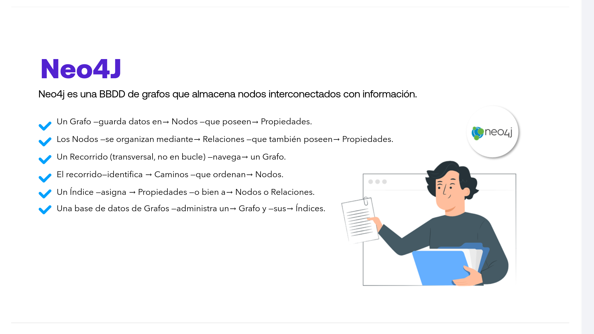
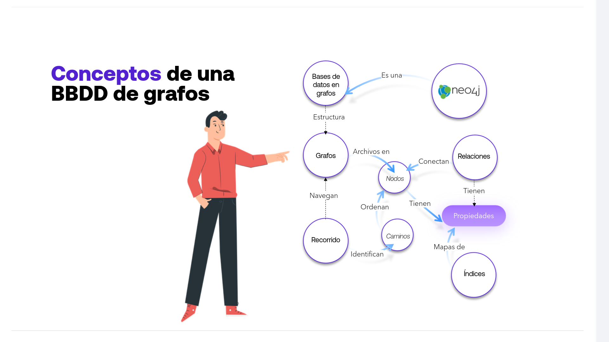
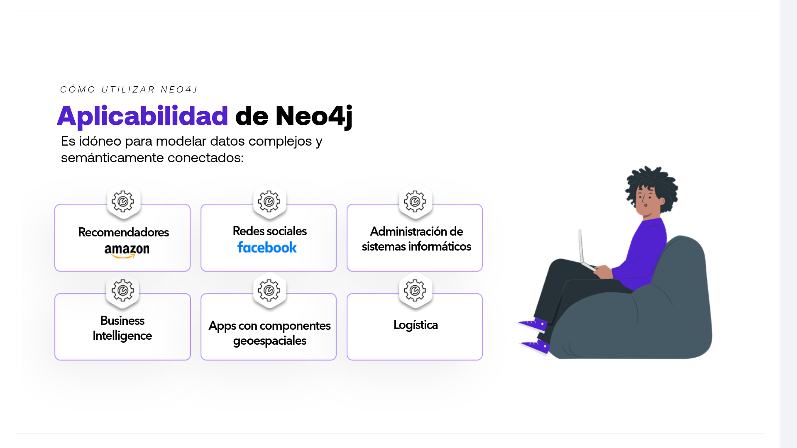
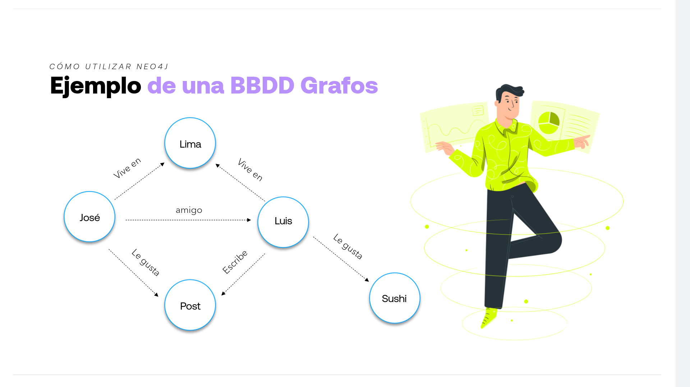
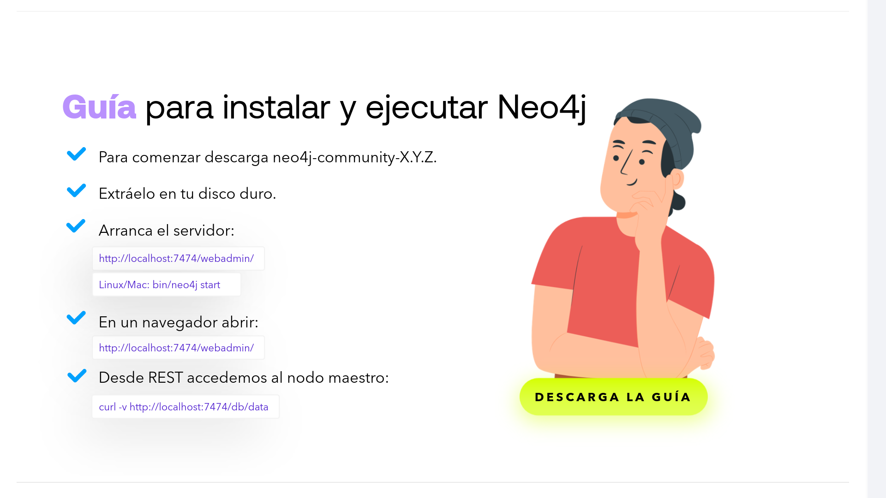
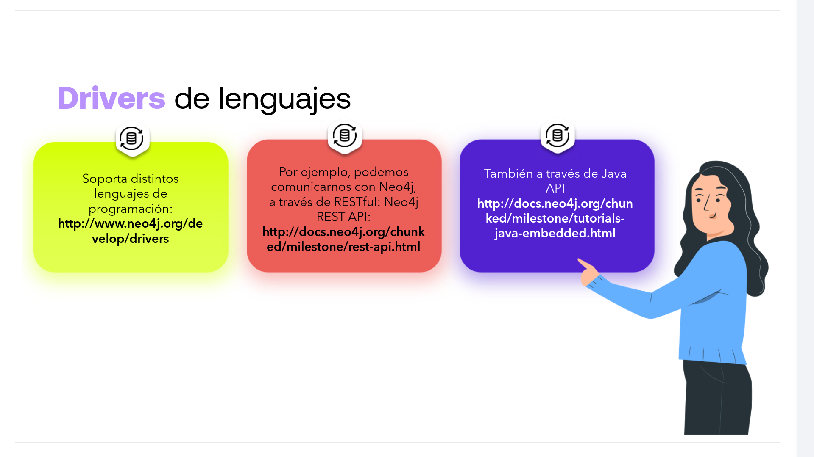
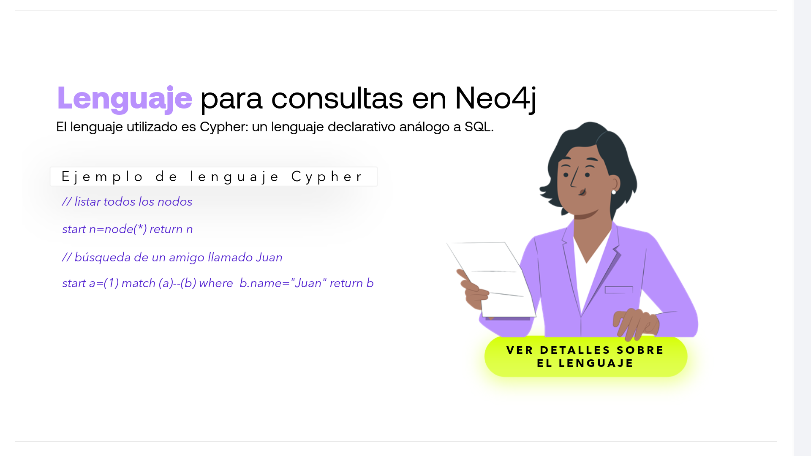
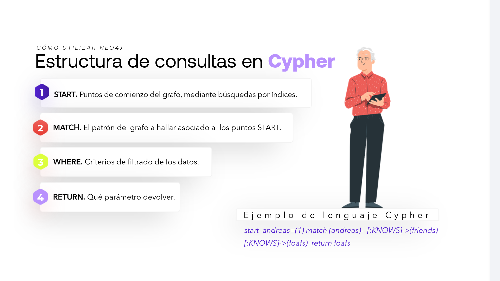

# 03-005:   Neo4J



Neo4j es una BBDD de grafos que almacena nodos interconectados con información:  

*   Un **Grafo** → **guarda datos** en → **Nodos** que poseen → **Propiedades**

*   Los **Nodos** → se **organizan** mediante → **Relaciones** que también **poseen** → **Propiedades**
*   Un **Recorrido** (transversal, no en bucle) → **navega** → un **Grafo**

*   El **recorrido** → **identifica** → **Caminos** → que **ordenan** → **Nodos**

*   Un **Índice** → **asigna** → **Propiedades** → o bien a **Nodos** o **Relaciones**

*   Una **base de datos de Grafos** → **administra** → un **Grafo** → y sus **Índices**

---


## Conceptos de una BBDD de grafos



Neo4j es un motor de **Bases de datos en grafos** cuya **Estructura** principal son los **Grafos**.  

La relación y funcionamiento entre sus componentes clave se organiza de la siguiente manera:  

*   **Grafos, Nodos y Relaciones:** Un Grafo **archiva en** múltiples **Nodos** los datos principales. Las **Relaciones** **conectan** estos Nodos entre sí para darles contexto sintáctico y semántico.

* **Propiedades:** Tanto los Nodos como las Relaciones **tienen** **Propiedades** (atributos o pares clave-valor que añaden detalle a las entidades y a sus enlaces).

* **Navegación y Caminos:** Para consultar la información, los algoritmos de **Recorrido** **navegan** por el Grafo. Estos recorridos **identifican** **Caminos**, los cuales a su vez **ordenan** los **Nodos** en la secuencia en que son visitados.

* **Indexación:** Los **Índices** **mapas de** **Propiedades**, acelerando las búsquedas y el acceso rápido a Nodos o Relaciones específicas dentro del motor.


### Las BBDD de grafos


1. Las BBDD de grafos están especialmente indicadas para modelar datos enlazados por semántica.
2. Cualquier área puede ser representada como un grafo y por tanto administrada por Neo4j.

> **NOTA IMPORTANTE**
> Una base de datos tradicional, puede devolver rápidamente el promedio de ingresos de todos los empleados de una multinacional, pero una base de datos de grafos, puede retornar quién de ellos es más probable que te invite a cenar.

---


## Características de Neo4j

Es una Base de datos de grafos con:  

*   **Alto rendimiento** y gran disponibilidad (escalabilidad en operaciones de lectura). Soporte potente para transacciones ACID.

*   **Escalable.** Gestión eficiente de miles de millones de Nodos, miles de millones de Relaciones, 2x miles de millones de Propiedades.

*   **Soporte potente** para transacciones ACID.

*   **Servidor con API** RESTful o con SDK de biblioteca Java.


### Casos de Uso de Neo4J



Es idóneo para modelar datos complejos y semánticamente conectados:

* Recomendadores (ej. Amazon)
* Redes sociales (ej. Facebook)
* Administración de sistemas informáticos
* Business Intelligence
* Apps con componentes geoespaciales
* Logística

---


## Ejemplo de una BBDD Grafos



* **José** *amigo* -> **Luis**
* **José** *Vive en* -> **Lima**
* **Luis** *Vive en* -> **Lima**
* **José** *Le gusta* -> **Post**
* **Luis** *Escribe* -> **Post**
* **Luis** *Le gusta* -> **Sushi**

---


## Guía para instalar y ejecutar Neo4j



* Para comenzar descarga `neo4j-community-X.Y.Z`.
* Extráelo en tu disco duro.
* Arranca el servidor:
  * `http://localhost:7474/webadmin/`
  * Linux/Mac: `bin/neo4j start`
* En un navegador abrir:
  * `http://localhost:7474/webadmin/`
* Desde REST accedemos al nodo maestro:
  * `curl -v http://localhost:7474/db/data`


## Drivers de lenguajes



* Soporta distintos lenguajes de programación: `http://www.neo4j.org/develop/drivers`

* Por ejemplo, podemos comunicarnos con Neo4j, a través de **RESTful: Neo4j REST API**: `http://docs.neo4j.org/chunked/milestone/rest-api.html`

* También a través de **Java API**: `http://docs.neo4j.org/chunked/milestone/tutorials-java-embedded.html`


---

## CYPHER:  Lenguaje para consultas en Neo4J




- El lenguaje utilizado es **Cypher**, un lenguaje declarativo análogo a SQL.

- MANDOCS:  https://neo4j.com/docs/cypher/

Ejemplo de lenguaje Cypher:

```cypher
// listar todos los nodos
start n=node(*) return n

// búsqueda de un amigo llamado Juan
start a=(1) match (a)--(b) where b.name="Juan" return b
```


### Estructura de consultas en Cypher




1. **START:** Puntos de comienzo del grafo, mediante búsquedas por índices.

2. **MATCH:** El patrón del grafo a hallar asociado a los puntos START.

3. **WHERE:** Criterios de filtrado de los datos.

4. **RETURN:** Qué parámetro devolver.

**Ejemplo de lenguaje Cypher**

```cypher
start andreas=(1) match (andreas)-[:KNOWS]->(friends)-[:KNOWS]->(foafs) return foafs
```


### HTTP Console


Opción para experimentar con la API REST.

- [Neo4j REST API Documentation v3.5](https://neo4j.com/docs/rest-docs/current/)

**Ejemplos**:


-   `get /`  - La URL raíz del servidor
-   `get /db/data` - La raíz del acceso a datos
-   `get /db/data/node/0` - Nodo 0
-   `get /db/data/node/0/relationships/in` - relaciones entrantes
