# 03-006:   REDIS


# **Redis**


**Redis es un almacén de servidores con estructura de datos.**

* Almacena datos en forma de pares clave/valor.
* La consistencia está garantizada al soportar "append-only file" y la disponibilidad de los datos está garantizada a través de la replicación en cluster y maestro-esclavo.
* También tiene tipos de valores muy interesantes: listas, conjuntos y conjuntos ordenados y tablas Hash.

---


## **Tipos de datos de Redis**

### Strings - Cadenas

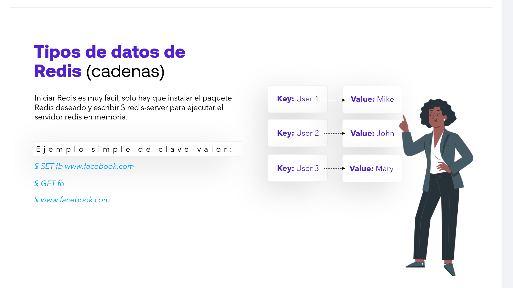

Iniciar Redis es muy fácil, solo hay que instalar el paquete Redis deseado y escribir `$ redis-server` para ejecutar el servidor redis en memoria.

- Ejemplo simple de clave-valor:


```REDIS
$ SET fb [www.facebook.com](https://www.facebook.com)

$ GET fb

$ [www.facebook.com](https://www.facebook.com)

```

* **Key:** User 1 $\rightarrow$ **Value:** Mike
* **Key:** User 2 $\rightarrow$ **Value:** John
* **Key:** User 3 $\rightarrow$ **Value:** Mary

---

### Hash


* Los Hashes son como Objetos Redis anidados que pueden incluir cualquier número de pares clave-valor.
* Una sola clave de Redis puede ser utilizada para recuperar todos los valores del hash.

-   Ejemplo:  `$HMSET user:eric name "Eric Redmond" password s3cret`

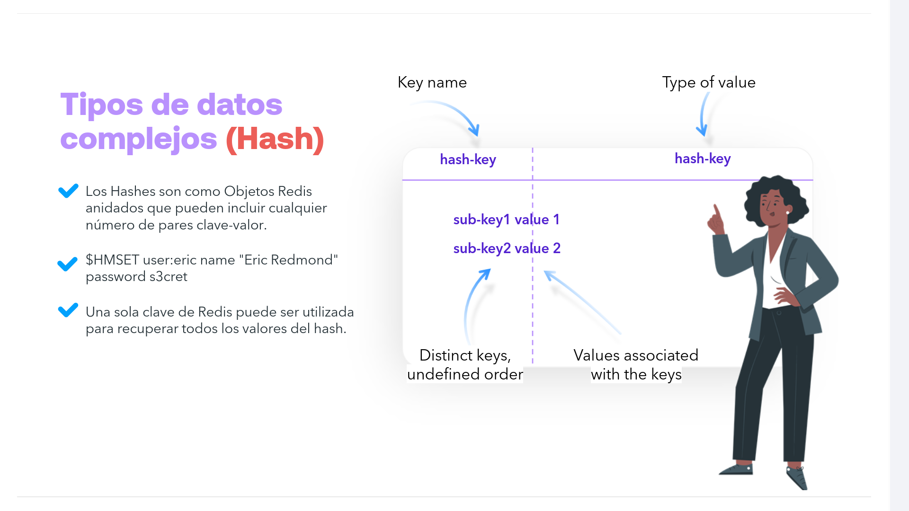


---

### List

* Las listas contienen múltiples valores ordenados que pueden actuar como colas (FIFO) y pilas (FILO).
* Pueden ejecutar acciones como añadir un elemento en el medio, borrar valores, etc.

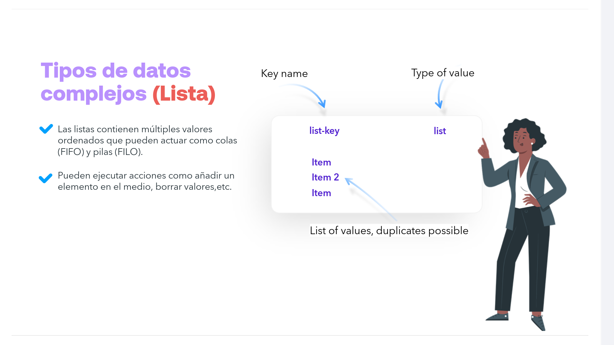

---

### Set

* Los conjuntos son colecciones desordenadas que no permiten la duplicación.
* Acepta operaciones de conjunto como `UNION` e `INTERSECTION`.

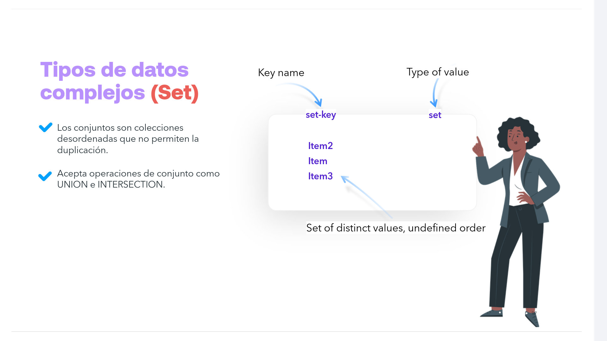

---

##  Expiración de Datos

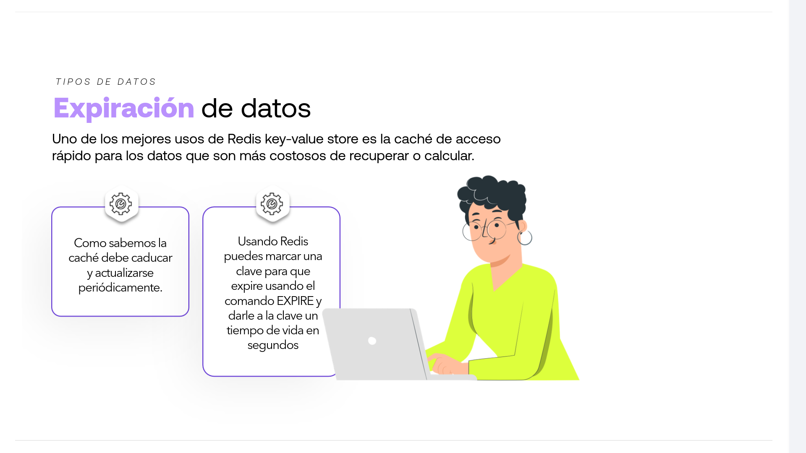

Uno de los mejores usos de Redis key-value store es la caché de acceso rápido para los datos que son más costosos de recuperar o calcular.

-   **Como sabemos la caché debe caducar y actualizarse periódicamente.**

-   **Usando Redis puedes marcar una clave para que expire usando el comando EXPIRE y darle a la clave un tiempo de vida en segundos**

---

## **Durabilidad**

> [!IMPORTANT]
> Base de la durabilidad de datos:  PERSITENCIA o NO-PERSISTENCIA

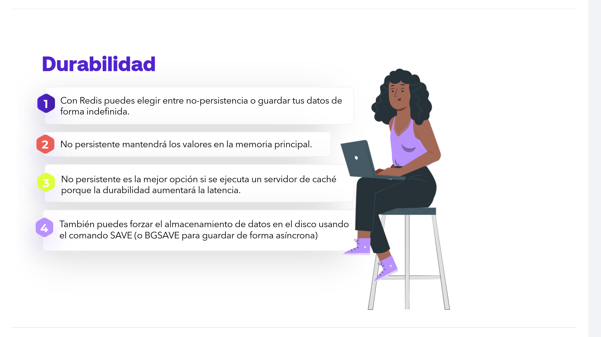
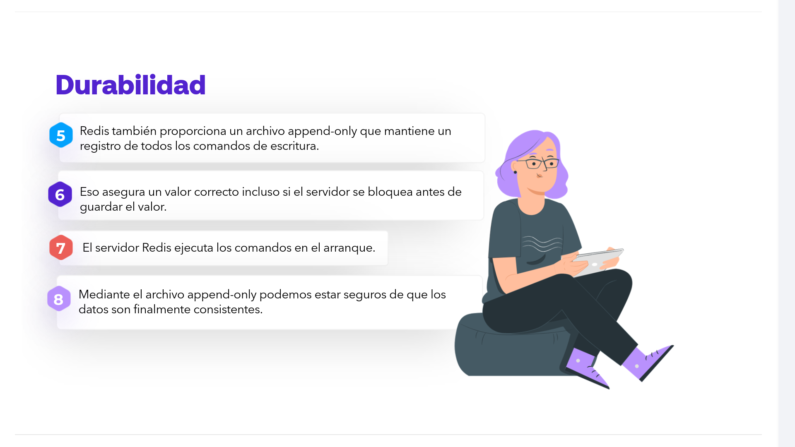


1.  Con Redis puedes elegir entre no-persistencia o guardar tus datos de forma indefinida.

2.  No persistente mantendrá los valores en la memoria principal.

3.  No persistente es la mejor opción si se ejecuta un servidor de caché porque la durabilidad aumentará la latencia.

4.  También puedes forzar el almacenamiento de datos en el disco usando el comando `SAVE` (o `BGSAVE` para guardar de forma asíncrona)

5.  Redis también proporciona un archivo append-only que mantiene un registro de todos los comandos de escritura.

6.  Eso asegura un valor correcto incluso si el servidor se bloquea antes de guardar el valor.

7.  El servidor Redis ejecuta los comandos en el arranque.

8.  Mediante el archivo append-only podemos estar seguros de que los datos son finalmente consistentes.

---

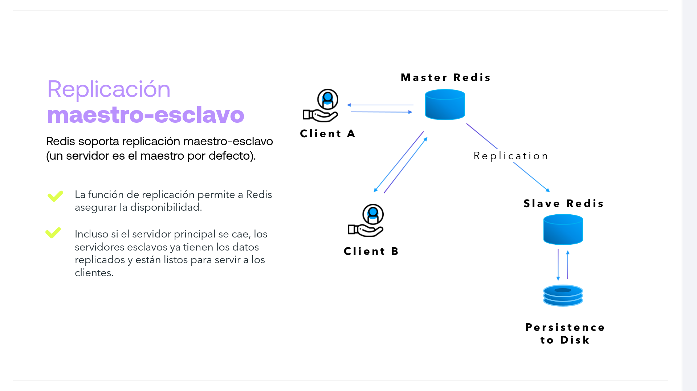

## **Replicación maestro-esclavo**

**Redis soporta replicación maestro-esclavo (un servidor es el maestro por defecto).**

* La función de replicación permite a Redis asegurar la disponibilidad.
* Incluso si el servidor principal se cae, los servidores esclavos ya tienen los datos replicados y están listos para servir a los clientes.

### **Diagrama de Arquitectura:**

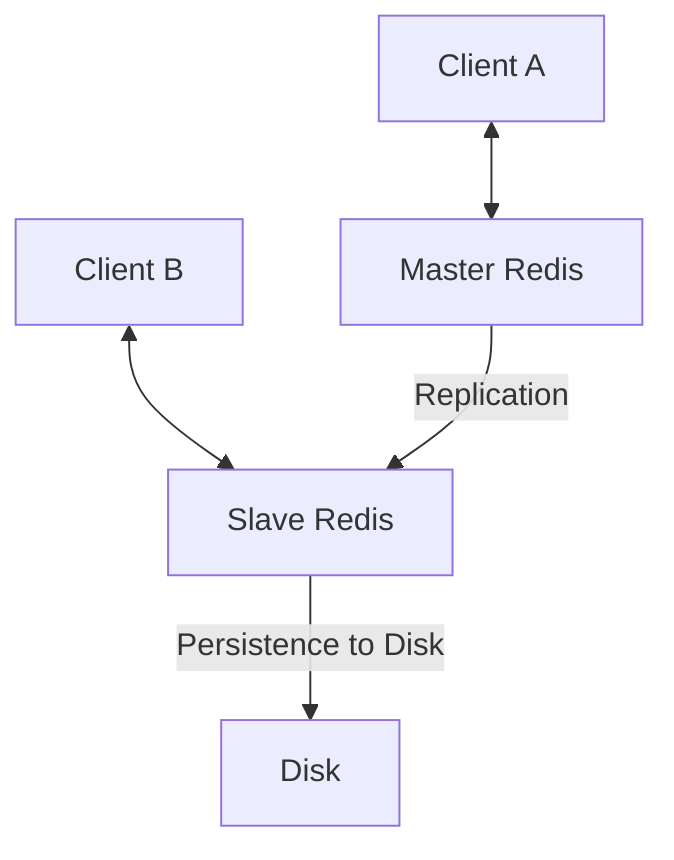


---

## **Clúster Redis**

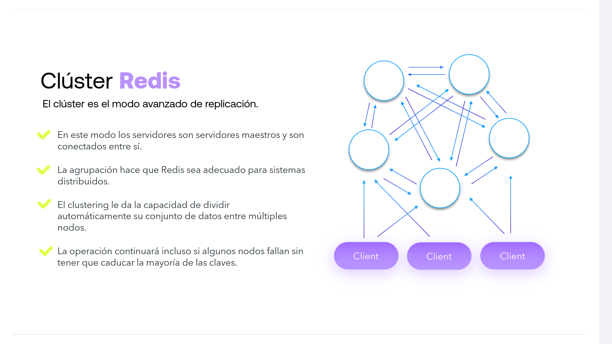

**El clúster es el modo avanzado de replicación.**

* En este modo los servidores son servidores maestros y son conectados entre sí.
* La agrupación hace que Redis sea adecuado para sistemas distribuidos.
* El clustering le da la capacidad de dividir automáticamente su conjunto de datos entre múltiples nodos.
* La operación continuará incluso si algunos nodos fallan sin tener que caducar la mayoría de las claves.

### **Diagrama de Red (Mesh / Full-Mesh Topology):**

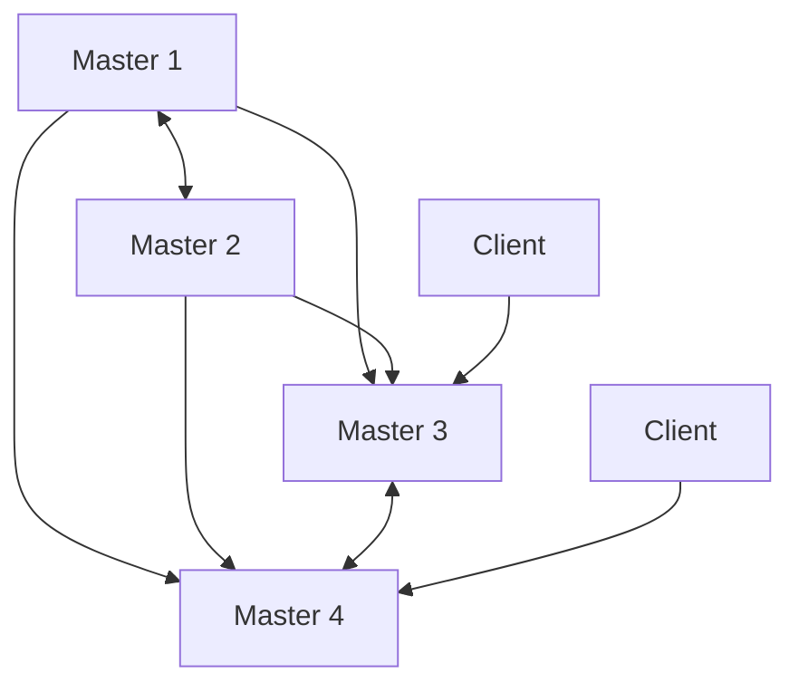


