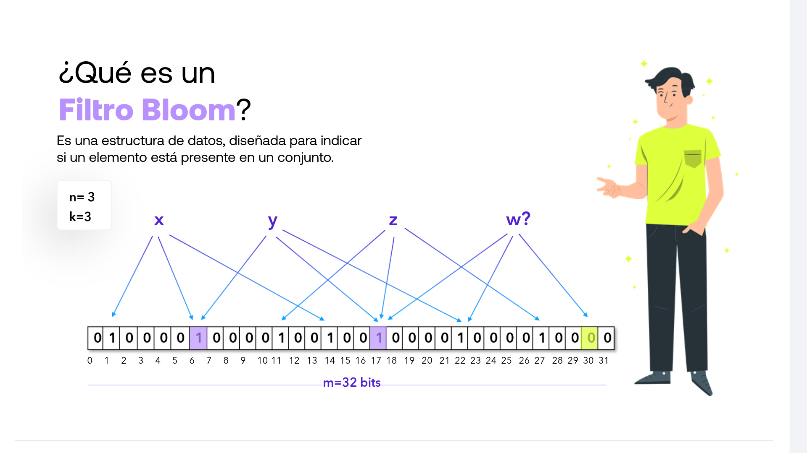

# 03-007:   Filtro Bloom

> ![IMPORTANT]
>
> Un filtro Bloom no es exclusivo de Redis, por lo que merece su sección aparte tras ver los distintos motores de DB:
>    - Es una estructura de datos probabilística conceptual y teórica.
>    - Se puede implementar en casi cualquier lenguaje de programación o base de datos
>    - **Se usa para evitar consultas innecesarias** verifica si un elemento forma parte de un conjunto, y lo hace de forma muy optimizada
> - Puede asegurar que un elemento no está en el grupo, o decir que probablemente está (con un margen pequeño de falsos positivos).
>
> Donde más se usa además es:
>    - REDIS
>    - Cassandra
>    - HBase
>    - PostgreSQL

## **¿Qué es un Filtro Bloom?**

**Es una estructura de datos, diseñada para indicar si un elemento está presente en un conjunto.**

* A pesar de ser muy rápidos, los filtros Bloom tienen una estructura de datos probabilística.
* Con los filtros Bloom podemos saber que el elemento o bien no está en el conjunto o bien puede estar en el conjunto.
* Los filtros Bloom son una excelente opción para reducir el tráfico innecesario a un sistema subyacente más lento, por ejemplo, una BBDD SQL.
