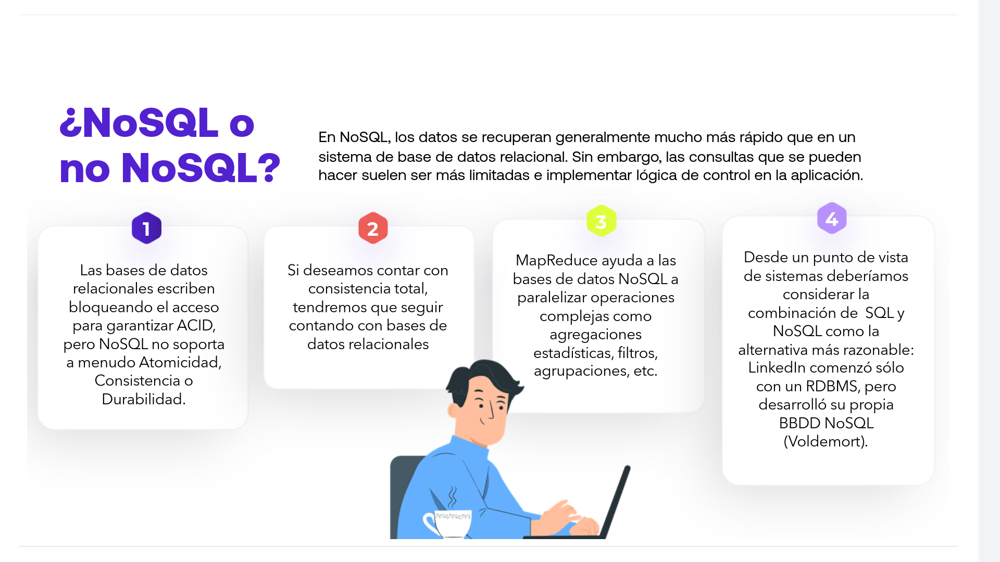
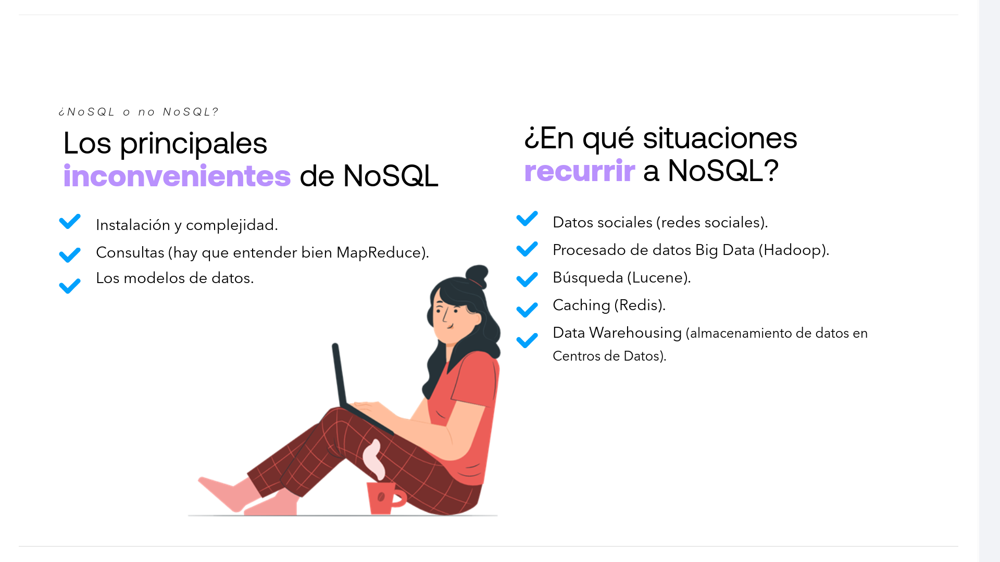
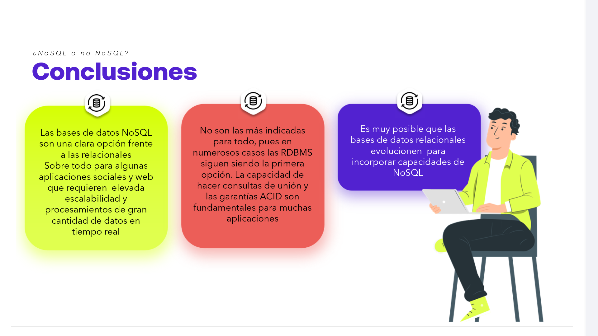

# 03-008:   SQL vs NoSQL

## **¿NoSQL o no NoSQL?**

En NoSQL, los datos se recuperan generalmente mucho más rápido que en un sistema de base de datos relacional. Sin embargo, las consultas que se pueden hacer suelen ser más limitadas e implementar lógica de control en la aplicación.

1. **Garantías ACID:** Las bases de datos relacionales escriben bloqueando el acceso para garantizar ACID, pero NoSQL no soporta a menudo Atomicidad, Consistencia o Durabilidad.
2. **Consistencia total:** Si deseamos contar con consistencia total, tendremos que seguir contando con bases de datos relacionales.
3. **MapReduce:** MapReduce ayuda a las bases de datos NoSQL a paralelizar operaciones complejas como agregaciones estadísticas, filtros, agrupaciones, etc.
4. **Enfoque políglota / híbrido:** Desde un punto de vista de sistemas deberíamos considerar la combinación de SQL y NoSQL como la alternativa más razonable: LinkedIn comenzó sólo con un RDBMS, pero desarrolló su propia BBDD NoSQL (Voldemort).

| **Los principales inconvenientes de NoSQL** | **¿En qué situaciones recurrir a NoSQL?** |
| :--- | :--- |
| * Instalación y complejidad. | * Datos sociales (redes sociales). |
| * Consultas (hay que entender bien MapReduce). | * Procesado de datos Big Data (Hadoop). |
| * Los modelos de datos. | * Búsqueda (Lucene). |
| | * Caching (Redis). |
| | * Data Warehousing (almacenamiento de datos en Centros de Datos). |

*   **Alternativa frente a RDBMS:** Las bases de datos NoSQL son una clara opción frente a las relacionales. Sobre todo para algunas aplicaciones sociales y web que requieren elevada escalabilidad y procesamientos de gran cantidad de datos en tiempo real.

*   **No aptas para todo uso:** No son las más indicadas para todo, pues en numerosos casos las RDBMS siguen siendo la primera opción. La capacidad de hacer consultas de unión y las garantías ACID son fundamentales para muchas aplicaciones.

*   **Evolución híbrida:** Es muy posible que las bases de datos relacionales evolucionen para incorporar capacidades de NoSQL.
