# **03-009:     CouchDB**

Si atendemos a rankings de BBDD más utilizadas, vemos que Berkeley DB se encuentra absolutamente desfasada, y es **CouchDB** la que recoge actualmente su testigo (**más reciente y adaptada a Big Data**):

* **Ranking DB-Engines:** [https://db-engines.com/en/ranking](https://db-engines.com/en/ranking)

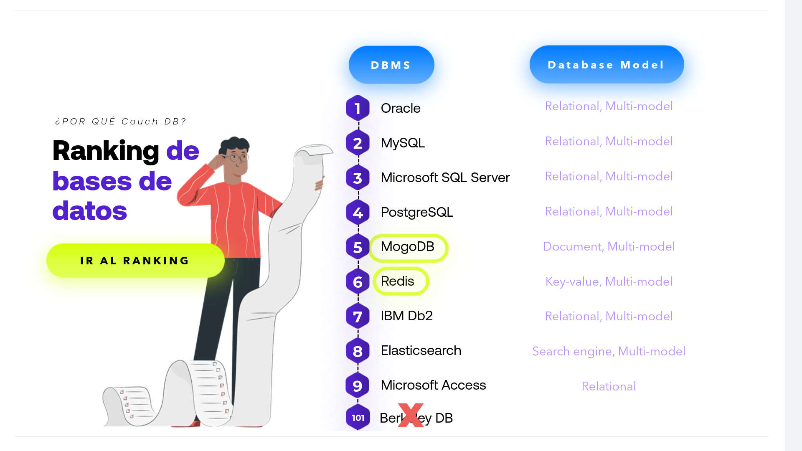

---


## **CouchDB**

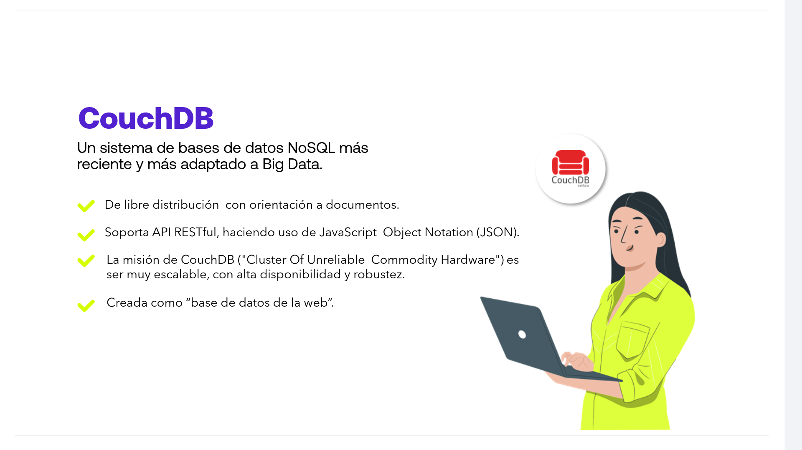

**Un sistema de bases de datos NoSQL más reciente y más adaptado a Big Data.**

* **Orientación a documentos:** De libre distribución (*Open Source*) y orientada al almacenamiento de documentos.
* **API RESTful / JSON:** Soporta API RESTful nativa, haciendo uso de *JavaScript Object Notation* (JSON) como formato primario de intercambio de datos.
* **Acrónimo y Misión:** El nombre responde a *"Cluster Of Unreliable Commodity Hardware"*. Su propósito fundamental es ofrecer alta escalabilidad horizontal, alta disponibilidad y tolerancia a fallos en hardware estándar.
* **Base de datos de la Web:** Diseñada desde cero con protocolos nativos de la web en su núcleo.


### *PROPIEDADES DE COUCHDB*

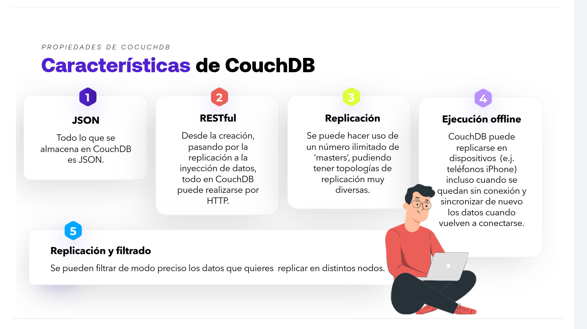

1. **JSON:** Todo lo que se almacena internamente en CouchDB es JSON (documentos, metadatos y configuraciones).
2. **RESTful:** Desde la creación de BBDD hasta la inyección de datos y la replicación, todo en CouchDB se realiza mediante peticiones HTTP estándar.
3. **Replicación flexible:** Permite el uso de un número ilimitado de nodos *master*, soportando topologías de replicación complejas y bidireccionales.
4. **Ejecución offline / Sync:** CouchDB puede replicarse en dispositivos ligeros y clientes (ej. smartphones/iPhone). Permite operar localmente sin conexión y sincronizar de nuevo de forma transparente al recuperar la conectividad.
5. **Replicación y filtrado:** Permite definir reglas para filtrar de modo preciso qué datos o documentos específicos se desean replicar entre distintos nodos.

---


## **Conceptos clave** 

### Documentos

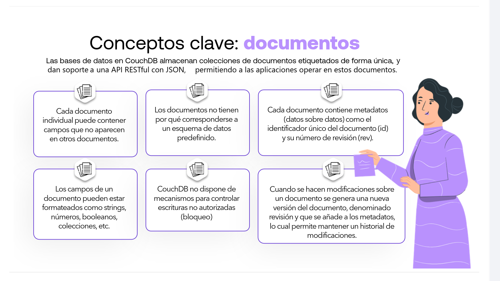

Las bases de datos en CouchDB almacenan colecciones de documentos etiquetados de forma única, ofreciendo una API RESTful con JSON para operar sobre ellos.

*   **Sin esquema (Schema-free):** Los documentos no tienen por qué corresponderse con un esquema rígido predefinido. Cada documento puede contener campos únicos que no existan en otros.

*   **Tipos de datos ricos:** Los campos dentro de un documento pueden ser cadenas (*strings*), números, booleanos, colecciones/arrays, u objetos anidados.

*   **Metadatos obligatorios:** Cada documento incluye metadatos clave:
  * `_id`: Identificador único del documento.
  * `_rev`: Número de revisión (control de versiones).

*    **Ausencia de bloqueos (Lockless):** CouchDB no dispone de mecanismos de bloqueo de archivos (*locking*) para escrituras, lo que maximiza el rendimiento y la concurrencia.

*   **Inmutabilidad y revisiones:** Al modificar un documento no se sobrescribe directamente; se genera una nueva versión (*revisión*) que se añade a los metadatos, manteniendo un historial claro de cambios.

---


### Vistas

Con las vistas podemos **estructurar y consultar datos semiestructurados**.

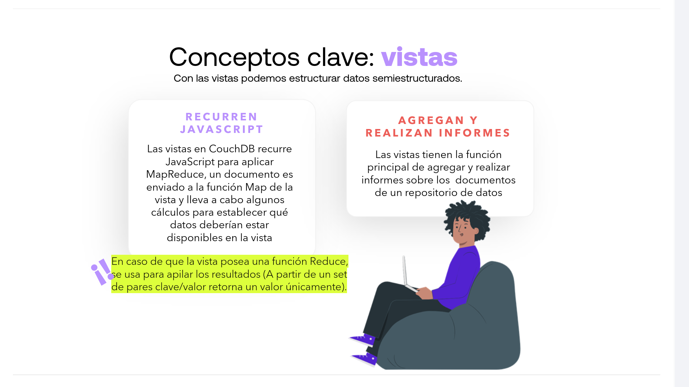

### **Recurren a JavaScript (MapReduce)**
Las vistas en CouchDB utilizan JavaScript para ejecutar operaciones MapReduce:
* **Map:** Un documento se envía a la función `map()`, que realiza cálculos y emite pares clave/valor para determinar qué datos estarán disponibles en la vista.
* **Reduce:** En caso de incluir una función `reduce()`, esta se utiliza para resumir o agrupar los resultados emitted por Map (retornando un único valor agrupado a partir del conjunto de pares clave/valor).

### **Agregan y realizan informes**
La función principal de las vistas es agregar, filtrar y construir informes de alto rendimiento sobre el repositorio de datos.


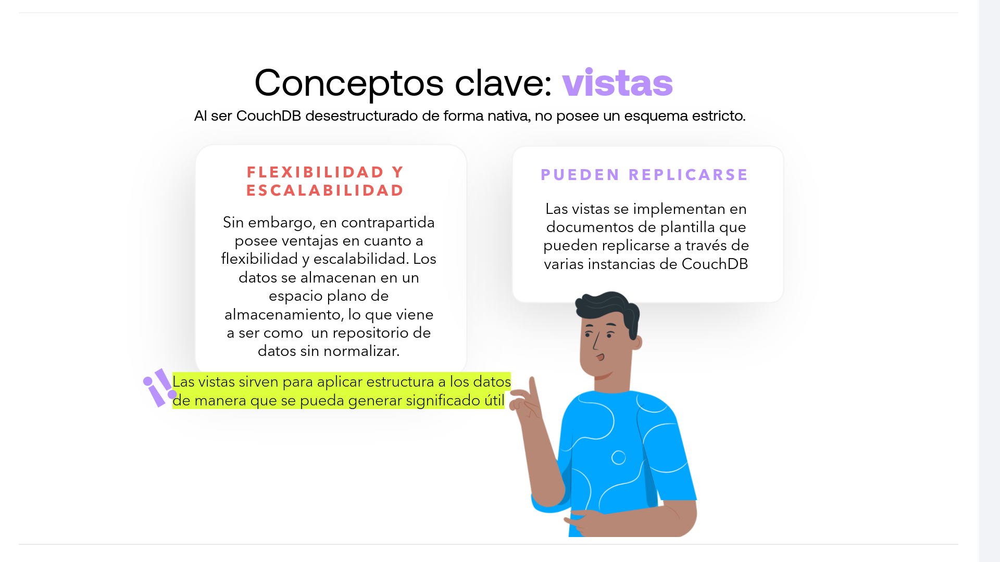


Al ser CouchDB desestructurado de forma nativa, no posee un esquema estricto.

* **Flexibilidad y escalabilidad:** Los datos se almacenan en un espacio plano de almacenamiento (*flat storage space*), actuando como un repositorio de datos sin normalizar.
* **Vistas para estructurar:** Las vistas sirven para aplicar estructura y semántica a los datos planos de manera que se pueda generar información útil y consultable.
* **Replicación de vistas:** Las vistas se implementan en *Design Documents* (documentos de plantilla), por lo que se replican e instancian automáticamente a través de todos los nodos del clúster.


#### **Map/Reduce vs. CouchDB**

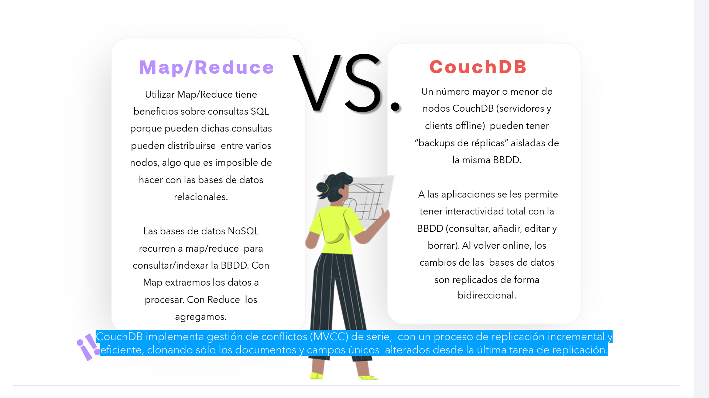
| Map / Reduce | Replicación / Modelo CouchDB |
| :--- | :--- |
| **Distribución de consultas:** Permite distribuir peticiones de consulta/indexación entre múltiples nodos, superando las limitaciones de escalabilidad de los RDBMS tradicionales. | **Nodos y Réplicas Aisladas:** Un número variable de nodos CouchDB (tanto servidores como clientes *offline*) pueden mantener réplicas aisladas de la misma BBDD. |
| **Fases:** <br>• **Map:** Extrae y transforma los datos a procesar.<br>• **Reduce:** Agrega y sintetiza los resultados. | **Interactividad Total y Sync:** Las aplicaciones operan localmente (CRUD completo). Al recuperar la conexión, las modificaciones se replican de forma bidireccional. |

> [!IMPORTANT]
> **Gestión de conflictos:** CouchDB implementa control de concurrencia multiversión (**MVCC**) de serie, con una replicación incremental y eficiente que clona exclusivamente los documentos y campos alterados desde la última sincronización.

---


### **Gestión de Conflictos (MVCC)**

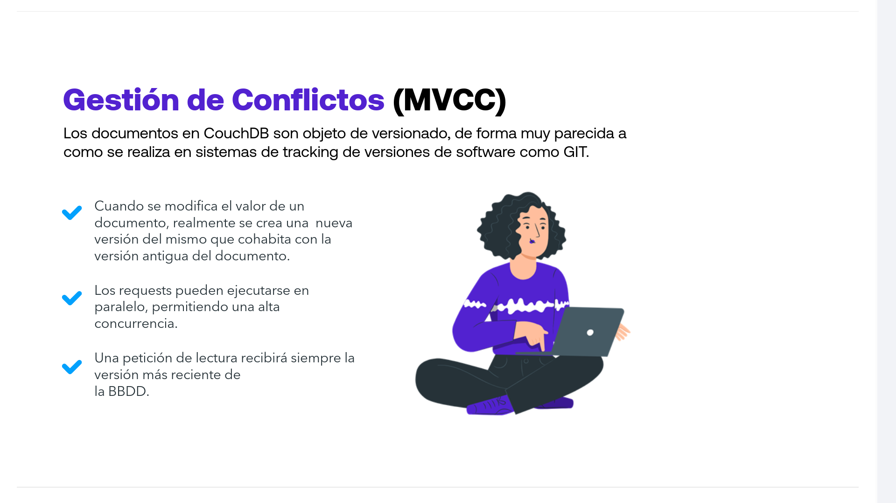

Los documentos en CouchDB son objeto de versionado continuo, de forma muy parecida a como funciona un sistema de control de versiones distribuido como Git.

* **Inmutabilidad de versiones:** Al modificar el valor de un documento, se crea una nueva revisión que cohabita temporalmente con la versión anterior.
* **Alta concurrencia:** Las peticiones de lectura y escritura se ejecutan en paralelo sin bloquearse mutuamente.
* **Consistencia en lectura:** Una petición de lectura recibirá siempre la versión consistente más reciente según el hilo/secuencia de la BBDD.


### **Modelo de Concurrencia: Locking vs. CouchDB**

> En CouchDB se sacrifica CONSITENCIA por VELOCIDAD


#### **Modelo Tradicional (Locking)**

*   **Mecanismo:** No se permite la lectura de datos por parte de otros clientes mientras se realiza un proceso de escritura (`write`).

*   **Inconveniente:** Genera cuellos de botella y bloqueos (*commits* a disco bloqueantes).

#### **Modelo CouchDB (MVCC / Append-Only)**

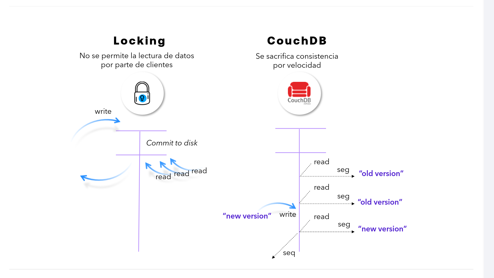

*   **Mecanismo:** Se sacrifica la consistencia inmediata estricta a cambio de una velocidad y rendimiento masivos.

*   **Flujo:** Las lecturas se dirigen a secuencias previas (`old version`) sin detenerse por la escritura entrante (`new version`), la cual genera una nueva secuencia (`seq`) de forma no bloqueante.

---


### **El Teorema CAP en CouchDB**


CouchDB sacrifica la consistencia inmediata (*Enforced Consistency*) a cambio de obtener el máximo rendimiento, disponibilidad y tolerancia a particiones mediante la distribución de la información.

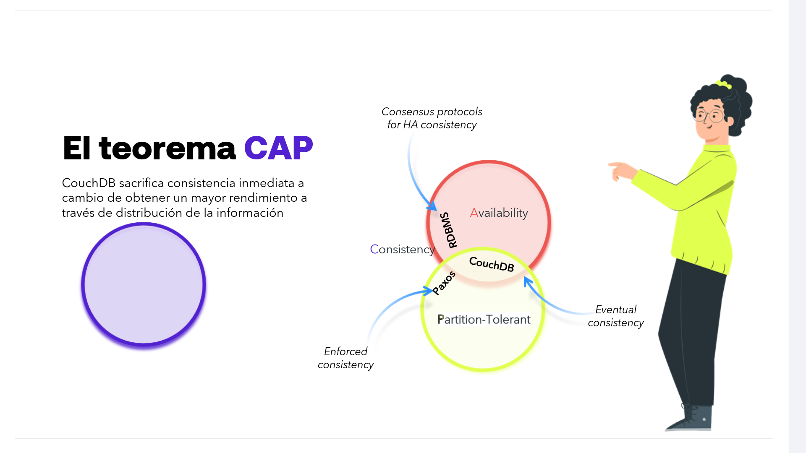

* **Clasificación AP:** En el contexto del Teorema CAP, CouchDB se sitúa principalmente como un sistema **AP** (*Availability + Partition Tolerance*).
* **Consistencia Eventual (*Eventual Consistency*):** La consistencia total entre todos los nodos no es instantánea, sino que se alcanza de forma eventual mediante su protocolo de replicación.

---

## **La API RESTful (JSON)**

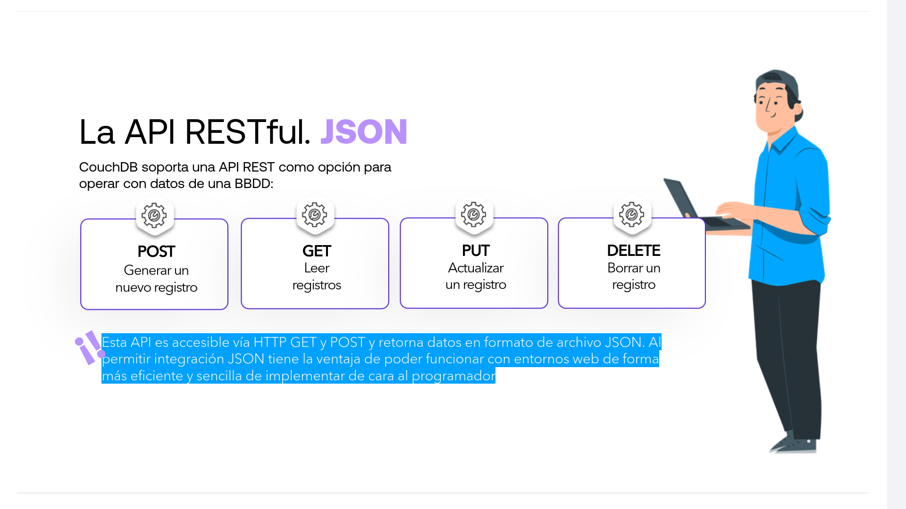

CouchDB expone una API REST nativa sobre HTTP como interfaz principal para todas las operaciones CRUD sobre la base de datos:

| Método HTTP | Acción en CouchDB |
| --- | --- |
| **`POST`** | Generar / crear un nuevo registro o documento. |
| **`GET`** | Leer / consultar documentos o vistas. |
| **`PUT`** | Actualizar un registro existente (o crear uno con un ID específico). |
| **`DELETE`** | Marcar un registro como eliminado (`_deleted: true`). |

> **Ventaja de integración:** Accesible mediante simples peticiones HTTP que retornan siempre datos en formato JSON. Esta integración simplifica radicalmente el desarrollo en aplicaciones web y móviles.

---


## **Los documentos de diseño**

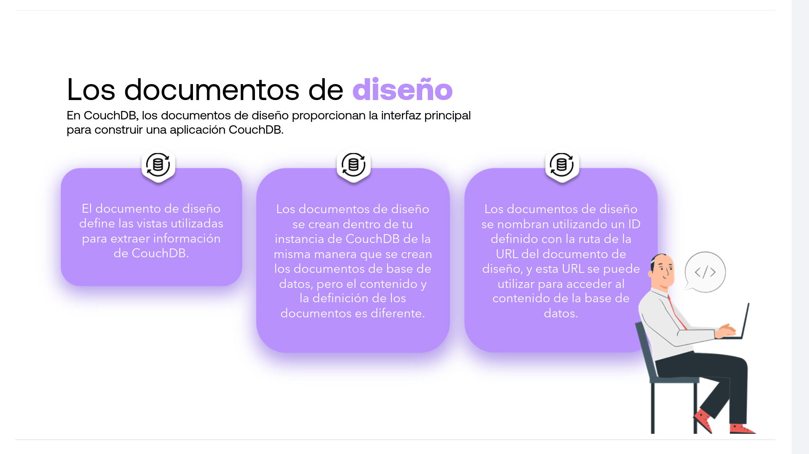

En CouchDB, los documentos de diseño proporcionan la interfaz principal para construir una aplicación CouchDB.

* **Extracción de información:** El documento de diseño define las vistas utilizadas para extraer información de CouchDB.
* **Creación estándar:** Los documentos de diseño se crean dentro de tu instancia de CouchDB de la misma manera que se crean los documentos de base de datos, pero el contenido y la definición de los documentos es diferente.
* **Identificación por URL:** Los documentos de diseño se nombran utilizando un ID definido con la ruta de la URL del documento de diseño, y esta URL se puede utilizar para acceder al contenido de la base de datos.


### **Estructura interna de un Documento de diseño**

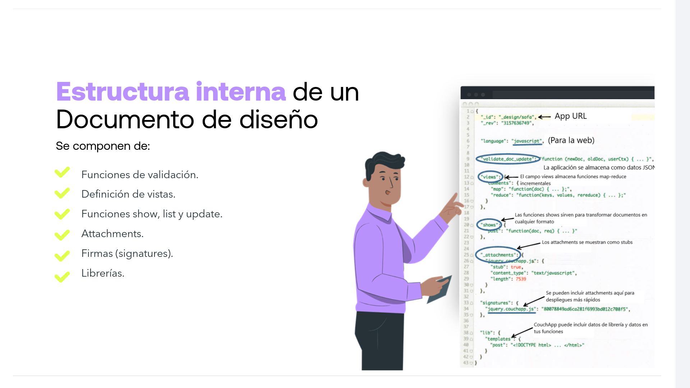

Se componen de:

* **Funciones de validación.**
* **Definición de vistas.**
* **Funciones show, list y update.**
* **Attachments.**
* **Firmas (signatures).**
* **Librerías.**

### **Ejemplo de estructura JSON:**

```json
{
  "_id": "_design/sofa",
  "_rev": "3157636749",
  "language": "javascript",
  "validate_doc_update": "function(newDoc, oldDoc, userCtx) { ... }",
  "views": {
    "comments": {
      "map": "function(doc) { ... }",
      "reduce": "function(keys, values, rereduce) { ... }"
    }
  },
  "shows": {
    "post": "function(doc, req) { ... }"
  },
  "_attachments": {
    "jquery.couchapp.js": {
      "stub": true,
      "content_type": "text/javascript",
      "length": 7539
    }
  },
  "signatures": {
    "jquery.couchapp.js": "80078849ad6ca281f6993bd012c708f5"
  },
  "lib": {
    "templates": {
      "post": "<!DOCTYPE html> ... </html>"
    }
  }
}

```

---

### **Vistas**

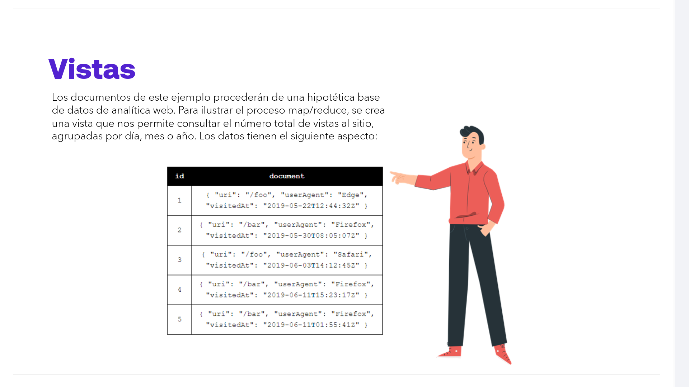

Los documentos de este ejemplo procederán de una hipotética base de datos de analítica web. Para ilustrar el proceso map/reduce, se crea una vista que nos permite consultar el número total de vistas al sitio, agrupadas por día, mes o año.  

Los datos tienen el siguiente aspecto:

| *id* | *document* |
| --- | --- |
| **1** | `{ "uri": "/foo", "userAgent": "Edge", "visitedAt": "2019-05-22T12:44:32Z" }` |
| **2** | `{ "uri": "/bar", "userAgent": "Firefox", "visitedAt": "2019-05-30T08:05:07Z" }` |
| **3** | `{ "uri": "/foo", "userAgent": "Safari", "visitedAt": "2019-06-03T14:12:45Z" }` |
| **4** | `{ "uri": "/bar", "userAgent": "Firefox", "visitedAt": "2019-06-11T15:23:17Z" }` |
| **5** | `{ "uri": "/bar", "userAgent": "Firefox", "visitedAt": "2019-06-11T01:55:41Z" }` |


### **Vistas: funciones map**

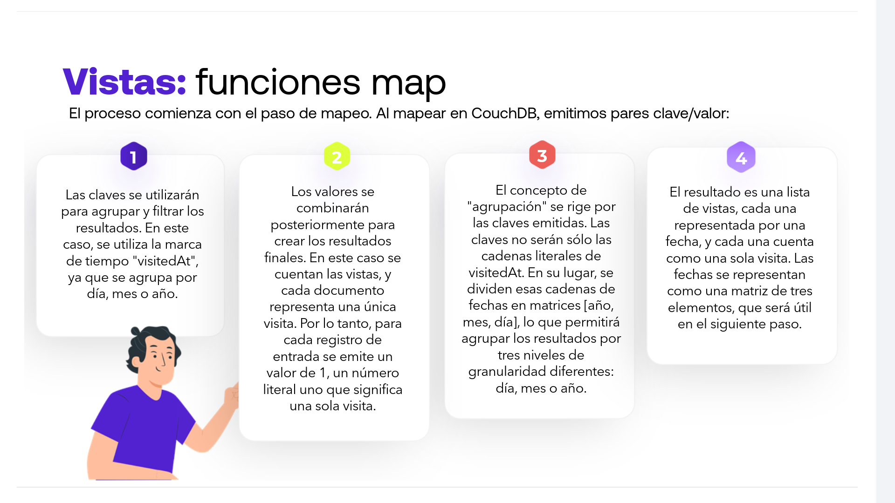

El proceso comienza con el paso de mapeo. Al mapear en CouchDB, emitimos pares clave/valor:

1.  **Claves de agrupación:** Las claves se utilizarán para agrupar y filtrar los resultados. En este caso, se utiliza la marca de tiempo `"visitedAt"`, ya que se agrupa por día, mes o año.

2.  **Valores a combinar:** Los valores se combinarán posteriormente para crear los resultados finales. En este caso se cuentan las vistas, y cada documento representa una única visita. Por lo tanto, para cada registro de entrada se emite un valor de `1`, un número literal uno que significa una sola visita.

3.  **Estructura de clave en matriz:** El concepto de "agrupación" se rige por las claves emitidas. Las claves no serán sólo las cadenas literales de `visitedAt`. En su lugar, se dividen esas cadenas de fechas en matrices `[año, mes, día]`, lo que permitirá agrupar los resultados por tres niveles de granularidad diferentes: día, mes o año.

4.  **Resultado intermedio:** El resultado es una lista de vistas, cada una representada por una fecha, y cada una cuenta como una sola visita. Las fechas se representan como una matriz de tres elementos, que será útil en el siguiente paso.


El proceso comienza con el paso de mapeo. Al mapear en CouchDB, emitimos pares clave/valor:

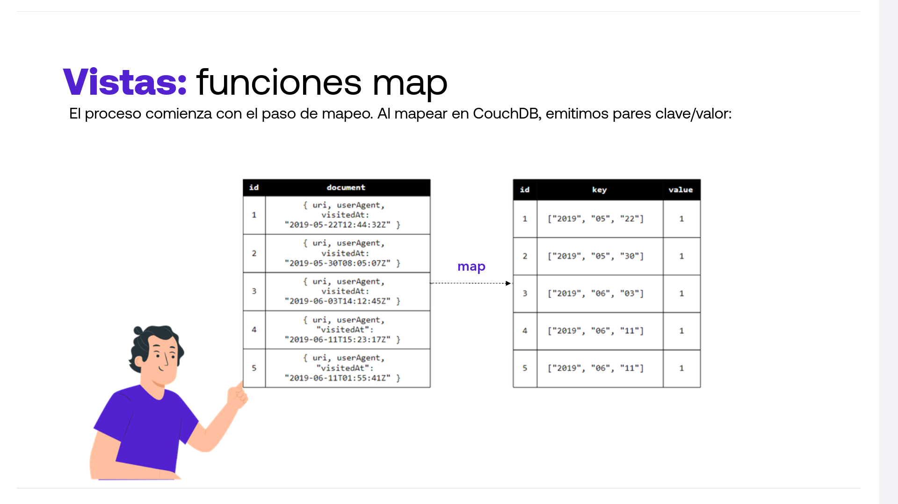

---


Antes de pasar al paso de reducción, CouchDB ordena los resultados del paso de mapa en grupos (**AGRUPACION**).

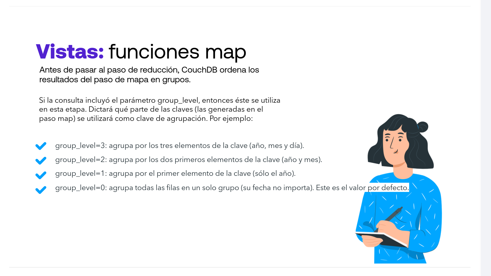

Si la consulta incluyó el parámetro `group_level`, entonces éste se utiliza en esta etapa. Dictará qué parte de las claves (las generadas en el paso map) se utilizará como clave de agrupación. Por ejemplo:

*   `group_level=3`: agrupa por los tres elementos de la clave (año, mes y día).

*   `group_level=2`: agrupa por los dos primeros elementos de la clave (año y mes).

*   `group_level=1`: agrupa por el primer elemento de la clave (sólo el año).

*   `group_level=0`: agrupa todas las filas en un solo grupo (su fecha no importa). Este es el valor por defecto.

---


En el paso de agrupación, los grupos se formarán independientemente en cada nodo del clúster de CouchDB(distribución por nodos).  

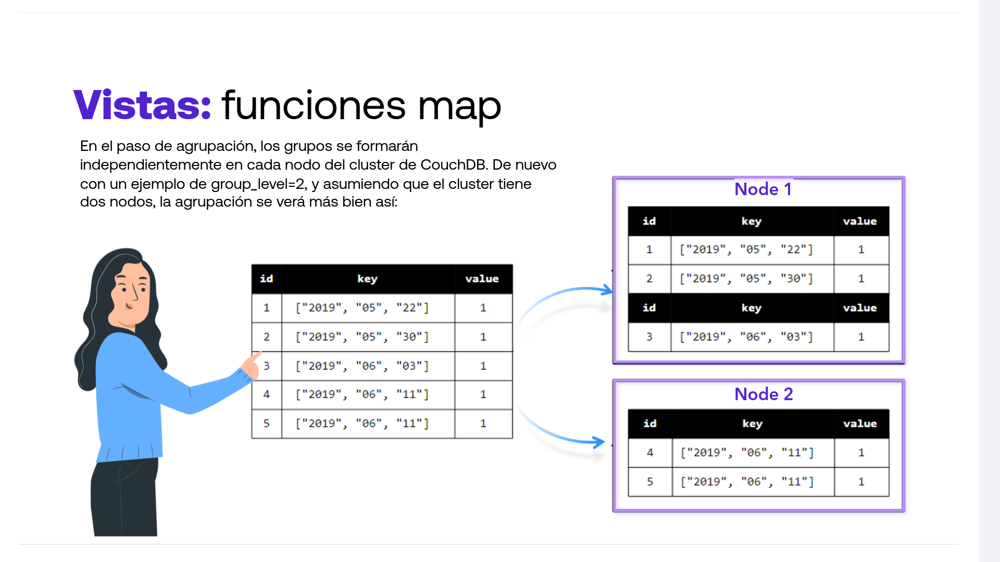


De nuevo con un ejemplo de `group_level=2`, y asumiendo que el clúster tiene dos nodos, la agrupación se verá más bien así:

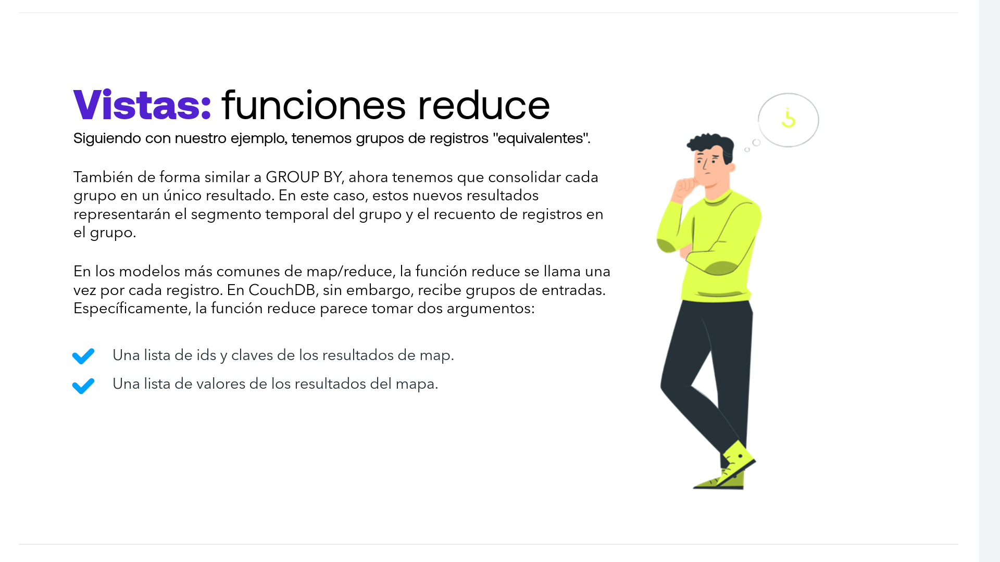

---

### **Vistas: funciones reduce**

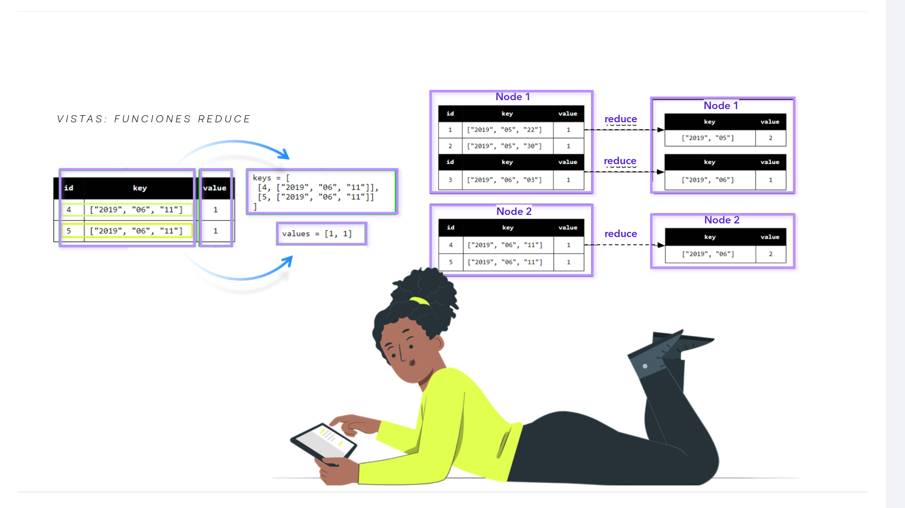

Siguiendo con nuestro ejemplo, tenemos grupos de registros "equivalentes".

También de forma similar a `GROUP BY`, ahora tenemos que consolidar cada grupo en un único resultado. En este caso, estos nuevos resultados representarán el segmento temporal del grupo y el recuento de registros en el grupo.

En los modelos más comunes de map/reduce, la función reduce se llama una vez por cada registro. En CouchDB, sin embargo, recibe grupos de entradas. Específicamente, la función reduce parece tomar dos argumentos:

* **Lista de claves:** Una lista de ids y claves de los resultados de map.
* **Lista de valores:** Una lista de valores de los resultados del mapa.

---


---

Los resultados "hermanos" a través de los nodos ahora tienen que ser consolidados en los resultados finales para toda la base de datos. CouchDB llama a este paso **"re-reduce"**.

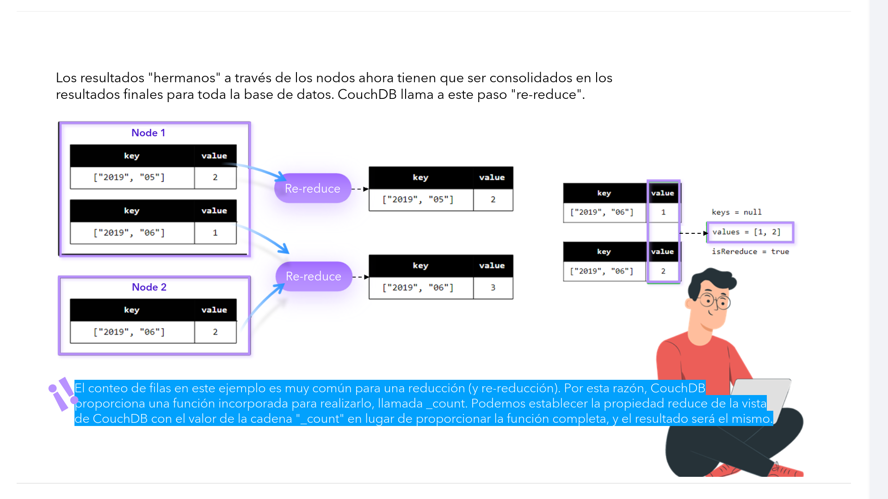


> [!IMPORTANT]
> **Función integrada `_count`:** El conteo de filas en este ejemplo es muy común para una reducción (y re-reducción).  
>
> Por esta razón, CouchDB proporciona una función incorporada para realizarlo, llamada `_count`. Podemos establecer la propiedad `reduce` de la vista de CouchDB con el valor de la cadena `"_count"` en lugar de proporcionar la función completa, y el resultado será el mismo.

---


## **Validaciones**

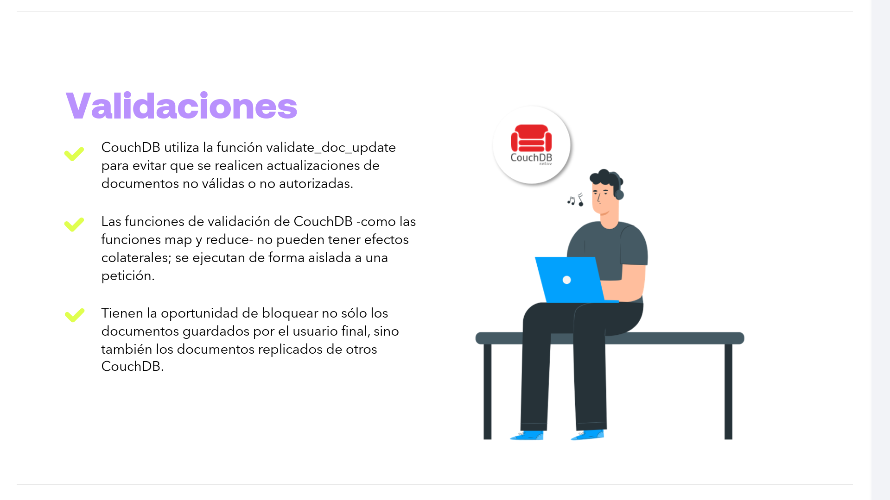

*   **`validate_doc_update`:** CouchDB utiliza la función `validate_doc_update` para evitar que se realicen actualizaciones de documentos no válidas o no autorizadas.

*   **Sin efectos colaterales:** Las funciones de validación de CouchDB —como las funciones map y reduce— no pueden tener efectos colaterales; se ejecutan de forma aislada a una petición.

*   **Control en origen y réplica:** Tienen la oportunidad de bloquear no sólo los documentos guardados por el usuario final, sino también los documentos replicados de otros CouchDB.


---

## **Replicación en CouchDB**

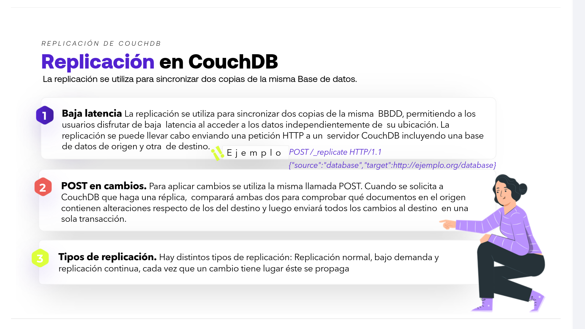

La replicación se utiliza para sincronizar dos copias de la misma base de datos.

1. **Baja latencia:** La replicación se utiliza para sincronizar dos copias de la misma BBDD, permitiendo a los usuarios disfrutar de baja latencia al acceder a los datos independientemente de su ubicación. La replicación se puede llevar a cabo enviando una petición HTTP a un servidor CouchDB incluyendo una base de datos de origen y otra de destino.
   
   > **Ejemplo:**
   > `POST /_replicate HTTP/1.1`
   > `{"source":"database", "target":"http://ejemplo.org/database"}`

2. **POST en cambios:** Para aplicar cambios se utiliza la misma llamada POST. Cuando se solicita a CouchDB que haga una réplica, comparará ambas BBDD para comprobar qué documentos en el origen contienen alteraciones respecto de los del destino y luego enviará todos los cambios al destino en una sola transacción.

3. **Tipos de replicación:** Hay distintos tipos de replicación: Replicación normal, bajo demanda y replicación continua (cada vez que un cambio tiene lugar, este se propaga).

---


## **Gestión de conflictos**

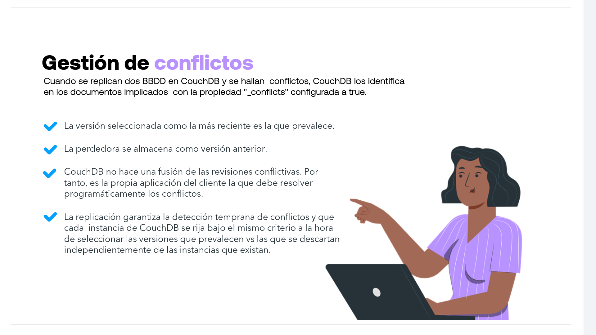

Cuando se replican dos BBDD en CouchDB y se hallan conflictos, CouchDB los identifica en los documentos implicados con la propiedad `_conflicts` configurada a `true`.

*   **Ganadora por relevancia:** La versión seleccionada como la más reciente es la que prevalece.

*   **Conservación del historial:** La perdedora se almacena como versión anterior.

*   **Resolución en cliente:** CouchDB no hace una fusión de las revisiones conflictivas. Por tanto, es la propia aplicación del cliente la que debe resolver programáticamente los conflictos.

*   **Detección temprana y consistencia de criterio:** La replicación garantiza la detección temprana de conflictos y que cada instancia de CouchDB se rija bajo el mismo criterio a la hora de seleccionar las versiones que prevalecen vs. las que se descartan, independientemente de las instancias que existan.

---


# **CouchApp**

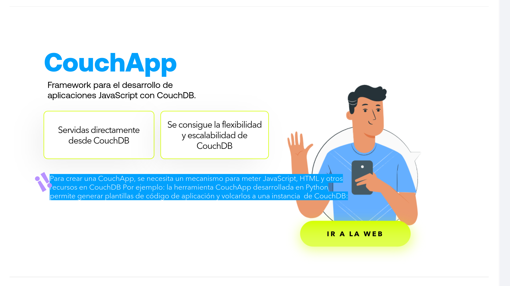

**Framework para el desarrollo de aplicaciones JavaScript con CouchDB.**

* Servidas directamente desde CouchDB.
* Se consigue la flexibilidad y escalabilidad de CouchDB.

> [!IMPORTANT]
> Para crear una CouchApp, se necesita un mecanismo para meter JavaScript, HTML y otros recursos en CouchDB. Por ejemplo: la herramienta CouchApp desarrollada en Python permite generar plantillas de código de aplicación y volcarlos a una instancia de CouchDB.

- Link a GitHub: https://github.com/couchapp/couchapp
- Integración de CouchApp JS a CouchDB actual (2026):   https://docs.couchdb.com/en/latest/ddocs/index.html

---


## **CouchApp y el patrón MVC (Model - View - Controler)**

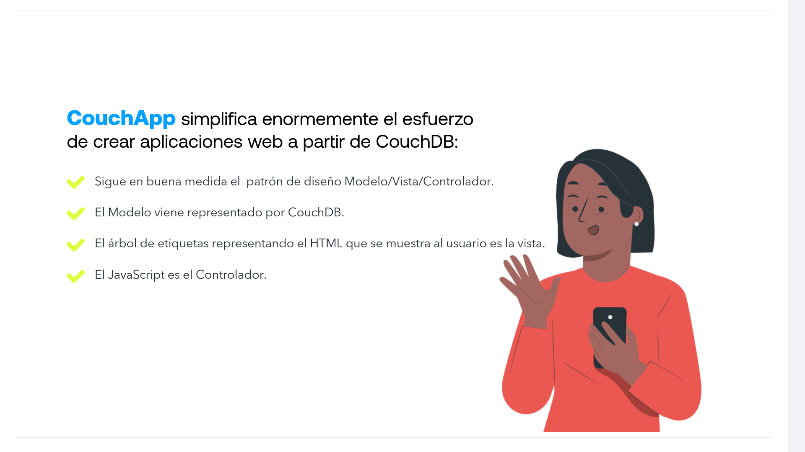

CouchApp simplifica enormemente el esfuerzo de crear aplicaciones web a partir de CouchDB pues sigue en buena medida el patrón de diseño **Modelo/Vista/Controlador (MVC)**.

* **Modelo:** Viene representado por CouchDB.
* **Vista:** El árbol de etiquetas representando el HTML que se muestra al usuario es la vista.
* **Controlador:** El JavaScript es el Controlador.

