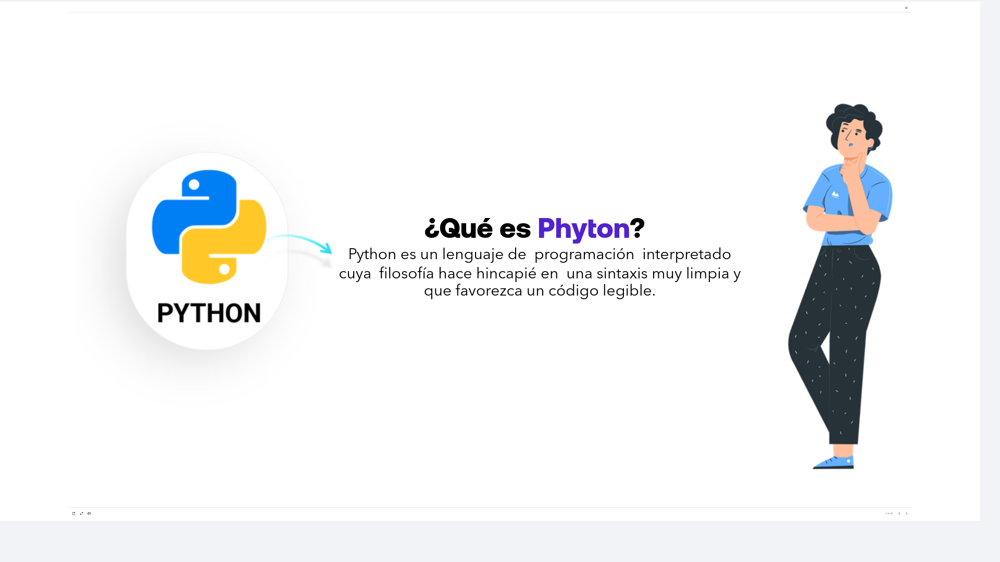
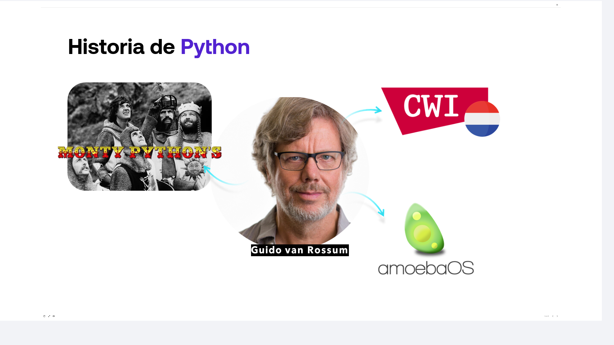
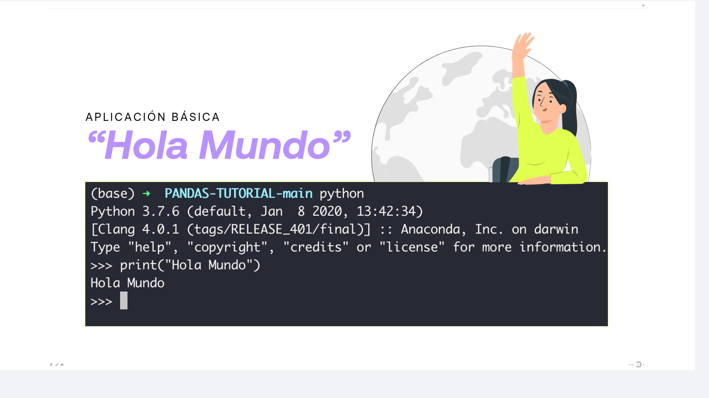
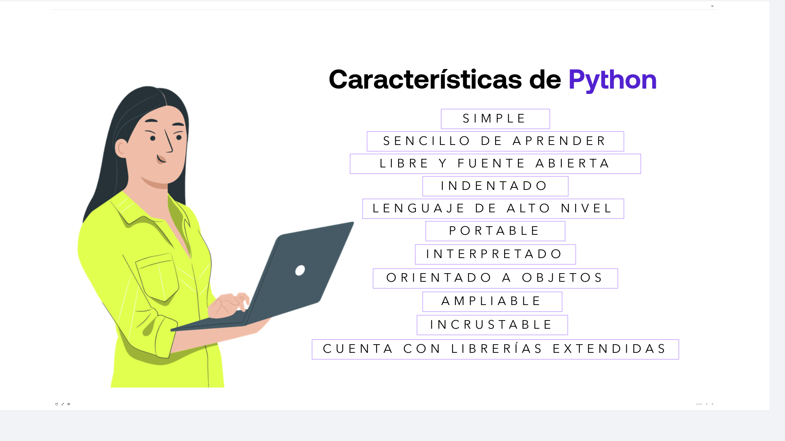
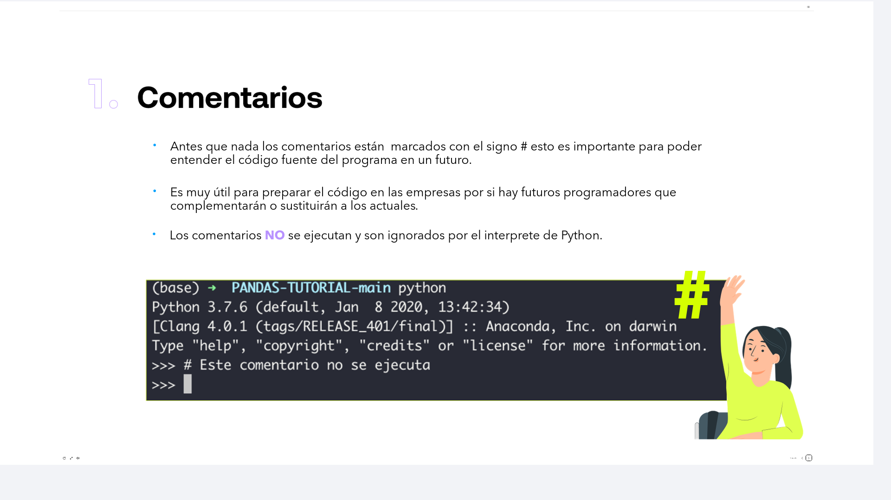
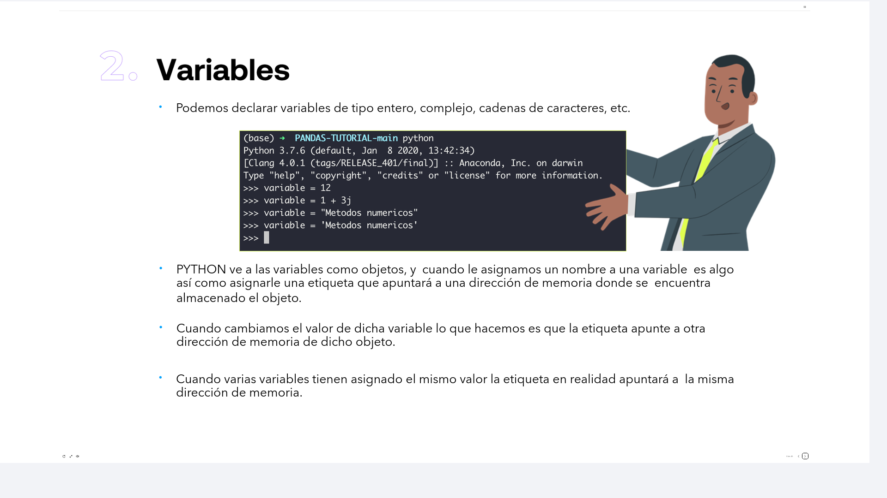
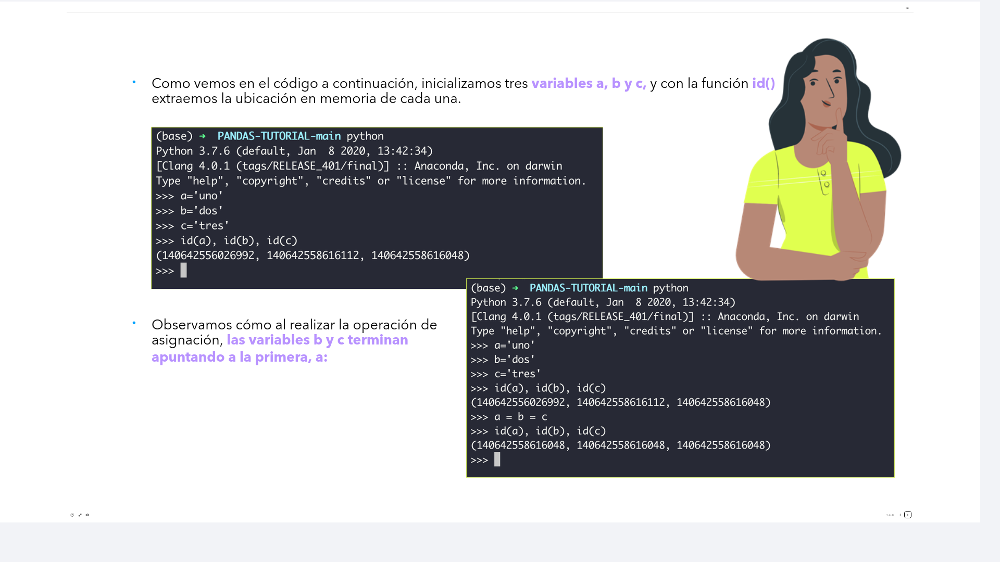

# 04-001:   Python. Comentarios/Heredocs. Variables


## ¿Qué es Python?





Python es un lenguaje de programación interpretado cuya filosofía hace hincapié en una sintaxis muy limpia y que favorezca un código legible.


### Historia de Python

**Guido van Rossum**:

1.  CWI (Centrum Wiskunde & Informatica)
    A finales de los años 80, el informático holandés Guido van Rossum trabajaba en el CWI (Centro de Matemáticas e Informática de los Países Bajos) dentro del equipo del lenguaje ABC. Aunque ABC tenía grandes ideas en cuanto a legibilidad y facilidad de aprendizaje, era un lenguaje muy rígido, difícil de extender y con limitaciones operativas. Guido se propuso crear un lenguaje de scripting descendiente de ABC pero superando sus fallos de diseño: que fuera extensible, fácil de leer y rápido de desarrollar.

2.  amoebaOS
    El proyecto principal en el que trabajaba Guido en el CWI era Amoeba, un sistema operativo distribuido basado en micronúcleo desarrollado junto a Andrew S. Tanenbaum. Administrar Amoeba con herramientas existentes de C o shell scripts tradicionales resultaba tedioso y lento. Guido concibió Python en las vacaciones de Navidad de 1989 como un proyecto personal para crear una herramienta con la que realizar llamadas al sistema Amoeba de forma sencilla y eficiente.

3.  MONTY PYTHON'S
    Contrario a la creencia popular de que el nombre proviene de la serpiente pitón, Guido bautizó el lenguaje en honor a Monty Python's Flying Circus, el célebre grupo cómico de la BBC británica del cual era un gran admirador. Buscaba un nombre corto, único y ligeramente irreverente para acompañar la filosofía informal pero potente del proyecto.

---

### ¿Cómo es un programa típico en Python?




---



## Características de Python

* SIMPLE
* SENCILLO DE APRENDER
* LIBRE Y FUENTE ABIERTA
* INDENTADO
* LENGUAJE DE ALTO NIVEL
* PORTABLE
* INTERPRETADO
* ORIENTADO A OBJETOS
* AMPLIABLE
* INCRUSTABLE
* CUENTA CON LIBRERÍAS EXTENDIDAS

---

## COMPONENTES DE PYTHON:   Comentarios/Heredocs. Variables.


### 1. Comentarios



* Antes que nada los comentarios están marcados con el signo # esto es importante para poder entender el código 
fuente del programa en un futuro.

* Es muy útil para preparar el código en las empresas por si hay futuros programadores que complementarán o sustituirán a los actuales.

* Los comentarios **NO** se ejecutan y son ignorados por el intérprete de Python.

#### **Comentarios multilínea, *Heredocs* y formateo de cadenas**

Aunque el signo `#` gestiona los comentarios de una sola línea, Python ofrece mecanismos avanzados para manejar bloques de texto extensos y formateo dinámico:

*   **Comentarios multilínea y *Docstrings*** 
    Se utilizan triples comillas (`"""` o `'''`). Si se ubican sueltas dentro del código sin asignarse a una variable, el intérprete las ignora funcionando como comentarios multilínea. Si se sitúan al inicio de una función, clase o módulo, se convierten en *docstrings* consultables con `help()`.

```python
"""
Este es un comentario multilínea.
Permite detallar explicaciones complejas
sin repetir el carácter '#' en cada línea.
"""
```

*   **Comportamiento tipo Heredoc**
    Si la triple comilla se asigna a una variable, actúa como un heredoc tradicional, conservando los saltos de línea, tabulaciones y comillas internas sin requerir caracteres de escape (`\n`).
    
```python
texto_multilinea = """
Este texto mantiene
    el formato exacto
y los saltos de línea.
"""
```

*   ***Cadenas formateadas (f-strings)** 
    Anteponiendo una f o F a las comillas (incluidas las triples comillas multilínea f"""..."""), se pueden interpolar expresiones y variables de Python directamente entre llaves {}.
    
```python
nombre = "Pepito"
version = 3.12

saludo = f"""
Hola {nombre},
Bienvenido a Python {version}.
El resultado de 2 + 2 es {2 + 2}.
"""
```

---


### 2. Variables



* Podemos declarar variables de tipo entero, complejo, cadenas de caracteres, etc (más adelante detallamos los data types).

-   PYTHON ve a las variables como objetos, y cuando le asignamos un nombre a una variable es algo así como asignarle una etiqueta que apuntará a una dirección de memoria donde se encuentra almacenado el objeto.

-   Cuando cambiamos el valor de dicha variable lo que hacemos es que la etiqueta apunte a otra dirección de memoria de dicho objeto.

-   Cuando varias variables tienen asignado el mismo valor la etiqueta en realidad apuntará a la misma dirección de memoria.



* Como vemos en el código a continuación, inicializamos tres **variables a, b y c**, y con la función **id()** extraemos la ubicación en memoria de cada una.

```bash
>>> a='uno'
>>> b='dos'
>>> c='tres'
>>> id(a), id(b), id(c)
(140642556026992, 140642558616112, 140642558616048)
>>>
```

* Observamos cómo al realizar la operación de asignación, **las variables b y c terminan apuntando a la primera, a:**

```bash
>>> a='uno'
>>> b='dos'
>>> c='tres'
>>> id(a), id(b), id(c)
(140642556026992, 140642558616112, 140642558616048)
>>> a = b = c
>>> id(a), id(b), id(c)
(140642558616048, 140642558616048, 140642558616048)
>>>
```
