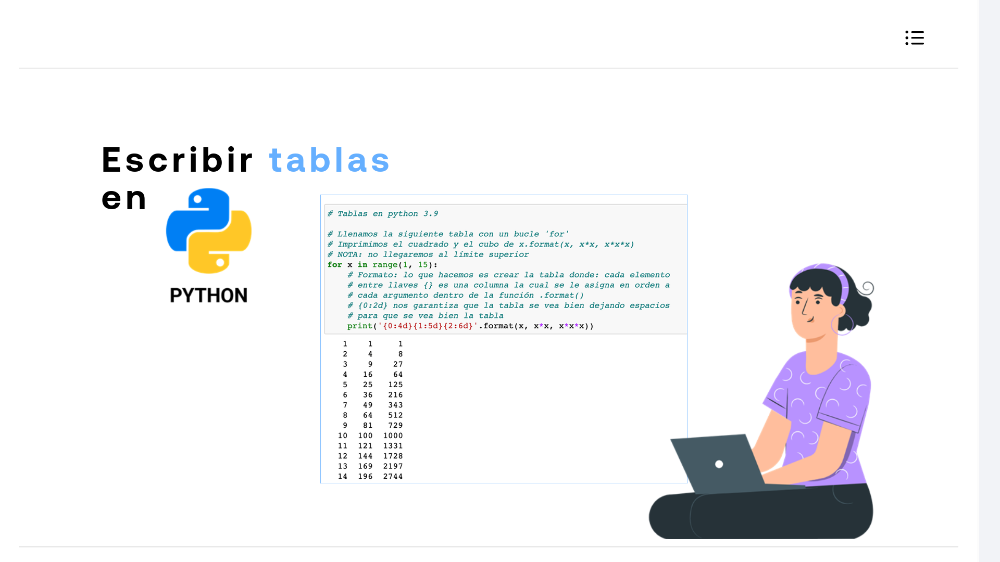

# 04-013 · Tablas

La presentación de datos alineados en consola requiere un control preciso del ancho de campo y de la alineación de caracteres  

En Python, el método `str.format()` permite estructurar tablas de texto sin recurrir a librerías externas.  

Se recomienda:  

-   Usar **anchos fijos mayores que la cifra de mayor longitud** esperada para evitar el solapamiento o desalineación de columnas.

-   En versiones modernas de Python (>= 3.6), se puede aplicar la misma lógica de formato utilizando *f-strings*: `print(f'{x:4d}{x*x:5d}{x*x*x:6d}')`.

-   Especificar el índice del parámetro (`0`, `1`, `2`) permite reutilizar o reordenar los argumentos dentro de la cadena sin duplicar variables.

---

## Formateo con `str.format()`

El método `.format()` reemplaza las llaves `{}` en una cadena de texto por los argumentos pasados en su invocación. Para dar formato tabular a los datos, se incluye una especificación de formato tras dos puntos (`:`).

### Sintaxis general del especificador

`'{posicion:ancho tipo}'.format(valor)`

- **`posicion`**: Índice del argumento pasado a `.format()` (empezando en `0`).
- **`ancho`**: Número mínimo de caracteres que ocupará la columna (añade espacios si el valor es más corto).
- **`tipo`**: Tipo de datos a representar (`d` para enteros, `f` para flotantes, `s` para cadenas).

---

## Generación de Tablas de Potencias

Un caso de uso habitual es la generación iterativa de filas con columnas alineadas mediante un bucle `for`.

```python
# Ejemplo de formateo de datos numéricos en columnas rectangulares

for x in range(1, 15):
    # Formato: 
    # {0:4d} -> Argumento 0 (x), ancho 4, entero
    # {1:5d} -> Argumento 1 (x**2), ancho 5, entero
    # {2:6d} -> Argumento 2 (x**3), ancho 6, entero
    print('{0:4d}{1:5d}{2:6d}'.format(x, x*x, x*x*x))
```

### Análisis de la especificación

- **Límite superior en `range()`**: El rango `range(1, 15)` itera desde 1 hasta 14 inclusive (el límite superior 15 se excluye).
- **Alineación por defecto**: Los valores numéricos (`d`) se alinean automáticamente a la derecha dentro del ancho especificado.

---

## Captura del Resultado en Consola



### Salida generada

```text
   1    1     1
   2    4     8
   3    9    27
   4   16    64
   5   25   125
   6   36   216
   7   49   343
   8   64   512
   9   81   729
  10  100  1000
  11  121  1331
  12  144  1728
  13  169  2197
  14  196  2744
```

---

## Opciones de Alineación y Relleno Avanzadas

Además del ancho de campo estándar, es posible especificar la alineación explícita mediante los siguientes caracteres:

| Sintaxis | Alineación | Ejemplo | Salida con valor `5` |
|---|---|---|---|
| `{0:<5d}` | Izquierda | `'{0:<5d}'.format(5)` | `'5    '` |
| `{0:>5d}` | Derecha | `'{0:>5d}'.format(5)` | `'    5'` |
| `{0:^5d}` | Centrado | `'{0:^5d}'.format(5)` | `'  5  '` |
| `{0:05d}` | Relleno con ceros | `'{0:05d}'.format(5)` | `'00005'` |

---


