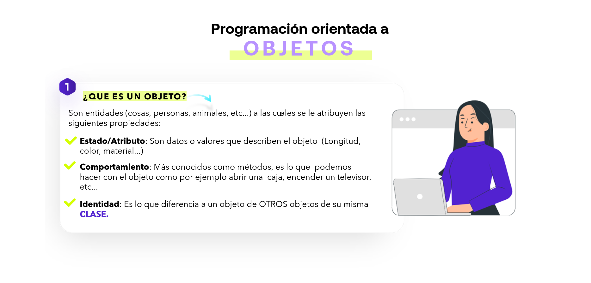
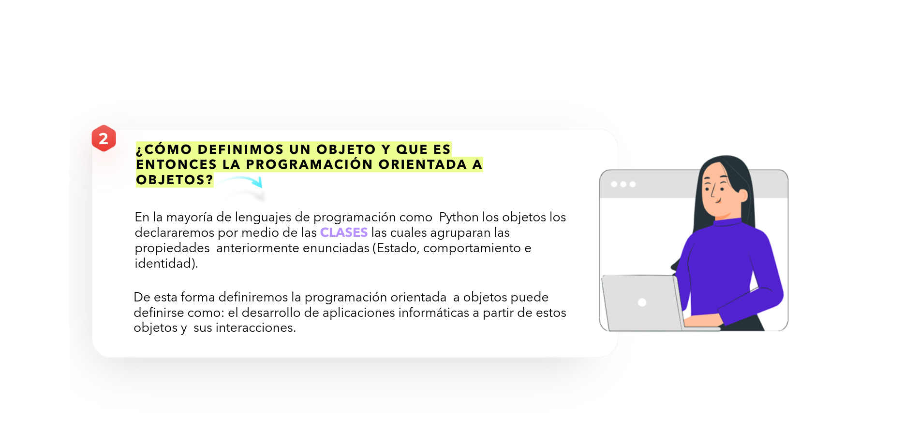
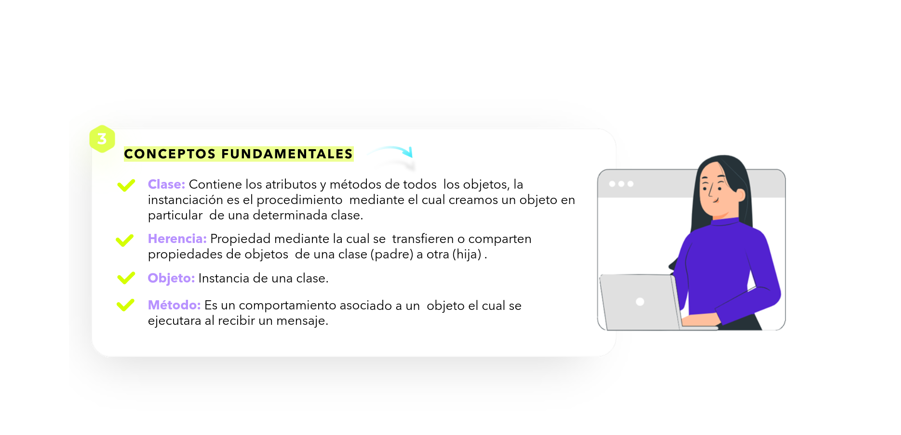
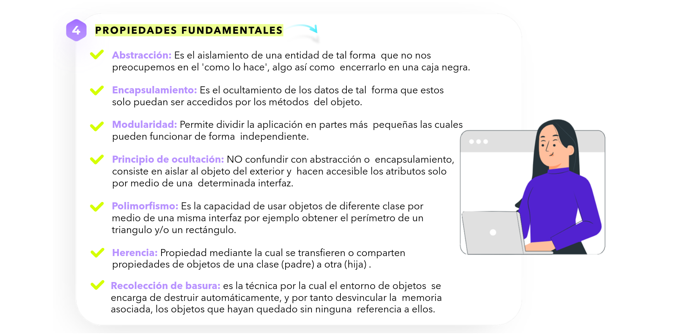
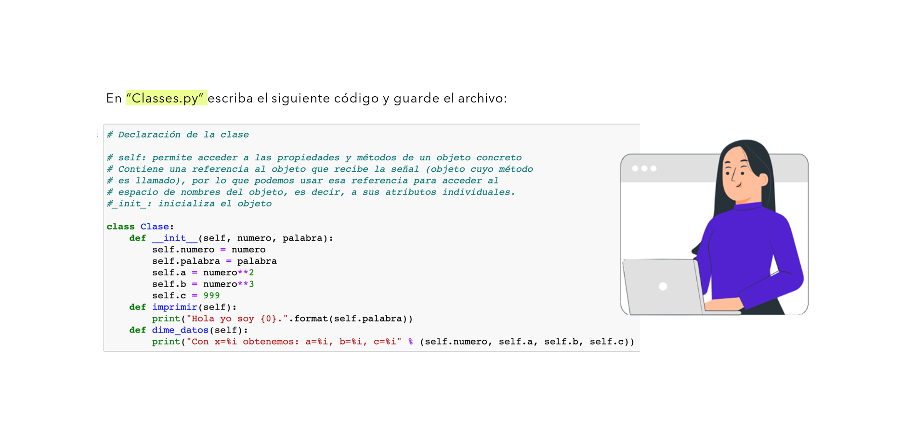
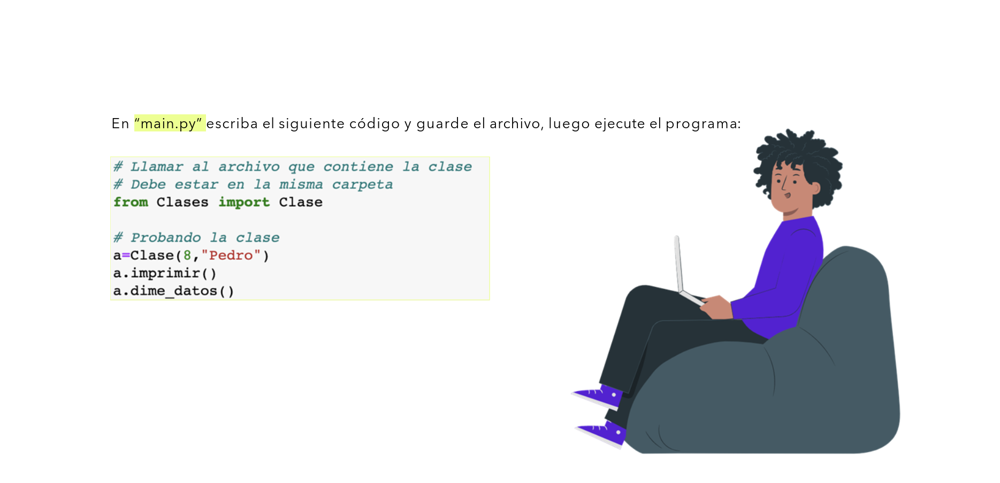
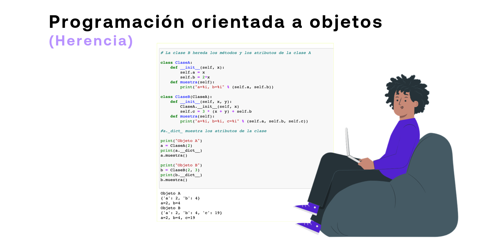

# 04-012:   Programación Orientada a Objetos (POO)

La Programación Orientada a Objetos (POO) es un paradigma de desarrollo que organiza el software en torno a entidades denominadas objetos, los cuales encapsulan datos (atributos) y comportamientos (métodos), modelando elementos del mundo real o conceptos abstractos.

---

## 1. ¿Qué es un objeto?



Un objeto es una entidad a la que se le atribuyen tres propiedades fundamentales:

-   **Estado / Atributo**: Datos o valores que describen el estado del objeto (por ejemplo, longitud, color, material, etc.).

-   **Comportamiento**: Definido por sus **métodos**. Representa las acciones que el objeto puede realizar o sufrir (por ejemplo, abrir una caja, encender un televisor, etc.).

-   **Identidad**: Propiedad única que distingue a un objeto particular de todos los demás objetos, incluso dentro de la misma clase.

---

## 2.    Clases y el Paradigma Orientado a Objetos



En lenguajes de programación como Python, los objetos no se construyen desde cero individualmente, sino a partir de **clases**.

-   **Clase**: Actúa como una plantilla o molde que agrupa la estructura de atributos y métodos.

-   **Definición de POO**: Es el desarrollo de aplicaciones informáticas mediante la construcción e interacción de estos objetos.

---

## 3. Conceptos Fundamentales



| Concepto | Definición |
|---|---|
| **Clase** | Contiene la definición de atributos y métodos comunes a un conjunto de objetos. |
| **Instanciación** | Procedimiento mediante el cual se crea un objeto particular a partir de una clase. |
| **Objeto** | Instancia concreta derivada de una clase. |
| **Método** | Comportamiento o función asociada a un objeto, la cual se ejecuta al recibir una llamada/mensaje. |
| **Herencia** | Propiedad mediante la cual se transfieren o comparten atributos y métodos de una clase base (padre) a una subclase (hija). |

---

## 4. Principios del Paradigma POO



-   **Abstracción**: Aislamiento de las características relevantes de una entidad, ocultando la complejidad de implementación ("caja negra").

-   **Encapsulamiento**: Ocultamiento de los datos internos para garantizar que solo se pueda acceder a ellos a través de las interfaces habilitadas del objeto.

-   **Moduridad**: Capacidad de dividir un programa en partes o módulos independientes con responsabilidades claras.

-   **Principio de Ocultación**: Protección estricta de la estructura interna de datos, haciendo accesibles los atributos exclusivamente mediante la interfaz definida.

-   **Polimorfismo**: Capacidad de enviar un mismo mensaje a objetos de clases distintas y que cada uno responda según su implementación particular (por ejemplo, calcular el área de un triángulo o un rectángulo).

-   **Herencia**: Reutilización de código permitiendo que clases hijas hereden el estado y comportamiento de una clase padre.

-   **Recolección de Basura (*Garbage Collection*)**: Técnica automática del entorno de ejecución que destruye y libera la memoria de los objetos que se quedan sin ninguna referencia activa.

---

## 5. Implementación en Python:     Declaración de una Clase



Para definir una clase en Python se utiliza la palabra clave `class`. El método constructor `__init__` se ejecuta al instanciar el objeto y sirve para inicializar sus atributos. El parámetro `self` hace referencia explícita a la instancia actual.

### Archivo: `Classes.py`

```python
# Declaración de la clase

class Clase:
    def __init__(self, numero, palabra):
        # self permite acceder a las propiedades y métodos del objeto concreto
        self.numero = numero
        self.palabra = palabra
        self.a = numero ** 2
        self.b = numero ** 3
        self.c = 999

    def imprimir(self):
        print("Hola yo soy {0}.".format(self.palabra))

    def dime_datos(self):
        print("Con x=%i obtenemos: a=%i, b=%i, c=%i" % (self.numero, self.a, self.b, self.c))
```

---

## 6. Instanciación e Importación



Para utilizar una clase definida en otro archivo dentro del mismo directorio, se utiliza la sintaxis `from módulo import Clase`.

### Archivo: `main.py`

```python
# Importar la clase desde el archivo Classes.py
from Classes import Clase

# Instanciación y prueba de la clase
a = Clase(8, "Pedro")
a.imprimir()
a.dime_datos()
```

---

## 7. Herencia de Clases



La herencia permite a una subclase reutilizar la funcionalidad de una clase padre y extenderla o sobrescribirla.

```python
# La clase B hereda los métodos y atributos de la clase A

class ClaseA:
    def __init__(self, x):
        self.a = x
        self.b = 2 * x

    def muestra(self):
        print("a=%i, b=%i" % (self.a, self.b))


class ClaseB(ClaseA):
    def __init__(self, x, y):
        # Invocación explícita al constructor de la clase padre
        ClaseA.__init__(self, x)
        self.c = 3 * (x + y) + self.b

    def muestra(self):
        # Sobrescritura del método muestra()
        print("a=%i, b=%i, c=%i" % (self.a, self.b, self.c))


# El atributo interno __dict__ expone los atributos almacenados en la instancia

print("Objeto A")
a = ClaseA(2)
print(a.__dict__)
a.muestra()

print("\nObjeto B")
b = ClaseB(2, 3)
print(b.__dict__)
b.muestra()
```

### Salida por consola

```text
Objeto A
{'a': 2, 'b': 4}
a=2, b=4

Objeto B
{'a': 2, 'b': 4, 'c': 19}
a=2, b=4, c=19
```

---


- `self` representa la instancia actual del objeto y debe declararse siempre como primer parámetro en los métodos de clase.
- `__init__()` es el constructor ejecutado de forma implícita en la instanciación.
- `__dict__` es un atributo especial que almacena el diccionario de atributos de la instancia.
- En la herencia, para utilizar la lógica de la clase base dentro del constructor de la hija, debe llamarse explícitamente a `ClasePadre.__init__(self, ...)` o utilizar `super().__init__(...)`.
