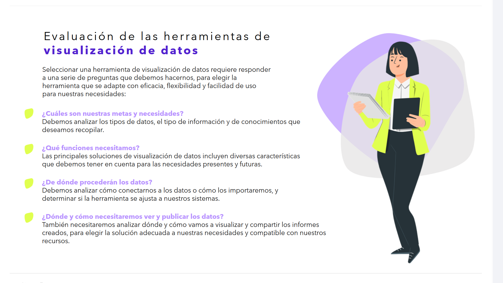
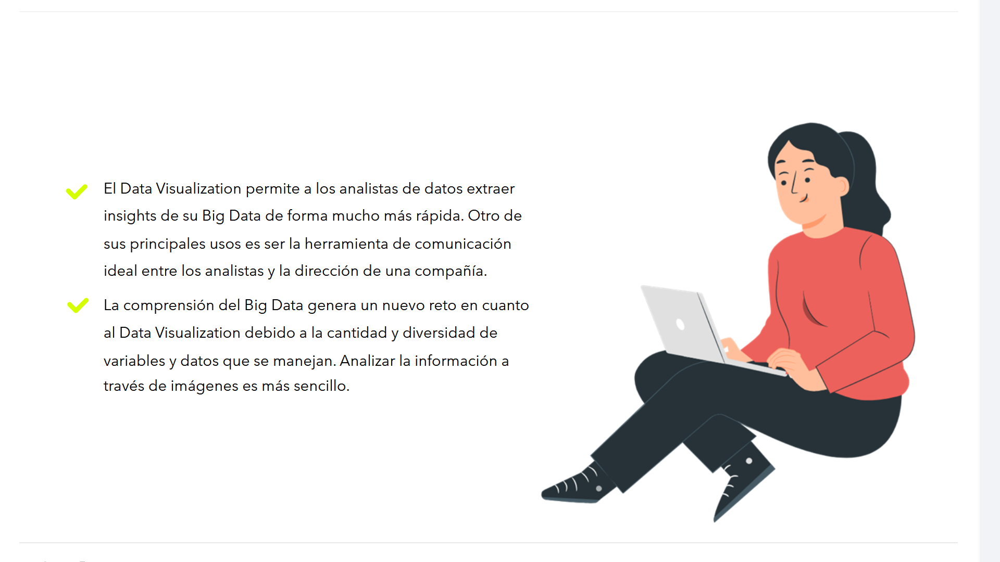
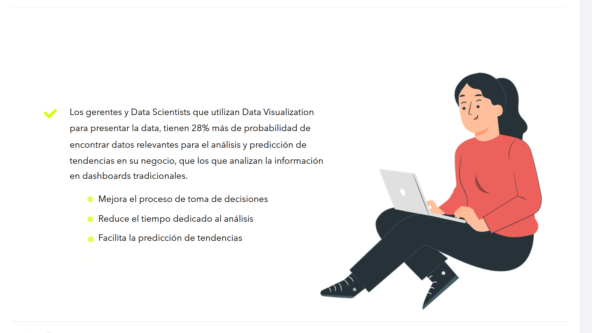

# 05-006:	Herramientas para Data Visualisation

---

## Evaluaci車n de las herramientas de visualizaci車n de datos

Seleccionar una herramienta de visualizaci車n de datos requiere responder a una serie de preguntas que debemos hacernos, para elegir la herramienta que se adapte con eficacia, flexibilidad y facilidad de uso para nuestras necesidades:

### ?? ?Cu芍les son nuestras metas y necesidades?
Debemos analizar los tipos de datos, el tipo de informaci車n y de conocimientos que deseamos recopilar.

### ??? ?Qu谷 funciones necesitamos?
Las principales soluciones de visualizaci車n de datos incluyen diversas caracter赤sticas que debemos tener en cuenta para las necesidades presentes y futuras.

### ?? ?De d車nde proceder芍n los datos?
Debemos analizar c車mo conectarnos a los datos o c車mo los importaremos, y determinar si la herramienta se ajusta a nuestros sistemas.

### ?? ?D車nde y c車mo necesitaremos ver y publicar los datos?
Tambi谷n necesitaremos analizar d車nde y c車mo vamos a visualizar y compartir los informes creados, para elegir la soluci車n adecuada a nuestras necesidades y compatible con nuestros recursos.

---

## El Impacto del Data Visualization en Big Data y Negocio

*   **Extracci車n r芍pida de insights:** El Data Visualization permite a los analistas de datos extraer insights de su Big Data de forma mucho m芍s r芍pida. Otro de sus principales usos es ser la herramienta de comunicaci車n ideal entre los analistas y la direcci車n de una compa?赤a.

*   **El reto de la complejidad:** La comprensi車n del Big Data genera un nuevo reto en cuanto al Data Visualization debido a la cantidad y diversidad de variables y datos que se manejan. Analizar la informaci車n a trav谷s de im芍genes es m芍s sencillo.

---

## ?? Ventajas Competitivas para Gerentes y Data Scientists

Los gerentes y Data Scientists que utilizan Data Visualization para presentar la data, tienen un **28% m芍s de probabilidad** de encontrar datos relevantes para el an芍lisis y predicci車n de tendencias en su negocio, que los que analizan la informaci車n en dashboards tradicionales.

#### Beneficios Clave
*   ? Mejora el proceso de toma de decisiones
*   ?? Reduce el tiempo dedicado al an芍lisis
*   ?? Facilita la predicci車n de tendencias

---
