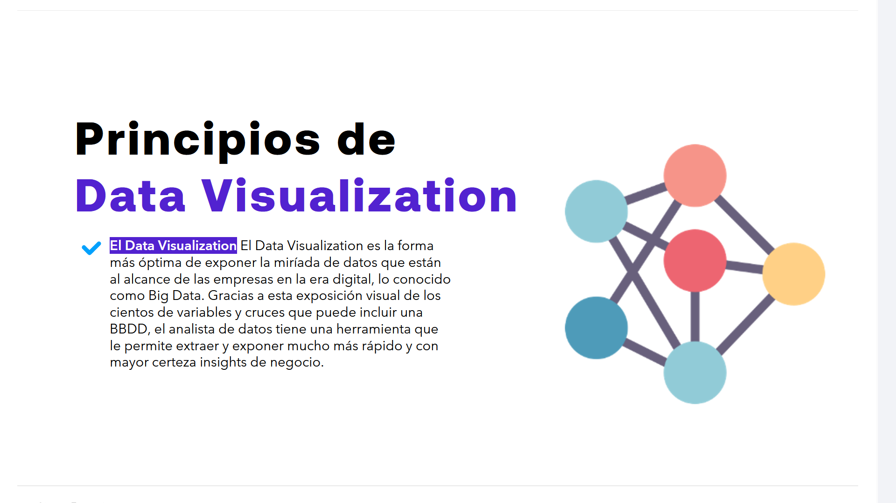
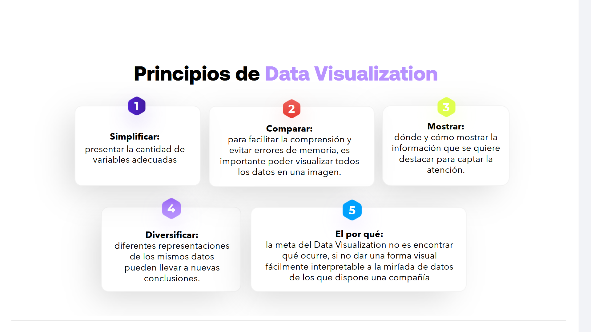

# 05-007:	Principios de Data Visualisation

El Data Visualization es la forma más óptima de exponer la miríada de datos que están al alcance de las empresas en la era digital, lo conocido como **Big Data**. 

> 💡 Gracias a esta exposición visual de los cientos de variables y cruces que puede incluir una BBDD, el analista de datos tiene una herramienta que le permite extraer y exponer mucho más rápido y con mayor certeza **insights de negocio**.

---

### 🔥 Simplificar
Presentar la cantidad de variables adecuadas.

### 🔥 Comparar
Para facilitar la comprensión y evitar errores de memoria, es importante poder visualizar todos los datos en una imagen.

### 🔥 Mostrar
Dónde y cómo mostrar la información que se quiere destacar para captar la atención.

### 🔥 Diversificar
Diferentes representaciones de los mismos datos pueden llevar a nuevas conclusiones.

### 🔥 El por qué
La meta del Data Visualization no es encontrar qué ocurre, sino dar una forma visual fácilmente interpretable a la miríada de datos de los que dispone una compañía.