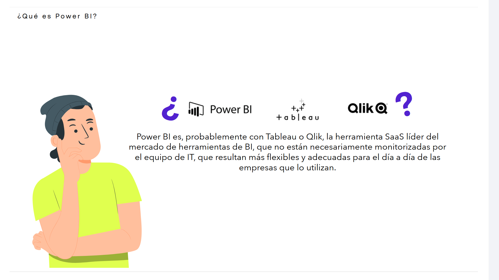
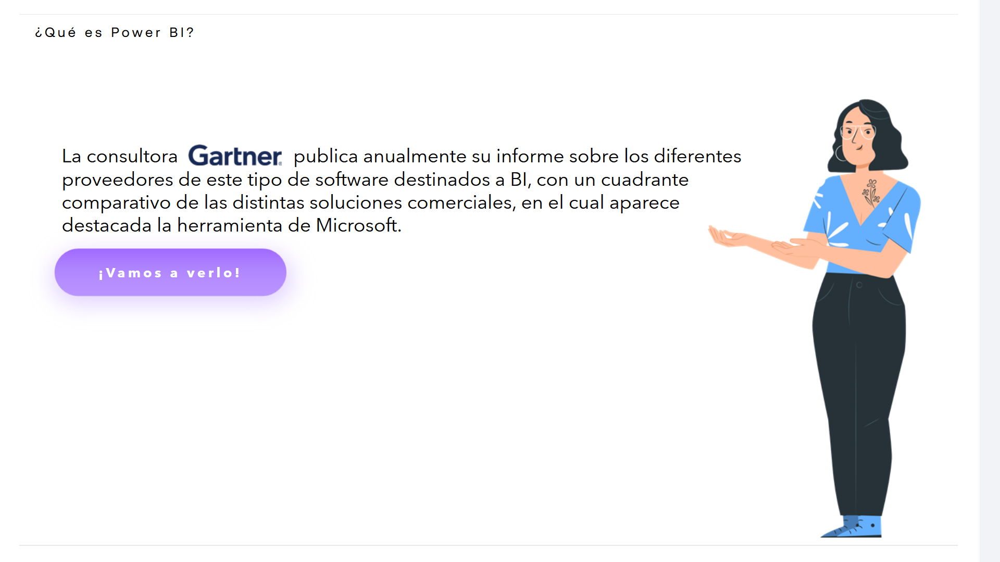
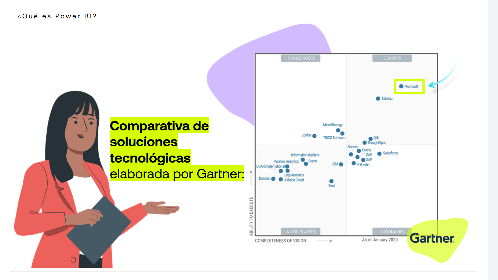
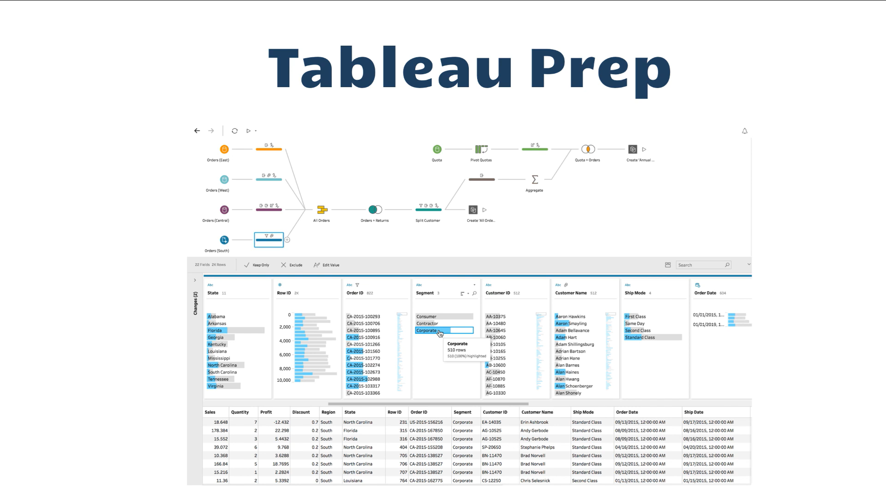
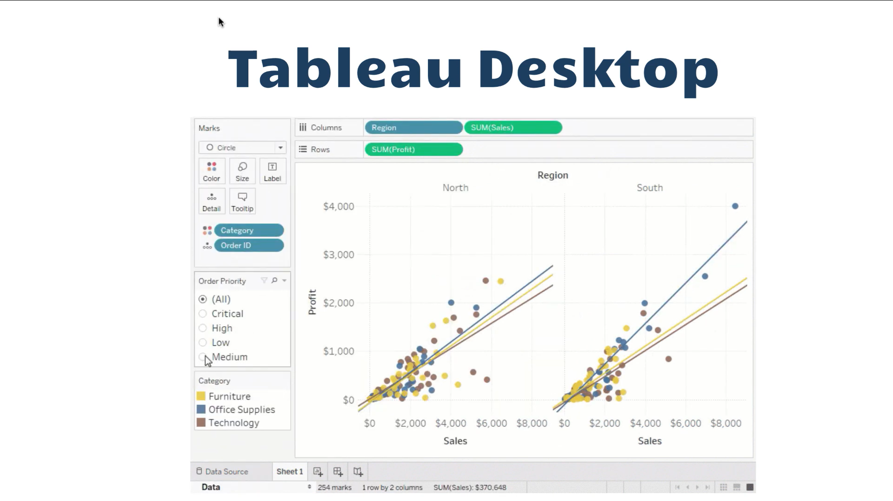
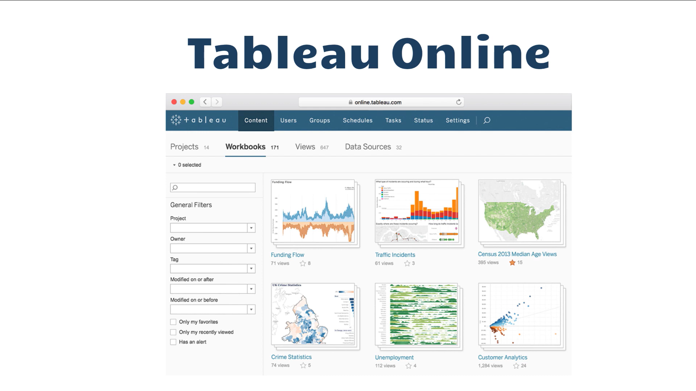
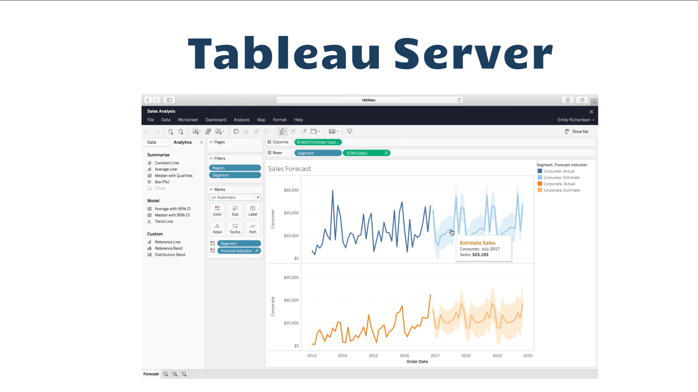

# 05-009:	Tableau y Business Inteligence

## El otro competidor de Tableu:		Power BI

### ¿Qué es Power BI?

* **Definición:** Power BI es, probablemente junto con Tableau o Qlik, la herramienta SaaS líder del mercado de herramientas de BI.
* **Características clave:**
  * No están necesariamente monitorizadas por el equipo de IT.
  * Resultan más flexibles y adecuadas para el día a día de las empresas que lo utilizan.

* **Informe Anual:** La consultora **Gartner** publica anualmente su informe sobre los diferentes proveedores de este tipo de software destinados a BI.
* **Formato:** Cuenta con un cuadrante comparativo de las distintas soluciones comerciales.
* **Resultado:** En dicho cuadrante aparece destacada la herramienta de Microsoft.

---

### Comparativa de soluciones tecnológicas elaborada por Gartner:

* **Ejes del cuadrante:**
  * **Eje vertical:** Ability to execute *(Capacidad de ejecución)*
  * **Eje horizontal:** Completeness of vision *(Integridad de visión)*
* **Categorías del cuadrante:**
  * Challengers
  * Leaders *(Destaca: **Microsoft**)*
  * Niche Players
  * Visionaries

> 📅 **Referencia temporal del gráfico:** As of January 2020

---

## Business Intelligence: Enfoque en Tableau y Power BI

- **Vídeo de Apoyo:** https://www.youtube.com/watch?v=GBSdCGMpU1Q

> **Tableau y Power BI lideran el mercado de la analítica.**

Tableau destaca por ser una suite robusta que permite desde la ingeniería básica de datos (**Prep**), pasando por el diseño avanzado (**Desktop**), hasta la distribución en la nube o servidores locales (**Online/Server**), consolidándose como una habilidad imprescindible para cualquier profesional del mundo de los datos.

---

### 1. Introducción al Business Intelligence (BI) y Tableau

**Tableau** es una de las herramientas de análisis de datos e Inteligencia de Negocios (**Business Intelligence**) más utilizadas y potentes del mercado.  

Su lema principal, *"Changing the way you think about data"* (**Cambiando la forma de ver los datos**), define su propósito fundamental: transformar datos en bruto en información visual y comprensible.  

El **Business Intelligence (BI)** se define como la práctica de entender los datos para obtener información relevante sobre un negocio a través de **visualizaciones**, **cuadros de mando (dashboards)** y diferentes metodologías de **análisis predictivo o descriptivo**. Tableau facilita este proceso mediante una interfaz intuitiva basada en hacer clic y arrastrar (*drag-and-drop*).

---

### 2. Los 4 Componentes Clave del Ecosistema Tableau

Tableau no es una única aplicación, sino un entorno compuesto por **cuatro herramientas principales** diseñadas para cubrir todo el ciclo de vida del dato:

1. Tableau Prep
2. Tableau Desktop
3. Tableau Online
4. Tableau Server

#### A. 	Tableau Prep

> **Definición:** Es una herramienta de **ETL (Extract, Transform, and Load / Extraer, Transformar y Cargar)** orientada a la limpieza y preparación del dato.

> **Propósito:** Automatizar los procesos de limpieza de datos. Un científico o analista de datos suele pasar hasta el **80% de su tiempo** depurando datos; Tableau Prep reduce drásticamente este margen temporal.

---

#### B. 	Tableau Desktop

> **Definición:** La aplicación de escritorio principal del entorno.

> **Propósito:** Es donde se lleva a cabo el núcleo del análisis de datos. En ella se diseñan los gráficos, informes interactivos y los cuadros de mando finales. Es la herramienta central que se enseña en cualquier formación académica sobre Tableau.

---

#### C. 	Tableau Online

> **Definición:** La vertiente en la nube (**SaaS**) del entorno.

> **Propósito:** Almacenar, gestionar y consultar las hojas de trabajo, dashboards y fuentes de datos en la nube de Tableau. Responde a la tendencia global del BI de abandonar los archivos locales para centralizar la computación y el acceso a través de la web.

---

#### D. 	Tableau Server

> **Definición:** Plataforma empresarial para la gobernanza y compartición de datos.

> **Propósito:** Pensada para grandes organizaciones que requieren alojar sus datos de forma privada, ya sea de manera local (**on-premises**) o en nubes privadas, permitiendo la administración segura de accesos y la colaboración en equipo.

---

### 3. Tableau Public vs. Tableau Desktop

Para usuarios individuales y estudiantes existe una distinción crucial en cuanto a licencias:

#### **Tableau Desktop**

- Es de pago, enfocado al sector empresarial, y cuenta con una versión de prueba de **14 días**.
- Permite guardar archivos de forma local y privada.

#### **Tableau Public**

- Es una versión totalmente gratuita que conserva la gran mayoría de funcionalidades analíticas de la versión Desktop.
- La restricción clave es que los datos y libros de trabajo son públicos: obligatoriamente deben guardarse en la nube de Tableau Public, por lo que no es apto para empresas con políticas de privacidad o datos sensibles.

---

### 4. Tipos de Licencias y Roles de Usuario

El acceso a Tableau en entornos compartidos se estructura en **tres niveles o perfiles de coste escalonado**:

- **Creator (Creador):** Acceso completo para transformar datos (Tableau Prep) y diseñar visualizaciones (Tableau Desktop).

- **Explorer (Explorador):** Modifica o profundiza en informes ya creados sobre la plataforma web.

- **Viewer (Visor):** Usuario de consulta que únicamente consume e interactúa con los cuadros de mando terminados.

---

### 5. El Mercado del BI: Tableau vs. Power BI (Cuadrante Mágico de Gartner)

#### 	Cuadrante Mágico de Gartner para Plataformas de Analítica y Business Intelligence

Gartner clasifica anualmente los softwares del sector basándose en su **"habilidad de ejecución"** y la **"integridad de su visión"**.

- **Microsoft Power BI:** Posicionado como el líder absoluto y el software más avanzado del mercado debido a su accesibilidad e integración con el ecosistema de Microsoft.

- **Tableau:** Posicionado firmemente como el segundo mejor software del mundo y colíder del cuadrante, destacando por su potencia visual y flexibilidad de exploración de datos.

- **Otros competidores:** Detrás de ellos se sitúan herramientas como **Qlik**, **ThoughtSpot** y **Salesforce** (empresa que de hecho adquirió Tableau).

---