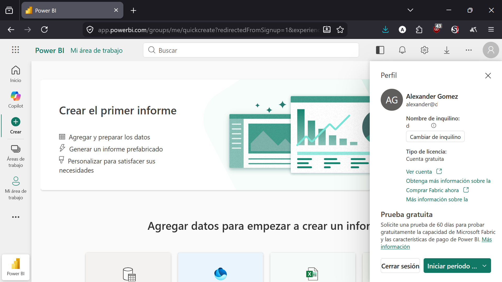
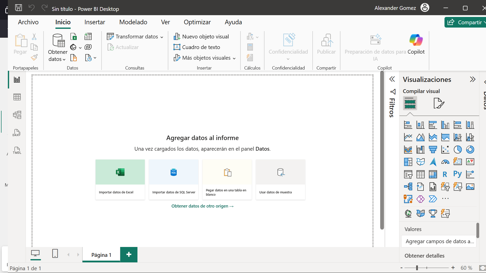

# SESION 2 - [2026 JUL, 14] 

---

## PRIMERAS PREGUNTAS QUE QUISIERA PODER RESPONDER Y VISUALIZAR

* ¿Qué relación hay entre el reparto de la riqueza, la criminalidad, la empleabilidad, la inclusión social, en una región-periodo temporal determinado?

* ¿Cuánto influye la alfabetización (incluso la relativa a modelos lingüísticos ) respecto a la inclusión social, laboral, de las personas?

* ¿Existe alguna relación entre la tasa de desempleo, la exclusión social y la salud mental tomando como factor la alfabetización? ¿Aquellos que hace 20-30 años siguieron unos itinerarios educativos, u otros, cómo se encuentran a día de hoy?

---
## Entorno de trabajo 

* Previo a UD 6, guías sobre interfaz y objetos visuales (06-001, 06-002).
* Para poder trabajar en la plataforma, hay que empezar a trabajar las fases iniciales de un proyecto Big Data, las que implican **recolecar datos**, **limpiar y adecuar datos**.
* Esta sesión tratará de desarrollar estos pasos iniciales, también afianzar aspectos técnicos de la plataforma (PowerBI Desktop, PowerBI online)
* **RECOMENDADO**:	Se está usando una cuenta gratuíta de PowerBI. Como las cuentas exponen públicamente todos los datos a todos aquellos que usen el mismo subdominio, se está usando una cuenta del mail corporativo de mi propia web.

## 🛠️ Enlaces y Notas de Desarrollo de Power BI

*   **Acceso al entorno Cloud:** [Portal Web de Power BI](https://app.powerbi.com/home?redirectedFromSignup=1&experience=power-bi)

*    Power BI Desktop funciona de forma totalmente autónoma y gratuita sin necesidad de tener una cuenta activa o de pago (en entornos locales).

- **Cloud**:
	
	
- **Desktop**:

*  Recomendable trabajar de forma paralela tanto en la **versión Web (Servicio)** como en **Power BI Desktop** utilizando el mismo proyecto. Esto servirá para identificar y comparar posibles discrepancias o limitaciones entre ambas interfaces, las cuales deberían ser mínimas.

---
