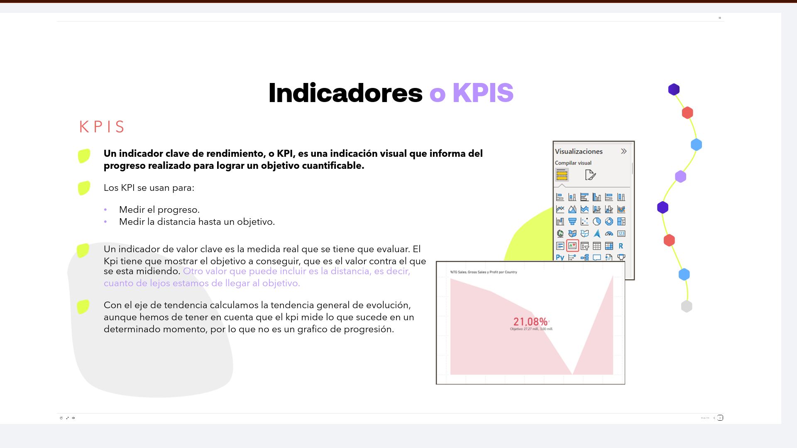
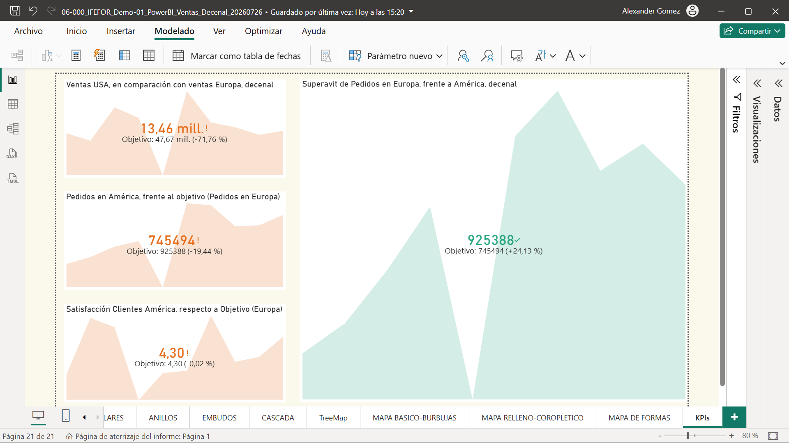
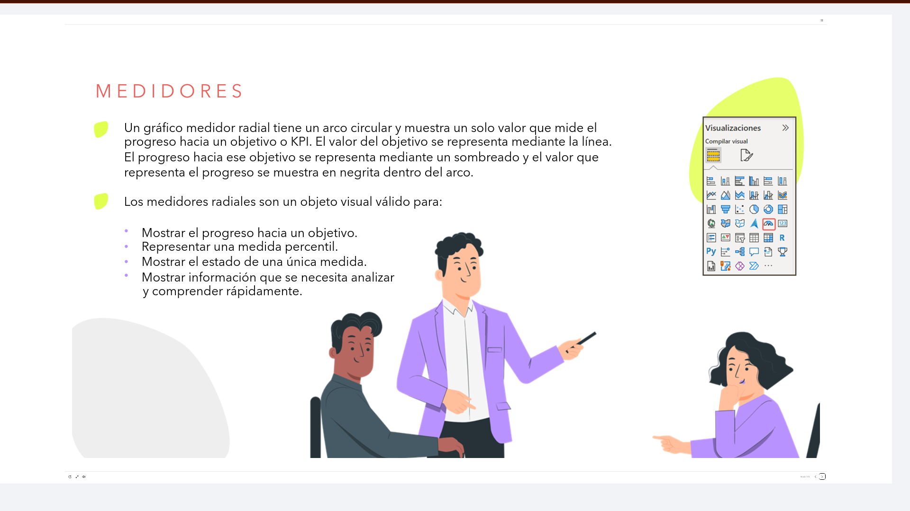
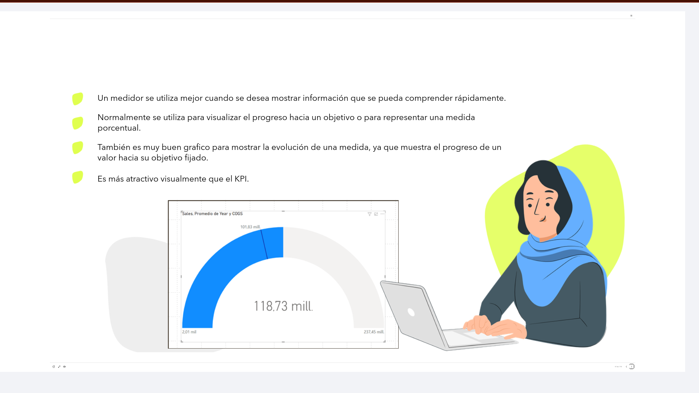
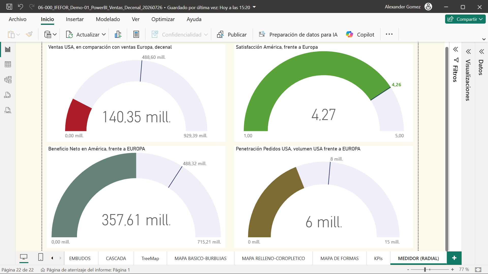
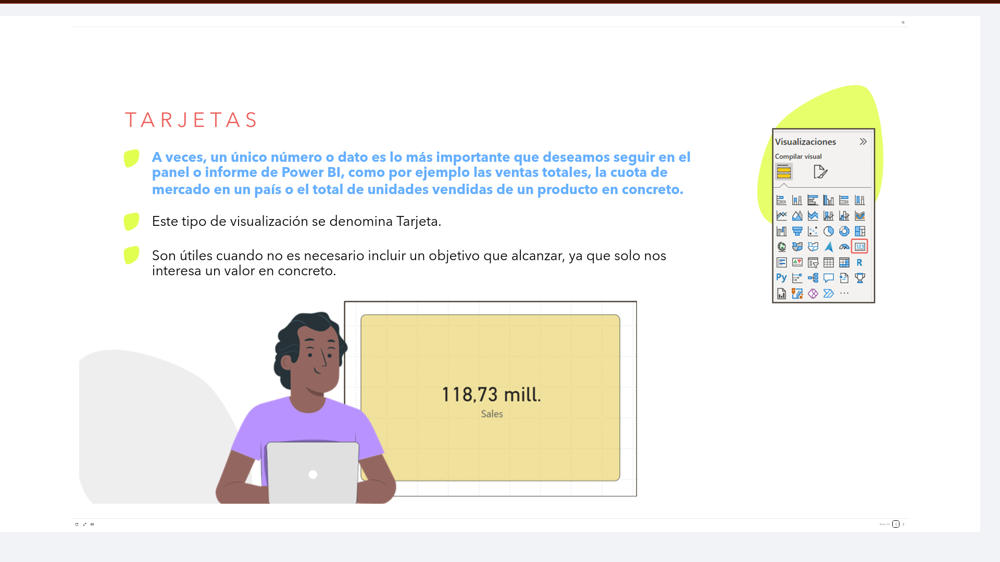
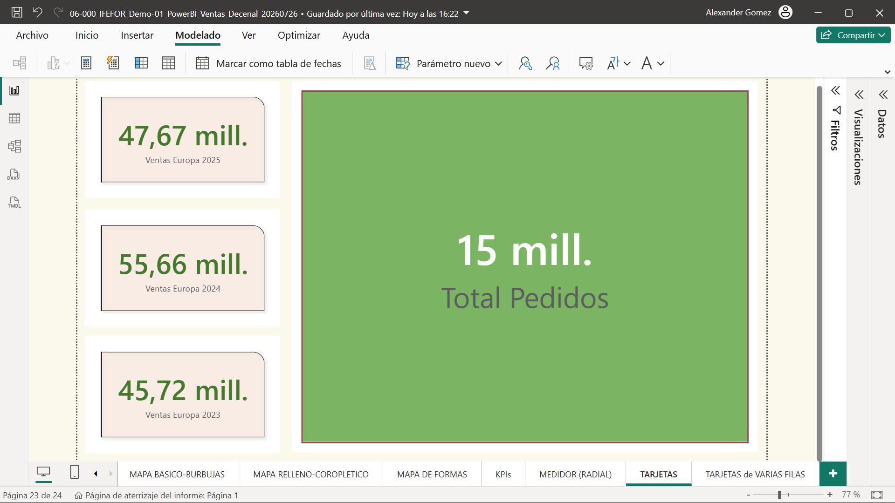
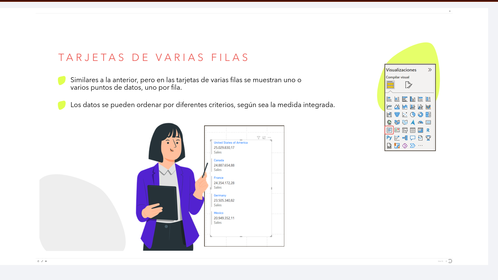

# 06-009: KPI's - Indicadores

## Indicadores o KPIs

### KPIs

Un **indicador clave de rendimiento**, o **KPI**, es una indicación visual que informa del progreso realizado para lograr un objetivo cuantificable.

Los KPI se usan para:

- Medir el progreso.
- Medir la distancia hasta un objetivo.

Un indicador de valor clave es la medida real que se tiene que evaluar. El KPI tiene que mostrar el objetivo a conseguir, que es el valor contra el que se está midiendo. Otro valor que puede incluir es la distancia, es decir, cuánto de lejos estamos de llegar al objetivo.

Con el eje de tendencia calculamos la tendencia general de evolución, aunque hemos de tener en cuenta que el KPI mide lo que sucede en un determinado momento, por lo que **no es un gráfico de progresión**.

---

### Medidores

Un gráfico medidor radial tiene un arco circular y muestra un solo valor que mide el progreso hacia un objetivo o KPI. El valor del objetivo se representa mediante la línea. El progreso hacia ese objetivo se representa mediante un sombreado, y el valor que representa el progreso se muestra en negrita dentro del arco.

**Los medidores radiales son un objeto visual válido para:**

- Mostrar el progreso hacia un objetivo.
- Representar una medida percentil.
- Mostrar el estado de una única medida.
- Mostrar información que se necesita analizar y comprender rápidamente.

Un medidor se utiliza mejor cuando se desea mostrar información que se pueda comprender rápidamente.

Normalmente se utiliza para visualizar el progreso hacia un objetivo o para representar una medida porcentual.

> También es un gráfico muy adecuado para mostrar la evolución de una medida, ya que muestra el progreso de un valor hacia su objetivo fijado.
> Es más atractivo visualmente que el KPI.

---

### Tarjetas

A veces, un único número o dato es lo más importante que deseamos seguir en el panel o informe de Power BI, como por ejemplo las ventas totales, la cuota de mercado en un país o el total de unidades vendidas de un producto en concreto.

Este tipo de visualización se denomina **Tarjeta**.

Son útiles cuando no es necesario incluir un objetivo que alcanzar, ya que solo nos interesa un valor en concreto.

---

### Tarjetas de Varias Filas

Similares a la anterior, pero en las tarjetas de varias filas se muestran uno o varios puntos de datos, uno por fila.

Los datos se pueden ordenar por diferentes criterios, según sea la medida integrada.

---