# 06-010: Otros Gráficos

- Cintas
- Dispersión
- Dispersión con Burbujas
- Esquema Jerárquico
- Elementos Influyentes Clave

---

## Gráfico de Cintas

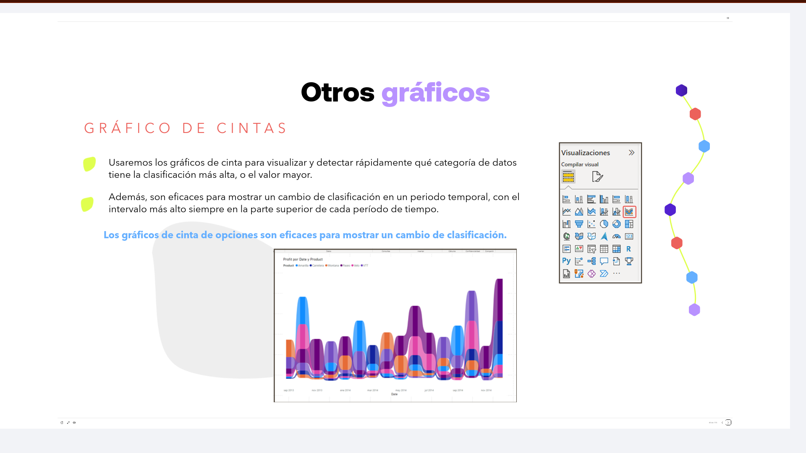

Usaremos los gráficos de cinta para visualizar y detectar rápidamente qué categoría de datos tiene la clasificación más alta, o el valor mayor.

Además, son eficaces para mostrar un cambio de clasificación en un periodo temporal, con el intervalo más alto siempre en la parte superior de cada período de tiempo.

> Los gráficos de cinta de opciones son eficaces para **mostrar un cambio de clasificación**.

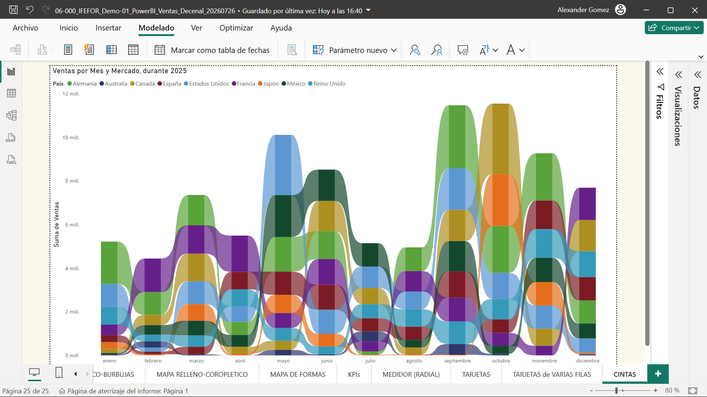

---

## Gráfico de Dispersión

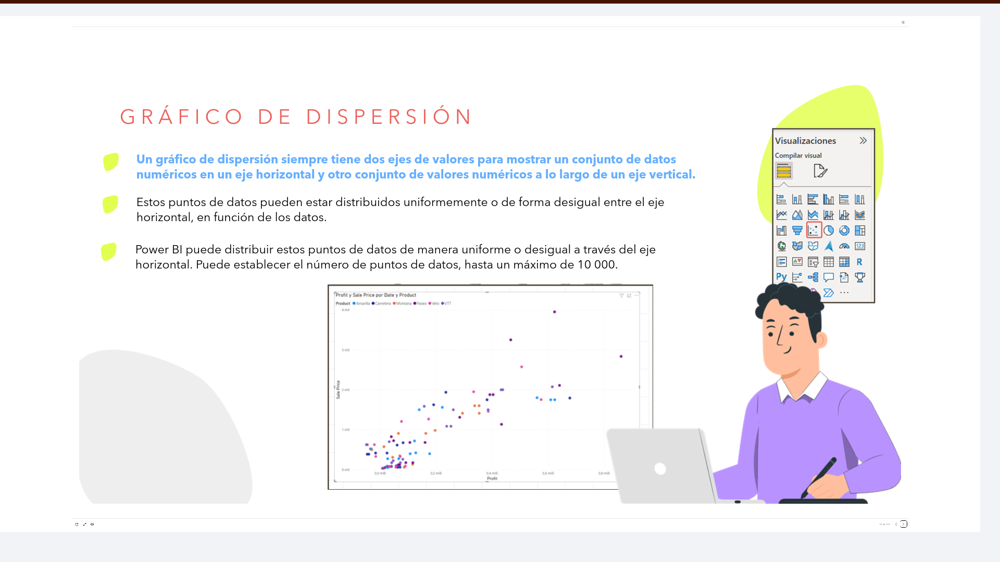

Un gráfico de dispersión siempre tiene **dos ejes de valores**: muestra un conjunto de datos numéricos en un eje horizontal y otro conjunto de valores numéricos a lo largo de un eje vertical.

Estos puntos de datos pueden estar distribuidos uniformemente o de forma desigual entre el eje horizontal, en función de los datos.

Power BI puede distribuir estos puntos de datos de manera uniforme o desigual a través del eje horizontal. Puede establecer el número de puntos de datos, hasta un máximo de **10.000**.

**Los gráficos de dispersión son útiles para:**

- Mostrar las relaciones entre dos valores numéricos.
- Trazar dos grupos de números como una serie de coordenadas `X` e `Y`.
- Emplearlo en lugar de un gráfico de líneas cuando se quiere cambiar la escala del eje horizontal.
- Convertir el eje horizontal en una escala logarítmica.
- Mostrar datos de la hoja de cálculo que incluyen pares o conjuntos de valores agrupados.
- Mostrar patrones en grandes conjuntos de datos.
- Comparar grandes cantidades de números correspondientes a puntos de datos sin tener en cuenta el tiempo.

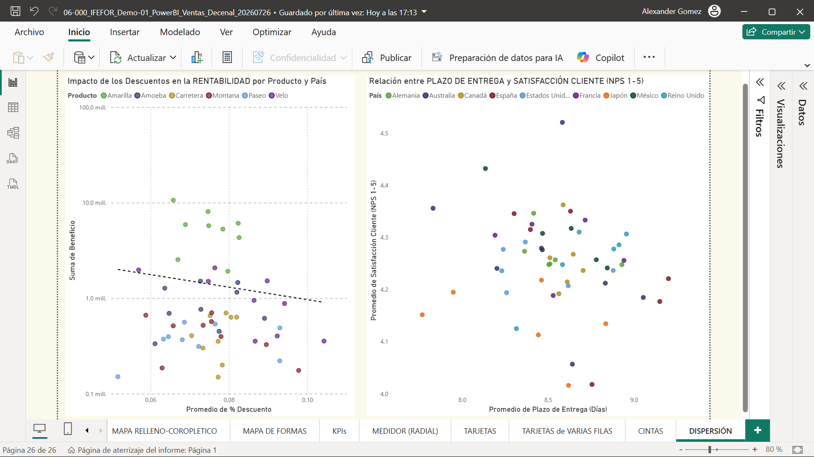

---

## Gráfico de Dispersión en Burbujas

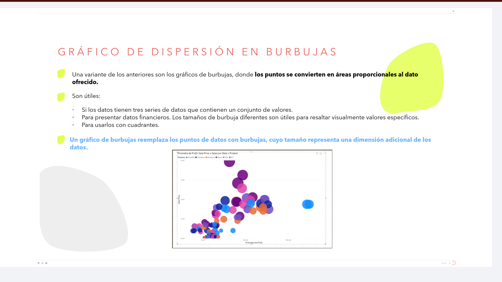

Una variante de los anteriores son los gráficos de burbujas, donde los puntos se convierten en áreas proporcionales al dato ofrecido.

**Son útiles:**

- Si los datos tienen tres series de datos que contienen un conjunto de valores.
- Para presentar datos financieros. Los tamaños de burbuja diferentes son útiles para resaltar visualmente valores específicos.
- Para usarlos con cuadrantes.

> Un gráfico de burbujas reemplaza los puntos de datos con burbujas, cuyo tamaño representa una dimensión adicional de los datos.

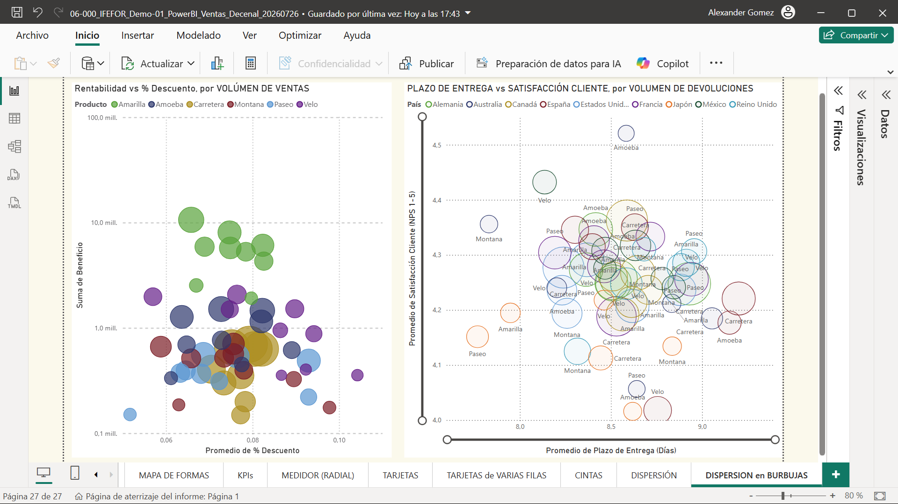

---

## Esquema Jerárquico

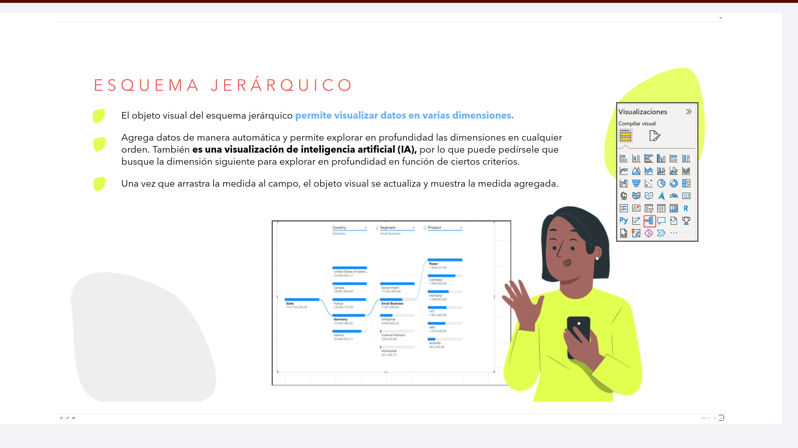

El objeto visual del esquema jerárquico permite visualizar datos en varias dimensiones.

Agrega datos de manera automática y permite explorar en profundidad las dimensiones en cualquier orden. También es una visualización de **inteligencia artificial (IA)**, por lo que puede pedírsele que busque la dimensión siguiente para explorar en profundidad en función de ciertos criterios.

Una vez que arrastra la medida al campo, el objeto visual se actualiza y muestra la medida agregada.

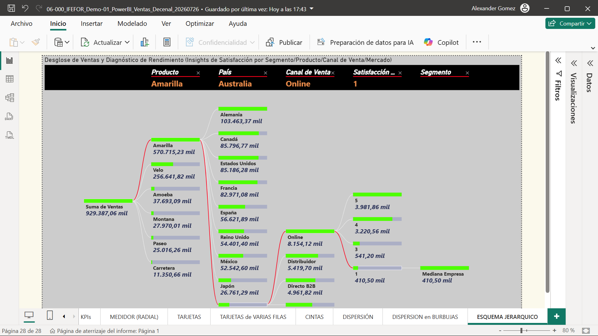

---

## Gráfico de Influenciadores Clave

En un gráfico de influenciadores clave se muestran los mayores colaboradores a un resultado o valor seleccionado.

Este gráfico es idóneo para ayudar a comprender los factores que afectan a una métrica clave. Por ejemplo, qué influye en los clientes para realizar un nuevo pedido o por qué las ventas fueron tan altas en una zona concreta.

> Ayuda a reconocer los factores que controlan una métrica que nos interesa, analizando los datos y clasificando los factores que son importantes, para mostrarlos como **influenciadores clave**.

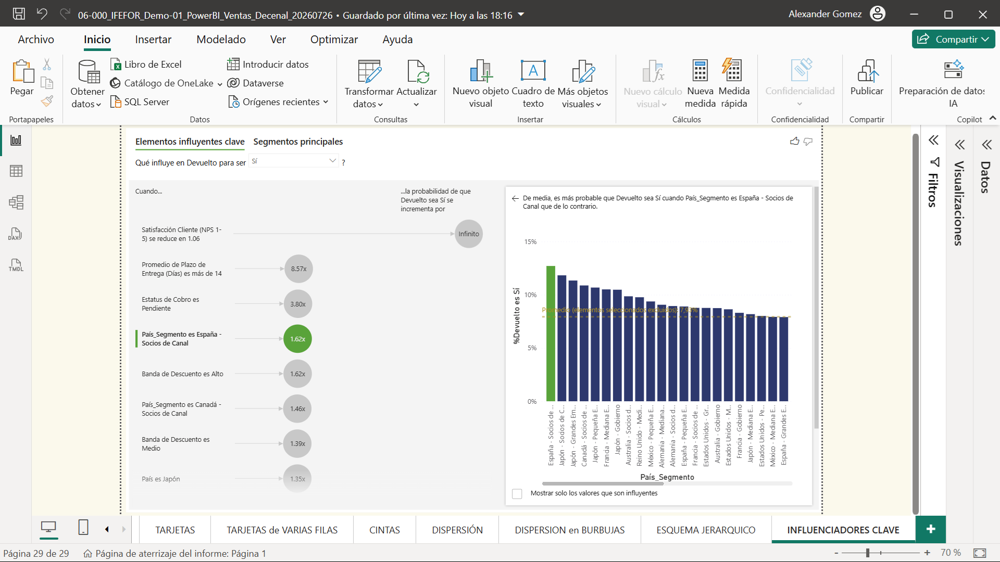

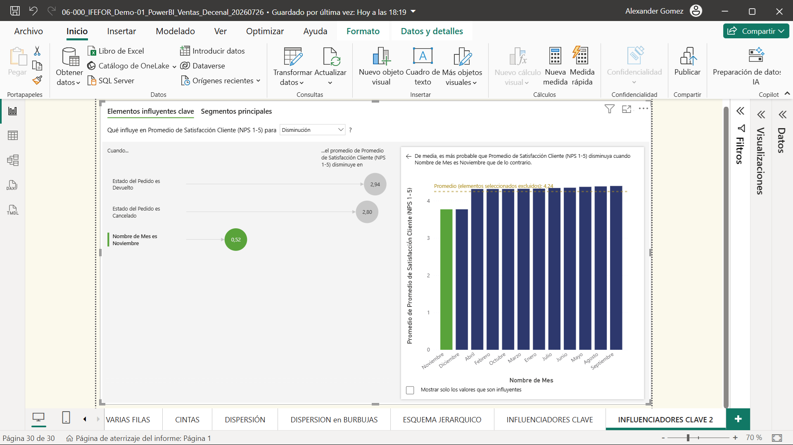

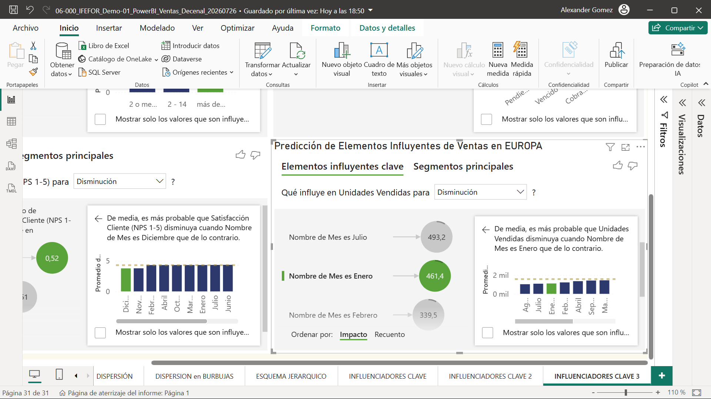
