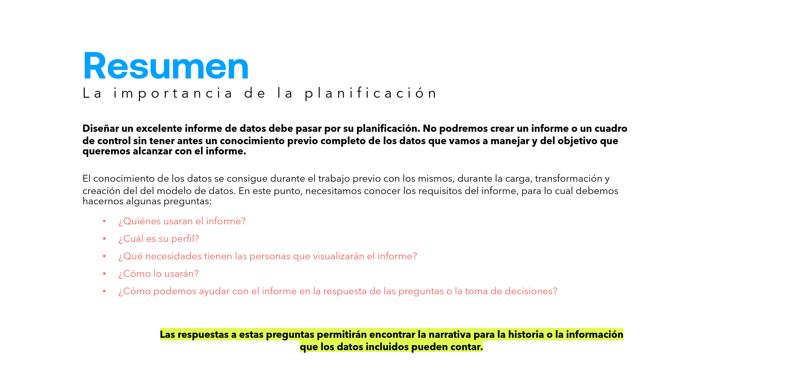
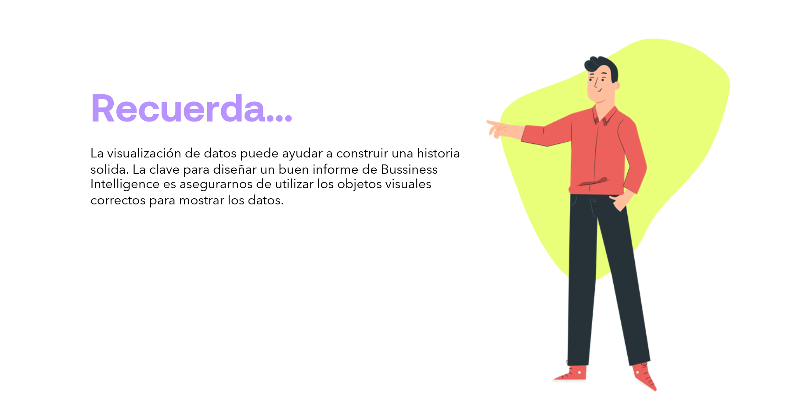
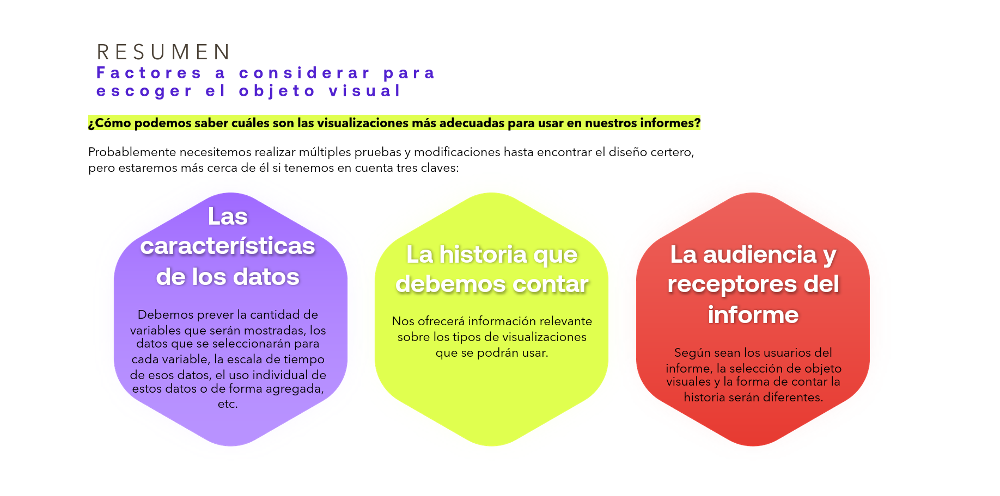

# 06-011: Importancia de la Planificación

Diseñar un excelente informe de datos debe pasar por su planificación. No podremos crear un informe o un cuadro de control sin tener antes un conocimiento previo completo de los datos que vamos a manejar y del objetivo que queremos alcanzar con el informe.

El conocimiento de los datos se consigue durante el trabajo previo con los mismos, durante la carga, transformación y creación del modelo de datos. En este punto, necesitamos conocer los requisitos del informe, para lo cual debemos hacernos algunas preguntas:

- ¿Quiénes usarán el informe?
- ¿Cuál es su perfil?
- ¿Qué necesidades tienen las personas que visualizarán el informe?
- ¿Cómo lo usarán?
- ¿Cómo podemos ayudar con el informe en la respuesta de las preguntas o la toma de decisiones?

Las respuestas a estas preguntas permitirán encontrar la narrativa para la historia o la información que los datos incluidos pueden contar.

> **Recuerda...**

La visualización de datos puede ayudar a construir una historia sólida. La clave para diseñar un buen informe de Business Intelligence es asegurarnos de utilizar los objetos visuales correctos para mostrar los datos.

---

### Factores a considerar para escoger el objeto visual

¿Cómo podemos saber cuáles son las visualizaciones más adecuadas para usar en nuestros informes?

Probablemente necesitemos realizar múltiples pruebas y modificaciones hasta encontrar el diseño certero, pero estaremos más cerca de él si tenemos en cuenta tres claves:

- **Las características de los datos:** debemos prever la cantidad de variables que serán mostradas, los datos que se seleccionarán para cada variable, la escala de tiempo de esos datos, el uso individual de estos datos o de forma agregada, etc.
- **La historia que debemos contar:** nos ofrecerá información relevante sobre los tipos de visualizaciones que se podrán usar.
- **La audiencia y receptores del informe:** según sean los usuarios del informe, la selección de objetos visuales y la forma de contar la historia serán diferentes.