# 06-012: INFORMES (1) - Personalización de las Visualizaciones

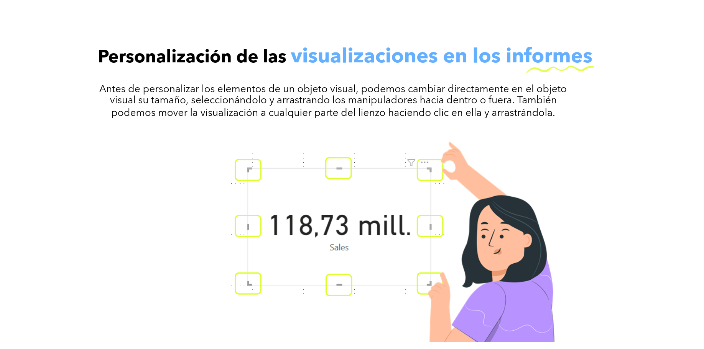

Antes de personalizar los elementos de un objeto visual, podemos cambiar directamente en el objeto visual su tamaño, seleccionándolo y arrastrando los manipuladores hacia dentro o fuera. También podemos mover la visualización a cualquier parte del lienzo haciendo clic en ella y arrastrándola.

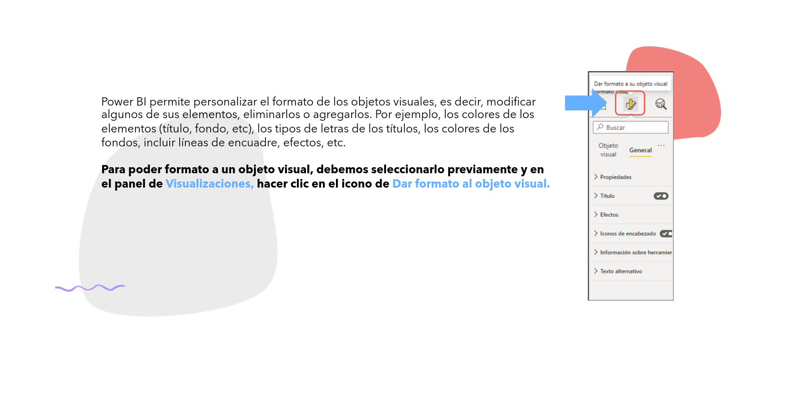

Power BI permite personalizar el formato de los objetos visuales, es decir, modificar algunos de sus elementos, eliminarlos o agregarlos. Por ejemplo: los *colores* de los elementos (título, fondo, etc.), los *tipos de letra* de los títulos, los *colores de los fondos*, incluir líneas de encuadre, efectos, etc.

Para dar formato a un objeto visual, debemos seleccionarlo previamente y, en el panel de `Visualizaciones`, hacer clic en el icono de `Dar formato al objeto visual`.

> Panel `VISUALIZACIONES` → Botón `FORMATO VISUAL` → `Dar Formato al Objeto Visual`

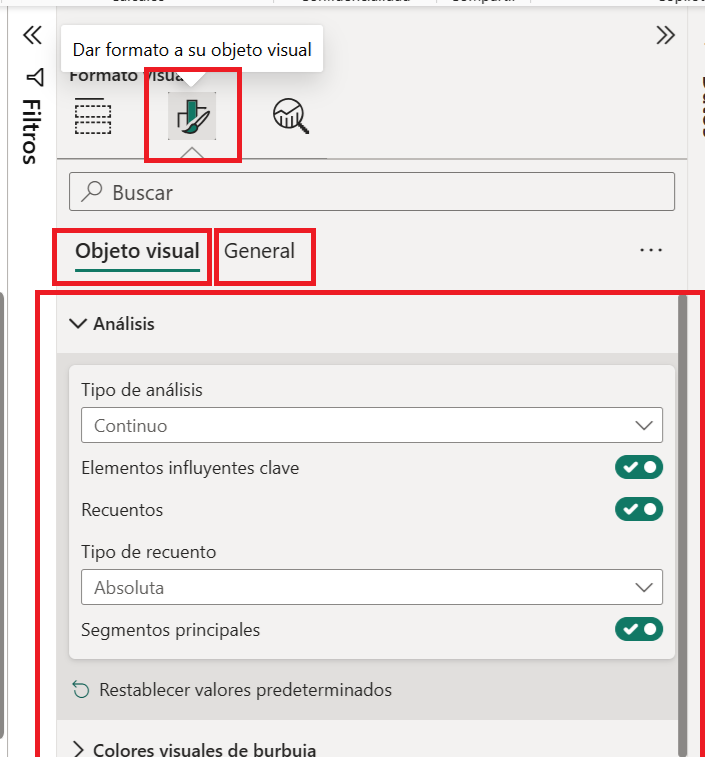

---

## La Importancia del Formato

> Dar el formato adecuado es una tarea a la que se debe dar **especial importancia**.

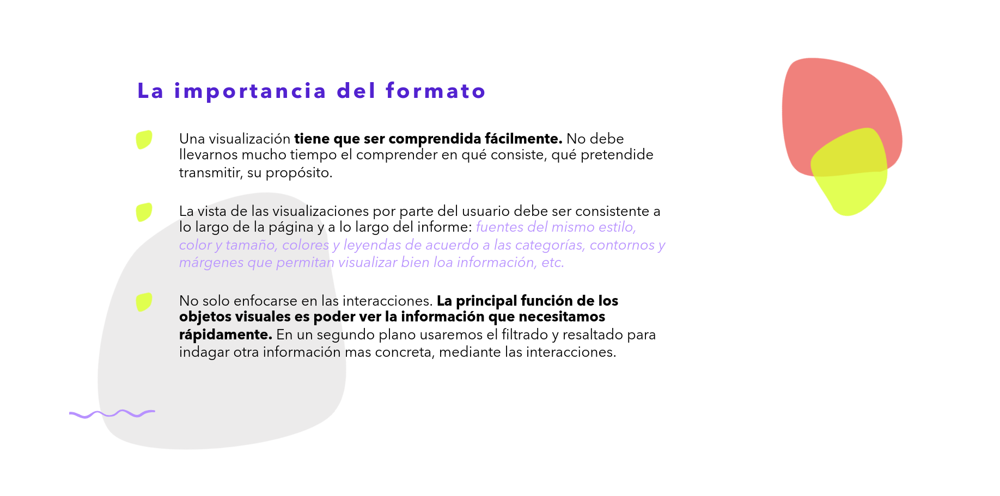

- Una visualización tiene que ser comprendida fácilmente. No debe llevarnos mucho tiempo comprender en qué consiste, qué pretende transmitir, su propósito.
- La vista de las visualizaciones por parte del usuario debe ser **consistente** a lo largo de la página y a lo largo del informe: fuentes del mismo estilo, color y tamaño, colores y leyendas de acuerdo a las categorías, contornos y márgenes que permitan visualizar bien la información, etc.
- **No solo enfocarse en las interacciones.** La principal función de los objetos visuales es poder ver la información que necesitamos rápidamente. En un segundo plano usaremos el filtrado y resaltado para indagar otra información más concreta, mediante las interacciones.

---

## Personalización por Tipo de Objeto Visual

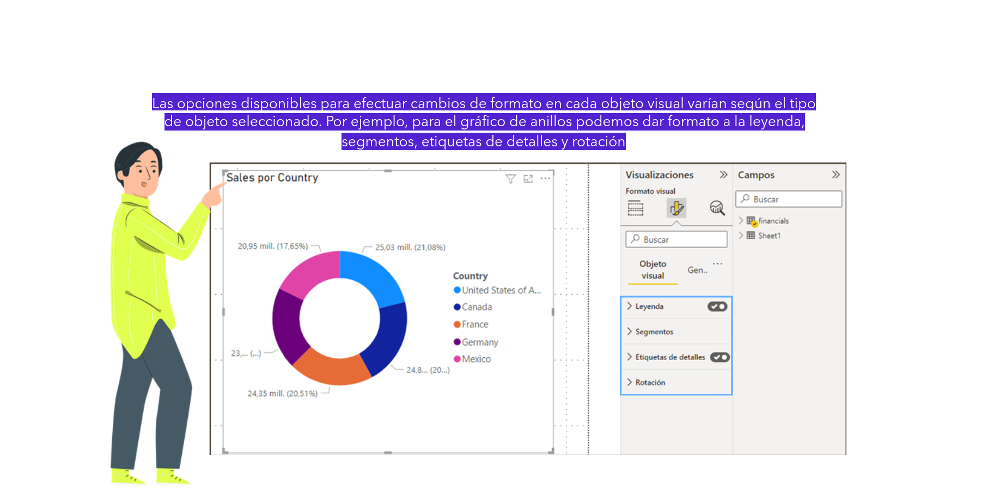

> Cada objeto visual tiene sus propias posibilidades de personalización.

Las opciones disponibles para efectuar cambios de formato en cada objeto visual varían según el tipo de objeto seleccionado. Por ejemplo, para el *gráfico de anillos* podemos dar formato a la `leyenda`, `segmentos`, `etiquetas de detalles` y `rotación`.

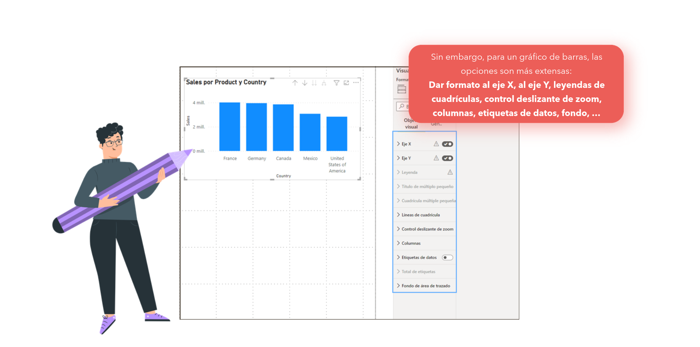

Sin embargo, para un *gráfico de barras*, las opciones son más extensas:

- `Eje X`
- `Eje Y`
- Leyendas de cuadrículas
- Control deslizante de zoom
- Columnas
- Etiquetas de datos
- Fondo
- ...

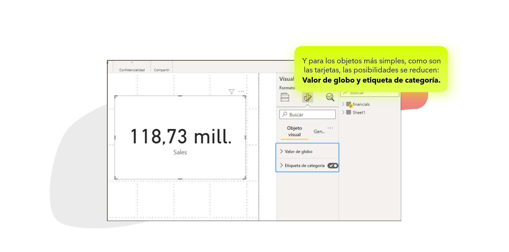

Y para los objetos más simples, como son las *tarjetas*, las posibilidades se reducen a:

- `Valor`
- `Etiqueta de categoría`

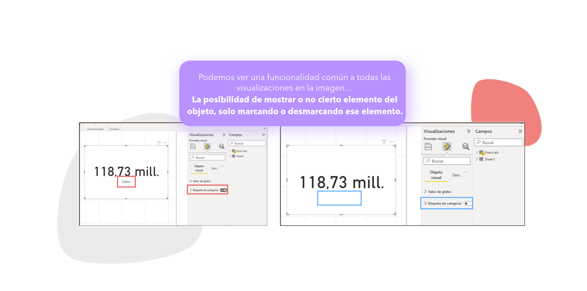

Podemos ver una funcionalidad **común a todas las visualizaciones** en la imagen: la posibilidad de mostrar o no cierto elemento del objeto, solo marcando o desmarcando ese elemento.

> En cada objeto podemos dar formato a varios de sus elementos, y dentro de cada elemento podemos personalizar diferentes características.

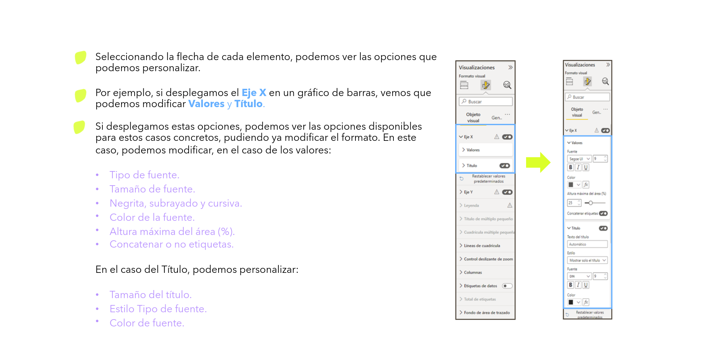

Seleccionando la flecha de cada elemento, podemos ver las opciones que podemos personalizar.

Por ejemplo, si desplegamos el `Eje X` en un gráfico de barras, vemos que podemos modificar `Valores` y `Título`.

Si desplegamos estas opciones, podemos ver las opciones disponibles para estos casos concretos, pudiendo ya modificar el formato. En el caso de los **valores**, podemos modificar:

- Tipo de fuente.
- Tamaño de fuente.
- ***Negrita***, ***subrayado*** y ***cursiva***.
- Color de la fuente.
- Altura máxima del área (%).
- Concatenar o no etiquetas.

En el caso del **título**, podemos personalizar:

- Tamaño del título.
- Estilo / tipo de fuente.
- Color de la fuente.

---

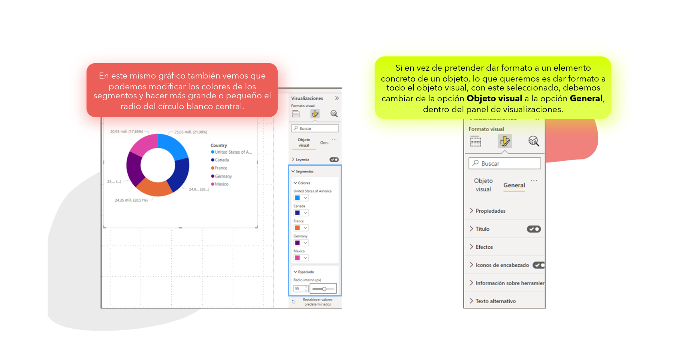

En este mismo gráfico también vemos que podemos modificar los colores de los segmentos y hacer más grande o pequeño el radio del círculo blanco central.

Si en vez de pretender dar formato a un elemento concreto de un objeto, lo que queremos es dar formato a **todo el objeto visual**, con este seleccionado, debemos cambiar de la opción `Objeto visual` a la opción `General`, dentro del panel de `Visualizaciones`.

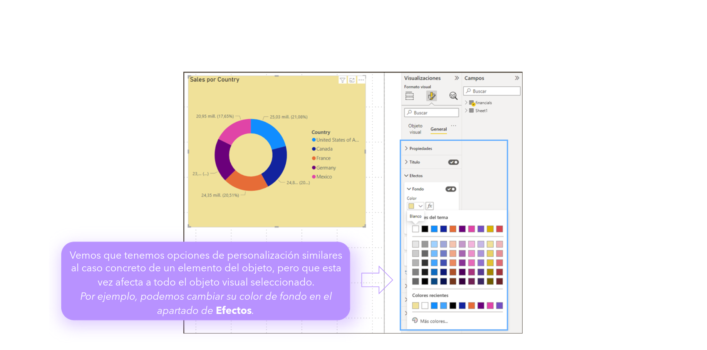

Vemos que tenemos opciones de personalización similares al caso concreto de un elemento del objeto, pero que esta vez afecta a todo el objeto visual seleccionado.

Por ejemplo, podemos cambiar su color de fondo en el apartado `Efectos`.

---

## Recuerda...

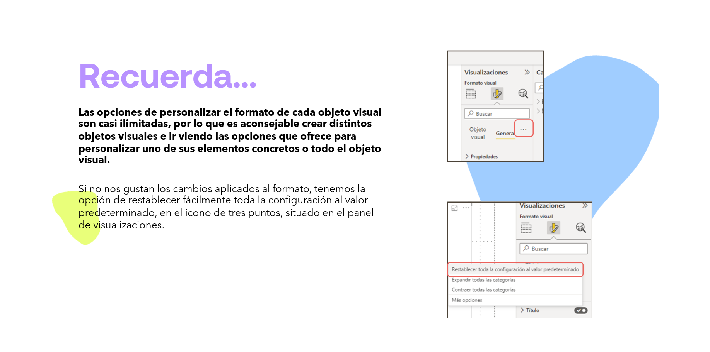

> Es aconsejable probar **todas las opciones disponibles** de formato de los objetos visuales; cada uno tiene sus propias posibilidades.

Las opciones de personalizar el formato de cada objeto visual son casi ilimitadas, por lo que es aconsejable crear distintos objetos visuales e ir viendo las opciones que ofrece para personalizar uno de sus elementos concretos o todo el objeto visual.

> 💡 **Un truco...** si no nos gustan los cambios aplicados al formato, tenemos la opción de restablecer fácilmente toda la configuración al valor predeterminado, en el icono de `tres puntos` (`...`), situado en el panel de `Visualizaciones`.

---

## Formato General del Informe

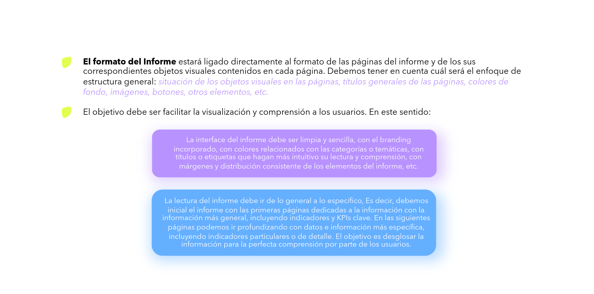

El formato del **Informe** estará ligado directamente al formato de las páginas del informe y de sus correspondientes objetos visuales contenidos en cada página. Debemos tener en cuenta cuál será el enfoque de estructura general: situación de los objetos visuales en las páginas, títulos generales de las páginas, colores de fondo, imágenes, botones, otros elementos, etc.

El objetivo debe ser **facilitar la visualización y comprensión** a los usuarios. En este sentido:

- La interfaz del informe debe ser limpia y sencilla, con el *branding* incorporado, con colores relacionados con las categorías o temáticas, con títulos o etiquetas que hagan más intuitiva su lectura y comprensión, con márgenes y distribución consistente de los elementos del informe, etc.
- La lectura del informe debe ir **de lo general a lo específico**. Es decir, debemos iniciar el informe con las primeras páginas dedicadas a la información más general, incluyendo indicadores y KPIs clave. En las siguientes páginas podemos ir profundizando con datos e información más específica, incluyendo indicadores particulares o de detalle. El objetivo es desglosar la información para la perfecta comprensión por parte de los usuarios.

---

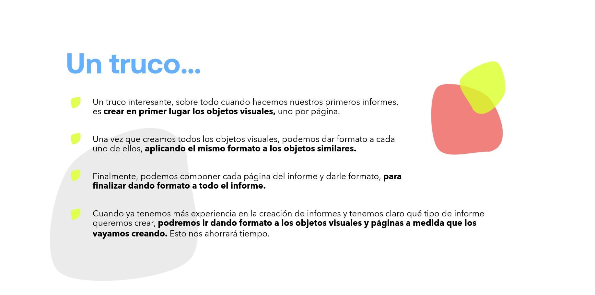

Un truco interesante, sobre todo cuando hacemos nuestros primeros informes, es crear en primer lugar los **objetos visuales**, uno por página.

Una vez que creamos todos los objetos visuales, podemos dar formato a cada uno de ellos, aplicando el mismo formato a los objetos similares.

Finalmente, podemos componer cada página del informe y darle formato, para terminar dando formato a **todo el informe**.

> Cuando ya tenemos más experiencia en la creación de informes y tenemos claro qué tipo de informe queremos crear, podremos ir dando formato a los objetos visuales y páginas a medida que los vayamos creando. **Esto nos ahorrará tiempo.**