# 06-013: Informe (2) - Filtros

## Los Filtros

> Son la funcionalidad de Power BI que nos permite acotar, seleccionar y modificar manualmente los datos de los campos que queremos visualizar en un objeto.

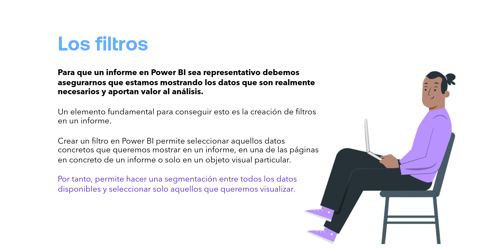

Para que un informe en Power BI sea representativo, debemos asegurarnos de que estamos mostrando los datos que son realmente necesarios y aportan valor al análisis.

Un elemento fundamental para conseguir esto es la **creación de filtros** en un informe.

Crear un filtro en Power BI permite seleccionar aquellos datos concretos que queremos mostrar:

- En un informe.
- En una página en concreto de un informe.
- Solo en un objeto visual particular.

Por tanto, permite hacer una **segmentación** entre todos los datos disponibles y seleccionar solo aquellos que queremos visualizar.

---

## Filtrado vs. Resaltado

> No debemos confundir los filtros con el **resaltado de datos** que nos ofrece Power BI cuando hacemos clic en alguno de ellos.

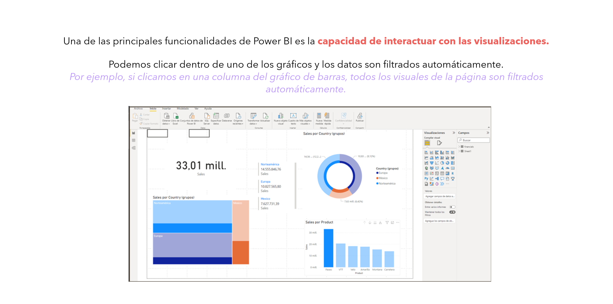

Una de las principales funcionalidades de Power BI es la capacidad de interactuar con las visualizaciones.

Podemos hacer clic dentro de uno de los gráficos y los datos son filtrados automáticamente.

Por ejemplo, si hacemos clic en una columna del gráfico de barras, todos los objetos visuales de la página son filtrados automáticamente.

---

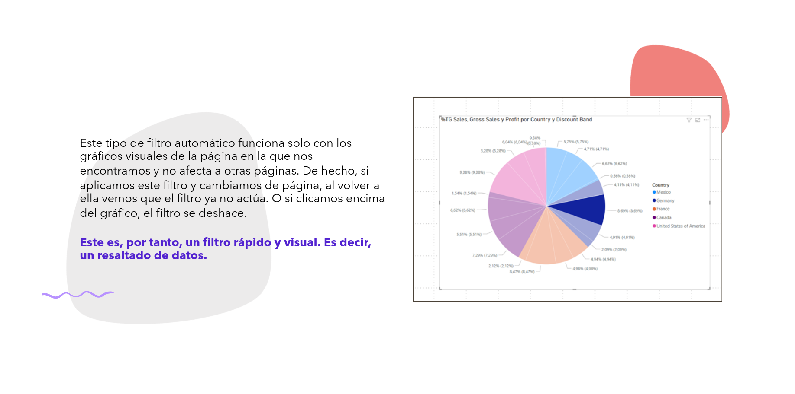

Este tipo de filtro automático funciona **solo con los gráficos visuales de la página** en la que nos encontramos y no afecta a otras páginas. De hecho, si aplicamos este filtro y cambiamos de página, al volver a ella vemos que el filtro ya no actúa. O si volvemos a hacer clic encima del gráfico, el filtro se deshace.

Este es, por tanto, un filtro rápido y visual. Es decir, un **resaltado de datos**.

---

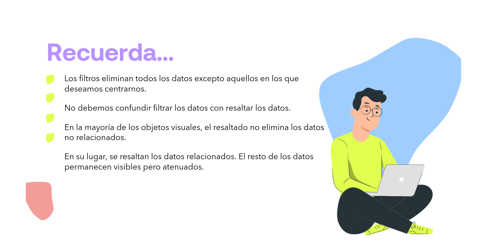

> **Recuerda...**
>
> - Los filtros eliminan todos los datos excepto aquellos en los que deseamos centrarnos.
> - No debemos confundir *filtrar* los datos con *resaltar* los datos.
> - En la mayoría de los objetos visuales, el resaltado **no elimina** los datos no relacionados.
> - En su lugar, se resaltan los datos relacionados. El resto de los datos permanecen visibles pero atenuados.

---

## Cómo Crear Filtros en Power BI

> **Dos formas:**
> 1. Vía panel `Filtros`.
> 2. Segmentando los datos; usando `DAX` para crear nuevos datos, etc.

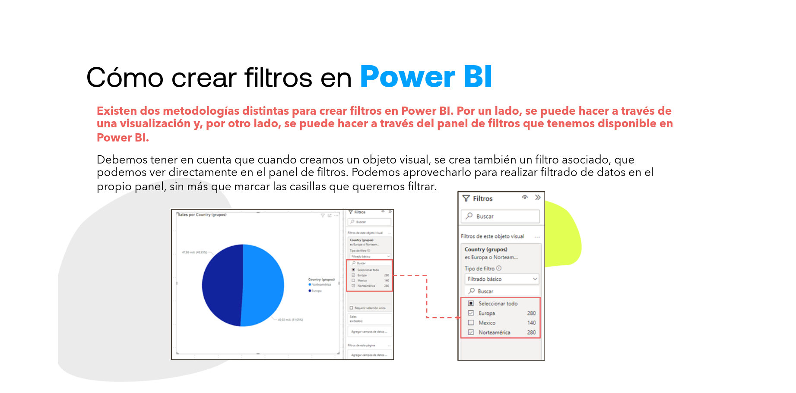

Existen dos metodologías distintas para crear filtros en Power BI: por un lado, se puede hacer a través de una visualización y, por otro lado, se puede hacer a través del panel `Filtros` que tenemos disponible en Power BI.

Debemos tener en cuenta que, cuando creamos un objeto visual, se crea también un filtro asociado, que podemos ver directamente en el panel `Filtros`. Podemos aprovecharlo para realizar filtrado de datos en el propio panel, sin más que marcar las casillas que queremos filtrar.

---

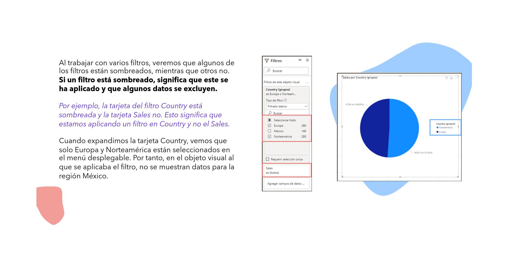

Al trabajar con varios filtros, veremos que algunos de ellos están sombreados, mientras que otros no. Si un filtro está sombreado, significa que **se ha aplicado** y que algunos datos se excluyen.

Por ejemplo, la tarjeta del filtro `Country` está sombreada y la tarjeta `Sales` no. Esto significa que estamos aplicando un filtro en `Country` y no en `Sales`.

Cuando expandimos la tarjeta `Country`, vemos que solo `Europa` y `Norteamérica` están seleccionados en el menú desplegable. Por tanto, en el objeto visual al que se aplicaba el filtro, no se muestran datos para la región `México`.

---

## El Panel de Filtros

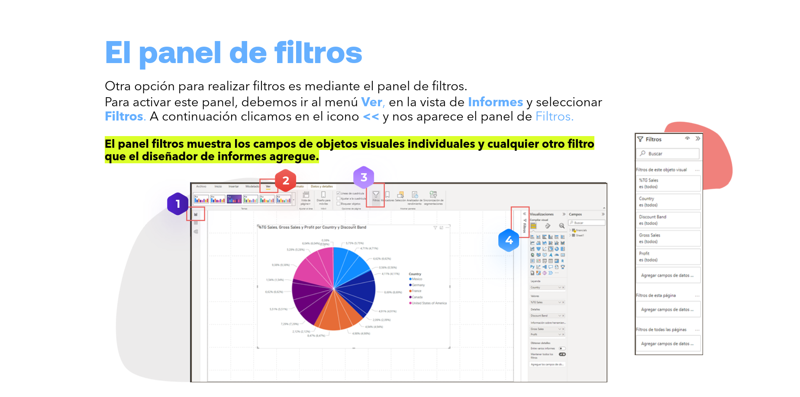

> Con el aumento de experiencia en Power BI, el panel de filtros se hace esencial.

Otra opción para realizar filtros es mediante el panel `Filtros`.

Para activar este panel, debemos ir al menú `Ver`, en la vista de `Informes`, y seleccionar `Filtros`. A continuación hacemos clic en el icono `<<` y nos aparece el panel `Filtros`.

El panel `Filtros` muestra los campos de objetos visuales individuales y cualquier otro filtro que el diseñador de informes agregue.

---

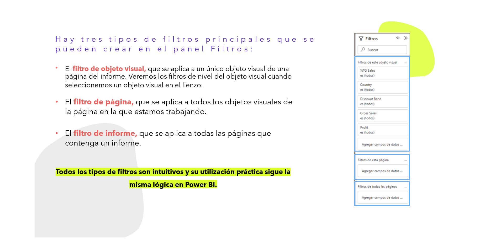

Hay **tres tipos de filtros** principales que se pueden crear en el panel `Filtros`:

- **Filtro de objeto visual**, que se aplica a un único objeto visual de una página del informe. Veremos los filtros de nivel del objeto visual cuando seleccionemos un objeto visual en el lienzo.
- **Filtro de página**, que se aplica a todos los objetos visuales de la página en la que estamos trabajando.
- **Filtro de informe**, que se aplica a todas las páginas que contenga un informe.

> Todos los tipos de filtros son intuitivos y su utilización práctica sigue la misma lógica en Power BI.

---

## Filtros Básicos y Avanzados

De forma predeterminada, los lectores de informes pueden cambiar del filtrado `Básico` al `Avanzado`.

### Básicos

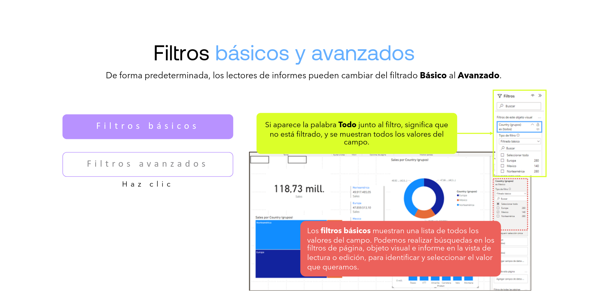

> Si aparece la palabra `Todo` junto al filtro, significa que **no está filtrado**, y se muestran todos los valores del campo.

Los filtros básicos muestran una lista de todos los valores del campo. Podemos realizar búsquedas en los filtros de página, objeto visual e informe en la vista de lectura o edición, para identificar y seleccionar el valor que queramos.

### Avanzados

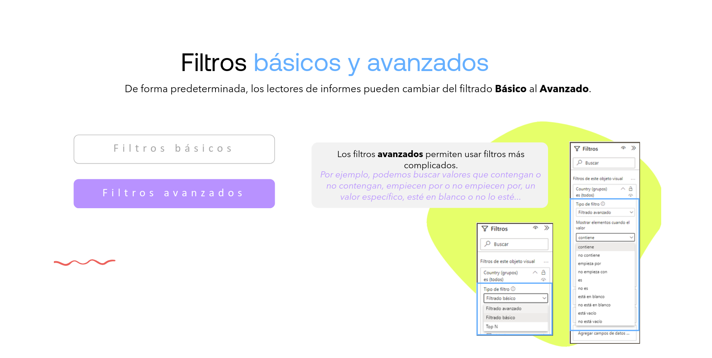

Los filtros avanzados permiten usar filtros más complejos.

Por ejemplo, podemos buscar valores que:

- **Contengan** o **no contengan** un valor específico.
- **Empiecen por** o **no empiecen por** un valor específico.
- **Estén en blanco** o **no lo estén**.

---

## Añadir un Filtro con un Campo que no está en un Objeto Visual

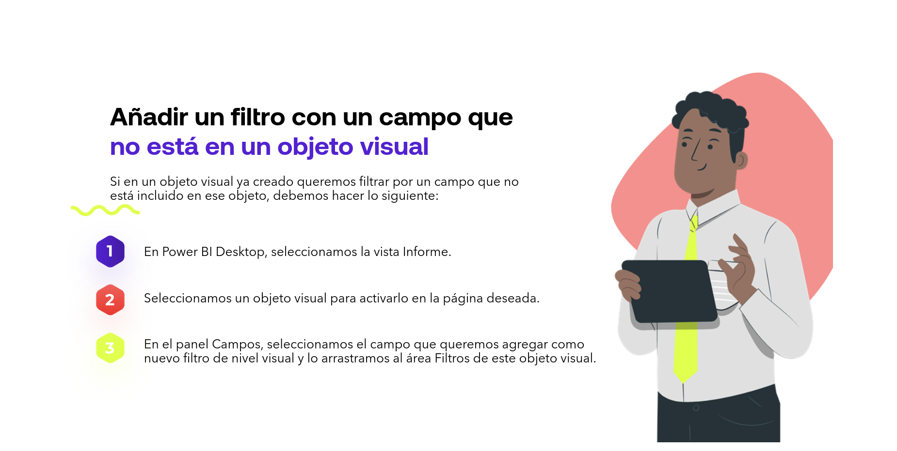

Si en un objeto visual ya creado queremos filtrar por un campo que no está incluido en ese objeto, debemos hacer lo siguiente:

1. En `Power BI Desktop`, seleccionamos la vista `Informe`.
2. Seleccionamos un objeto visual para activarlo en la página deseada.
3. En el panel `Campos`, seleccionamos el campo que queremos agregar como nuevo filtro de nivel visual y lo arrastramos al área `Filtros` de este objeto visual.

---

## Agregar un Filtro a una Página Completa

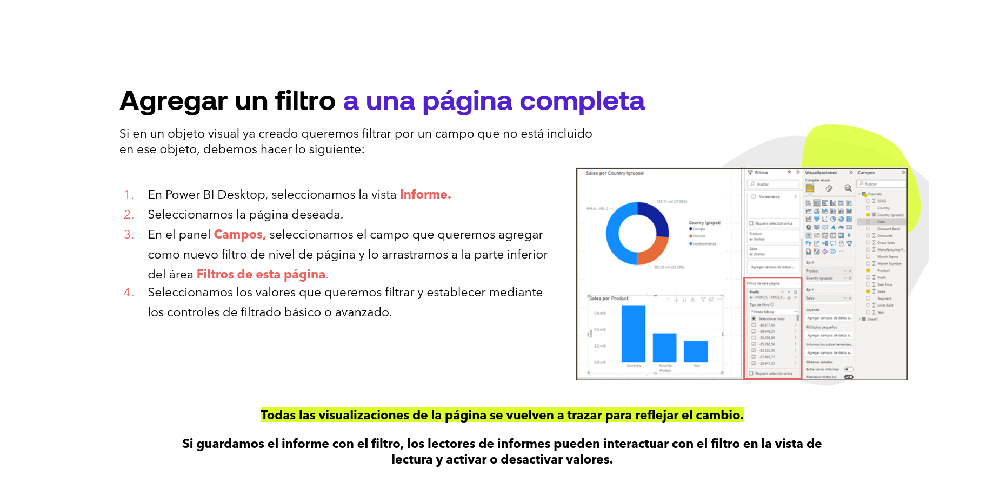

Si en un objeto visual ya creado queremos filtrar por un campo que no está incluido en ese objeto, debemos hacer lo siguiente:

1. En `Power BI Desktop`, seleccionamos la vista `Informe`.
2. Seleccionamos la página deseada.
3. En el panel `Campos`, seleccionamos el campo que queremos agregar como nuevo filtro de nivel de página y lo arrastramos a la parte inferior del área `Filtros` de esta página.
4. Seleccionamos los valores que queremos filtrar y los establecemos mediante los controles de filtrado `Básico` o `Avanzado`.

Todas las visualizaciones de la página se vuelven a trazar para reflejar el cambio.

> Si guardamos el informe con el filtro, los lectores de informes pueden interactuar con el filtro en la vista de lectura y activar o desactivar valores.

---

## Agregar un Filtro de Nivel de Informe para Filtrar un Informe Completo

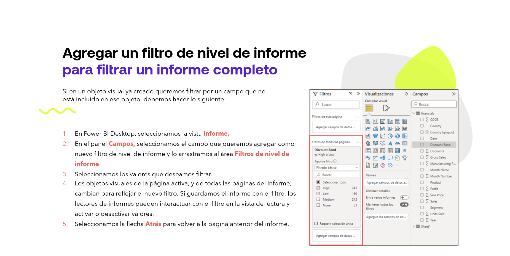

Si en un objeto visual ya creado queremos filtrar por un campo que no está incluido en ese objeto, debemos hacer lo siguiente:

1. En `Power BI Desktop`, seleccionamos la vista `Informe`.
2. En el panel `Campos`, seleccionamos el campo que queremos agregar como nuevo filtro de nivel de informe y lo arrastramos al área `Filtros de nivel de informe`.
3. Seleccionamos los valores que deseamos filtrar.
4. Los objetos visuales de la página activa, y de todas las páginas del informe, cambian para reflejar el nuevo filtro. Si guardamos el informe con el filtro, los lectores de informes pueden interactuar con el filtro en la vista de lectura y activar o desactivar valores.
5. Seleccionamos la flecha `Atrás` para volver a la página anterior del informe.

---

## Dar Formato a los Filtros en Informes de Power BI

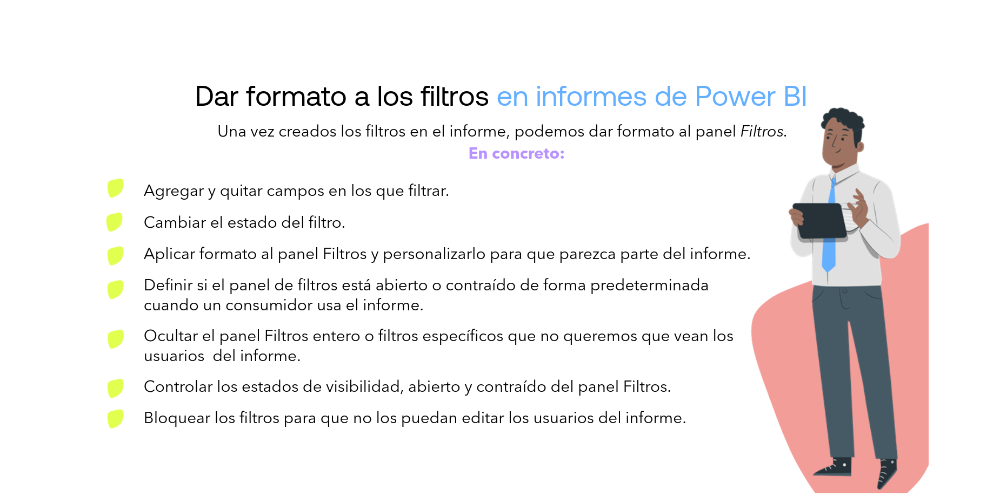

Una vez creados los filtros en el informe, podemos dar formato al panel `Filtros`. En concreto:

- Agregar y quitar campos en los que filtrar.
- Cambiar el estado del filtro.
- Aplicar formato al panel `Filtros` y personalizarlo para que parezca parte del informe.
- Definir si el panel de filtros está *abierto* o *contraído* de forma predeterminada cuando un consumidor usa el informe.
- Ocultar el panel `Filtros` entero, o filtros específicos que no queremos que vean los usuarios del informe.
- Controlar los estados de visibilidad, *abierto* y *contraído*, del panel `Filtros`.
- **Bloquear** los filtros para que no los puedan editar los usuarios del informe.

---

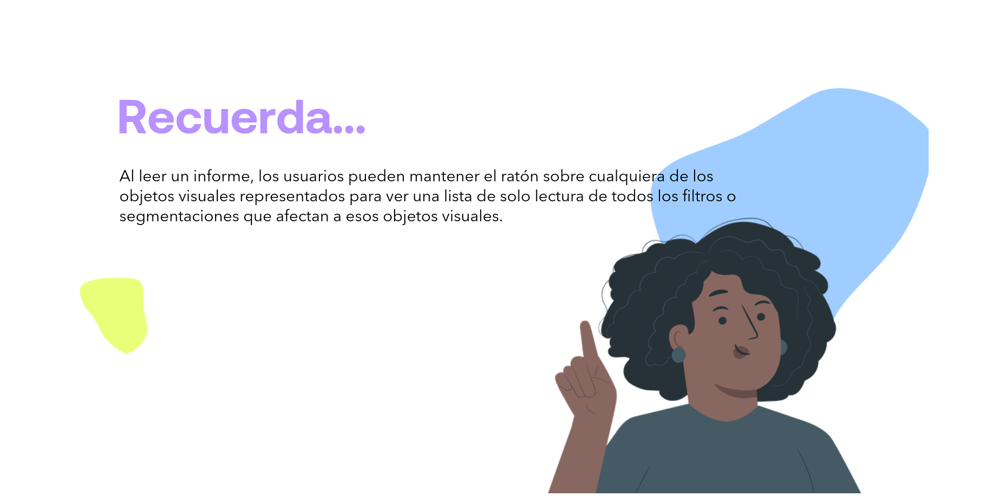

> **Recuerda...**
>
> Al leer un informe, los usuarios pueden mantener el ratón sobre cualquiera de los objetos visuales representados para ver una lista de solo lectura de todos los filtros o segmentaciones que afectan a esos objetos visuales.