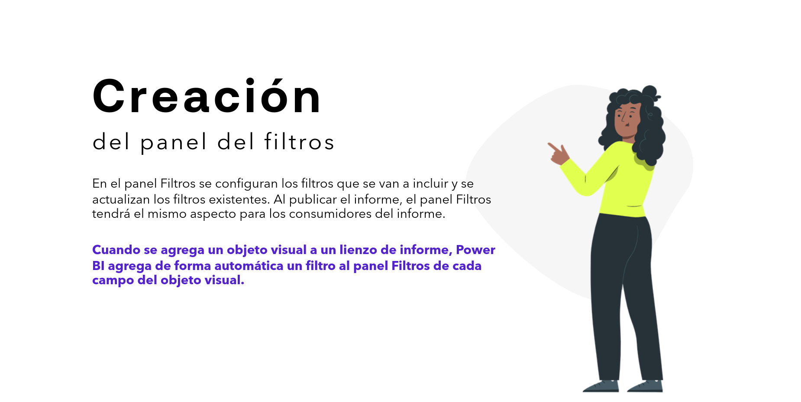
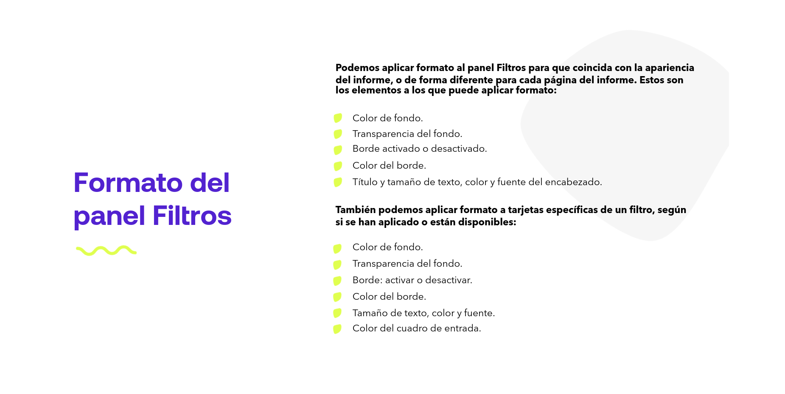
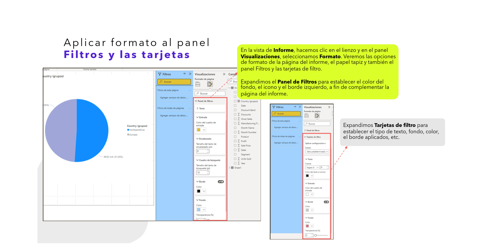
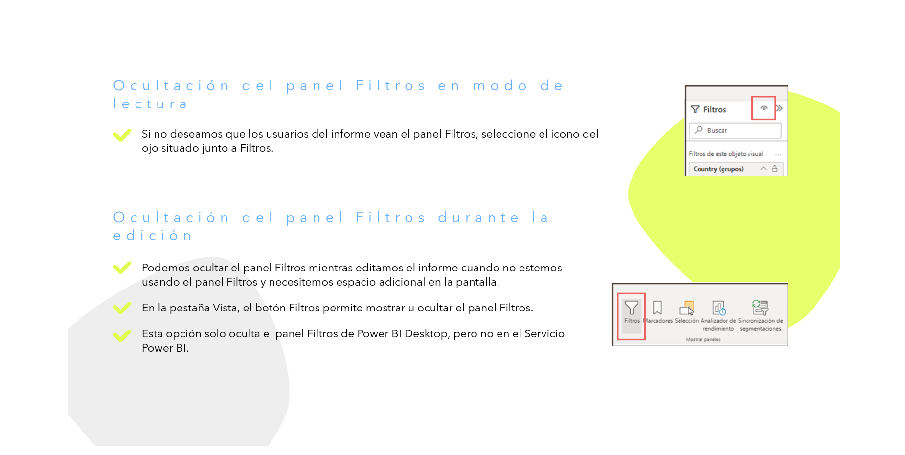
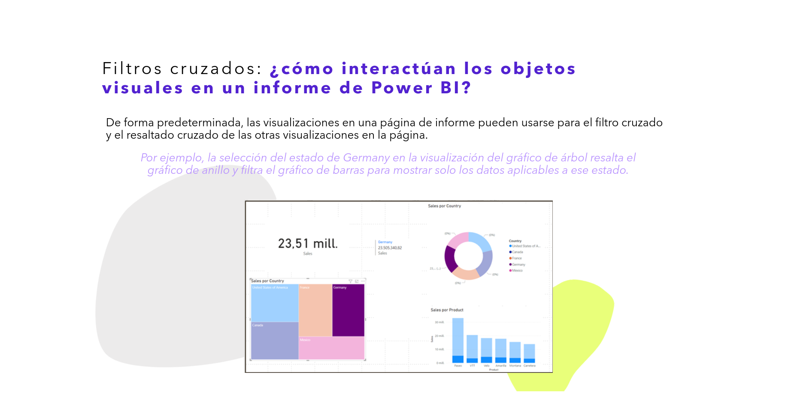

# 06-014: Informe (3) - Filtros (2)

## Creación del Panel de Filtros

En el panel `Filtros` se configuran los filtros que se van a incluir y se actualizan los filtros existentes. Al publicar el informe, el panel `Filtros` tendrá el mismo aspecto para los consumidores del informe.

> Cuando se agrega un objeto visual a un lienzo de informe, Power BI agrega de forma automática un filtro al panel `Filtros` por cada campo del objeto visual.

---

## Formato del Panel Filtros

Podemos aplicar formato al panel `Filtros` para que coincida con la apariencia del informe, o de forma diferente para cada página del informe.

**Elementos a los que se puede aplicar formato al propio panel:**

- Color de fondo.
- Transparencia del fondo.
- Borde: activado o desactivado.
- Color del borde.
- Título y tamaño de texto, color y fuente del encabezado.

**Elementos a los que se puede aplicar formato en las tarjetas de filtro** *(según si se han aplicado o están disponibles)*:

- Color de fondo.
- Transparencia del fondo.
- Borde: activar o desactivar.
- Color del borde.
- Tamaño de texto, color y fuente.
- Color del cuadro de entrada.

---

## Aplicar Formato al Panel Filtros y las Tarjetas

En la vista de `Informe`, hacemos clic en el lienzo y, en el panel `Visualizaciones`, seleccionamos `Formato`. Veremos las opciones de formato de la página del informe, el papel tapiz y también el panel `Filtros` y las tarjetas de filtro.

- Expandimos `Panel de Filtros` para establecer el color del fondo, el icono y el borde izquierdo, a fin de complementar la página del informe.
- Expandimos `Tarjetas de filtro` para establecer el tipo de texto, fondo, color, el borde aplicado, etc.

---

## Restricciones del Panel de Filtros

> Con estas opciones se puede hacer visible, u ocultar, la disponibilidad de los filtros para los usuarios de los informes.

### Ocultación del Panel Filtros en Modo de Lectura

Si no deseamos que los usuarios del informe vean el panel `Filtros`, seleccionamos el icono del ojo 👁 situado junto a `Filtros`.

### Ocultación del Panel Filtros durante la Edición

Podemos ocultar el panel `Filtros` mientras editamos el informe, cuando no lo estemos usando y necesitemos espacio adicional en la pantalla.

En la pestaña `Vista`, el botón `Filtros` permite mostrar u ocultar el panel `Filtros`.

> ⚠️ Esta opción solo oculta el panel `Filtros` en `Power BI Desktop`, **pero no** en el `Servicio Power BI`.

---

## Bloquear u Ocultar Filtros

> De este modo, los usuarios no los podrán manipular.

Podemos **bloquear** u **ocultar** tarjetas individuales de filtro:

- Si **bloqueamos** un filtro, los usuarios del informe pueden verlo pero no modificarlo.
- Si lo **ocultamos**, no podrán verlo.

Ocultar tarjetas de filtro es muy útil si necesitamos ocultar filtros de limpieza de datos que excluyen los valores nulos o inesperados, por ejemplo.

Para activar o desactivar los filtros, u ocultarlos, usamos en el panel `Filtros` los iconos `Bloquear filtro` u `Ocultar filtro` dentro de una tarjeta de filtro.

---

## Filtros Cruzados

> ¿Cómo interactúan los objetos visuales en un informe de Power BI?

De forma predeterminada, las visualizaciones en una página de informe pueden usarse para el **filtro cruzado** y el **resaltado cruzado** de las otras visualizaciones en la página.

> Por ejemplo, la selección del estado `Germany` en la visualización del gráfico de árbol resalta el gráfico de anillo y filtra el gráfico de barras para mostrar solo los datos aplicables a ese estado.