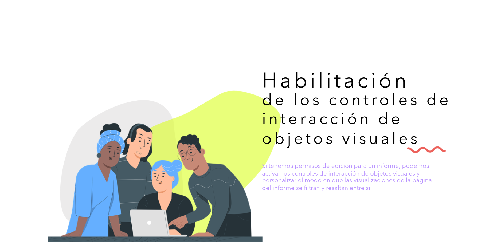
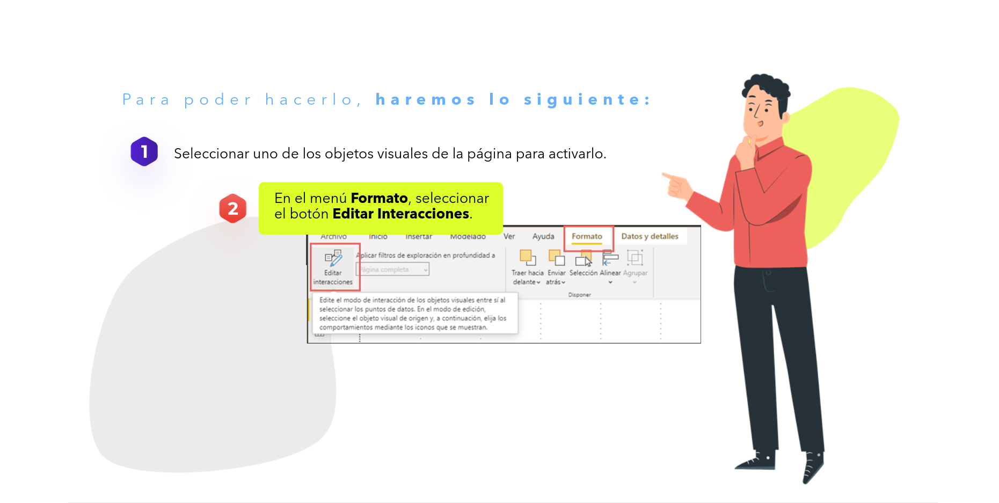
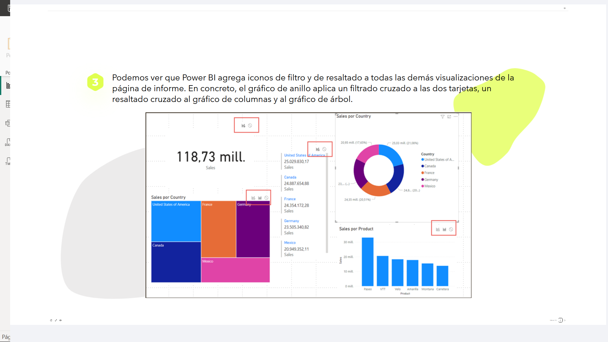
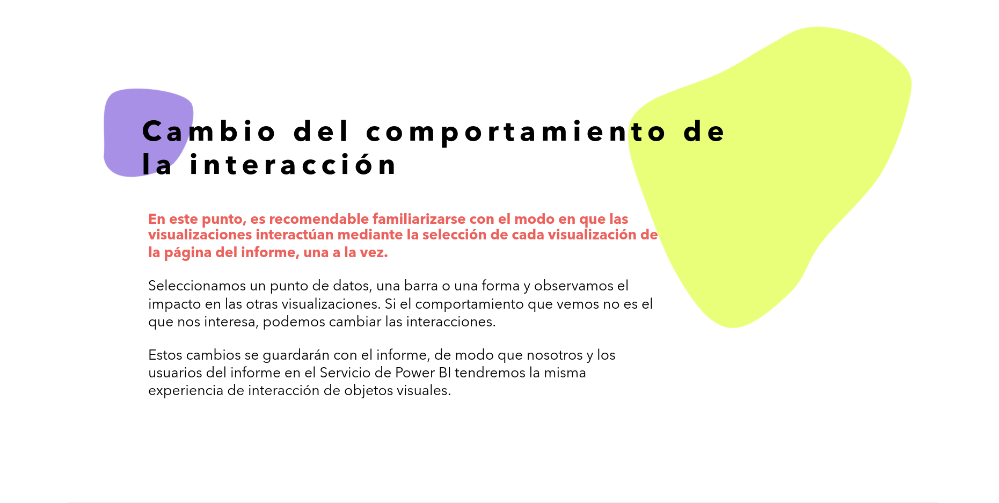
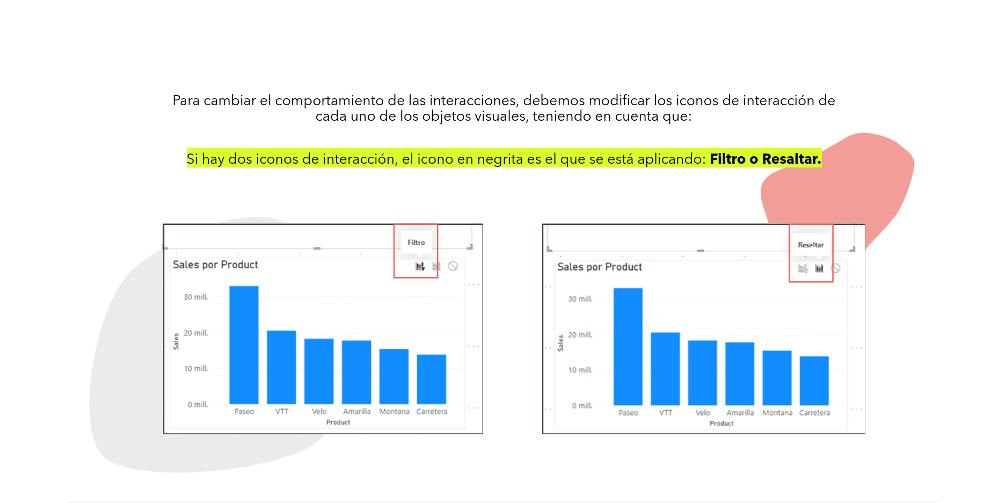
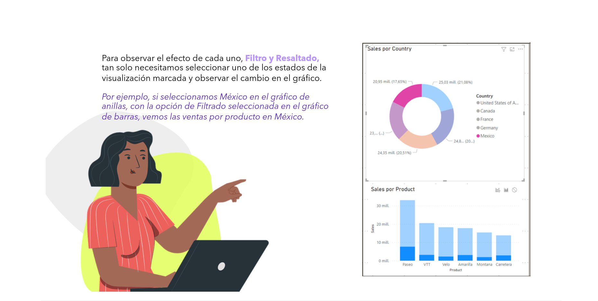
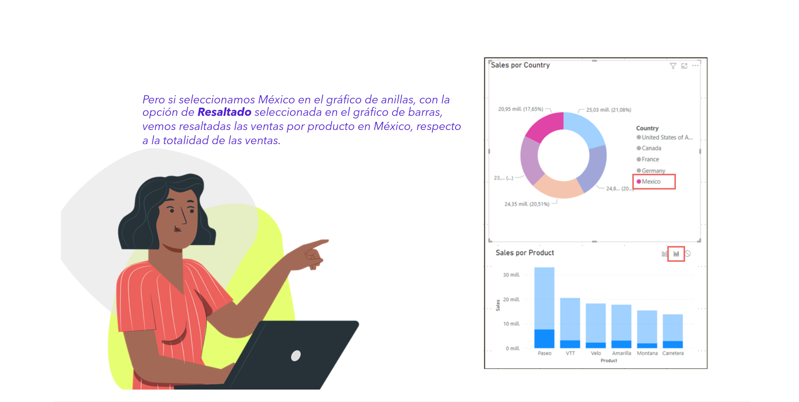
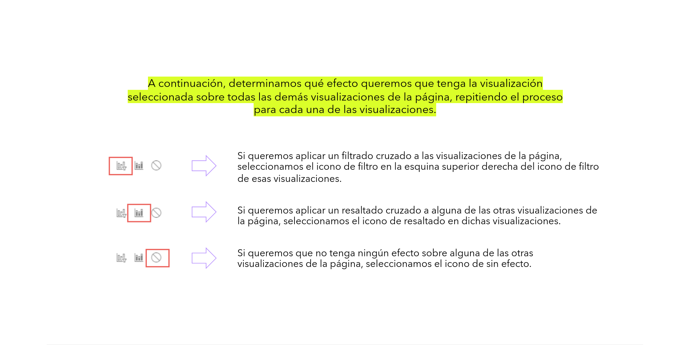

# 06-015: Controles de Interacción

## Habilitación de los Controles de Interacción de Objetos Visuales

Si tenemos permisos de edición para un informe, podemos activar los controles de interacción de objetos visuales y personalizar el modo en que las visualizaciones de la página del informe se filtran y resaltan entre sí.

**Para poder hacerlo, haremos lo siguiente:**

1. Seleccionar uno de los objetos visuales de la página para activarlo.
2. En el menú `Formato`, seleccionar el botón `Editar interacciones`.

Podemos ver que Power BI agrega iconos de `filtro` y de `resaltado` a todas las demás visualizaciones de la página de informe. En concreto, el gráfico de anillo aplica un **filtrado cruzado** a las dos tarjetas, y un **resaltado cruzado** al gráfico de columnas y al gráfico de árbol.

---

## Cambio del Comportamiento de la Interacción

> Para comprender las interacciones debemos probar las distintas posibilidades y observar cómo cambian los objetos de la página.

En este punto, es recomendable familiarizarse con el modo en que las visualizaciones interactúan, mediante la selección de cada visualización de la página del informe, una a la vez.

- Seleccionamos un punto de datos, una barra o una forma, y observamos el impacto en las otras visualizaciones.
- Si el comportamiento que vemos no es el que nos interesa, podemos cambiar las interacciones.

> Estos cambios se guardarán con el informe, de modo que nosotros y los usuarios del informe en el `Servicio de Power BI` tendremos la misma experiencia de interacción de objetos visuales.

---

## Diferencias entre Filtro y Resaltar

Para cambiar el comportamiento de las interacciones, debemos modificar los iconos de interacción de cada uno de los objetos visuales, teniendo en cuenta que:

> Si hay dos iconos de interacción, el icono **en negrita** es el que se está aplicando: `Filtro` o `Resaltar`.

Para observar el efecto de cada uno, `Filtro` y `Resaltado`,  tan solo necesitamos seleccionar uno de los estados de la visualización marcada y observar el cambio en el gráfico.

Por ejemplo, si seleccionamos `México` en el gráfico de anillos, con la opción `Filtrado` seleccionada en el gráfico de barras, vemos las ventas por producto en México.

Pero si seleccionamos `México` en el gráfico de anillos, con la opción `Resaltado` seleccionada en el gráfico de barras, vemos resaltadas las ventas por producto en México, respecto a la totalidad de las ventas.

---

> Para cada objeto visual de una página, podemos elegir el tipo de comportamiento de las interacciones con el resto de objetos.

A continuación, determinamos qué efecto queremos que tenga la visualización seleccionada sobre todas las demás visualizaciones de la página, repitiendo el proceso para cada una de ellas:

- Si queremos aplicar un **filtrado cruzado** a las visualizaciones de la página, seleccionamos el icono de `filtro` en la esquina superior derecha de esas visualizaciones.
- Si queremos aplicar un **resaltado cruzado** a alguna de las otras visualizaciones de la página, seleccionamos el icono de `resaltado` en dichas visualizaciones.
- Si queremos que **no tenga ningún efecto** sobre alguna de las otras visualizaciones de la página, seleccionamos el icono de `sin efecto`.