# 06-016: Medidas

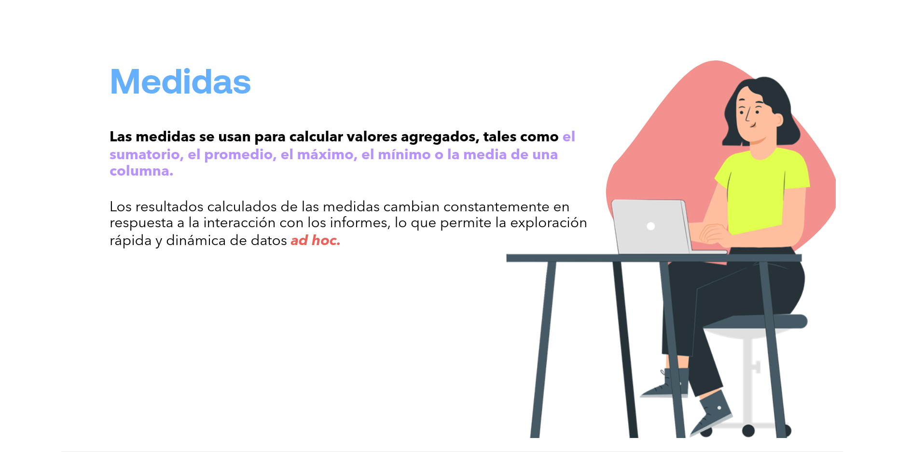

**Las medidas se usan para calcular valores agregados, tales como** el sumatorio, el promedio, el máximo, el mínimo o la media de una columna.

Los resultados calculados de las medidas cambian constantemente en respuesta a la interacción con los informes, lo que permite la exploración rápida y dinámica de datos *ad hoc*.

---

## Descripción de las medidas

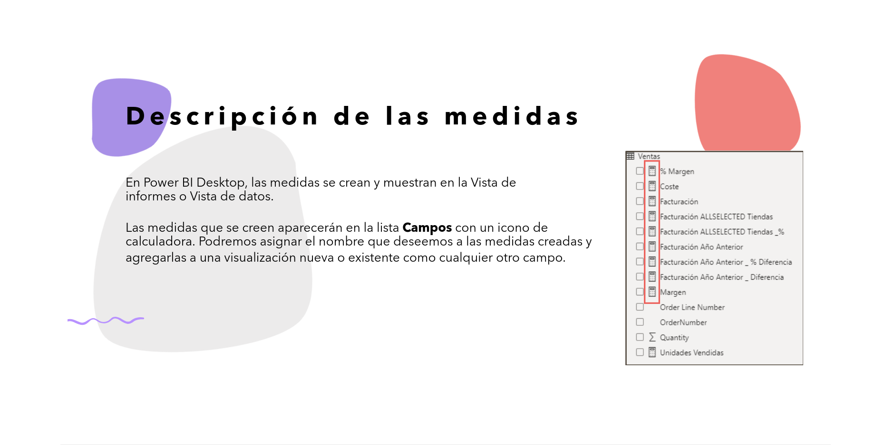

En Power BI Desktop, las medidas se crean y muestran en la Vista de informes o Vista de datos.

Las medidas que se creen aparecerán en la lista **Campos** con un icono de calculadora. Podremos asignar el nombre que deseemos a las medidas creadas y agregarlas a una visualización nueva o existente como cualquier otro campo.

---

## Visualización de las medidas

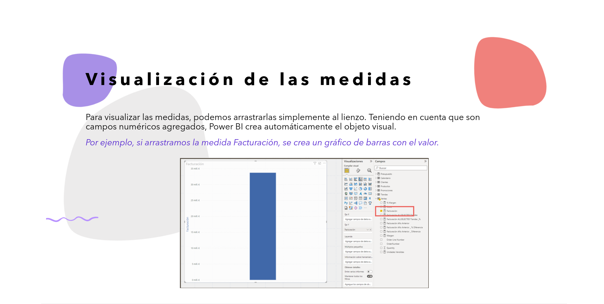

Para visualizar las medidas, podemos arrastrarlas simplemente al lienzo. Teniendo en cuenta que son campos numéricos agregados, Power BI crea automáticamente el objeto visual.

*Por ejemplo, si arrastramos la medida Facturación, se crea un gráfico de barras con el valor.*

---

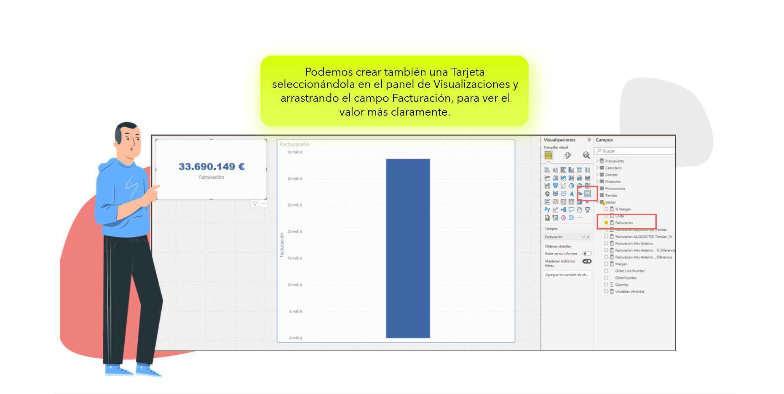

> Podemos crear también una Tarjeta seleccionándola en el panel de Visualizaciones y arrastrando el campo Facturación, para ver el valor más claramente.

---

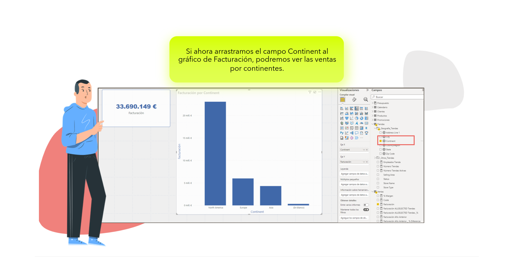

> Si ahora arrastramos el campo Continent al gráfico de Facturación, podremos ver las ventas por continentes.

---

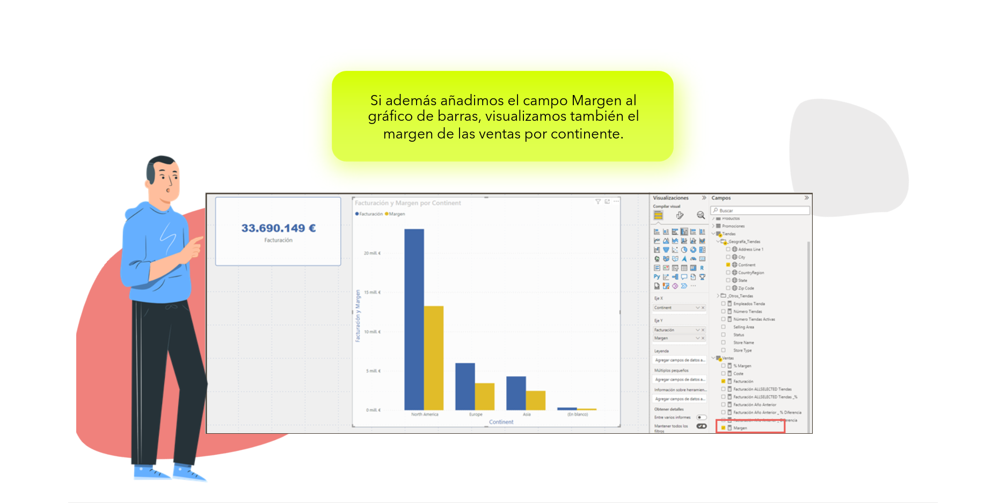

> Si además añadimos el campo Margen al gráfico de barras, visualizamos también el margen de las ventas por continente.

---

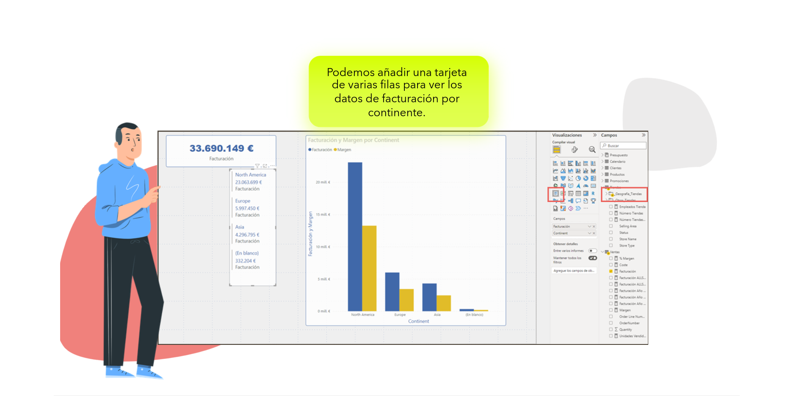

> Podemos añadir una tarjeta de varias filas para ver los datos de facturación por continente.

---

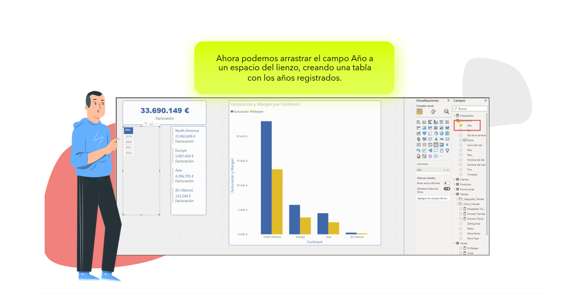

> Ahora podemos arrastrar el campo Año a un espacio del lienzo, creando una tabla con los años registrados.

---

**PODEMOS DARLE UN FORMATO PERSONALIZADO**  

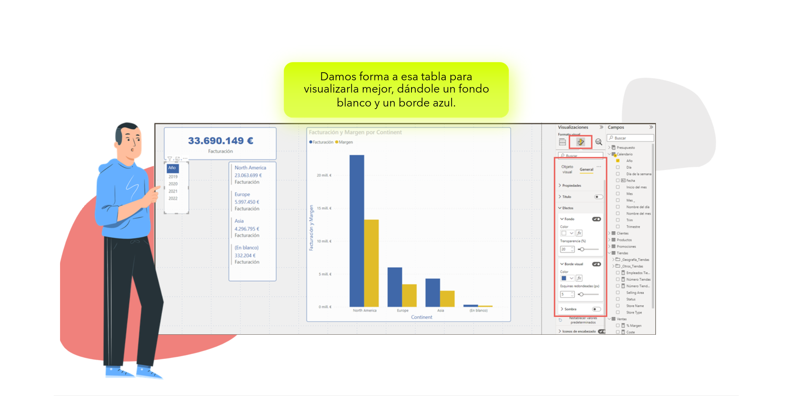

> Damos forma a esa tabla para visualizarla mejor, dándole un fondo blanco y un borde azul.

---

**PODEMOS CREAR BOTONES DE SEGMENTACIÓN O FILTRADO DENTRO DEL LIENZO**  

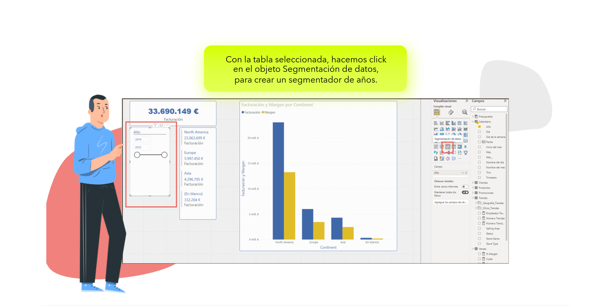

> Con la tabla seleccionada, hacemos click en el objeto Segmentación de datos, para crear un segmentador de años.

---

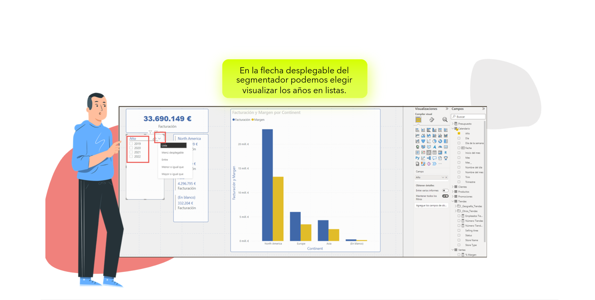

> En la flecha desplegable del segmentador podemos elegir visualizar los años en listas.

---

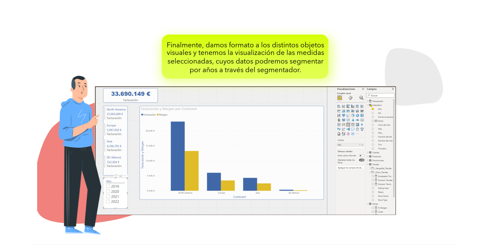

> Finalmente, damos formato a los distintos objetos visuales y tenemos la visualización de las medidas seleccionadas, cuyos datos podremos segmentar por años a través del segmentador.

---

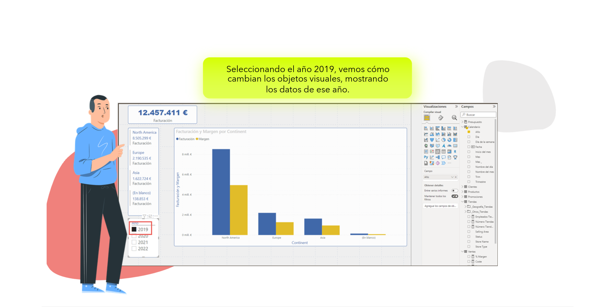

> Seleccionando el año 2019, vemos cómo cambian los objetos visuales, mostrando los datos de ese año.

---

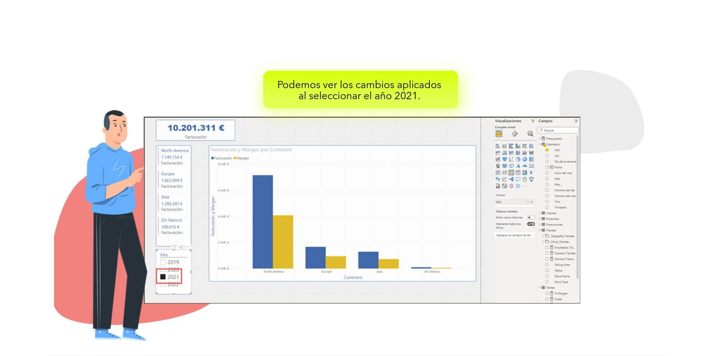

> Podemos ver los cambios aplicados al seleccionar el año 2021.

---

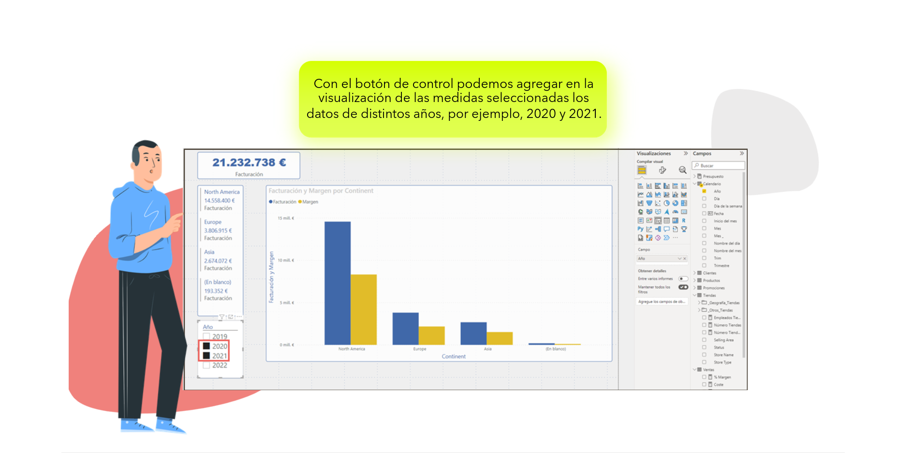

> Con el botón de control podemos agregar en la visualización de las medidas seleccionadas los datos de distintos años, por ejemplo, 2020 y 2021.

