# 06-017: Marcadores

## ¿Qué son los marcadores?

>   Elementos útiles cuando queremos que los informes se visualicen en un orden determinado, en favor de la narrativa

Los marcadores son una de las funcionalidades interesantes que ofrece Power BI en los análisis de datos a través de los informes.   

**Esta funcionalidad permite memorizar el estado de cualquier página de los informe, asociándolo a un nombre, en el momento exacto en el que realizamos el marcador, de manera que, al seleccionarlo, se muestra la página en la situación en la que estaba cuando se definió el marcador.**  

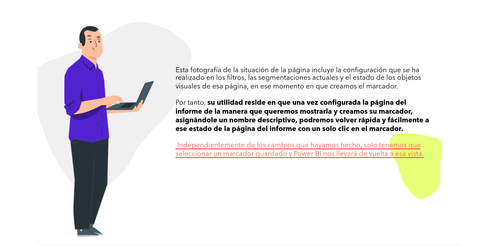

>   Estarán disponibles en la versión publicada del informe, para los usuarios poder seleccionar las visualizaciones cuándo y cómo queremos que las vean

Esta fotografía de la situación de la página incluye la configuración que se ha realizado en los filtros, las segmentaciones actuales y el estado de los objetos visuales de esa página, en ese momento en que creamos el marcador.  

Por tanto, **su utilidad reside en que una vez configurada la página del informe de la manera que queremos mostrarla y creamos su marcador, asignándole un nombre descriptivo, podremos volver rápida y fácilmente a ese estado de la página del informe con un solo clic en el marcador.**  

**Independientemente de los cambios que hayamos hecho, solo tenemos que seleccionar un marcador guardado y Power BI nos llevará de vuelta a esa vista.**

---

## Principal uso de los marcadores

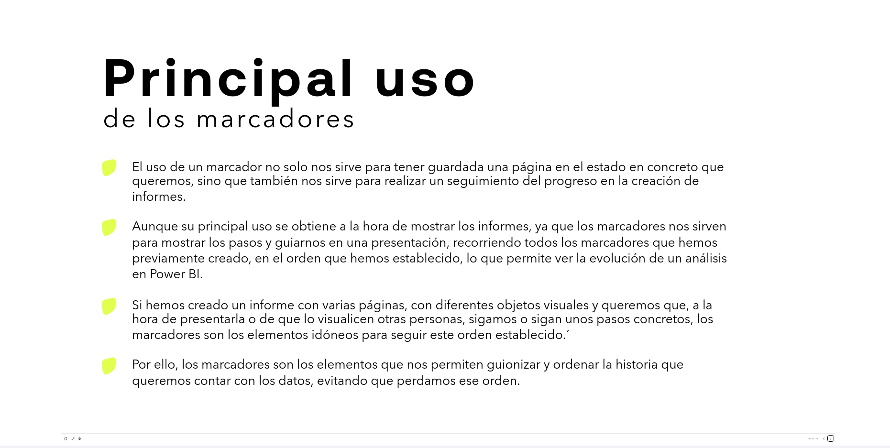

* El uso de un marcador no solo nos sirve para tener guardada una página en el estado en concreto que queremos, sino que también nos sirve para realizar un seguimiento del progreso en la creación de informes.

* Aunque su principal uso se obtiene a la hora de mostrar los informes, ya que los marcadores nos sirven para mostrar los pasos y guiarnos en una presentación, recorriendo todos los marcadores que hemos previamente creado, en el orden que hemos establecido, lo que permite ver la evolución de un análisis en Power BI.

* Si hemos creado un informe con varias páginas, con diferentes objetos visuales y queremos que, a la hora de presentarla o de que lo visualicen otras personas, sigamos o sigan unos pasos concretos, los marcadores son los elementos idóneos para seguir este orden establecido.

* Por ello, los marcadores son los elementos que nos permiten guionizar y ordenar la historia que queremos contar con los datos, evitando que perdamos ese orden.

---

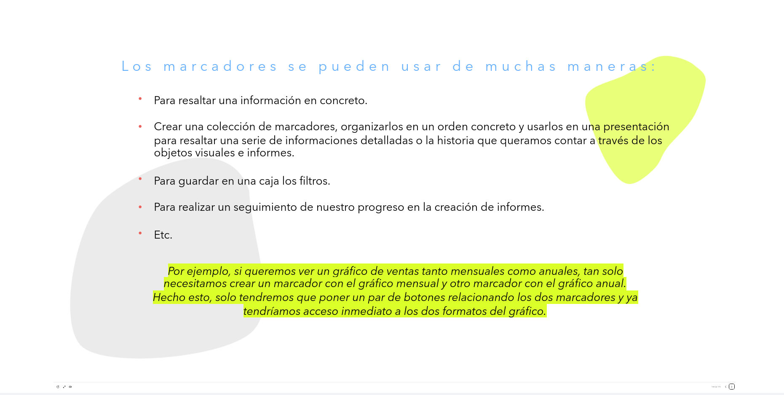

## Agregar, Eliminar y Cambiar de nombre

Los marcadores se pueden usar de muchas maneras:

*   Para resaltar una información en concreto.

*   Crear una colección de marcadores, organizarlos en un orden concreto y usarlos en una presentación para resaltar una serie de informaciones detalladas o la historia que queramos contar a través de los objetos visuales e informes.

*   Para guardar en una caja los filtros.

*   Para realizar un seguimiento de nuestro progreso en la creación de informes.

*   Etc...

> *Por ejemplo, si queremos ver un gráfico de ventas tanto mensuales como anuales, tan solo necesitamos crear un marcador con el gráfico mensual y otro marcador con el gráfico anual. Hecho esto, solo tendremos que poner un par de botones relacionando los dos marcadores y ya tendríamos acceso inmediato a los dos formatos del gráfico.*

---

### Crear un marcador en Power BI

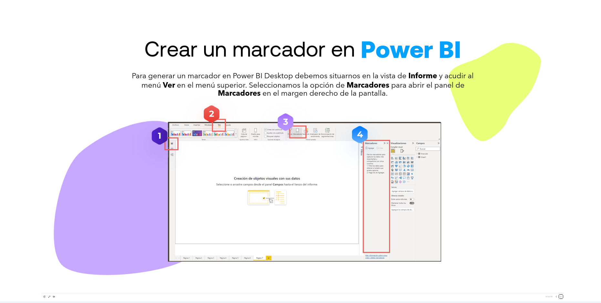

Para generar un marcador en Power BI Desktop:

1.  Debemos situarnos en la vista de **Informe**

2.  Acudir al menú **Ver** en el menú superior

3.  Seleccionamos la opción de **Marcadores**

3.  Se abrirá el panel de **Marcadores** en el margen derecho de la pantalla

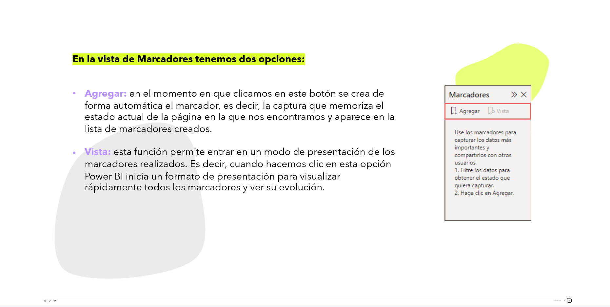

4.  **En la vista de Marcadores tenemos dos opciones:**  

    * **Agregar:** en el momento en que clicamos en este botón se crea de forma automática el marcador, es decir, la captura que memoriza el estado actual de la página en la que nos encontramos y aparece en la lista de marcadores creados.

    * **Vista:** esta función permite entrar en un modo de presentación de los marcadores realizados. Es decir, cuando hacemos clic en esta opción Power BI inicia un formato de presentación para visualizar rápidamente todos los marcadores y ver su evolución.

---

#### AGREGAR

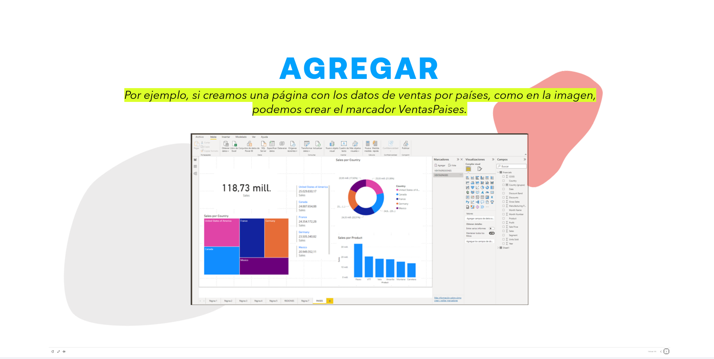

> *Por ejemplo, si creamos una página con los datos de ventas por países, como en la imagen, podemos crear el marcador VentasPaíses.*

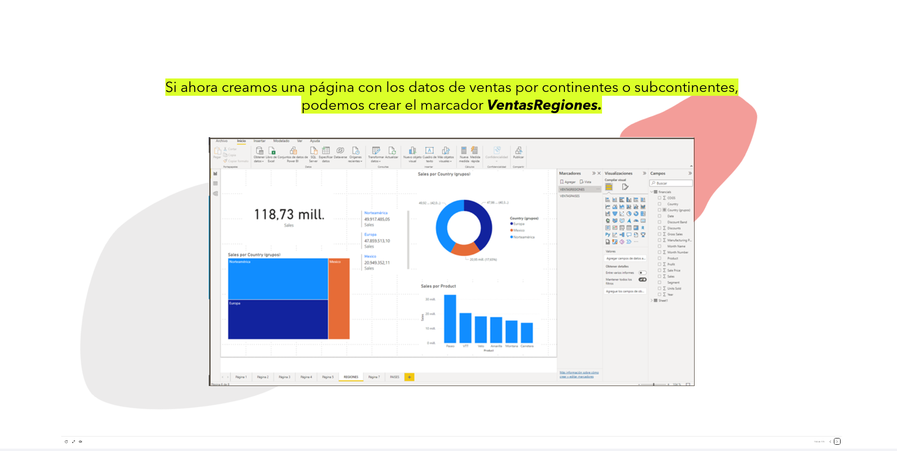

> Si ahora creamos una página con los datos de ventas por continentes o subcontinentes, podemos crear el marcador **VentasRegiones**.

---

#### VISTA

> Se da acceso directo a los marcadores , como si estuviésemos en una presentación

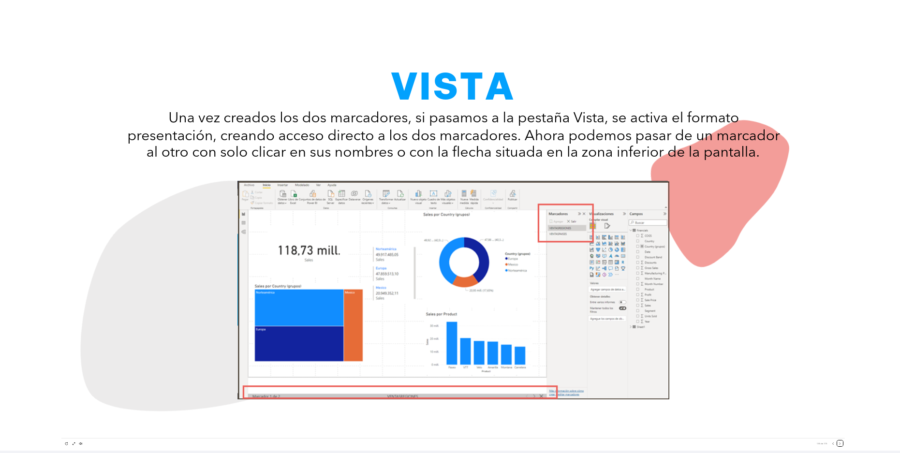

*   Una vez creados los dos marcadores, si pasamos a la pestaña Vista, se activa el formato presentación, creando acceso directo a los dos marcadores.

*   Ahora podemos pasar de un marcador al otro con solo clicar en sus nombres o con la flecha situada en la zona inferior de la pantalla.

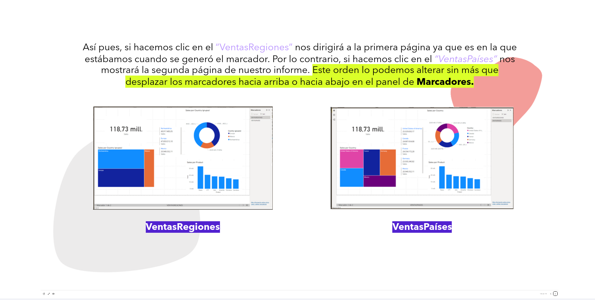

*   Así pues, si hacemos clic en el *"VentasRegiones"* nos dirigirá a la primera página ya que es en la que estábamos cuando se generó el marcador.  

*   Por lo contrario, si hacemos clic en el *"VentasPaíses"* nos mostrará la segunda página de nuestro informe. **Este orden lo podemos alterar sin más que desplazar los marcadores hacia arriba o hacia abajo en el panel de Marcadores.**

---

**CUANDO CREAMOS UN MARCADOR, LOS SIGUIENTES ELEMENTOS SE GUARDARÁN ASOCIADOS A ÉL:**  

1.  La página en la que estamos y su vista configurada.

2.  Los filtros aplicados en los objetos visuales.

3.  Las segmentaciones de datos, incluidos el tipo de segmentación y el estado de la segmentación.

4.  El estado de los objetos visuales.

5.  La lista y el criterio de ordenación de los marcadores creados.

6.  La ubicación de exploración.

7.  La visibilidad o no de un objeto.

8.  Los modos de enfoque o de Destacados de los objetos visibles.

---

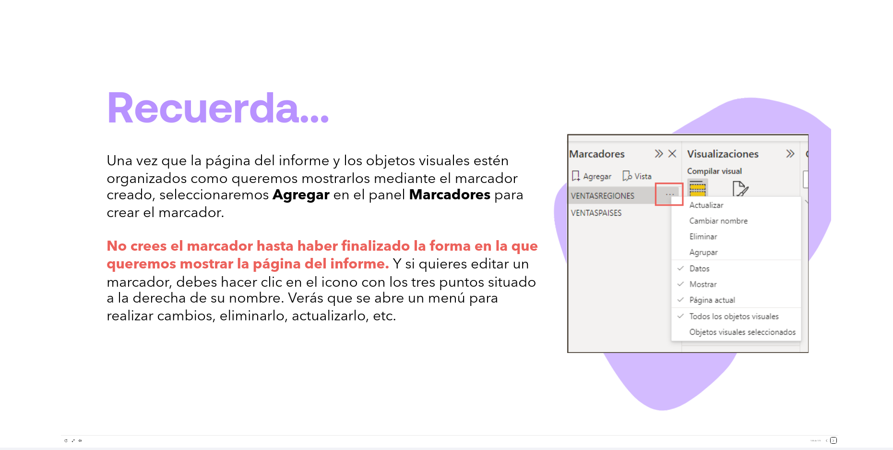
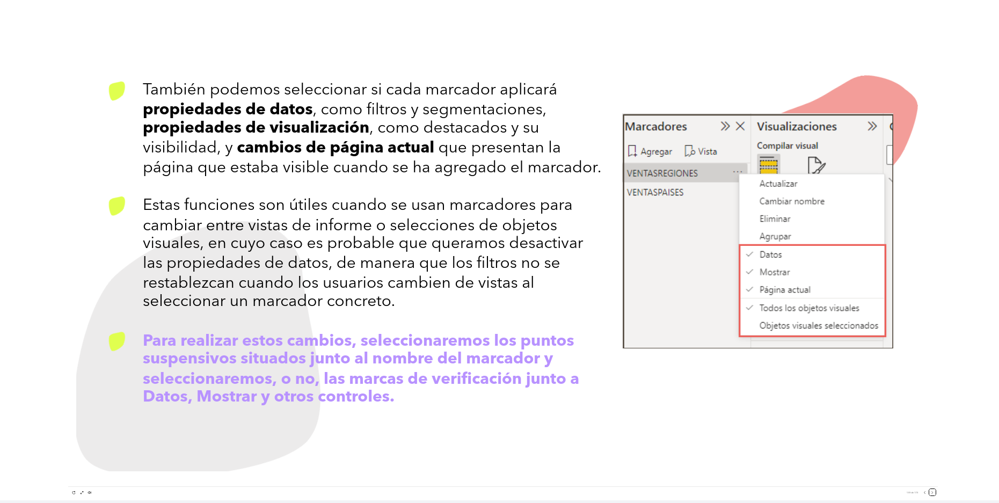

-   Una vez que la página del informe y los objetos visuales estén organizados como queremos mostrarlos mediante el marcador creado, seleccionaremos **Agregar** en el panel **Marcadores** para crear el marcador.

-   **No crees el marcador hasta haber finalizado la forma en la que queremos mostrar la página del informe.** Y si quieres editar un marcador, debes hacer clic en el icono con los tres puntos situado a la derecha de su nombre. Verás que se abre un menú para realizar cambios, eliminarlo, actualizarlo, etc.

*   También podemos seleccionar si cada marcador aplicará **propiedades de datos**, como filtros y segmentaciones, **propiedades de visualización**, como destacados y su visibilidad, y **cambios de página actual** que presentan la página que estaba visible cuando se ha agregado el marcador.

*   Estas funciones son útiles cuando se usan marcadores para cambiar entre vistas de informe o selecciones de objetos visuales, en cuyo caso es probable que queramos desactivar las propiedades de datos, de manera que los filtros no se restablezcan cuando los usuarios cambien de vistas al seleccionar un marcador concreto.

*   **Para realizar estos cambios, seleccionaremos los puntos suspensivos situados junto al nombre del marcador y seleccionaremos, o no, las marcas de verificación junto a Datos, Mostrar y otros controles.**
