# 06-017:   Grupos de marcadores

> Cuando se crean varios marcadores, algo habitual, PowerBI permite **agruparlos**

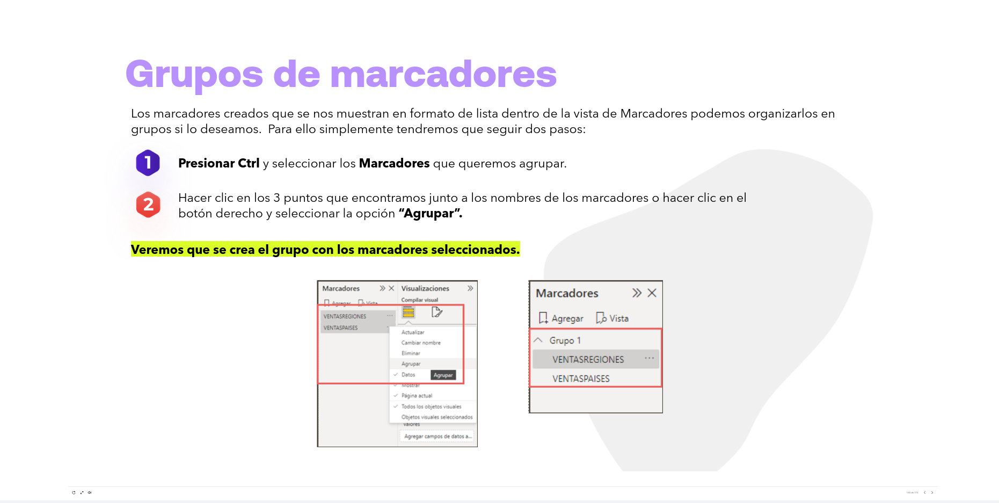

Los marcadores creados que se nos muestran en formato de lista dentro de la vista de Marcadores podemos organizarlos en grupos si lo deseamos. Para ello simplemente tendremos que seguir dos pasos:

1. **Presionar Ctrl** y seleccionar los **Marcadores** que queremos agrupar.
2. Hacer clic en los 3 puntos que encontramos junto a los nombres de los marcadores o hacer clic en el botón derecho y seleccionar la opción **"Agrupar"**.

**Veremos que se crea el grupo con los marcadores seleccionados.**

---

## Grupos de marcadores en modo Vista

**Al usar el modo Vista de los marcadores, se aplicarán las siguientes situaciones:**

*   Si el marcador seleccionado está en un grupo cuando se hace clic en Ver en los marcadores, solo los marcadores de ese grupo se muestran en la sesión de visualización.

*   Si el marcador seleccionado no está en un grupo, o si se encuentra en el nivel superior, como por ejemplo el nombre de un grupo de marcadores, se reproducen todos los marcadores del informe completo, incluidos los de cualquier grupo.

> En ciertas ocasiones, resultará necesario la agrupación de distintos datos, bien sea por MEJORAR LA VISUALIZACION o para OBTENER MAYOR NIVEL DE INFORMACION

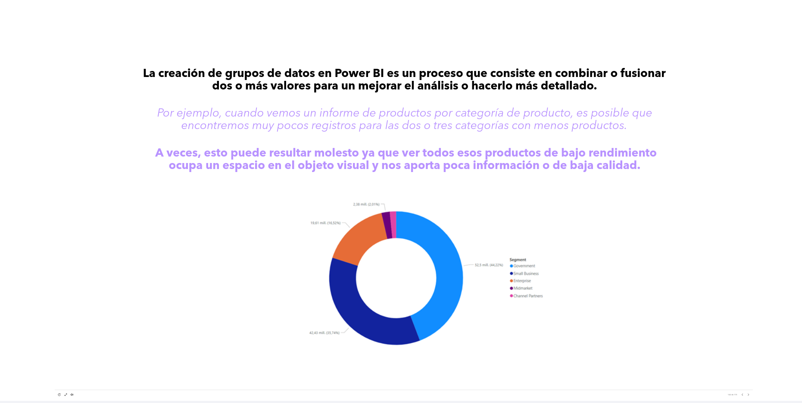

-   **La creación de grupos de datos en Power BI es un proceso que consiste en combinar o fusionar dos o más valores para un mejorar el análisis o hacerlo más detallado.**

    *Por ejemplo, cuando vemos un informe de productos por categoría de producto, es posible que encontremos muy pocos registros para las dos o tres categorías con menos productos.*

**A veces, esto puede resultar molesto ya que ver todos esos productos de bajo rendimiento ocupa un espacio en el objeto visual y nos aporta poca información o de baja calidad.**

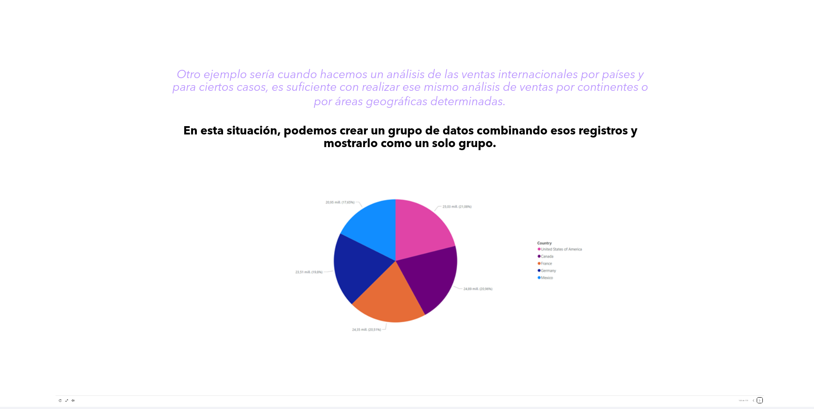

-   *Otro ejemplo sería cuando hacemos un análisis de las ventas internacionales por países y para ciertos casos, es suficiente con realizar ese mismo análisis de ventas por continentes o por áreas geográficas determinadas.*

**En esta situación, podemos crear un grupo de datos combinando esos registros y mostrarlo como un solo grupo.**

---

### Crear grupos de datos en Power BI

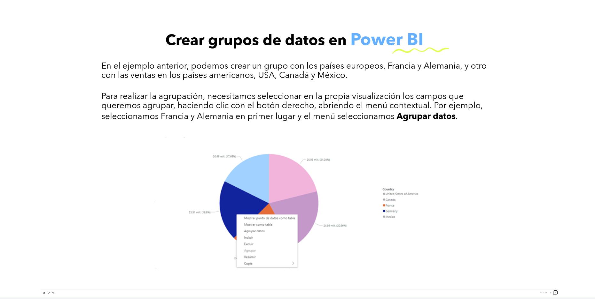

En el ejemplo anterior, podemos crear un grupo con los países europeos, Francia y Alemania, y otro con las ventas en los países americanos, USA, Canadá y México.

Para realizar la agrupación, necesitamos seleccionar en la propia visualización los campos que queremos agrupar, haciendo clic con el botón derecho, abriendo el menú contextual. Por ejemplo, seleccionamos Francia y Alemania en primer lugar y el menú seleccionamos **Agrupar datos**.

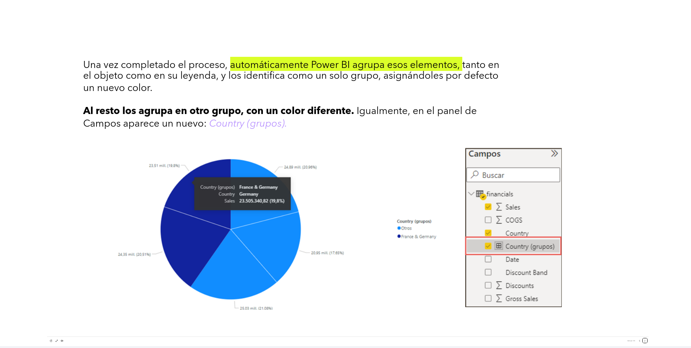

Una vez completado el proceso, **automáticamente Power BI agrupa esos elementos**, tanto en el objeto como en su leyenda, y los identifica como un solo grupo, asignándoles por defecto un nuevo color.

**Al resto los agrupa en otro grupo, con un color diferente.** Igualmente, en el panel de Campos aparece un nuevo: *Country (grupos)*.

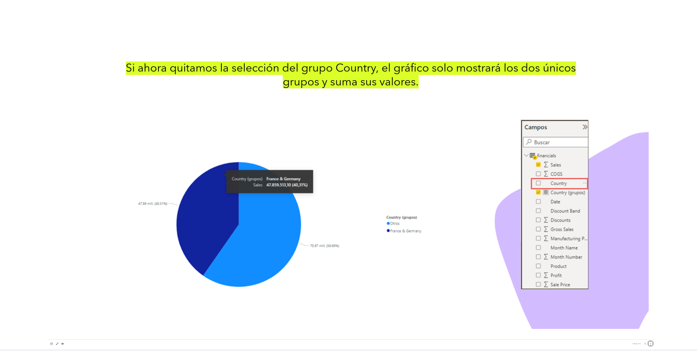

**Si ahora quitamos la selección del grupo Country, el gráfico solo mostrará los dos únicos grupos y suma sus valores.**

---

### Editar grupos de datos en Power BI

> Una vez creados los grupos de datos, también podremos editarlos según sea necesario

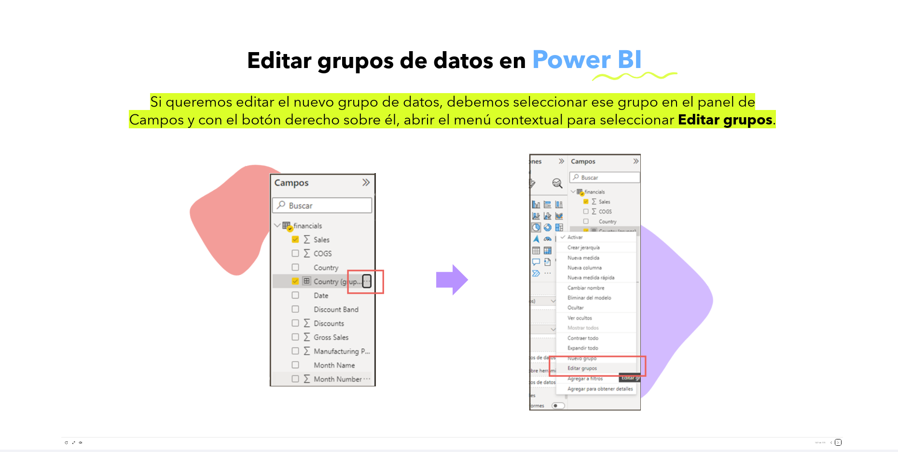

**Si queremos editar el nuevo grupo de datos, debemos seleccionar ese grupo en el panel de Campos y con el botón derecho sobre él, abrir el menú contextual para seleccionar Editar grupos.**

-   En la nueva ventana podemos editar:

    *   **Nombre:** indicar el nombre del grupo.
    *   **Campo:** los campos o columnas usadas para agrupar los datos.
    *   **Tipo de grupo:** lista o contenedor.
    *   **Valores no agrupados:** son los campos que no están agrupados pero están disponibles en esa columna.
    *   **Grupos y miembros:** es la lista de los grupos que se incluyen y sus miembros.
    *   **Incluir otro grupo:** para colocar a todos los miembros desagrupados en el grupo *Otros*.

-   Si desmarcamos *Incluir otro grupo* y hacemos clic en *aceptar*, veremos que el gráfico agrupa a los países europeos y mantiene separados a los países americanos.

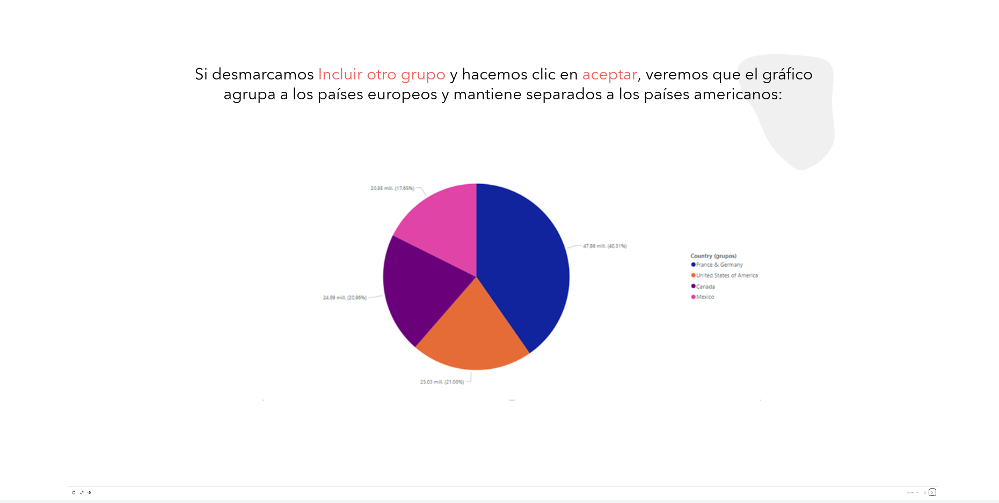

  
-   **En esta misma ventana de edición del grupo podemos:**

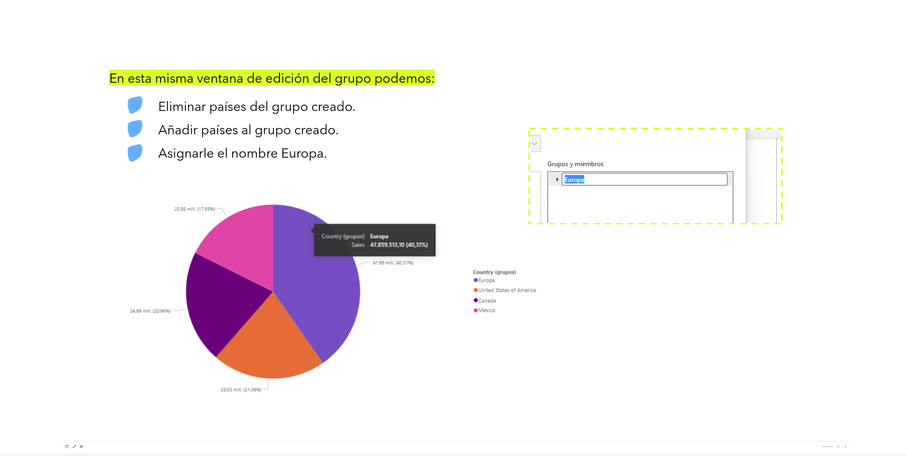

    * Eliminar países del grupo creado.
    * Añadir países al grupo creado.
    * Asignarle el nombre Europa.

-   **También podemos crear un nuevo grupo.**

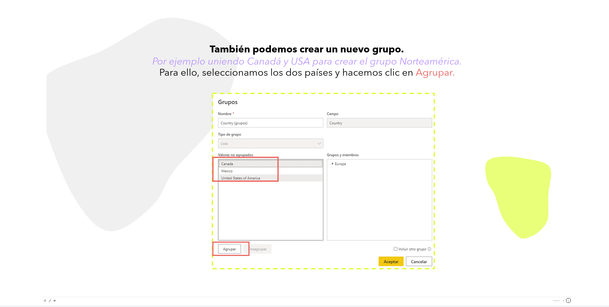

    * *Por ejemplo uniendo Canadá y USA para crear el grupo Norteamérica.*

-   Para ello, seleccionamos los dos países y hacemos clic en **Agrupar**.

- Veremos que **aparece un nuevo grupo**, al que cambiaremos el nombre a *Norteamérica*.
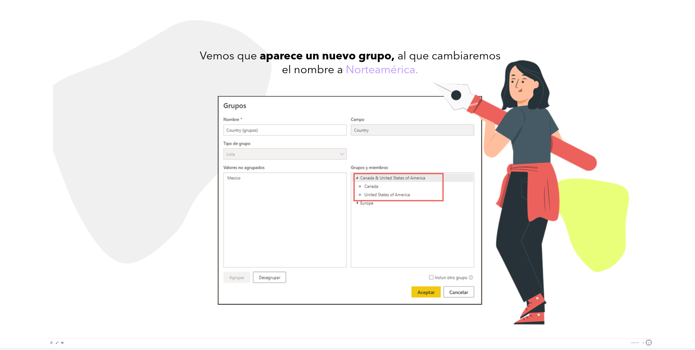

-   **Aceptamos los cambios y ya visualizamos el nuevo grupo en el gráfico.**
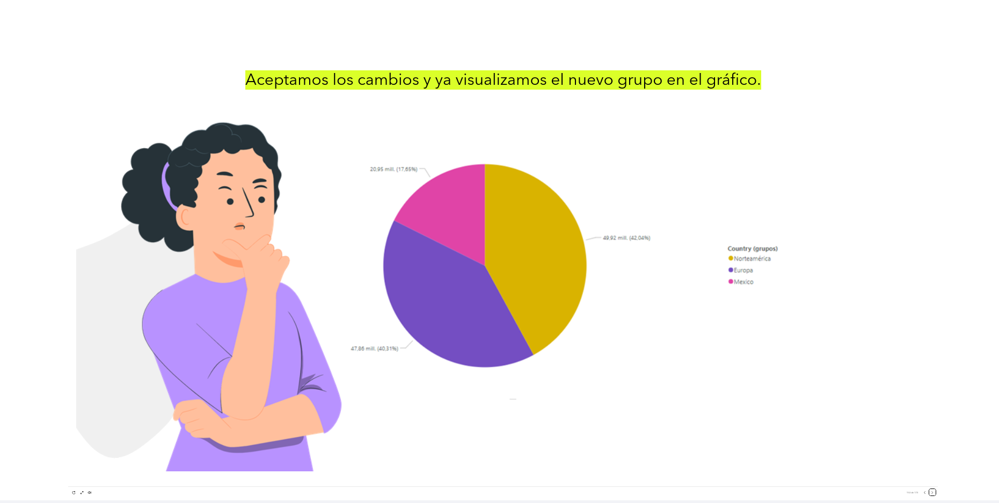

-   **Cada vez que creamos un nuevo grupo, aparece un nuevo campo en el panel de campos.** De esta forma, podremos usarlos en nuevos gráficos.
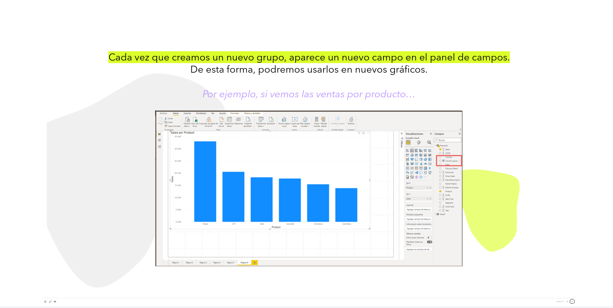

    * *Por ejemplo, si vemos las ventas por producto...*

-   Y ahora colocamos el campo *Country (grupos)* en la sección de **leyenda**, vemos los datos de ventas por producto correspondientes a los grupos creados: *Europa, Norteamérica y México.*
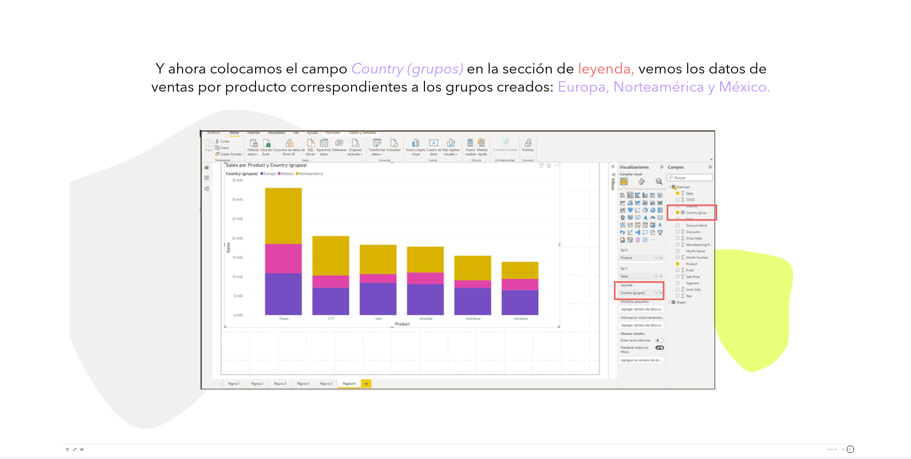

