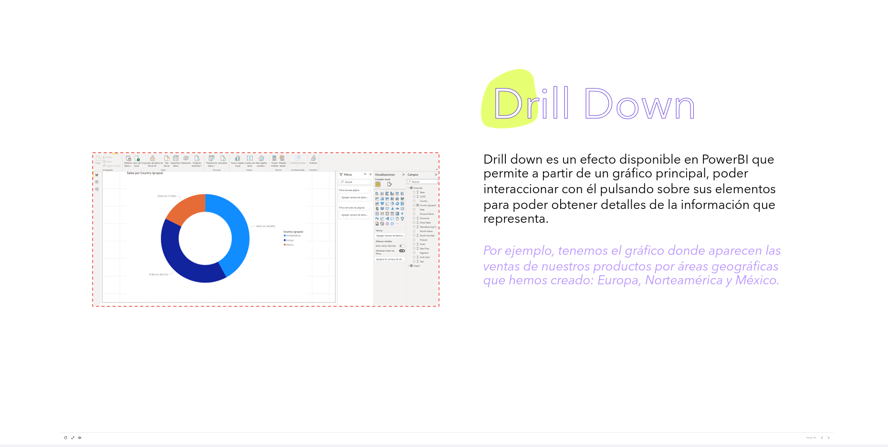
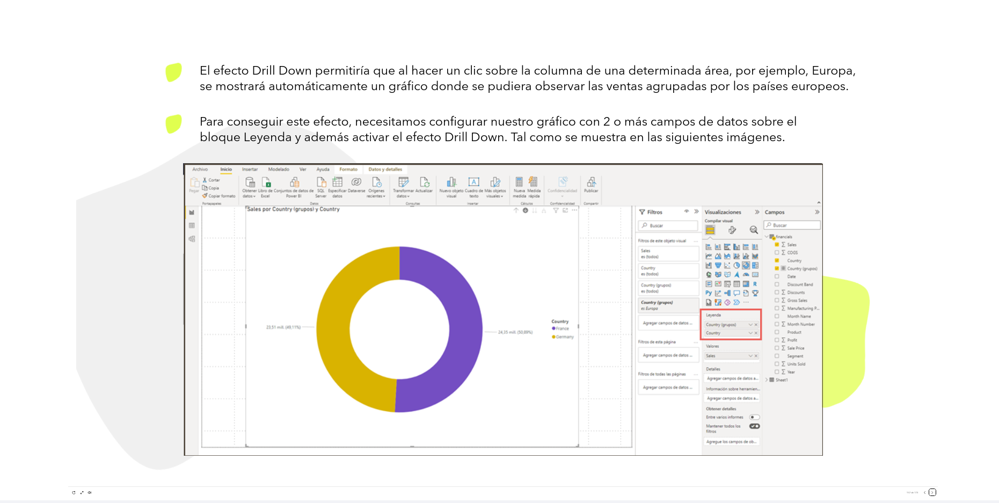
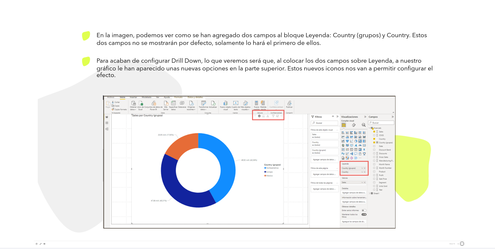
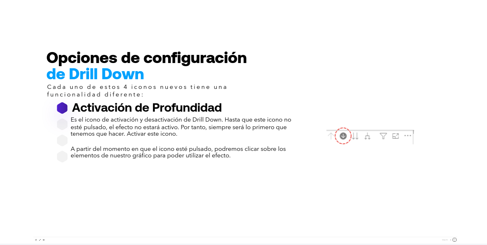
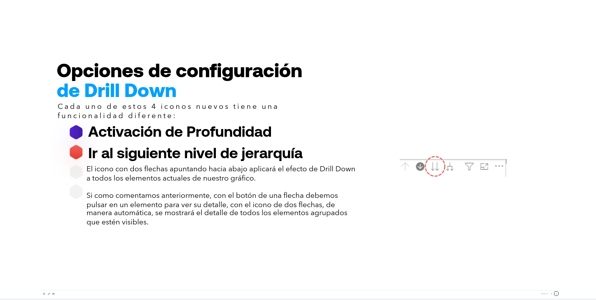
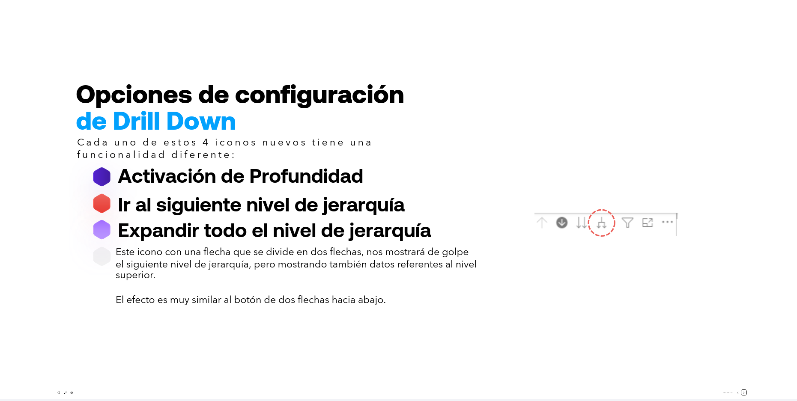
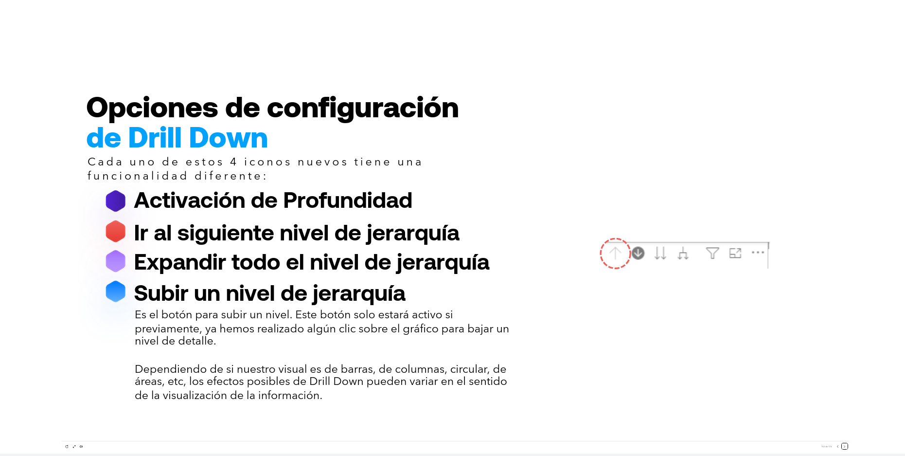

# 06-019    Drill Down

Drill down es un efecto disponible en PowerBI que permite a partir de un gráfico principal, poder interaccionar con él pulsando sobre sus elementos para poder obtener detalles de la información que representa.

*Por ejemplo, tenemos el gráfico donde aparecen las ventas de nuestros productos por áreas geográficas que hemos creado: Europa, Norteamérica y México.*

-   El efecto Drill Down permitiría que al hacer un clic sobre la columna de una determinada área, por ejemplo, Europa, se mostrará automáticamente un gráfico donde se pudiera observar las ventas agrupadas por los países europeos.

-   Para conseguir este efecto, necesitamos configurar nuestro gráfico con 2 o más campos de datos sobre el bloque Leyenda y además activar el efecto Drill Down. Tal como se muestra en las siguientes imágenes.

> Cuando añadimos varios campos en el componente LEYENDA del objeto visual, SOLO SE VISUALIZA EL PRIMER CAMPO. 
>
> Precisamente DRILL DOWN PERMITE PASAR DE UN CAMPO A otros

-   En la imagen, podemos ver como se han agregado dos campos al bloque Leyenda: Country (grupos) y Country. Estos dos campos no se mostrarán por defecto, solamente lo hará el primero de ellos.

-   Para acaban de configurar Drill Down, lo que veremos será que, al colocar los dos campos sobre Leyenda, a nuestro gráfico le han aparecido unas nuevas opciones en la parte superior. Estos nuevos iconos nos van a permitir configurar el efecto.

---

## Opciones de configuración de Drill Down

Cada uno de estos 4 iconos nuevos tiene una funcionalidad diferente:

### Activación de Profundidad

Es el icono de activación y desactivación de Drill Down.  

-   Hasta que este icono no esté pulsado, el efecto no estará activo. Por tanto, siempre será lo primero que tenemos que hacer. Activar este icono.

-   A partir del momento en que el icono esté pulsado, podremos clicar sobre los elementos de nuestro gráfico para poder utilizar el efecto.

---

### Ir al siguiente nivel de jerarquía

El icono con dos flechas apuntando hacia abajo aplicará el efecto de Drill Down a todos los elementos actuales de nuestro gráfico.

-   Si como comentamos anteriormente, con el botón de una flecha debemos pulsar en un elemento para ver su detalle, con el icono de dos flechas, de manera automática, se mostrará el detalle de todos los elementos agrupados que estén visibles.

---

### Expandir todo el nivel de jerarquía

-   Este icono con una flecha que se divide en dos flechas, nos mostrará de golpe el siguiente nivel de jerarquía, pero mostrando también datos referentes al nivel superior.

-   El efecto es muy similar al botón de dos flechas hacia abajo.

---

### Subir un nivel de jerarquía

> El resultado varía según el objeto visual en el que se aplica, por lo que se recomienda ir probando con cada elemento para ver si ofrece los resultados deseados

-   Es el botón para subir un nivel. Este botón solo estará activo si previamente, ya hemos realizado algún clic sobre el gráfico para bajar un nivel de detalle.

-   Dependiendo de si nuestro visual es de barras, de columnas, circular, de áreas, etc, los efectos posibles de Drill Down pueden variar en el sentido de la visualización de la información.

---

