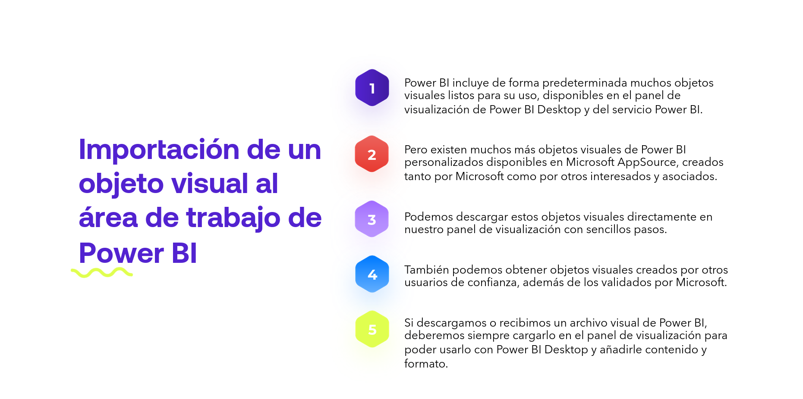
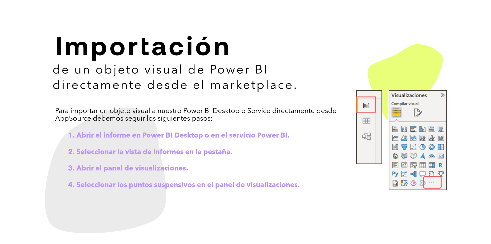
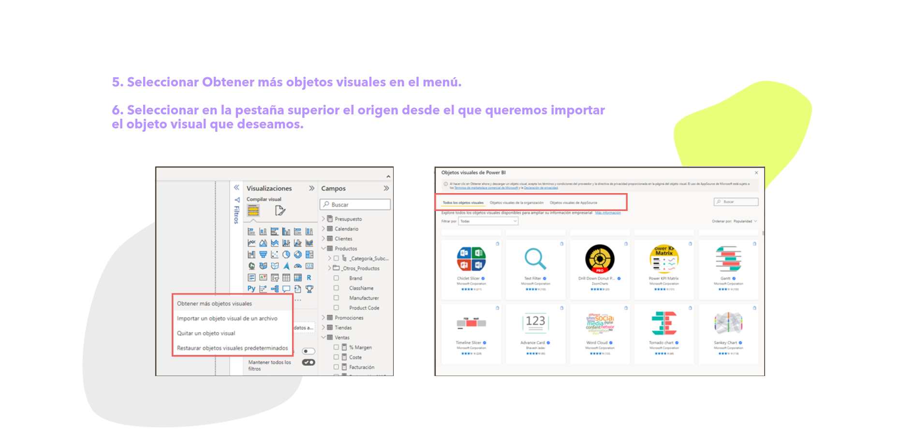
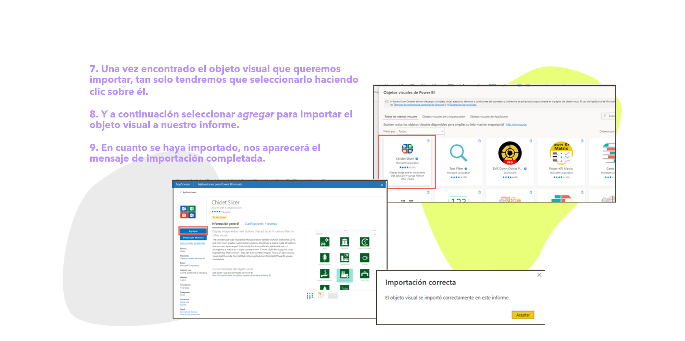
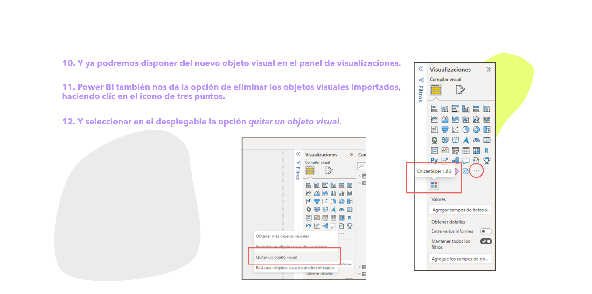
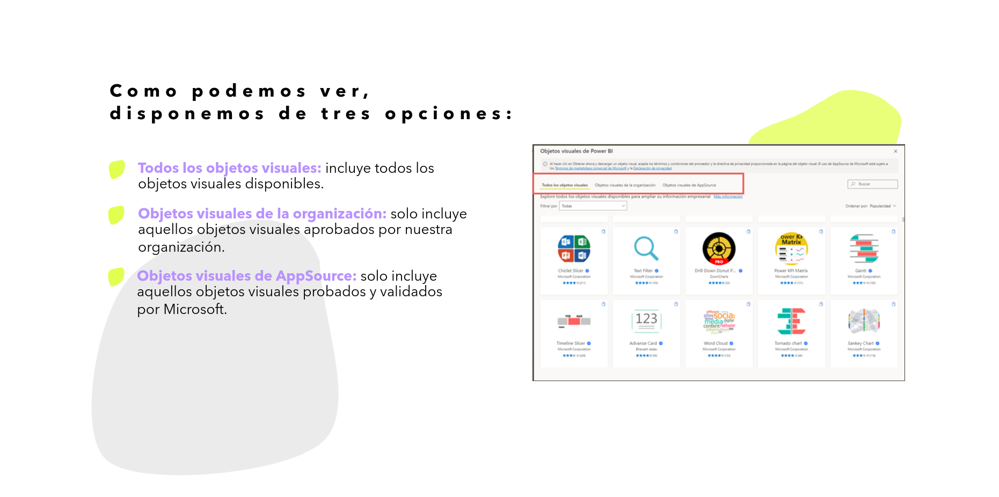
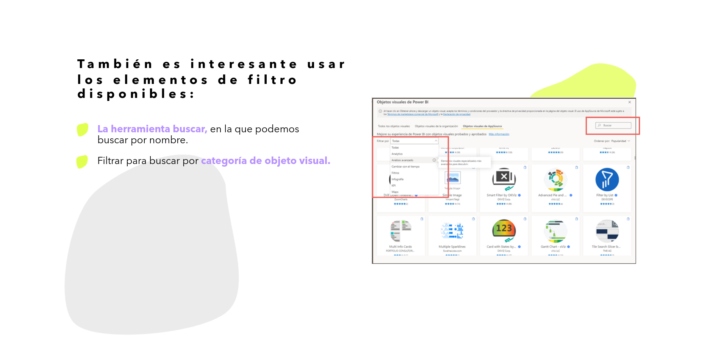
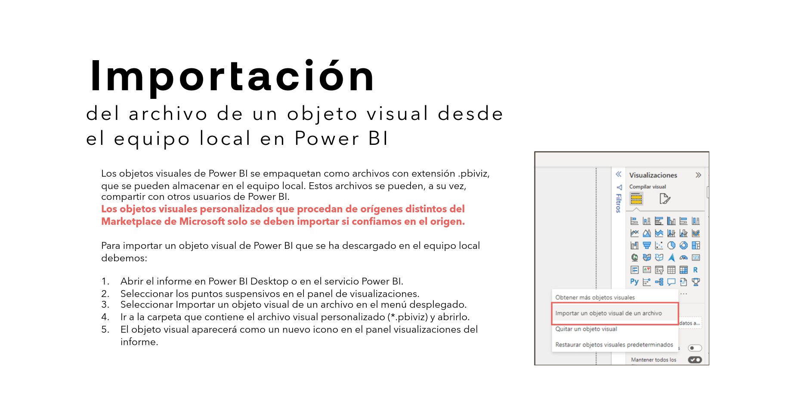
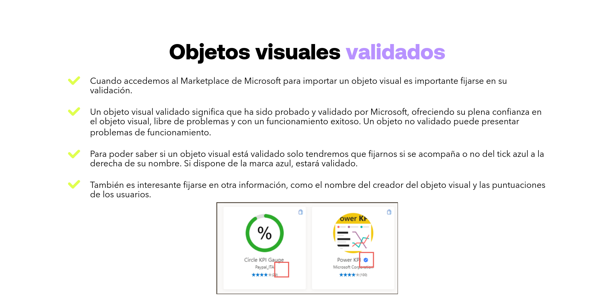

# 06-020:   Importar Elementos Visuales

>   Además de los objetos visuales predeterminados, existen muchísimos más que pueden ser importados.   

>   Precisamente, esta es una de las mayores fuentes de ingresos para Microsoft ya que, desgraciadamente, el 99% de los objetos visuales que podremos importar desde su Market son elementos de pago por licencia de uso.

## Importación de un objeto visual al área de trabajo de Power BI

1.  Power BI incluye de forma predeterminada muchos objetos visuales listos para su uso, disponibles en el panel de visualización de Power BI Desktop y del servicio Power BI.

2.  Pero existen muchos más objetos visuales de Power BI personalizados disponibles en Microsoft AppSource, creados tanto por Microsoft como por otros interesados y asociados.

3.  Podemos descargar estos objetos visuales directamente en nuestro panel de visualización con sencillos pasos.

4.  También podemos obtener objetos visuales creados por otros usuarios de confianza, además de los validados por Microsoft.

5.  Si descargamos o recibimos un archivo visual de Power BI, deberemos siempre cargarlo en el panel de visualización para poder usarlo con Power BI Desktop y añadirle contenido y formato.

---

## Importación de un objeto visual de Power BI directamente desde el marketplace

Para importar un objeto visual a nuestro Power BI Desktop o Service directamente desde AppSource debemos seguir los siguientes pasos:

1.  **Abrir el informe en Power BI Desktop o en el servicio Power BI.**

2.  **Seleccionar la vista de Informes en la pestaña.**

3.  **Abrir el panel de visualizaciones.**

4.  **Seleccionar los puntos suspensivos en el panel de visualizaciones.**

5.  **Seleccionar "Obtener más objetos visuales" en el menú**.

6.  **Seleccionar en la pestaña superior el origen desde el que queremos importar el objeto visual que deseamos**.
    - Como podemos ver, disponemos de tres opciones:

    
    !
    *   **Todos los objetos visuales:** incluye todos los objetos visuales disponibles.
    *   **Objetos visuales de la organización:** solo incluye aquellos objetos visuales aprobados por nuestra organización.
    *   **Objetos visuales de AppSource:** solo incluye aquellos objetos visuales probados y validados por Microsoft.

    - También es interesante usar los elementos de filtro disponibles:
    
    
    *   **La herramienta buscar,** en la que podemos buscar por nombre.
    *   **Filtrar para buscar por categoría de objeto visual.**

7.  **Una vez encontrado el objeto visual que queremos importar, tan solo tendremos que seleccionarlo haciendo clic sobre él.**

8.  **Y a continuación seleccionar *agregar* para importar el objeto visual a nuestro informe.**

9.  **En cuanto se haya importado, nos aparecerá el mensaje de importación completada.**

10. **Y ya podremos disponer del nuevo objeto visual en el panel de visualizaciones.**

11. **Power BI también nos da la opción de eliminar los objetos visuales importados, haciendo clic en el icono de tres puntos.**

12. **Y seleccionar en el desplegable la opción *quitar un objeto visual*.**

13. **En la nueva ventana seleccionamos el objeto visual que queremos eliminar y clicamos en *quitar*.**

14. **Confirmamos que queremos eliminarlo y Power BI lo elimina de nuestro informe.**

---

## Importación del archivo de un objeto visual desde el equipo local en Power BI

Los objetos visuales de Power BI se empaquetan como archivos con extensión `.pbiviz`, que se pueden almacenar en el equipo local. Estos archivos se pueden, a su vez, compartir con otros usuarios de Power BI.  

**Los objetos visuales personalizados que procedan de orígenes distintos del Marketplace de Microsoft solo se deben importar si confiamos en el origen.**

Para importar un objeto visual de Power BI que se ha descargado en el equipo local debemos:

1.  Abrir el informe en Power BI Desktop o en el servicio Power BI.

2.  Seleccionar los puntos suspensivos en el panel de visualizaciones.

3.  Seleccionar Importar un objeto visual de un archivo en el menú desplegado.

4.  Ir a la carpeta que contiene el archivo visual personalizado (*.pbiviz) y abrirlo.

5.  El objeto visual aparecerá como un nuevo icono en el panel visualizaciones del informe.

---

### Objetos visuales validados

> IMPORTANTE:   En teoría, los objetos validados por Microsoft certifican que son seguros para su uso.
>
> Existen muchas otras fuentes para poder integrar nuevos objetos visuales y elementos a PowerBI que, en teoría, no están validados por Microsoft, por lo que toca confiar o no en la fuente origen.

> Pese a ello, que Microsoft "certifique" que un elemento es seguro no es tampoco una garantía real 100%, por lo que conviene estar atento a posibles revocaciones futuras del uso de un objeto visual del market.

*   Cuando accedemos al Marketplace de Microsoft para importar un objeto visual es importante fijarse en su validación.

*   Un objeto visual validado significa que ha sido probado y validado por Microsoft, ofreciendo su plena confianza en el objeto visual, libre de problemas y con un funcionamiento exitoso. Un objeto no validado puede presentar problemas de funcionamiento.

*   Para poder saber si un objeto visual está validado solo tendremos que fijarnos si se acompaña o no del tick azul a la derecha de su nombre. Si dispone de la marca azul, estará validado.

*   También es interesante fijarse en otra información, como el nombre del creador del objeto visual y las puntuaciones de los usuarios.
