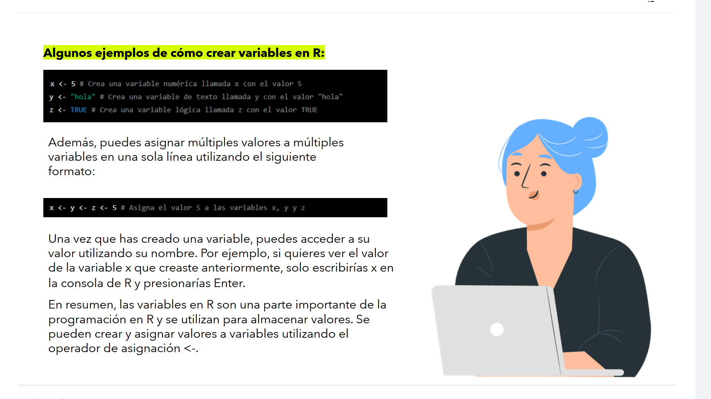

# 07-002: `R` - Variables


Las **variables** son uno de los conceptos fundamentales de R. Actúan como **contenedores de datos**, permitiendo almacenar información que podrá utilizarse posteriormente en cálculos, análisis y visualizaciones.

---

## Variables

Una variable es un **nombre** al que se le asigna un valor.

Ese valor puede ser de distintos tipos:

- 🔢 Numérico
- 📝 Texto
- 🔤 Caracteres
- ✔️ Lógico (booleano)
- 🧮 Complejo
- 💾 Bytes (Raw)

Las variables se crean utilizando el operador de asignación, `<-`:

```r
x <- 5
```

---

###	Tipado, Entorno y Ámbito de Variables en `R`

###		1.	Tipado dinámico

R es un lenguaje de **tipado dinámico**.

> 💡 No es necesario declarar previamente el tipo de una variable. El tipo queda determinado automáticamente por el valor asignado.

Por ejemplo:

```r
x <- 5
```

R interpreta automáticamente que `x` contiene un número.

---

###	Tipos atómicos principales

#### 🔢 Numeric

Tipo numérico por defecto.

```r
x <- 5
```

Internamente se almacena como un **Double (64 bits)**.

---

### 🔹 Integer

Para crear un entero explícito se utiliza el sufijo **`L`**.

```r
x <- 5L
```

---

#### 🔤 Character

Representa cadenas de texto.

Puede utilizar comillas simples o dobles.

```r
nombre <- "Alex"

apellido <- 'Pérez'
```

Muy utilizado para:

- Nombres
- Direcciones
- Categorías
- Etiquetas

---

#### ✔️ Logical

Valores booleanos.

```r
activo <- TRUE

error <- FALSE
```

También pueden escribirse como:

```r
T
F
```

> ⚠️ Aunque son válidos, se recomienda utilizar siempre **TRUE** y **FALSE** para mejorar la legibilidad.

Además, R realiza **coerción automática** a valor numérico binario:

| Valor lógico | Valor numérico |
|--------------|---------------:|
| `TRUE` | **1** |
| `FALSE` | **0** |

---

#### 🧮 Complex

Utilizado para números complejos.

```r
z <- 3 + 2i
```

---

#### 💾 Raw

Permite trabajar directamente con bytes.

Se utiliza principalmente en:

- Criptografía
- Comunicaciones
- Procesamiento binario

---

### 2.	Convenciones de nombres

Los nombres de variables en R son **sensibles a mayúsculas y minúsculas**.

Esto significa que:

```r
ventas
```

y

```r
Ventas
```

son **dos variables completamente distintas**.

---

#### ✅ Caracteres permitidos

Los nombres pueden contener:

- Letras
- Números
- Guion bajo (`_`)
- Punto (`.`)

Ejemplos válidos:

```r
ventas2026

total_ventas

cliente1

datos.finales
```

---

## 🌟 Recomendación: `snake_case`

En el ecosistema **Tidyverse** se recomienda utilizar **snake_case**.

Ejemplo:

```r
total_ventas_2026
```

En lugar de:

```r
TotalVentas2026
```

o

```r
Total.Ventas.2026
```

> 💡 El uso de `snake_case` mejora la legibilidad y evita conflictos con funciones históricas del núcleo de R, como `as.data.frame()`.

---

## 💻 Ejemplos de creación de variables



```r
x <- 5
```

Variable numérica.

---

```r
y <- "hola"
```

Variable de texto.

---

```r
z <- TRUE
```

Variable lógica.

---

## 📦 Asignación múltiple

R permite asignar el mismo valor a varias variables en una sola instrucción.

```r
x <- y <- z <- 5
```

Después de ejecutar la sentencia:

- `x = 5`
- `y = 5`
- `z = 5`

---

## 🔍 Acceso a una variable

Para consultar el contenido de una variable basta con escribir su nombre.

```r
x
```

Salida:

```text
[1] 5
```

---

## 📌 Operadores de asignación

###  1.	Operador `<-`

Es el operador recomendado por prácticamente todas las guías de estilo de R.

```r
edad <- 30
```

✔️ Es el estándar utilizado por:

- Google Style Guide
- Tidyverse Style Guide
- R Core

---

###	2.	Operador `=`

También puede utilizarse:

```r
edad = 30
```

Sin embargo, **no es la práctica recomendada**.

¿Por qué?

Porque normalmente se reserva para asignar **parámetros de funciones**.

Ejemplo:

```r
read.csv(file = "datos.csv")
```

Así se evita cualquier ambigüedad para el intérprete de R.

---

###	3.	Asignación inversa

R incluso permite invertir la dirección de la asignación.

```r
5 -> x
```

Aunque es completamente válida, **rara vez se utiliza** en proyectos reales.

---

## 	Variables y memoria en Power BI

Cuando un script de **R** se ejecuta dentro de **Power BI**, las variables tienen un comportamiento particular.

---

###	Contexto de memoria

Cada ejecución crea un **entorno aislado (Environment)**.

Esto significa que las variables únicamente existen mientras el script está ejecutándose.

Cuando termina la ejecución:

- La memoria se libera.
- Las variables desaparecen.

---

###	Data Frames y Power BI

Power BI espera recibir una **tabla** como resultado del script.

Por ello, normalmente el resultado debe almacenarse en un:

- `data.frame`
- `tibble`

Si únicamente devolvemos un valor escalar:

```r
x <- 5
```

Power BI **no podrá incorporarlo** al modelo tabular.

En cambio:

```r
resultado <- data.frame(valor = x)
```

**... SÍ podrá utilizarse como tabla.**

---

###	Persistencia de variables

Las variables **NO permanecen en memoria** entre ejecuciones.

Cada vez que el usuario:

- Cambia un filtro,
- Utiliza un segmentador (*Slicer*),
- Modifica el contexto del informe

Power BI vuelve a ejecutar completamente el script.  

Como consecuencia:  

- Se destruyen todas las variables anteriores.
- Se crean nuevas variables con los datos filtrados.

---
