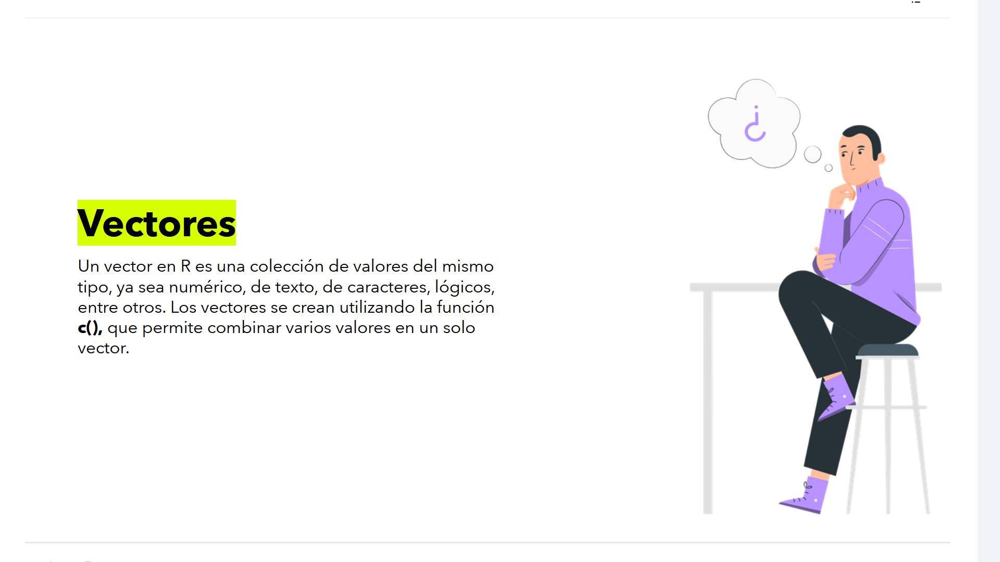
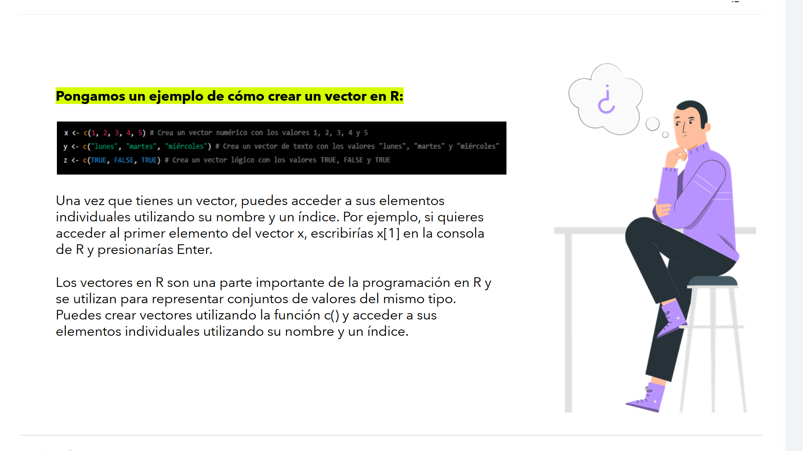

# 🧮 07-003: `R` - Tipos de Datos: Vectores

Los **vectores** constituyen la estructura de datos **más importante y fundamental** de R.

> 💡 En R, prácticamente todas las operaciones trabajan sobre vectores.

---

## ¿Qué es un vector?



Un **vector** es una colección **ordenada** de elementos que cumplen una condición fundamental:

> ✅ **Todos sus elementos deben ser del mismo tipo de dato.**

Puede contener:

- 🔢 Números
- 🔤 Texto
- ✔️ Valores lógicos
- 🧮 Números complejos
- 💾 Datos binarios (Raw)

Los vectores se crean mediante la función **`c()`**, cuyo nombre proviene de **Combine**.

---

## 📌 Estructura Fundamental de R: Vectores Atómicos

###	1.	Vector atómico

Una característica muy importante de R es que **no existen los valores escalares puros**.

Cuando escribimos:

```r
x <- 5
```

realmente estamos creando:

> Un **vector atómico** de longitud **1**.

Es decir:

```text
Longitud = 1
Elemento = 5
```

---

####	Homogeneidad

Todos los elementos de un vector deben pertenecer al **mismo tipo de dato**.

Por ejemplo:

```r
c(1,2,3,4)
```

✔️ Correcto (todos son numéricos)

---

```r
c(TRUE,FALSE,TRUE)
```

✔️ Correcto (todos son lógicos)

---

```r
c("Lunes","Martes")
```

✔️ Correcto (todos son caracteres)

---

### 2️.	Coerción implícita

Si mezclamos distintos tipos dentro de un mismo vector, **R no genera un error**.

En su lugar realiza una **coerción automática**, convirtiendo todos los elementos al tipo más flexible.

La jerarquía es:

1. LOGICAL
2. INTEGER
3. NUMERIC (double)
4. CHAR

```r
# EJEMPLO
c(TRUE,10,"KPI")

# RESULTADO:
[1] "TRUE" "10" "KPI"
```
Todos los elementos pasan automáticamente a ser de tipo **Character**.

---

##	Creación de vectores



### 🔢 Vector numérico

```r
x <- c(1,2,3,4,5)
```

---

### 🔤 Vector de texto

```r
dias <- c("lunes","martes","miércoles")
```

---

### ✔️ Vector lógico

```r
z <- c(TRUE,FALSE,TRUE)
```

---

## 	Acceso a los elementos

Los elementos de un vector se obtienen mediante índices.

Ejemplo:

```r
x[1]
```

Resultado:

```text
[1] 1
```

---

## Indexación en `R`

###	1.	Indexación basada en `1` - NON-ZERO BASED

Una diferencia muy importante respecto a otros lenguajes, la indexación es **NON-ZERO BASED**:

| Lenguaje | Primer índice |
|----------|--------------:|
| **R** | **1** |
| Python | 0 |
| C | 0 |
| Java | 0 |

```r
x <- c(10,20,30,40)
```

Primer elemento:  

```r
x[1]
```

Resultado:  

```text
10
```

---

###	Seleccionar varios elementos

```r
x[c(1,3)]
```

Resultado:

```text
10 30
```

---

###	Excluir elementos

Un índice negativo elimina posiciones.

```r
x[-1]
```

Resultado:

```text
20 30 40
```

---

###	Filtrado mediante condiciones

También es posible utilizar expresiones lógicas.

```r
x[x > 20]
```

Resultado:

```text
30 40
```

Este mecanismo **constituye una de las herramientas más potentes del lenguaje**.

---

## Vectorización

La **vectorización** es una de las principales ventajas de R.

En lugar de recorrer un vector mediante un bucle `for`, R aplica automáticamente la operación sobre **todos los elementos**.

Ejemplo:  

1.	Asignar un vector de valores base para `ventas_base`:
	```r
	ventas_base <- c(100,200,300)
	```

2.	Aplicar un IVA del 21 %:

	```r
	ventas_con_iva <- ventas_base * 1.21
	```

3.	Resultado:

	```text
	121
	242
	363
	```

La multiplicación se realiza **elemento a elemento** (*element-wise*).

> 💡 Internamente, estas operaciones están implementadas en **C** y **Fortran**, por lo que son mucho más rápidas que recorrer manualmente los datos con un `for`.

---

## 	Vectorización vs. Bucles

### Método recomendado

```r
ventas_con_iva <- ventas_base * 1.21
```
* ✔️ Más rápido
* ✔️ Más legible
* ✔️ Más eficiente

---

### Método tradicional

```r
for(i in 1:length(ventas_base)){
    ventas_con_iva[i] <- ventas_base[i] * 1.21
}
```

⚠️ Correcto, pero menos eficiente y menos idiomático en R.

***

## 📊 Aplicación en Business Intelligence

Los vectores tienen un papel fundamental dentro de Power BI y del análisis de datos.

---

###	Representación de columnas

Cada columna de un **data.frame** o **tibble** es, en realidad, un **vector**.

Ejemplo:

| Cliente | Ventas |
|---------|--------:|
| Ana | 120 |
| Luis | 250 |
| Marta | 180 |

Internamente:

- `Cliente` -> `["Ana","Luis","Marta"]`
- `Ventas` -> `[120,250,180]` 

Cada columna es un vector independiente.

---

###	Transformaciones ETL

Durante un proceso **ETL** en Power BI:

- 	Importación
- 	Limpieza
- 	Transformación
- 	Preparación

la mayoría de las operaciones consisten en aplicar cálculos sobre vectores completos.  

Por ejemplo:  

```r
ventas * 1.21
```

... en vez de procesar fila por fila.  

---

###	Rendimiento

Comprender la vectorización permite:

- ⚡ Reducir tiempos de ejecución.
- 💾 Disminuir el consumo de memoria.
- 📈 Procesar millones de registros de forma eficiente.

Por ello, la vectorización es una de las características más valiosas de R para proyectos de **Business Intelligence** y **Data Science**.

---

## 📌 Resumen

| Concepto | Descripción |
|----------|-------------|
| **Vector** | Colección ordenada de elementos del mismo tipo |
| **Función de creación** | `c()` |
| **Tipos permitidos** | Numeric, Integer, Character, Logical, Complex y Raw |
| **Escalares** | En R son vectores de longitud 1 |
| **Coerción** | Convierte automáticamente todos los elementos al tipo más flexible |
| **Indexación** | Basada en 1 |
| **Vectorización** | Operaciones automáticas elemento a elemento |
| **Power BI** | Cada columna de un `data.frame` es un vector |

---

> 💡 Los **vectores** son la base del lenguaje R. Comprender su funcionamiento, la **coerción implícita**, la **indexación basada en 1** y la **vectorización** es esencial para escribir código eficiente y aprovechar al máximo R en proyectos de **Business Intelligence**, **Power BI** y **Ciencia de Datos**.
