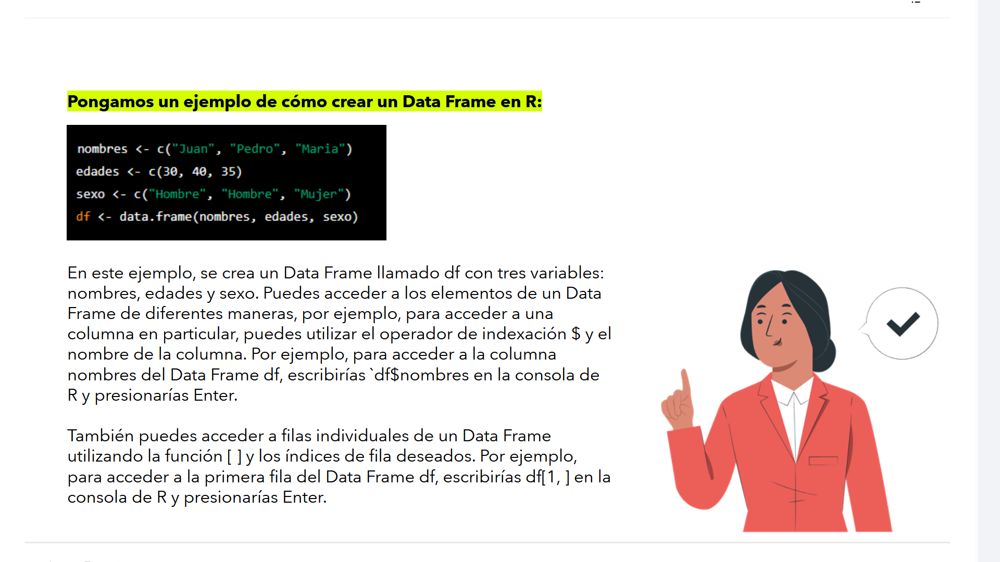

# 📊 07-004: `R` - Data Frames


Los **Data Frames** son la estructura de datos más utilizada en R para el análisis de información. Permiten almacenar datos **tabulares**, donde cada **columna** representa una variable y cada **fila** una observación o registro.

En el ámbito de **Business Intelligence**, un `data.frame` es el equivalente funcional a una **tabla relacional** de una base de datos o a una **tabla del modelo tabular** de Power BI.

---

## Arquitectura del Data Frame

### 1. 	Estructura interna

Aunque visualmente un Data Frame se comporta como una tabla, internamente R lo implementa como:

> **Una lista de vectores atómicos de igual longitud.**

Cada columna es un vector independiente y todos los vectores deben contener el mismo número de elementos.

**DATA FRAME**:
| nombres | edades | sexo | admin |
| ------- | ------ | ---- | ----- |
| Juan | 30 | Hombre | FALSE |
| Pedro | 40 | Hombre | TRUE |
| Maria | 35 | Mujer | FALSE |

Internamente es `Lista` de 4 `Vectores` diferentes:

```text
Lista
 ├── nombres → Vector<Character>
 ├── edades  → Vector<Numeric>
 ├── sexo  → Vector<Character>
 └── admin  → Vector<Boolean>
```

---

### 2. Heterogeneidad columnar

A diferencia de una **matriz**, donde todos los elementos deben ser del mismo tipo, un Data Frame permite que cada columna tenga un tipo distinto.

Ejemplo:

| Columna | Tipo |
|----------|------|
| nombres | Character |
| edades | Numeric |
| sexo | Character o Factor |

Esta flexibilidad lo convierte en la estructura ideal para representar conjuntos de datos reales.

---

### 3. Equivalencia con modelos de BI

Conceptualmente, un Data Frame equivale a:

| Tecnología | Equivalencia |
|------------|--------------|
| SQL | Tabla |
| Power BI | Tabla del modelo |
| Analysis Services | Tabla tabular |
| Excel | Tabla estructurada |

Por ello, la mayoría de herramientas de análisis trabajan internamente con estructuras muy similares.

---

## Evolución del Data Frame

Aunque `data.frame` sigue formando parte del núcleo de R, **actualmente convive con estructuras más modernas**.

### Tibble (`tibble`)

Promovido por el ecosistema **Tidyverse**, introduce un comportamiento más consistente y predecible.

Entre sus ventajas destacan:

- No convierte automáticamente texto en factores.
- Muestra únicamente las primeras filas al imprimir.
- Presenta mensajes de error más descriptivos.
- Facilita el desarrollo de código más robusto.

---

### `data.table`

`data.table` es una extensión diseñada para trabajar con grandes volúmenes de datos.

Características principales:

- Muy alto rendimiento.
- Bajo consumo de memoria.
- Sintaxis compacta:

```r
DT[i, j, by]
```

Es habitual encontrarlo en proyectos de Big Data y procesamiento masivo.

***

## Creación de un Data Frame



```r
nombres <- c("Juan", "Pedro", "María")
edades  <- c(30, 40, 35)
sexo    <- c("Hombre", "Hombre", "Mujer")
admin   <- c(FALSE, TRUE, FALSE

df <- data.frame(nombres, edades, sexo, admin)
```

Resultado:

| nombres | edades | sexo | admin |
|----------|--------|-------|------|
| Juan | 30 | Hombre | FALSE |
| Pedro | 40 | Hombre | TRUE |
| María | 35 | Mujer | FALSE |


---

## Acceso a los datos

### Acceso mediante `$`

Permite obtener directamente una columna.

```r
df$nombres
```

Resultado:

```text
[1] "Juan" "Pedro" "María"
```

El resultado es un **vector**.

---

### Acceso mediante índices

La sintaxis general es:

```r
dataframe[filas, columnas]
```

#### Primera fila

```r
df[1, ]
```

Resultado:

| nombres | edades | sexo | admin |
|----------|--------|-------|------|
| Juan | 30 | Hombre | FALSE |


#### Segunda columna

```r
df[,2]
```

o

```r
df[,"edades"]
```

Resultado:

```text
30 40 35
```


#### Varias columnas

```r
df[,c(1,3)]
```

Resultado:

| nombres | sexo |
|----------|-------|
| Juan | Hombre |
| Pedro | Hombre |
| María | Mujer |

---

## Filtrado de registros (Slicing)

Una de las operaciones más utilizadas consiste en seleccionar filas mediante condiciones lógicas.

Ejemplo:

```r
df[df$edades > 30, ]
```

Resultado:

| nombres | edades | sexo |
|----------|--------|-------|
| Pedro | 40 | Hombre |
| María | 35 | Mujer |

Este mecanismo es conceptualmente equivalente al `SELECT`-`FROM`-`WHERE` de SQL:

```sql
SELECT *
FROM personas
WHERE edades > 30;
```

---

## El operador `$`

El operador `$` es un acceso abreviado a una columna concreta.

Es importante distinguir dos comportamientos:

```r
df["nombres"]
```

Devuelve:

> Un **Data Frame** con una única columna.

---

```r
df$nombres
```

Devuelve:

> Un **vector** de tipo `character`.

La diferencia es importante porque muchas funciones esperan específicamente un vector y no un Data Frame.

---

## El Data Frame en Power BI

Cuando Power BI ejecuta un script de R, el intercambio de datos se realiza siempre mediante Data Frames.

### Entrada de datos

Power BI convierte automáticamente la tabla seleccionada en un Data Frame denominado:

```r
dataset
```

Por ejemplo:

```r
head(dataset)
```

muestra las primeras filas recibidas desde Power BI.

---

###	Salida de datos

El resultado que devuelve el script debe ser un **Data Frame**.

Ejemplo correcto:

```r
resultado <- data.frame(total = c(10,20,30))
```

---

Ejemplo incorrecto:

```r
resultado <- c(10,20,30)
```

Un vector no puede importarse directamente como tabla dentro del modelo de Power BI.

---

## Importancia en procesos ETL

Durante un proceso ETL en Power Query, los Data Frames permiten:

- Limpiar datos.
- Transformar columnas.
- Crear variables derivadas.
- Filtrar registros.
- Agrupar información.
- Preparar conjuntos de datos para su carga al modelo.

Por este motivo constituyen la estructura central sobre la que trabajan la mayoría de scripts de R utilizados en Business Intelligence.

---

# Resumen

| Concepto | Descripción |
|----------|-------------|
| **Data Frame** | Tabla formada por columnas (vectores) de igual longitud |
| **Estructura interna** | Lista de vectores atómicos |
| **Tipos por columna** | Pueden ser diferentes |
| **Acceso** | `$` o `[filas, columnas]` |
| **Filtrado** | Mediante expresiones lógicas |
| **Power BI** | Intercambia datos con R mediante Data Frames |
| **Alternativas modernas** | `tibble` y `data.table` |

---

> El **Data Frame** es la estructura de datos fundamental para el análisis en R. Representa información tabular de forma eficiente, constituye el formato estándar de intercambio con Power BI y sirve como base para la mayoría de procesos ETL, análisis estadísticos y modelos de Business Intelligence.
