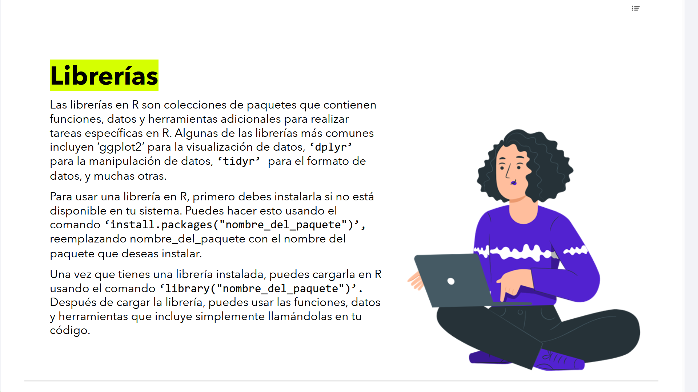
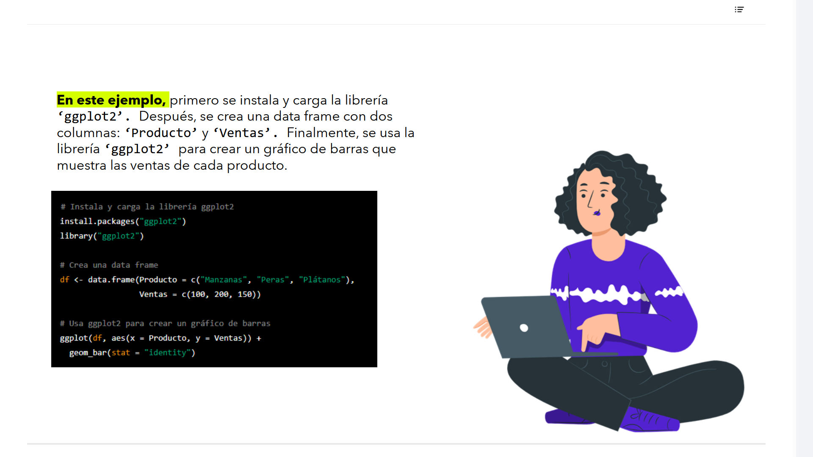

# 07-006: 	`R` - Librerias



Las librerías en R son colecciones de paquetes que contienen funciones, datos y herramientas adicionales para realizar tareas específicas en R.  

Algunas de las librerías más comunes incluyen:

-	`ggplot2` para la visualización de datos
-	`dplyr` para la manipulación de datos
-	`tidyr` para el formato de datos
-	Muchas otras ...


Para usar una librería en R, primero ha de instalarse:  

- Comando `install.packages("nombre_del_paquete")`

- Una vez instalada,cargarla en R usando el comando `library("nombre_del_paquete")` 

- Después de cargar la librería, puedes usar las funciones, datos y herramientas que incluye simplemente llamándolas en tu código.

---

## Ecosistema Tidyverse y Gestión de Paquetes en Entornos de BI

###	1. 	Paquete (Package) vs. Librería (Library)

En la jerga habitual suelen usarse como sinónimos, pero técnicamente:

*	Paquete (Package) -> Es la unidad empaquetada de código, documentación, datos y pruebas compiladas (ej. ggplot2 o dplyr). Se descarga de repositorios centrales como CRAN o GitHub.

* 	Librería (Library) -> Es el directorio físico del disco duro donde residen los paquetes instalados. La función library("paquete") carga en el espacio de nombres (namespace) del entorno actual los objetos del paquete almacenado en esa carpeta.


### 2. Núcleo de Analítica: Tidyverse

Las librerías citadas forman la columna vertebral del ecosistema Tidyverse, diseñado bajo los principios de Tidy Data (cada variable es una columna, cada observación es una fila):

- `dplyr`: Proporciona una gramática para la manipulación de datos a través de verbos intuitivos (filter, select, mutate, group_by, summarise).

- `tidyr`: Especializado en remodelar la estructura de los datos (pivoting, separación/unión de columnas) para convertirlos a formatos normalizados.

- `ggplot2`: Implementa la Grammar of Graphics desarrollada por Leland Wilkinson, permitiendo construir visualizaciones estadísticas complejas por capas.


### 3. Consideraciones Críticas de Paquetes en Power BI

Cuando integras scripts de R dentro de Power BI Desktop o Power BI Service (SaaS en la nube):

- Límite de `install.packages()` 
No se deben incluir llamadas a install.packages() dentro del código del informe de Power BI. Las instalaciones deben realizarse previamente en el entorno local de R del sistema.

- Entorno del Servicio en la Nube
**Si el informe se publica en Power BI Service, únicamente se pueden utilizar las librerías soportadas e preinstaladas por Microsoft en sus servidores de ejecución.**


---

1. En este ejemplo, primero se instala y carga la librería `ggplot2`
2.	Después, se crea una data frame con dos columnas: `Producto` y `Ventas`
3.	Finalmente, se usa la librería `ggplot2` para crear un gráfico de barras que muestra las ventas de cada producto.



#### 1.	Instala y carga la librería `ggplot2`
```r
install.packages("ggplot2")
library("ggplot2")
```

#### 2.	Crea una data frame
```r
df <- data.frame(Producto = c("Manzanas", "Peras", "Plátanos"),
                 Ventas = c(100, 200, 150))
```

#### 3.	Usa `ggplot2` para crear un gráfico de barras
```r
ggplot(df, aes(x = Producto, y = Ventas)) +
  geom_bar(stat = "identity")
```

---

##	Gramática Gráfica de `ggplot2` e Integración en Cuadros de Mando

1. Los Tres Pilares de un Gráfico en ggplot2

El ejemplo muestra la sintaxis declarativa por capas mediante el operador +:

    * Datos (data) -> El Data Frame de origen (df).

    * Mapeo Estético (aes - Aesthetics) ->  Define la correspondencia entre variables de los datos y atributos visuales (x = Producto, y = Ventas).

    * Geometría (geom) ->  Define cómo se representan visualmente esos datos (`geom_bar(stat = "identity"` ... dibuja barras cuya altura equivale directamente al valor numérico de la variable `y`).

2. Visuales Personalizados de R en Power BI

Al utilizar R para generar imágenes/gráficos en un panel de Power BI:

    * Contexto Dinámico de Selección
	El data.frame que recibe `ggplot()` se actualiza automáticamente según los filtros interactivos (slicers) seleccionados por el usuario en Power BI.

    * Flexibilidad Gráfica Avanzada
	Permite superar las limitaciones de los gráficos estándar de Power BI, renderizando diagramas de densidad, parcelas de facetas (`facet_wrap`), mapas de calor o distribuciones complejas directamente en el lienzo del informe.
	