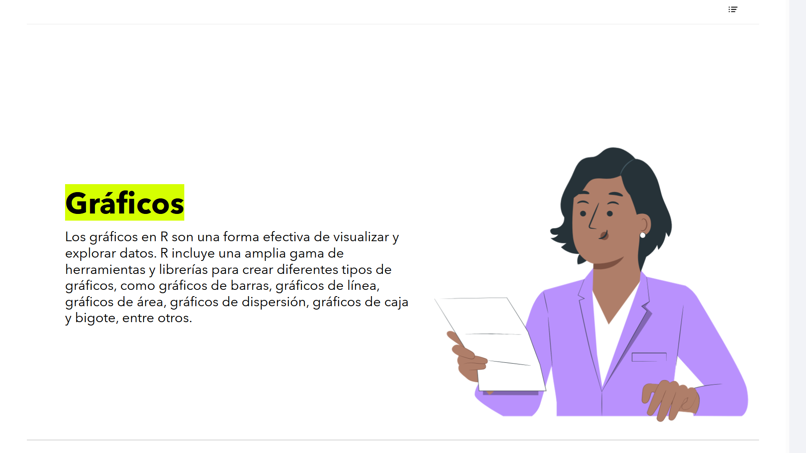

# 07-007: 	`R` - Gráficos

Los gráficos en R son una forma efectiva de visualizar y explorar datos.  

R incluye una amplia gama de herramientas y librerías para crear diferentes tipos de gráficos, como gráficos de barras, gráficos de línea, gráficos de área, gráficos de dispersión, gráficos de caja y bigote, entre otros.  

---

## Paradigmas de Visualización en `R` y Análisis Exploratorio de Datos (EDA) en BI

1. Dos Motores de Gráficos: Base Graphics vs. Grid / ggplot2

En R existen dos filosofías diferenciadas para generar representaciones visuales:

    * Base Graphics (graphics)
	El motor nativo de R (plot(), hist(), boxplot()). Funciona mediante un modelo de "lienzo de dibujo" en el que los elementos se añaden secuencialmente. Es rápido para inspección de datos al vuelo, pero rígido para personalizar o integrar en dashboards dinámicos.

    * Grid Graphics / ggplot2
	Basado en un sistema de capas declarativo. No dibuja píxeles directos, sino que crea objetos gráficos intermedios que se pueden modificar, almacenar en variables o renderizar condicionalmente según los contextos de filtrado.

2. Tipologías de Gráficos Clave en Analítica de Negocio

    * Gráficos de Dispersión (Scatter plots)
	 Esenciales en BI para análisis de correlación entre dos métricas continuas (ej. Precio vs. Volumen de Ventas), permitiendo trazar líneas de tendencia o regresión directamente.

    * Gráficos de Caja y Bigotes (Box plots)
	 Herramienta clave en Business Intelligence para detectar variabilidad, simetría y outliers (valores atípicos) en la distribución de datos financieros o de rendimiento de procesos.

    * Gráficos de Líneas y Área
	 Fundamentales para el análisis de series temporales (Time Series), estacionalidad y pronósticos de demanda.

3. Ventajas y Arquitectura de Renderizado en Power BI

Cuando insertas un visual de R en Power BI:

    * Pipelines de Datos Automáticos
	 Power BI genera dinámicamente un dataset filtrado en memoria y se lo pasa al proceso de R subyacente.

    * Generación del Dispositivo Gráfico
	 El script de R se ejecuta en segundo plano creando un dispositivo gráfico (usualmente PNG o SVG). R dibuja la escena y devuelve la imagen renderizada al lienzo del informe.

    * Casos de Uso Avanzados
	 Supera limitaciones de los visuales nativos de Power BI al permitir gráficos de facetas múltiples (facet_grid), matrices de correlación (corrplot) y gráficos de distribución avanzada sin depender de licencias de terceros en el marketplace.
