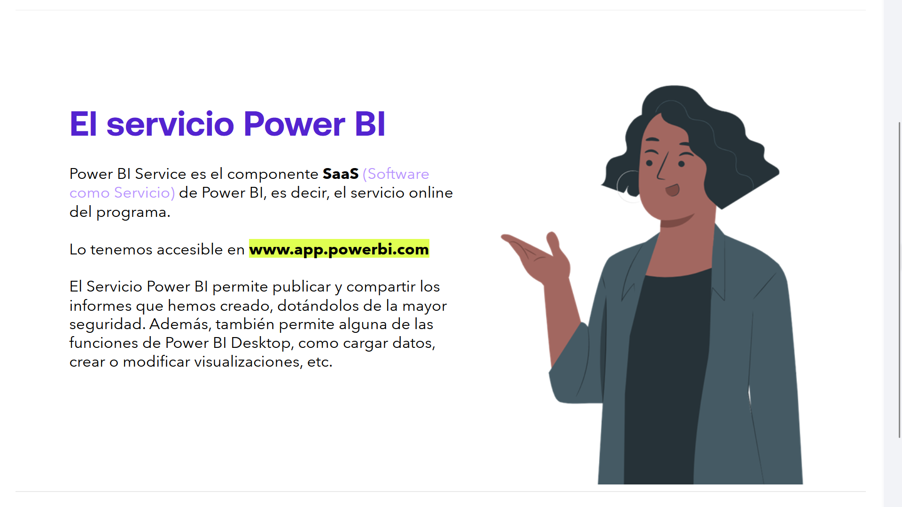
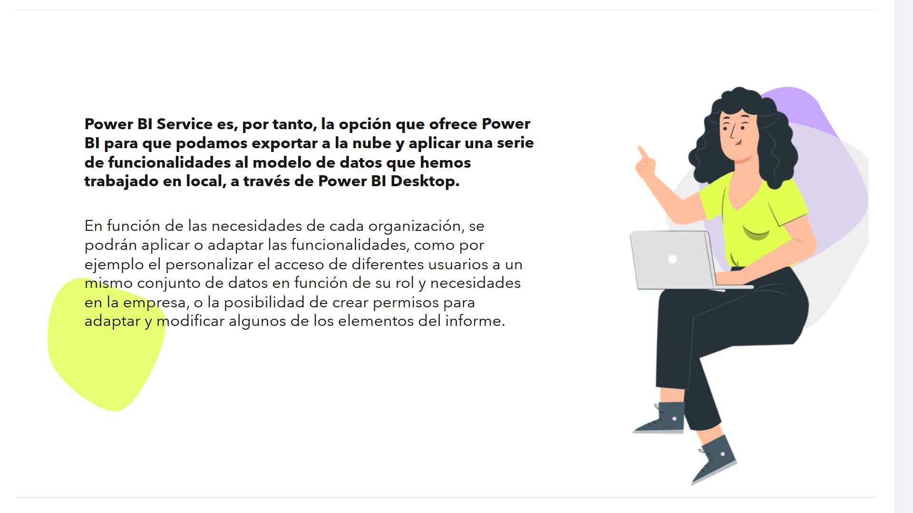
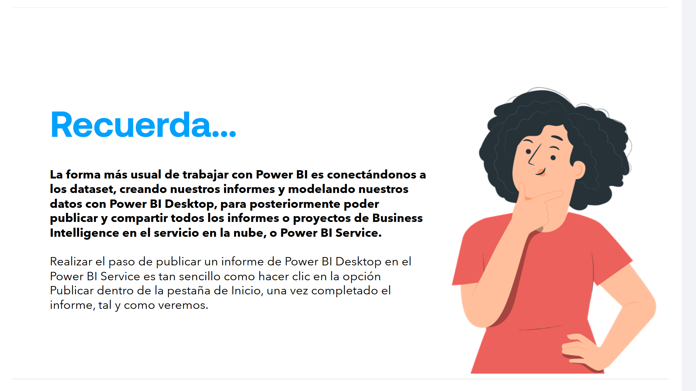

# 08-001: Power BI como SaaS

**Power BI Service** es el componente **SaaS** (*Software como Servicio*) de Power BI, es decir, el servicio online del programa, accesibe en `app.powerbi.com`.

El **Servicio Power BI** permite publicar y compartir los informes que hemos creado, dotándolos de la mayor seguridad. Además, también permite alguna de las funciones de Power BI Desktop, como cargar datos, crear o modificar visualizaciones, etc.

---

## Fundamentos Teóricos de Power BI Service (SaaS) y Colaboración Empresarial

### 1. Arquitectura SaaS y Componentes en la Nube

Power BI Service opera sobre la infraestructura global de **Microsoft Azure**. Funciona como la capa de consumo, distribución y gobernanza dentro de la suite de Business Intelligence, haciendo una clara **separación de Roles:** 

- Mientras `Power BI Desktop` es la herramienta cliente para modelado relacional (**VertiPaq**), `DAX` y diseño de informes ...
- `Power BI Service` actúa como el portal centralizado para la publicación, colaboración y automatización de la actualización de datos (*Data Refresh*).

* **Artefactos Principales:**

  - **Semantic Models** (Modelos de datos), el motor en la nube que sostiene las relaciones, medidas DAX y orígenes de datos.
  - **Reports** (Informes), representaciones visuales compuestas por una o varias páginas interactivas.
  - **Dashboards** (Paneles), lienzos de una sola página que consolidan los indicadores clave (**KPIs**) más relevantes mediante "mosaicos" (*tiles*) provenientes de distintos informes.

Power BI Service es, por tanto, la opción que ofrece Power BI para que podamos exportar a la nube y aplicar una serie de funcionalidades al modelo de datos que hemos trabajado en local, a través de Power BI Desktop.

En función de las necesidades de cada organización, se podrán aplicar o adaptar las funcionalidades, como por ejemplo personalizar el acceso de diferentes usuarios a un mismo conjunto de datos en función de su rol y necesidades en la empresa, o la posibilidad de crear permisos para adaptar y modificar algunos de los elementos del informe.

---

### Arquitectura de Seguridad, Gobernanza y Licenciamiento

#### 1. Seguridad a Nivel de Fila (RLS) y Seguridad a Nivel de Columna (CLS)

La nube permite restringir el acceso a los datos según el contexto del usuario autenticado vía **Microsoft Entra ID** (anteriormente *Azure Active Directory*):

- **Row-Level Security (RLS)** aplica filtros DAX dinámicos (`USERPRINCIPALNAME()`) para que los usuarios finales solo visualicen los registros correspondientes a su ámbito (ej. un gerente regional solo ve las ventas de su zona).
- **Workspace Roles**, como control de acceso granular dentro de las áreas de trabajo mediante cuatro roles principales: `Admin`, `Member`, `Contributor` y `Viewer`.

#### 2. Capacidad y Licenciamiento Empresarial

- **Power BI Pro:** licencia por usuario requerida para publicar y consumir contenido compartido en áreas de trabajo estándar.
- **Power BI Premium / Fabric Capacity (F SKUs):** asigna recursos de cómputo dedicados en Azure. Permite a usuarios con licencias gratuitas (*Free*) consumir informes y habilita características avanzadas como cargas de trabajo masivas, refrescos acelerados e integración de *data engineering* (*Lakehouses*/*Datawarehouses*).

---

> **Recuerda...**

- La forma más usual de trabajar con Power BI es conectándonos a los *datasets*, creando nuestros informes y modelando nuestros datos con `Power BI Desktop`, para posteriormente poder publicar y compartir todos los informes o proyectos de Business Intelligence en el servicio en la nube, o `Power BI Service`.

- Realizar el paso de publicar un informe de Power BI Desktop en el Power BI Service es tan sencillo como hacer clic en la opción `Publicar` dentro de la pestaña de `Inicio`, una vez completado el informe, tal y como veremos.

---

### El Ciclo de Vida del Desarrollo en BI (ALM) y Puertas de Enlace

#### 1. On-premises Data Gateway (Puerta de Enlace)

Para que Power BI Service mantenga actualizados los modelos semánticos cuyos orígenes de datos residen en redes privadas de la empresa (*SQL Server local, archivos en red, SAP On-Premises*), se utiliza el **Power BI Gateway**.

> Actúa como un puente de comunicación cifrado (vía `Azure Service Bus`) entre la nube de Microsoft y la infraestructura privada local, sin necesidad de abrir puertos de entrada en el *firewall* empresarial.

#### 2. Despliegue y Ciclo de Vida (*Application Lifecycle Management*)

El flujo de trabajo profesional desde Power BI Desktop hacia Power BI Service incluye:

1. 	**Desarrollo y Pruebas en local**, creación del archivo `.pbix` (o carpeta de proyecto `.pbip` para control de versiones en Git, etc).

2. 	**Publicación en Áreas de Trabajo (Workspaces),** promoción del archivo hacia entornos segregados de *Desarrollo*, *Test*, staging, *Producción*, mediante `Deployment Pipelines`.

3.	**Distribución mediante Apps de Power BI,** empaquetado final y distribución controlada para la audiencia corporativa mediante *Aplicaciones de Power BI* (`Power BI Apps`), desacoplando el desarrollo activo de la experiencia de lectura del usuario final.

