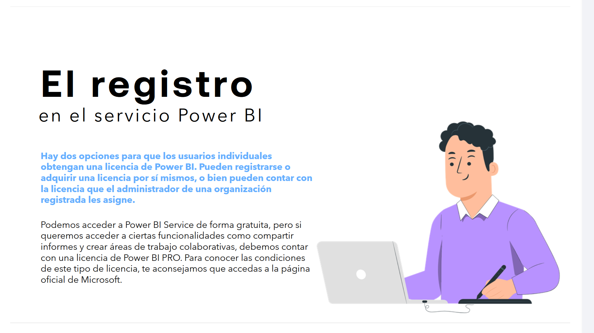
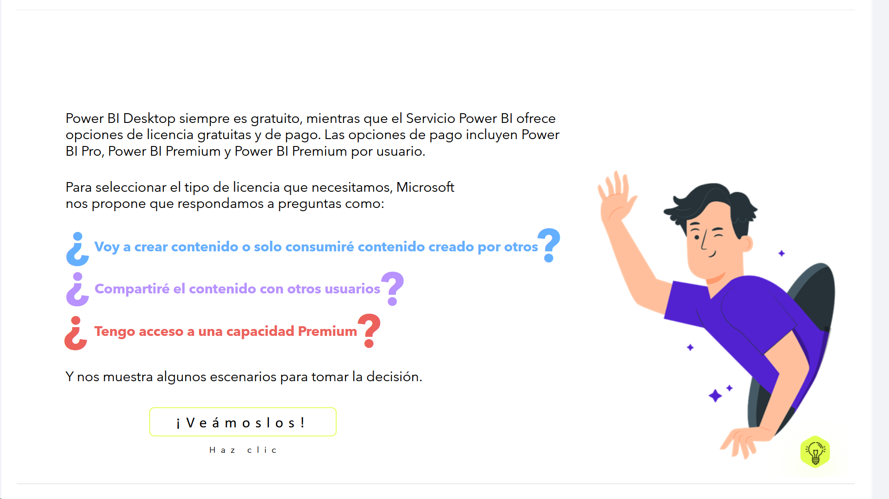

# 08-002: Registro en Power BI

## El Registro en el Servicio Power BI

Hay dos opciones para que los usuarios individuales obtengan una licencia de Power BI:

1.  **Registrarse o adquirir una licencia por sí mismos**
2.	Contar con la licencia que el administrador de una organización registrada les asigne

Podemos acceder a Power BI Service de forma gratuita, pero si queremos acceder a ciertas funcionalidades como compartir informes y crear áreas de trabajo colaborativas, debemos contar con una **licencia de Power BI PRO**.

---

## Fundamentos Teóricos del Registro y Modelos de Asignación *Tenant* en BI

### 1. Modelos de Aprovisionamiento: *Self-Service Signup* vs. *Azure AD Admin Assignment*

##### **Self-Service Purchase / Signup** 
Proceso mediante el cual un usuario dentro de una organización se registra con su cuenta de correo corporativa (`usuario@empresa.com`).  
 Microsoft evalúa el dominio y crea un *tenant* de **Microsoft Entra ID** si no existe, o asigna una licencia en el entorno existente según la política configurada por la organización.

#### **Administración Centralizada (Entra ID / M365 Admin Center)**
El administrador del *tenant* gestiona de forma centralizada los recursos, bloquea las compras individuales no autorizadas (*Self-service purchase*) mediante `PowerShell`/`MS Graph`, y asigna licencias `Pro`, `PPU` o capacidades dedicadas según los perfiles de usuario.

---

`Power BI Desktop` siempre es **gratuito**, mientras que el **Servicio Power BI** ofrece opciones de licencia gratuitas y de pago. Las opciones de pago incluyen `Power BI Pro`, `Power BI Premium` y `Power BI Premium por usuario`.

Para seleccionar el tipo de licencia que necesitamos, Microsoft nos propone que respondamos a preguntas como:

- ¿Voy a crear contenido o solo consumiré contenido creado por otros?
- ¿Compartiré el contenido con otros usuarios?
- ¿Tengo acceso a una capacidad Premium?

Y nos muestra algunos escenarios para tomar la decisión.

---

### Tabla de Escenarios de Licenciamiento

| Rol de Usuario | Necesidad Analítica | Capacidad del Workspace | Licencia Requerida |
|---|---|---|---|
| **Desarrollador / Analista** | Crear y publicar modelos semánticos / informes | Estándar / Pro | Power BI Pro |
| **Desarrollador BI Avanzado** | Modelos masivos, *paginated reports*, XMLA | PPU Workspace | Power BI Premium Per User (PPU) |
| **Consumidor Interno** | Ver interactivos y filtrar Dashboards | Estándar / Pro | Power BI Pro |
| **Consumidor Masivo** | Lectura/interacción exclusiva de informes | Premium / Fabric Capacity (P/F SKU) | Power BI Free (Gratuita) |
| **Analista Personal** | Uso personal sin compartir | Local / Mi área de trabajo | Power BI Free / Desktop |