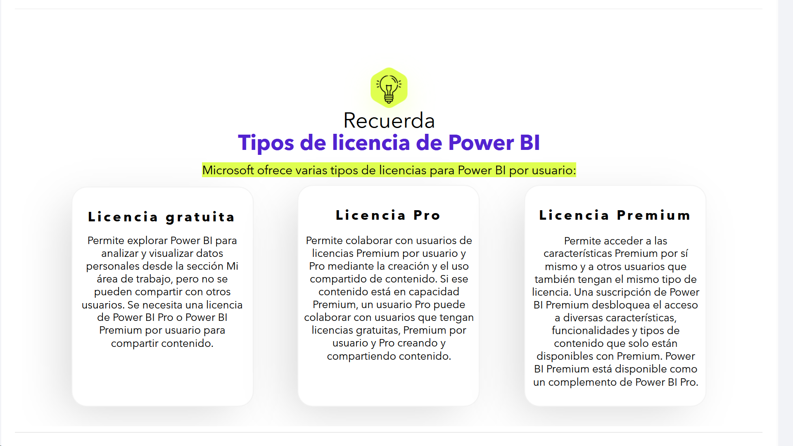
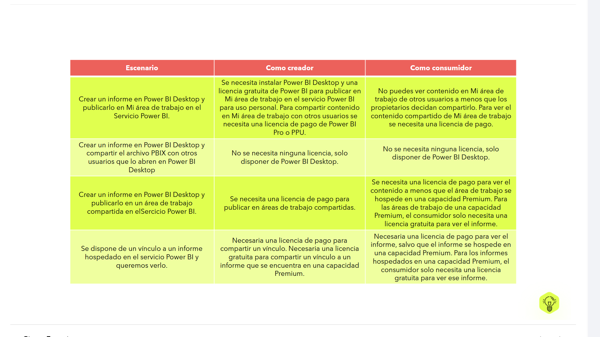
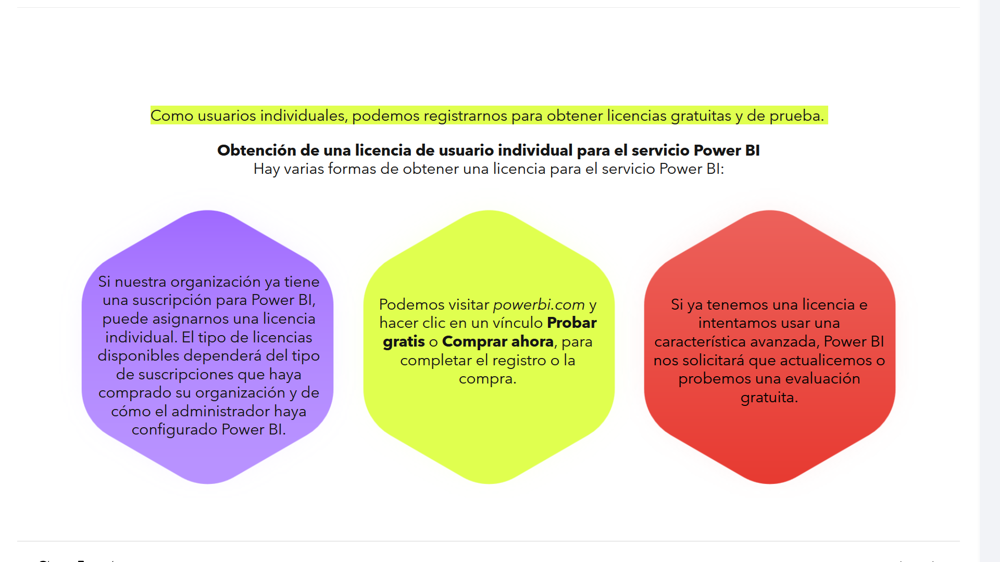
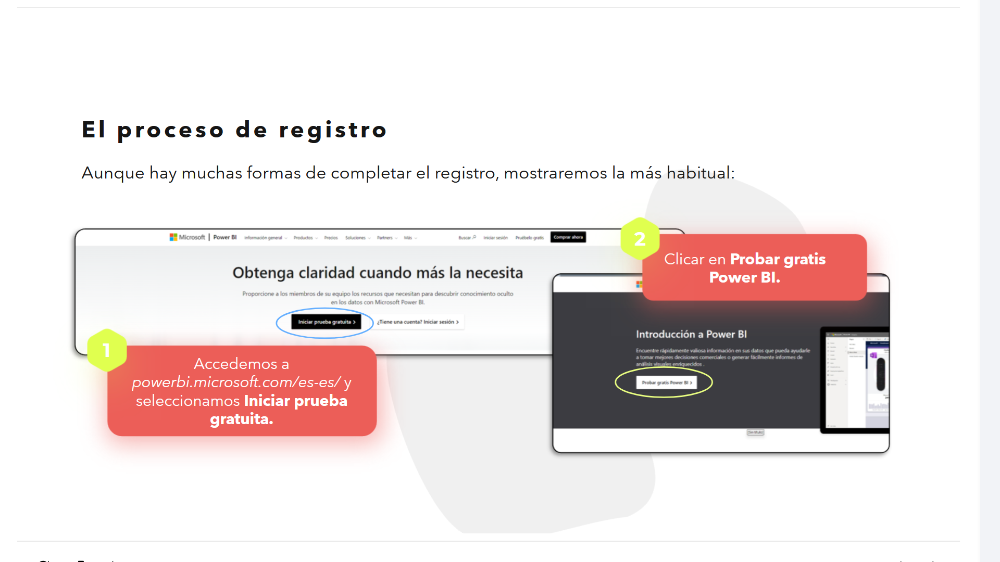
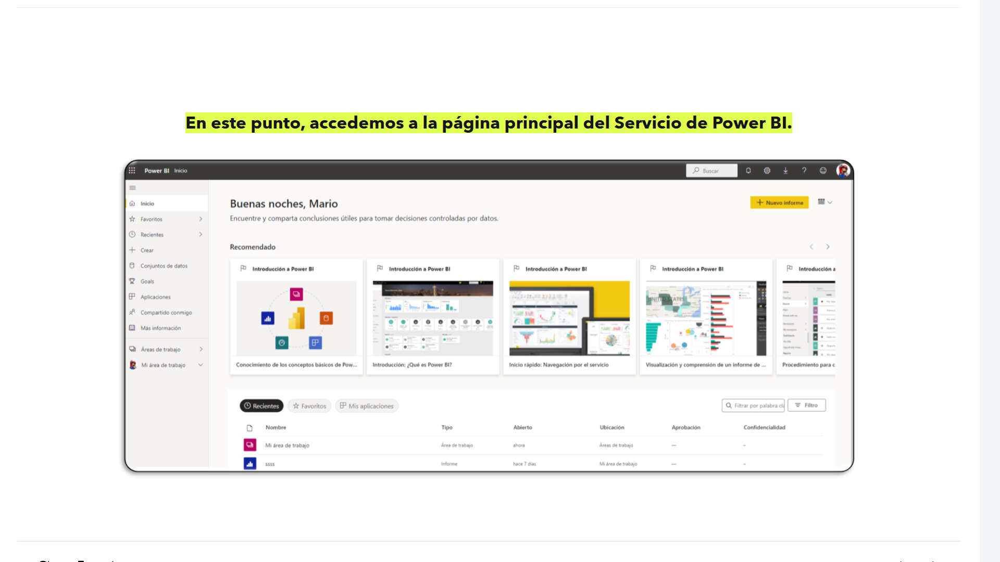

# 08-003: Licencias de Power BI

## Tipos de Licencia de Power BI

Microsoft ofrece varios tipos de licencias para Power BI por usuario:

### Licencia Gratuita

Permite explorar Power BI para analizar y visualizar datos personales desde la sección `Mi área de trabajo`, pero **no se pueden compartir con otros usuarios**. Se necesita una licencia de `Power BI Pro` o `Power BI Premium por usuario` para compartir contenido.

### Licencia Pro

Permite colaborar con usuarios de licencias Premium por usuario y Pro mediante la creación y el uso compartido de contenido. Si ese contenido está en capacidad Premium, un usuario Pro puede colaborar con usuarios que tengan licencias gratuitas, Premium por usuario y Pro, creando y compartiendo contenido.

### Licencia Premium

Permite acceder a las características Premium por sí mismo y a otros usuarios que también tengan el mismo tipo de licencia. Una suscripción de `Power BI Premium` desbloquea el acceso a diversas características, funcionalidades y tipos de contenido que solo están disponibles con Premium. Power BI Premium está disponible como un complemento de Power BI Pro.

---

## Arquitectura de Licenciamiento: Por Usuario vs. Por Capacidad

### 1. Power BI Free (Gratuita)

> **La mejor opción para estudiantes, desarrolladores, personas que necesitan la funcionalidad completa de PowerBI sin necesidad de escalar el servicio, ni contratar espacio/servidores** Permite usar PowerBI online, compartir informes publicamente desde web, etc.

- **Entorno de Trabajo** concede acceso exclusivo a `My Workspace` ("Mi área de trabajo").

- **Limitaciones BI ** 
	Algunas opciones están deshabilitadas, pero permite un uso **COMPLETO** del servicio, exceptuando las funciones premium/Fabric.

### 2. Power BI Pro (Licencia por Usuario)

- **Puntal de Colaboración:** habilita la creación de *Workspaces* colaborativos, la publicación de modelos semánticos compartidos (*shared datasets*), actualización programada (hasta 8 veces al día por *dataset*) y la distribución mediante `Power BI Apps`.
- **Interacción BI:** un usuario Pro únicamente puede compartir contenido con otro usuario que disponga también de licencia Pro, a menos que el contenido esté alojado sobre una **Capacidad Dedicada** (*Premium F/P SKU*).

### 3. Power BI Premium Per User (PPU)

- **Analítica Avanzada Escalar:** ocupa un espacio intermedio entre Pro y la Capacidad Dedicada por nodo.
- **Ventajas Técnicas:** permite acceso a *pipelines* de despliegue (ALM), *paginated reports* (`.rdl`), *endpoints* XMLA para lectura/escritura (vía `SSMS`, `DAX Studio` o `Tabular Editor`), mayor frecuencia de refrescos (hasta 48 al día) y modelos de datos de mayor tamaño en RAM.
- **Restricción de Consumo:** para consumir contenido generado dentro de un entorno PPU, todos los usuarios finales requieren disponer de una licencia PPU individual.

---

### Tabla de Escenarios de Creación y Consumo

| Escenario | Como Creador | Como Consumidor |
|---|---|---|
| Crear un informe en Power BI Desktop y publicarlo en `Mi área de trabajo` en el Servicio Power BI. | Se necesita instalar Power BI Desktop y una licencia gratuita de Power BI para publicar en `Mi área de trabajo` en el servicio Power BI, para uso personal. Para compartir contenido en `Mi área de trabajo` con otros usuarios se necesita una licencia de pago de Power BI Pro o PPU. | No puedes ver contenido en `Mi área de trabajo` de otros usuarios a menos que los propietarios decidan compartirlo. Para ver el contenido compartido de `Mi área de trabajo` se necesita una licencia de pago. |
| Crear un informe en Power BI Desktop y compartir el archivo `PBIX` con otros usuarios que lo abren en Power BI Desktop. | No se necesita ninguna licencia, solo disponer de Power BI Desktop. | No se necesita ninguna licencia, solo disponer de Power BI Desktop. |
| Crear un informe en Power BI Desktop y publicarlo en un área de trabajo compartida en el Servicio Power BI. | Se necesita una licencia de pago para publicar en áreas de trabajo compartidas. | Se necesita una licencia de pago para ver el contenido, a menos que el área de trabajo se hospede en una capacidad Premium. Para las áreas de trabajo de una capacidad Premium, el consumidor solo necesita una licencia gratuita para ver el informe. |
| Se dispone de un vínculo a un informe hospedado en el Servicio Power BI y queremos verlo. | Es necesaria una licencia de pago para compartir un vínculo. Es necesaria una licencia gratuita para compartir un vínculo a un informe que se encuentra en una capacidad Premium. | Es necesaria una licencia de pago para ver el informe, salvo que el informe se hospede en una capacidad Premium. Para los informes hospedados en una capacidad Premium, el consumidor solo necesita una licencia gratuita para ver ese informe. |

---

Como usuarios individuales, podemos registrarnos para obtener licencias gratuitas y de prueba.

### Obtención de una Licencia de Usuario Individual para el Servicio Power BI

Hay varias formas de obtener una licencia para el Servicio Power BI:

1. Si nuestra organización ya tiene una suscripción para Power BI, puede asignarnos una licencia individual. El tipo de licencias disponibles dependerá del tipo de suscripciones que haya comprado su organización y de cómo el administrador haya configurado Power BI.
2. Podemos visitar `powerbi.com` y hacer clic en un vínculo `Probar gratis` o `Comprar ahora`, para completar el registro o la compra.
3. Si ya tenemos una licencia e intentamos usar una característica avanzada, Power BI nos solicitará que actualicemos o probemos una evaluación gratuita.

---

## Direcciones de Correo Electrónico Admitidas

> **Solo direcciones de email corporativas**.

Microsoft solo admite ciertos tipos de direcciones de correo electrónico para usar al registrarnos para poder acceder al Servicio Power BI:

> Se requiere usar una dirección de correo electrónico **profesional o educativa**. No podremos registrarnos con direcciones de correo electrónico de proveedores de telecomunicaciones o de servicios de correo electrónico de usuario, como `outlook.com`, `hotmail.com`, `gmail.com`, etc.

---

## El Proceso de Registro

Aunque hay muchas formas de completar el registro, mostraremos la más habitual:

1. Accedemos a `powerbi.microsoft.com/es-es/` y seleccionamos `Iniciar prueba gratuita`.
2. Hacemos clic en `Probar gratis Power BI`.

1. Cuando se nos solicite, iniciamos sesión con la cuenta de correo.
2. Si tenemos una cuenta anterior para otro producto de Microsoft instalado, este reconocerá nuestro usuario y seleccionaremos `Iniciar sesión`.
3. En el caso de no estar usando una dirección de correo electrónico profesional o educativa, veremos un mensaje de advertencia para cambiar la dirección de correo.
4. Se nos pedirá la introducción de una contraseña para completar el registro.
5. Se nos pedirá que revisemos los términos y condiciones y, si estamos de acuerdo, seleccionaremos `Iniciar`.

En este punto, accedemos a la página principal del Servicio de Power BI.

---

## Limitaciones del Servicio Online vs. App de Escritorio

`Power BI Service` se estructura a través de áreas de trabajo compartidas que permiten trabajar con los informes, los paneles y los conjuntos de datos asociados, de forma totalmente colaborativa.

Aunque también permite conectarse a orígenes de datos, sus capacidades de modelación son más limitadas, por lo que es aconsejable cargar los datos, refinarlos, crear las relaciones, crear las visualizaciones, diseñar los informes, etc., en la **versión de escritorio**, en vez de en esta versión del programa.