# 08-004:	Contenido del servicio PowerBI

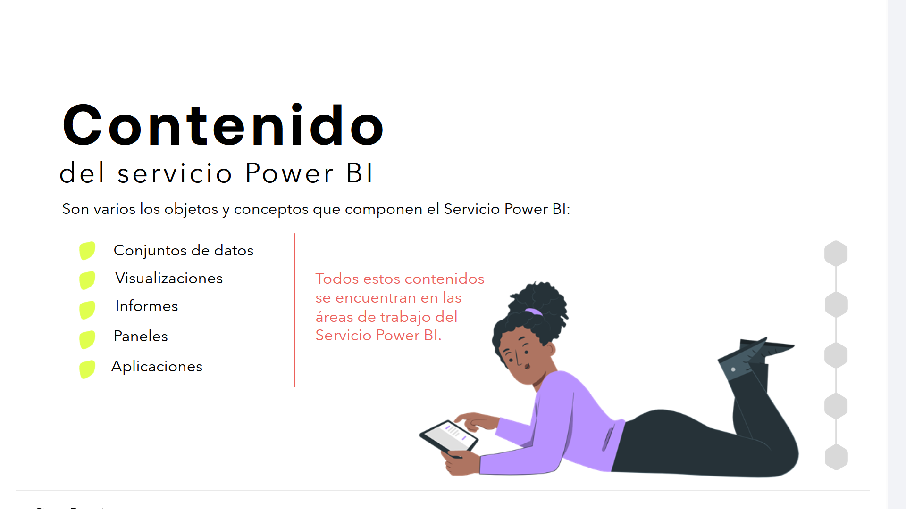

# Contenido del servicio Power BI

Son varios los objetos y conceptos que componen el Servicio Power BI:

* Conjuntos de datos
* Visualizaciones
* Informes
* Paneles
* Aplicaciones

> Todos estos contenidos se encuentran en las áreas de trabajo del Servicio Power BI.

---

### CONJUNTOS DE DATOS

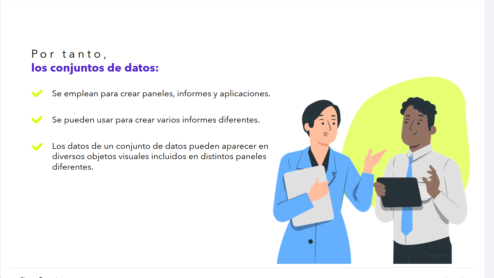

* Un conjunto de datos es una colección o contenedor de datos que los diseñadores o creadores importan, o a los que se conectan, para poder crear los informes y paneles posteriores.
  *Puede ser una hoja de Excel o los datos contenidos en una página web, por ejemplo.*
* En el Servicio Power BI, los usuarios no suelen interactuar con los conjuntos de datos, ya que **son los propios diseñadores los que los manipulan y administran.**
* Cuando un diseñador comparte una aplicación con los usuarios o les concede permisos en un área de trabajo específico, **los usuarios pueden buscar qué conjuntos de datos se usan, pero no pueden modificar el conjunto de datos**, para garantizar que esa fuente de datos es segura.

Por tanto, **los conjuntos de datos:**

* Se emplean para crear paneles, informes y aplicaciones.
* Se pueden usar para crear varios informes diferentes.
* Los datos de un conjunto de datos pueden aparecer en diversos objetos visuales incluidos en distintos paneles diferentes.

---

### VISUALIZACIONES

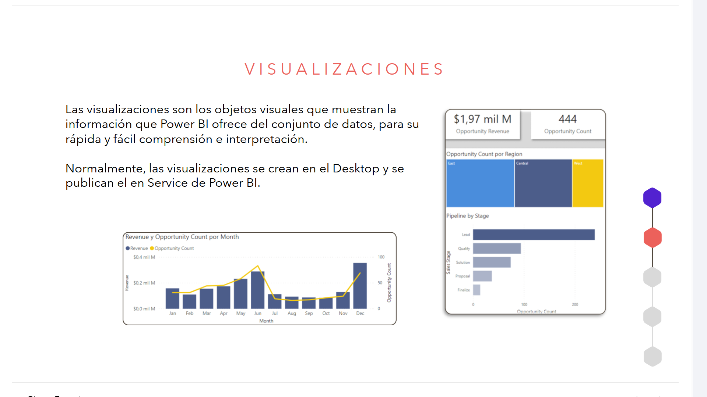

Las visualizaciones son los objetos visuales que muestran la información que Power BI ofrece del conjunto de datos, para su rápida y fácil comprensión e interpretación.

Normalmente, las visualizaciones se crean en el Desktop y se publican en el Service de Power BI.

---

### INFORMES

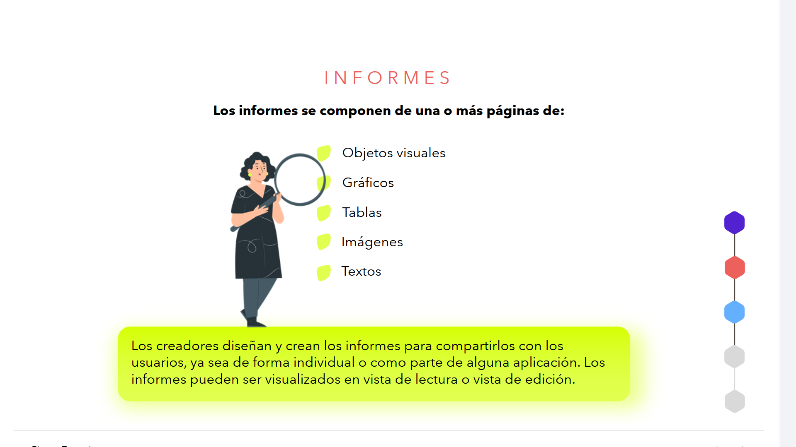

**Los informes se componen de una o más páginas de:**

* Objetos visuales
* Gráficos
* Tablas
* Imágenes
* Textos

Los creadores diseñan y crean los informes para compartirlos con los usuarios, ya sea de forma individual o como parte de alguna aplicación. Los informes pueden ser visualizados en vista de lectura o vista de edición.

---

Informes: **Vista de lectura y vista de edición**

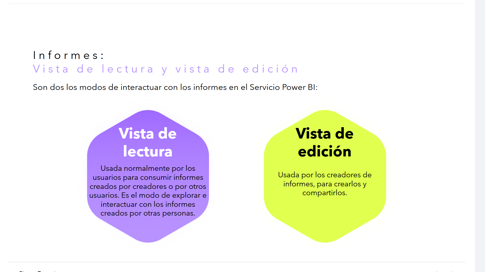

Son dos los modos de interactuar con los informes en el Servicio Power BI:

* **Vista de lectura:** Usada normalmente por los usuarios para consumir informes creados por creadores o por otros usuarios. Es el modo de explorar e interactuar con los informes creados por otras personas.
* **Vista de edición:** Usada por los creadores de informes, para crearlos y compartirlos.

---

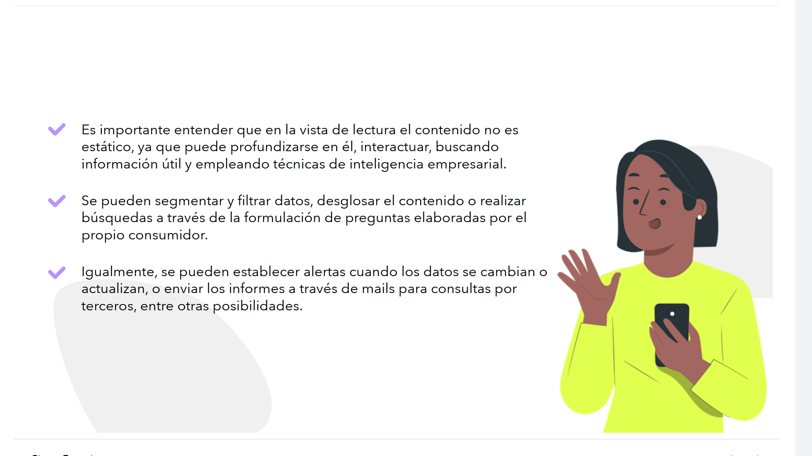

* Es importante entender que en la vista de lectura el contenido no es estático, ya que puede profundizarse en él, interactuar, buscando información útil y empleando técnicas de inteligencia empresarial.
* Se pueden segmentar y filtrar datos, desglosar el contenido o realizar búsquedas a través de la formulación de preguntas elaboradas por el propio consumidor.
* Igualmente, se pueden establecer alertas cuando los datos se cambian o actualizan, o enviar los informes a través de mails para consultas por terceros, entre otras posibilidades.

---

### PANELES

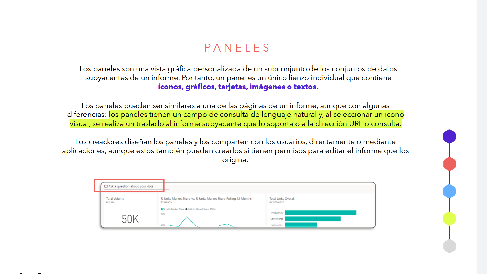

Los paneles son una vista gráfica personalizada de un subconjunto de los conjuntos de datos subyacentes de un informe. Por tanto, un panel es un único lienzo individual que contiene **iconos, gráficos, tarjetas, imágenes o textos.**

Los paneles pueden ser similares a una de las páginas de un informe, aunque con algunas diferencias: los paneles tienen un campo de consulta de lenguaje natural y, al seleccionar un icono visual, se realiza un traslado al informe subyacente que lo soporta o a la dirección URL o consulta.

Los creadores diseñan los paneles y los comparten con los usuarios, directamente o mediante aplicaciones, aunque estos también pueden crearlos si tienen permisos para editar el informe que los origina.

---

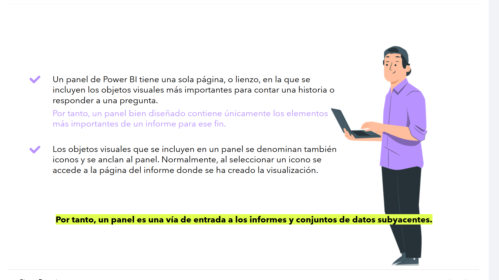

* Un panel de Power BI tiene una sola página, o lienzo, en la que se incluyen los objetos visuales más importantes para contar una historia o responder a una pregunta.
  Por tanto, un panel bien diseñado contiene únicamente los elementos más importantes de un informe para ese fin.
* Los objetos visuales que se incluyen en un panel se denominan también iconos y se anclan al panel. Normalmente, al seleccionar un icono se accede a la página del informe donde se ha creado la visualización.

**Por tanto, un panel es una vía de entrada a los informes y conjuntos de datos subyacentes.**

---

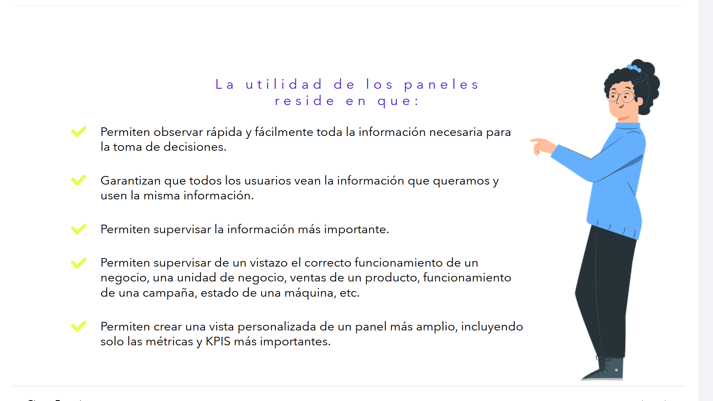

La utilidad de los paneles reside en que:

* Permiten observar rápida y fácilmente toda la información necesaria para la toma de decisiones.
* Garantizan que todos los usuarios vean la información que queramos y usen la misma información.
* Permiten supervisar la información más importante.
* Permiten supervisar de un vistazo el correcto funcionamiento de un negocio, una unidad de negocio, ventas de un producto, funcionamiento de una campaña, estado de una máquina, etc.
* Permiten crear una vista personalizada de un panel más amplio, incluyendo solo las métricas y KPIS más importantes.

---

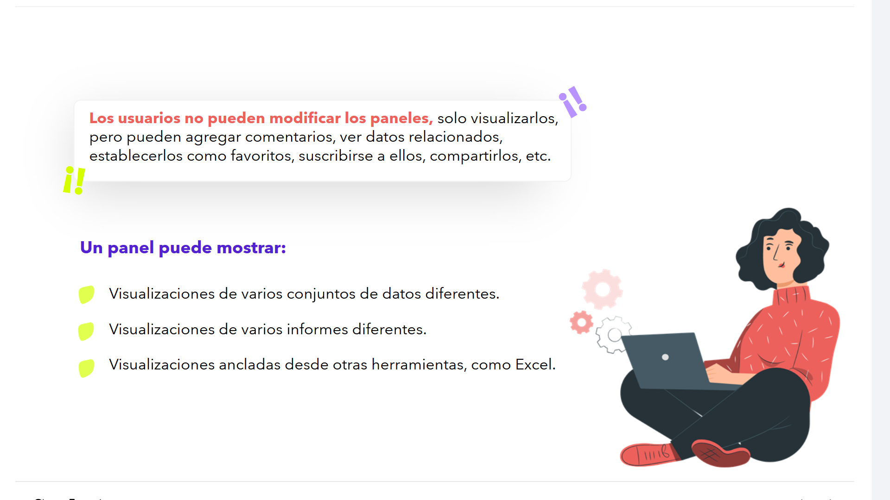

> **Los usuarios no pueden modificar los paneles**, solo visualizarlos, pero pueden agregar comentarios, ver datos relacionados, establecerlos como favoritos, suscribirse a ellos, compartirlos, etc.

**Un panel puede mostrar:**

* Visualizaciones de varios conjuntos de datos diferentes.
* Visualizaciones de varios informes diferentes.
* Visualizaciones ancladas desde otras herramientas, como Excel.

---

# Paneles Vs Informes

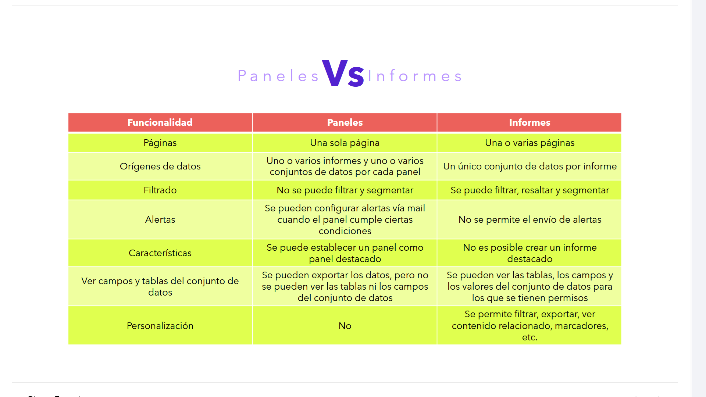

| Funcionalidad | Paneles | Informes |
| :--- | :--- | :--- |
| **Páginas** | Una sola página | Una o varias páginas |
| **Orígenes de datos** | Uno o varios informes y uno o varios conjuntos de datos por cada panel | Un único conjunto de datos por informe |
| **Filtrado** | No se puede filtrar y segmentar | Se puede filtrar, resaltar y segmentar |
| **Alertas** | Se pueden configurar alertas vía mail cuando el panel cumple ciertas condiciones | No se permite el envío de alertas |
| **Características** | Se puede establecer un panel como panel destacado | No es posible crear un informe destacado |
| **Ver campos y tablas del conjunto de datos** | Se pueden exportar los datos, pero no se pueden ver las tablas ni los campos del conjunto de datos | Se pueden ver las tablas, los campos y los valores del conjunto de datos para los que se tienen permisos |
| **Personalización** | No | Se permite filtrar, exportar, ver contenido relacionado, marcadores, etc. |

---

### APLICACIONES

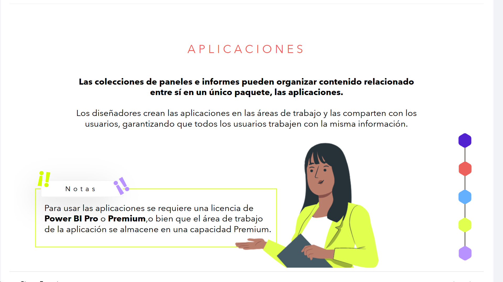

**Las colecciones de paneles e informes pueden organizar contenido relacionado entre sí en un único paquete, las aplicaciones.**

Los diseñadores crean las aplicaciones en las áreas de trabajo y las comparten con los usuarios, garantizando que todos los usuarios trabajen con la misma información.

> **Notas**
> Para usar las aplicaciones se requiere una licencia de **Power BI Pro** o **Premium**, o bien que el área de trabajo de la aplicación se almacene en una capacidad Premium.

---

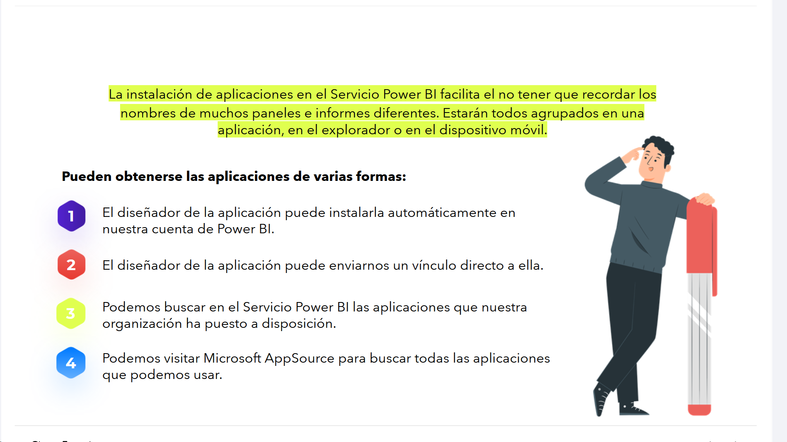

La instalación de aplicaciones en el Servicio Power BI facilita el no tener que recordar los nombres de muchos paneles e informes diferentes. Estarán todos agrupados en una aplicación, en el explorador o en el dispositivo móvil.

**Pueden obtenerse las aplicaciones de varias formas:**

1. El diseñador de la aplicación puede instalarla automáticamente en nuestra cuenta de Power BI.
2. El diseñador de la aplicación puede enviarnos un vínculo directo a ella.
3. Podemos buscar en el Servicio Power BI las aplicaciones que nuestra organización ha puesto a disposición.
4. Podemos visitar Microsoft AppSource para buscar todas las aplicaciones que podemos usar.

---

# Recuerda...

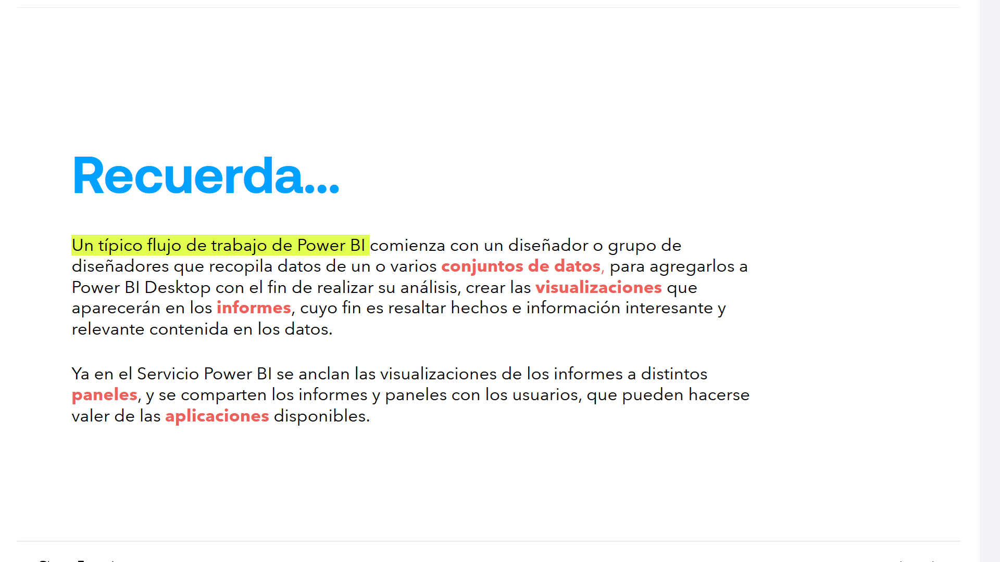

Un típico flujo de trabajo de Power BI comienza con un diseñador o grupo de diseñadores que recopila datos de un o varios **conjuntos de datos**, para agregarlos a Power BI Desktop con el fin de realizar su análisis, crear las **visualizaciones** que aparecerán en los **informes**, cuyo fin es resaltar hechos e información interesante y relevante contenida en los datos.

Ya en el Servicio Power BI se anclan las visualizaciones de los informes a distintos **paneles**, y se comparten los informes y paneles con los usuarios, que pueden hacerse valer de las **aplicaciones** disponibles.

---

# Uso del servicio Power BI

### Uso compartido de los resultados

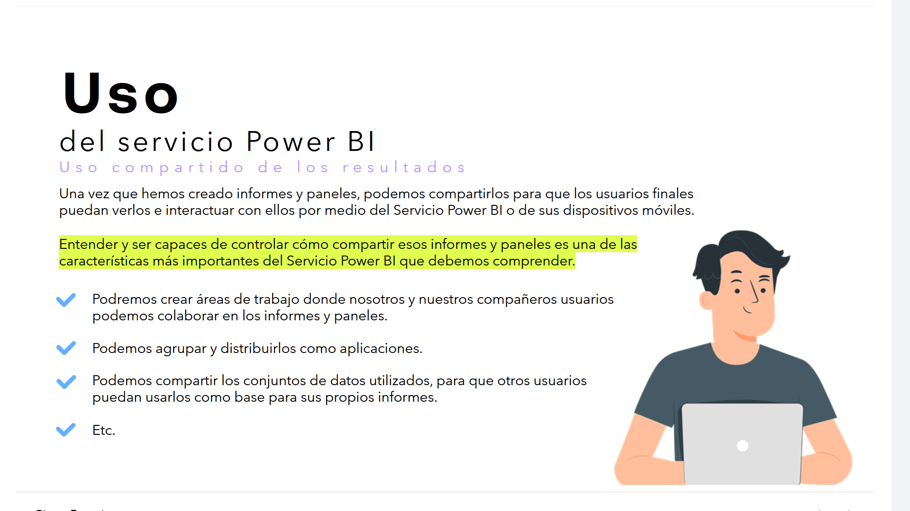
Una vez que hemos creado informes y paneles, podemos compartirlos para que los usuarios finales puedan verlos e interactuar con ellos por medio del Servicio Power BI o de sus dispositivos móviles.

**Entender y ser capaces de controlar cómo compartir esos informes y paneles es una de las características más importantes del Servicio Power BI que debemos comprender.**

* Podremos crear áreas de trabajo donde nosotros y nuestros compañeros usuarios podemos colaborar en los informes y paneles.
* Podemos agrupar y distribuirlos como aplicaciones.
* Podemos compartir los conjuntos de datos utilizados, para que otros usuarios puedan usarlos como base para sus propios informes.
* Etc.

---