# 08-005:	Interfaz de PowerBI

## Entorno del **Servicio Power BI**

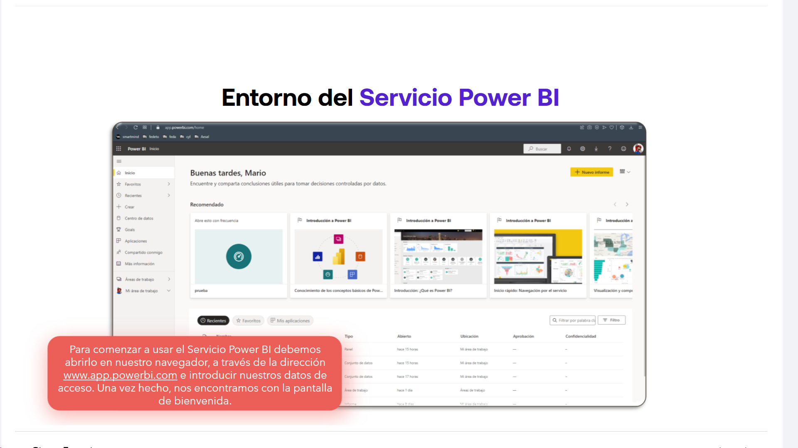

Para comenzar a usar el Servicio Power BI debemos abrirlo en nuestro navegador, a través de la dirección **www.app.powerbi.com** e introducir nuestros datos de acceso. Una vez hecho, nos encontramos con la pantalla de bienvenida.

---

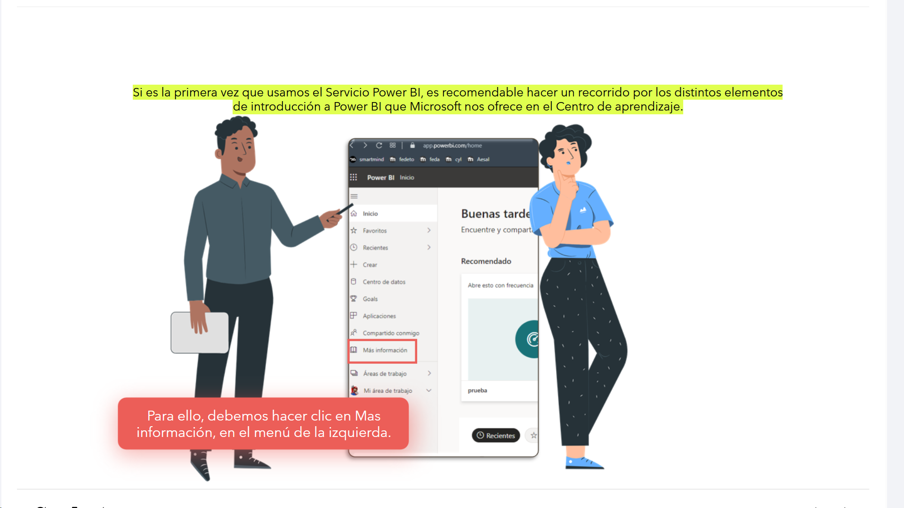

Si es la primera vez que usamos el Servicio Power BI, es recomendable hacer un recorrido por los distintos elementos de introducción a Power BI que Microsoft nos ofrece en el Centro de aprendizaje.

> Para ello, debemos hacer clic en **Más información**, en el menú de la izquierda.

---

### El centro de aprendizaje

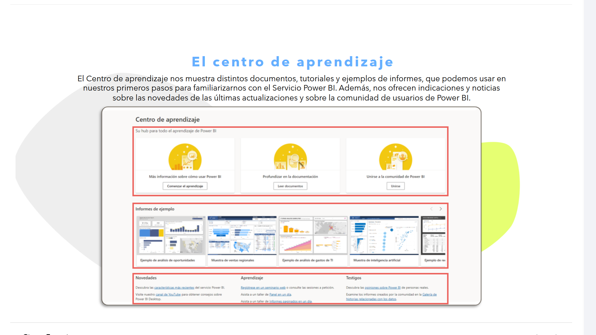

El Centro de aprendizaje nos muestra distintos documentos, tutoriales y ejemplos de informes, que podemos usar en nuestros primeros pasos para familiarizarnos con el Servicio Power BI. Además, nos ofrecen indicaciones y noticias sobre las novedades de las últimas actualizaciones y sobre la comunidad de usuarios de Power BI.

---

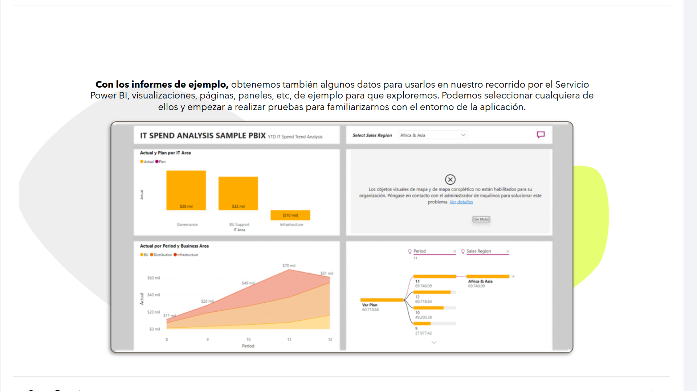

**Con los informes de ejemplo**, obtenemos también algunos datos para usarlos en nuestro recorrido por el Servicio Power BI, visualizaciones, páginas, paneles, etc., de ejemplo para que exploremos. Podemos seleccionar cualquiera de ellos y empezar a realizar pruebas para familiarizarnos con el entorno de la aplicación.

---

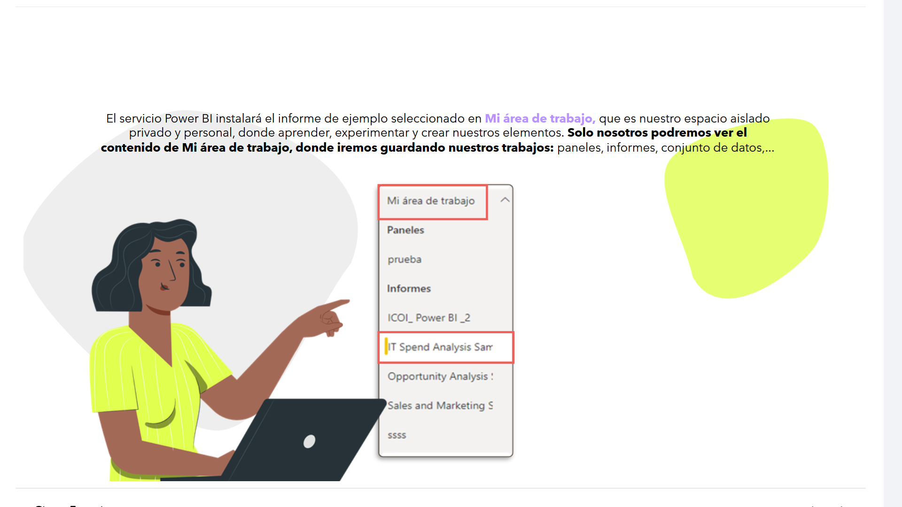

El servicio Power BI instalará el informe de ejemplo seleccionado en **Mi área de trabajo**, que es nuestro espacio aislado privado y personal, donde aprender, experimentar y crear nuestros elementos. **Solo nosotros podremos ver el contenido de Mi área de trabajo, donde iremos guardando nuestros trabajos:** paneles, informes, conjunto de datos...

---

## La interface de usuario del servicio Power BI

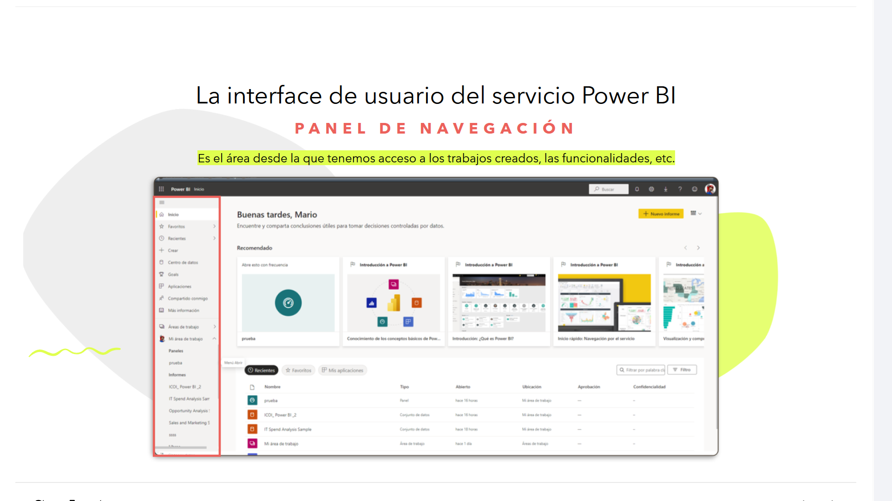

## PANEL DE NAVEGACIÓN

Es el área desde la que tenemos acceso a los trabajos creados, las funcionalidades, etc.

---

### Inicio

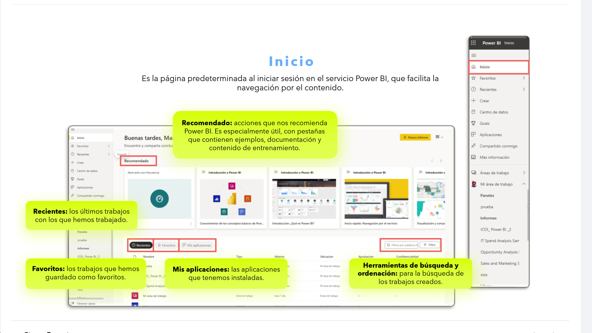

Es la página predeterminada al iniciar sesión en el servicio Power BI, que facilita la navegación por el contenido.

* **Recomendado:** acciones que nos recomienda Power BI. Es especialmente útil, con pestañas que contienen ejemplos, documentación y contenido de entrenamiento.
* **Recientes:** los últimos trabajos con los que hemos trabajado.
* **Favoritos:** los trabajos que hemos guardado como favoritos.
* **Mis aplicaciones:** las aplicaciones que tenemos instaladas.
* **Herramientas de búsqueda y ordenación:** para la búsqueda de los trabajos creados.

---

### Favoritos y recientes

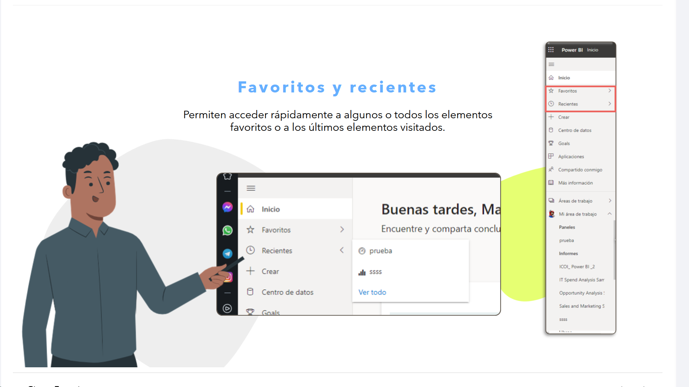

Permiten acceder rápidamente a algunos o todos los elementos favoritos o a los últimos elementos visitados.

---

### Crear y Centro de datos

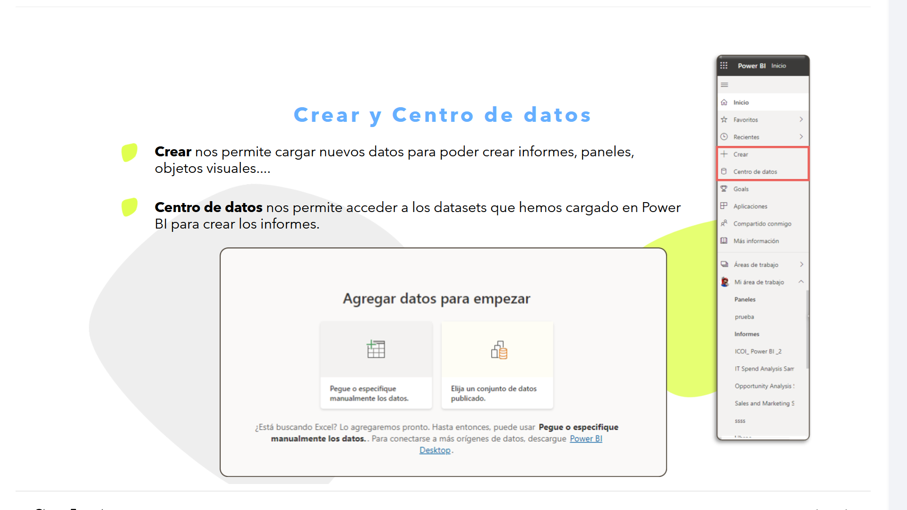

* **Crear** nos permite cargar nuevos datos para poder crear informes, paneles, objetos visuales....
* **Centro de datos** nos permite acceder a los datasets que hemos cargado en Power BI para crear los informes.

---

### Goals

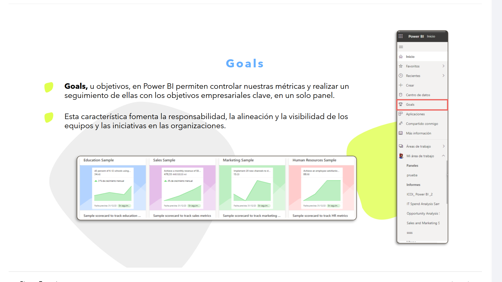

**Goals**, u objetivos, en Power BI permiten controlar nuestras métricas y realizar un seguimiento de ellas con los objetivos empresariales clave, en un solo panel.

Esta característica fomenta la responsabilidad, la alineación y la visibilidad de los equipos y las iniciativas en las organizaciones.

---

### Aplicaciones

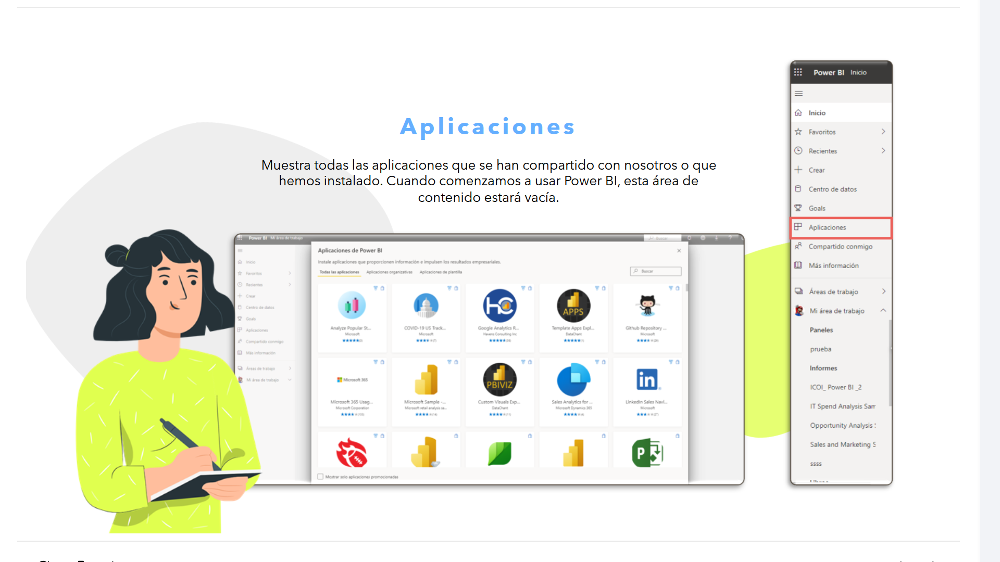

Muestra todas las aplicaciones que se han compartido con nosotros o que hemos instalado. Cuando comenzamos a usar Power BI, esta área de contenido estará vacía.

---

### Compartido conmigo

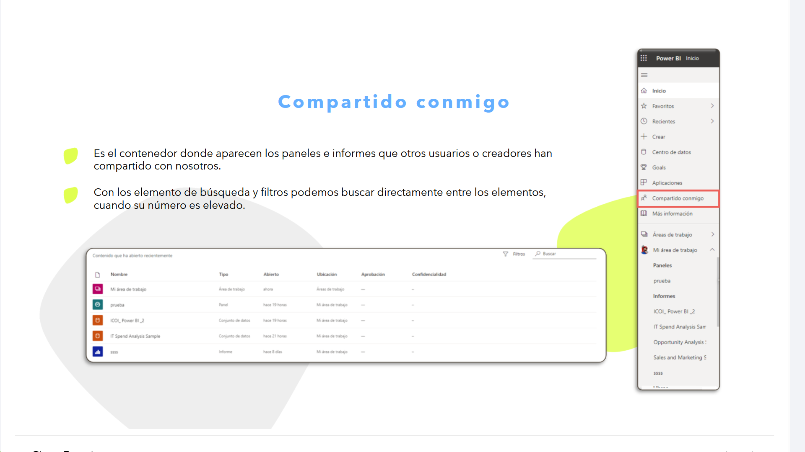

Es el contenedor donde aparecen los paneles e informes que otros usuarios o creadores han compartido con nosotros.

Con los elemento de búsqueda y filtros podemos buscar directamente entre los elementos, cuando su número es elevado.

---

### Las áreas de trabajo

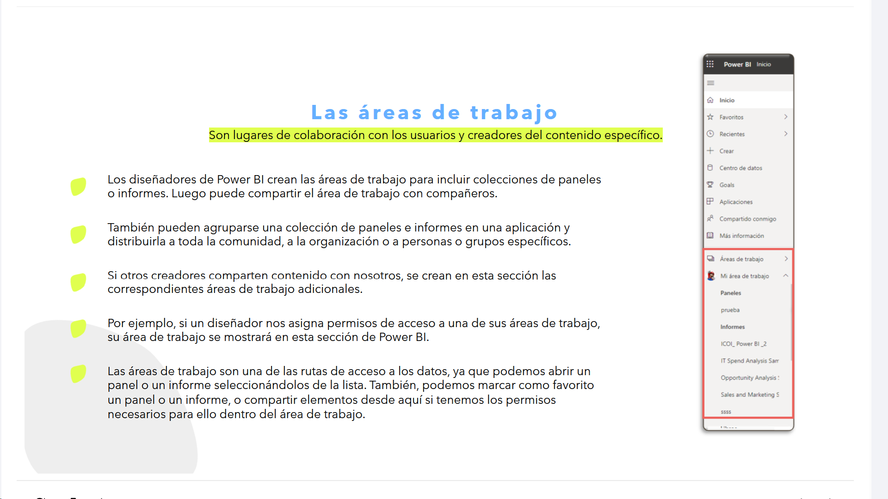

**Son lugares de colaboración con los usuarios y creadores del contenido específico.**

Los diseñadores de Power BI crean las áreas de trabajo para incluir colecciones de paneles o informes. Luego puede compartir el área de trabajo con compañeros.

También pueden agruparse una colección de paneles e informes en una aplicación y distribuirla a toda la comunidad, a la organización o a personas o grupos específicos.

Si otros creadores comparten contenido con nosotros, se crean en esta sección las correspondientes áreas de trabajo adicionales.

Por ejemplo, si un diseñador nos asigna permisos de acceso a una de sus áreas de trabajo, su área de trabajo se mostrará en esta sección de Power BI.

Las áreas de trabajo son una de las rutas de acceso a los datos, ya que podemos abrir un panel o un informe seleccionándolos de la lista. También, podemos marcar como favorito un panel o un informe, o compartir elementos desde aquí si tenemos los permisos necesarios para ello dentro del área de trabajo.

---

### Mi área de trabajo

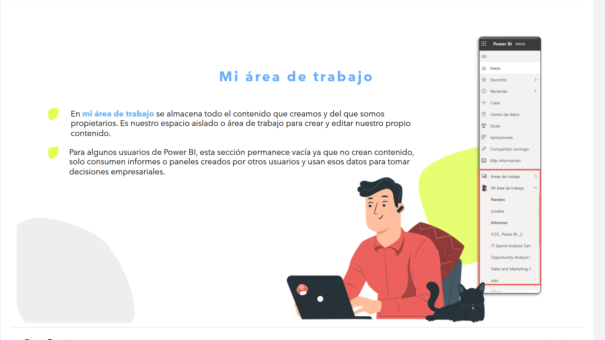

En **mi área de trabajo** se almacena todo el contenido que creamos y del que somos propietarios. Es nuestro espacio aislado o área de trabajo para crear y editar nuestro propio contenido.

Para algunos usuarios de Power BI, esta sección permanece vacía ya que no crean contenido, solo consumen informes o paneles creados por otros usuarios y usan esos datos para tomar decisiones empresariales.

---

### Lienzo y botones

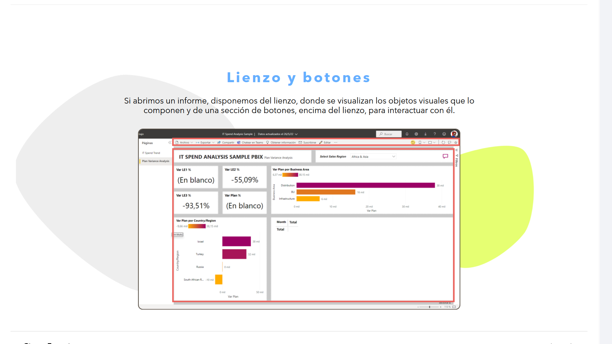

Si abrimos un informe, disponemos del lienzo, donde se visualizan los objetos visuales que lo componen y de una sección de botones, encima del lienzo, para interactuar con él.

---

### Preguntas y respuestas

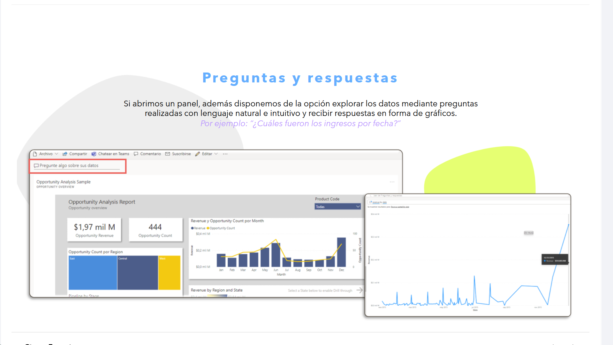

Si abrimos un panel, además disponemos de la opción explorar los datos mediante preguntas realizadas con lenguaje natural e intuitivo y recibir respuestas en forma de gráficos.

*Por ejemplo: "¿Cuáles fueron los ingresos por fecha?"*

---

### Buscar y ordenar contenido

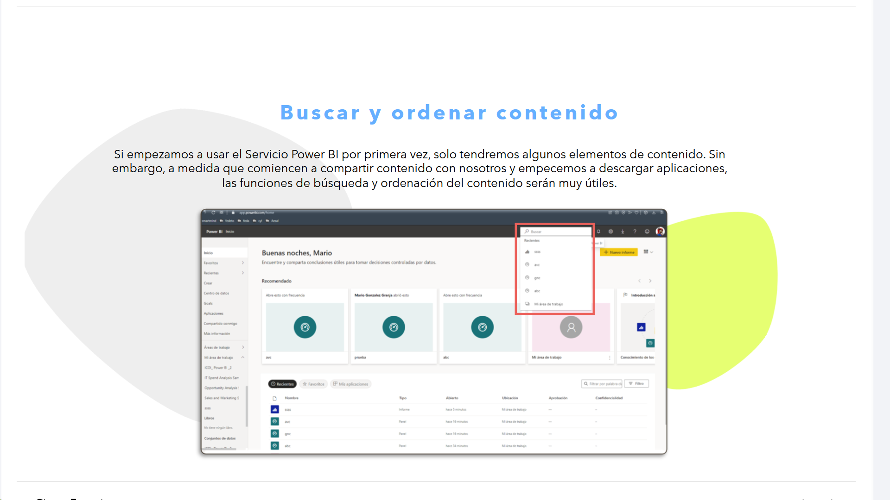

Si empezamos a usar el Servicio Power BI por primera vez, solo tendremos algunos elementos de contenido. Sin embargo, a medida que comiencen a compartir contenido con nosotros y empecemos a descargar aplicaciones, las funciones de búsqueda y ordenación del contenido serán muy útiles.

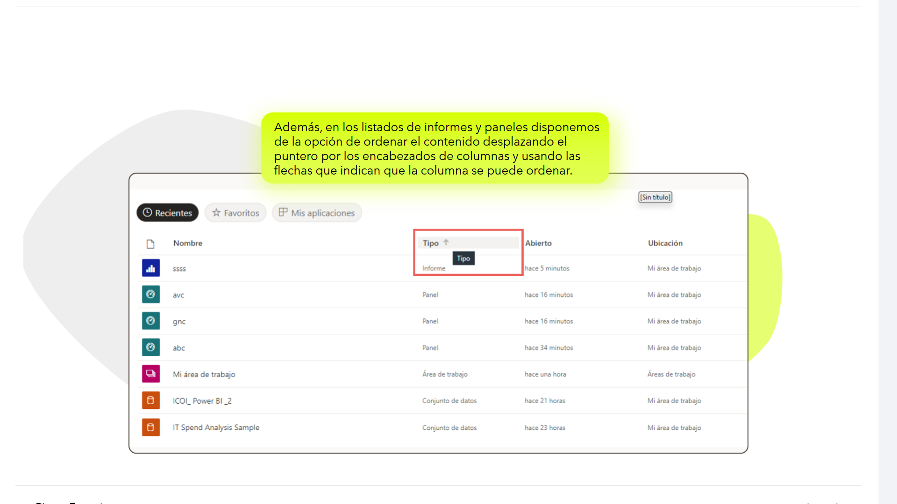

Además, en los listados de informes y paneles disponemos de la opción de ordenar el contenido desplazando el puntero por los encabezados de columnas y usando las flechas que indican que la columna se puede ordenar.

---

### Los paneles

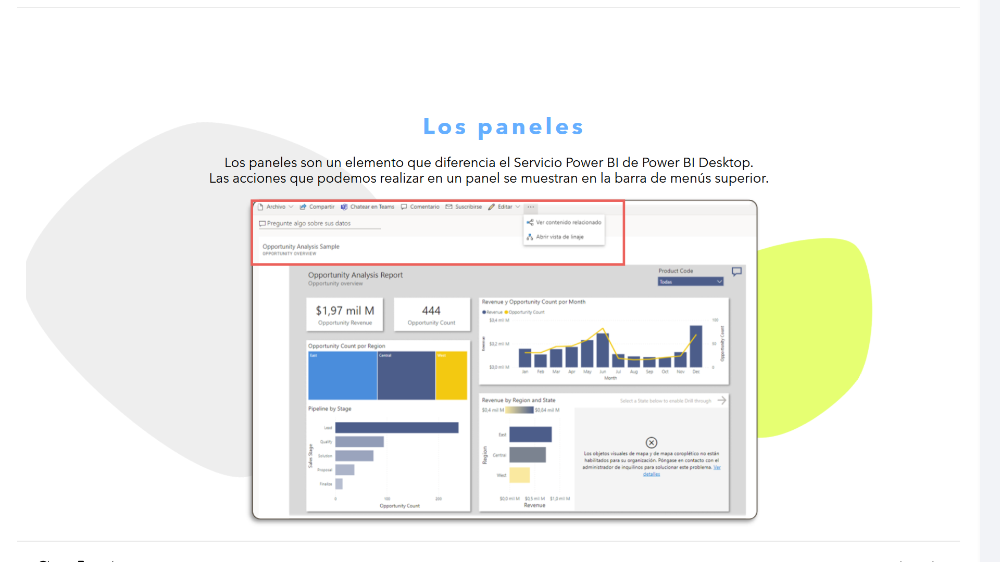

Los paneles son un elemento que diferencia el Servicio Power BI de Power BI Desktop.
Las acciones que podemos realizar en un panel se muestran en la barra de menús superior.

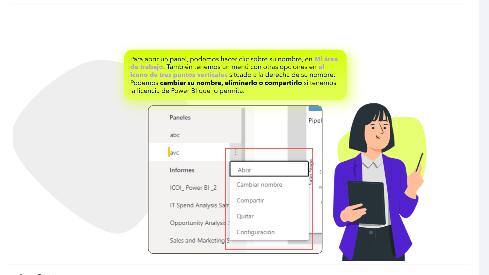

Para abrir un panel, podemos hacer clic sobre su nombre, en **Mi área de trabajo**. También tenemos un menú con otras opciones en **el icono de tres puntos verticales** situado a la derecha de su nombre. Podemos **cambiar su nombre, eliminarlo o compartirlo** si tenemos la licencia de Power BI que lo permita.

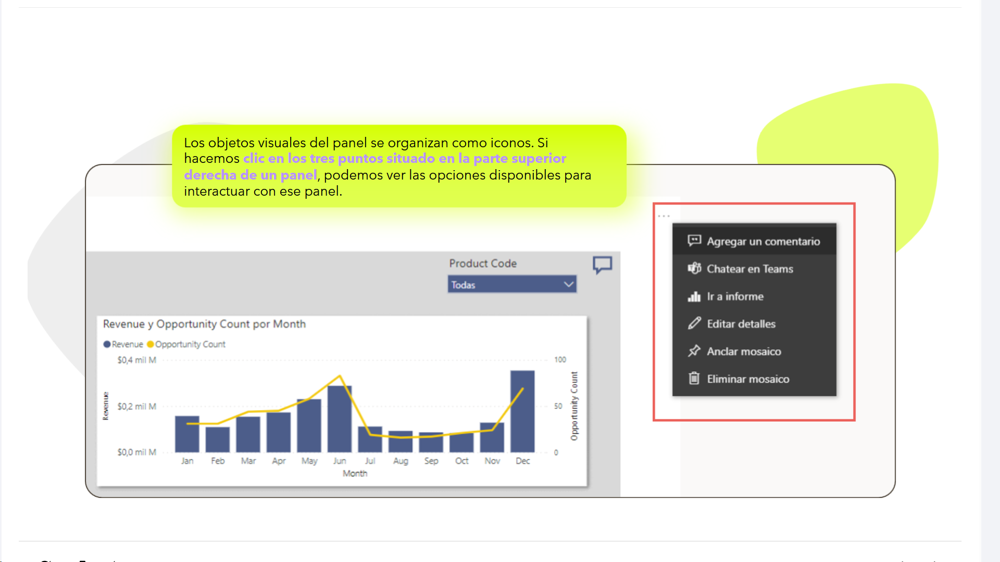

Los objetos visuales del panel se organizan como iconos. Si hacemos **clic en los tres puntos situado en la parte superior derecha de un panel**, podemos ver las opciones disponibles para interactuar con ese panel.

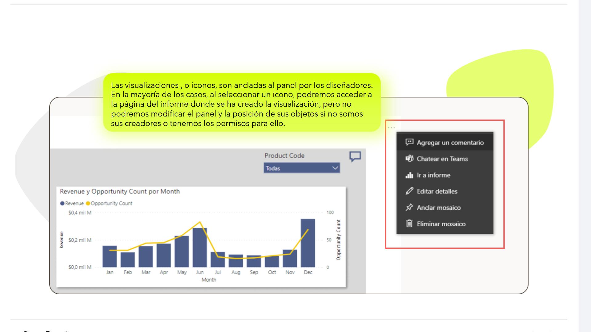

Las visualizaciones , o iconos, son ancladas al panel por los diseñadores. En la mayoría de los casos, al seleccionar un icono, podremos acceder a la página del informe donde se ha creado la visualización, pero no podremos modificar el panel y la posición de sus objetos si no somos sus creadores o tenemos los permisos para ello.

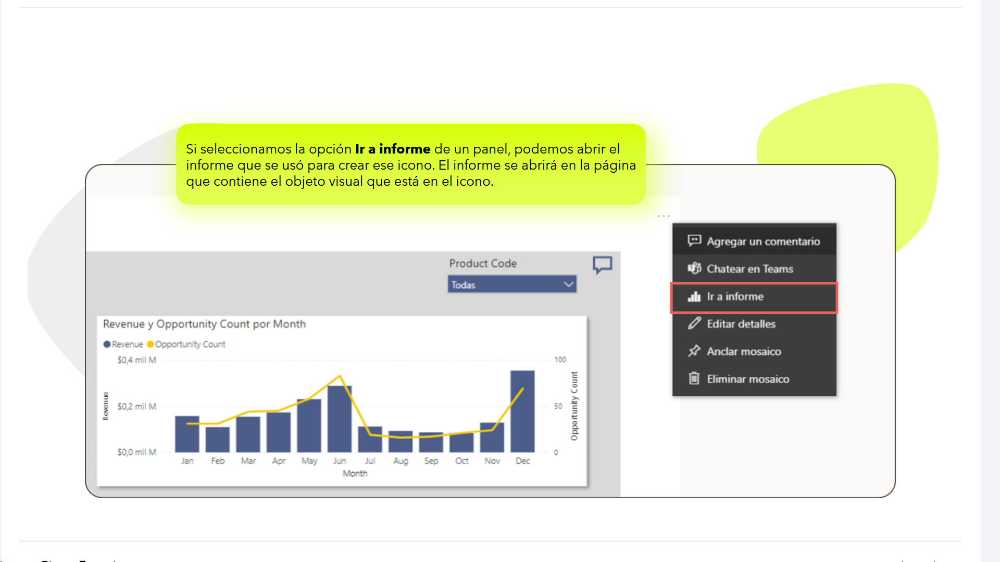

Si seleccionamos la opción **Ir a informe** de un panel, podemos abrir el informe que se usó para crear ese icono. El informe se abrirá en la página que contiene el objeto visual que está en el icono.

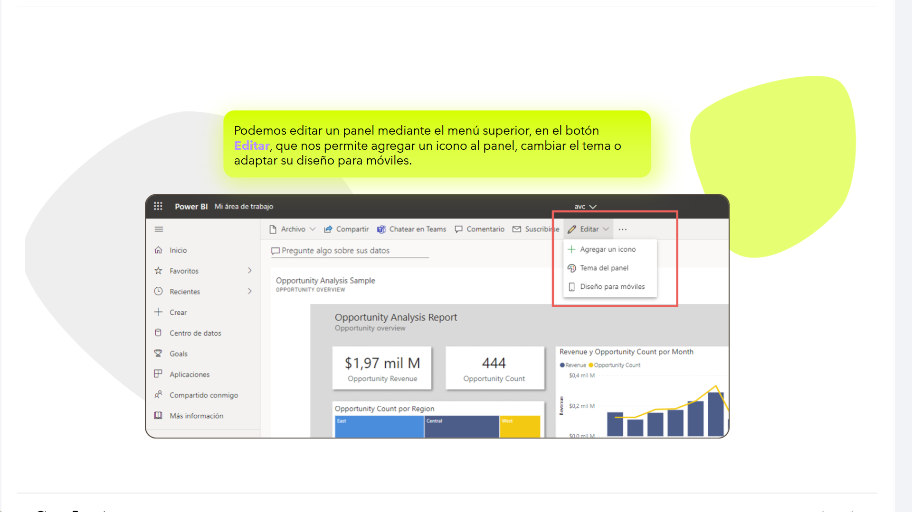

Podemos editar un panel mediante el menú superior, en el botón **Editar**, que nos permite agregar un icono al panel, cambiar el tema o adaptar su diseño para móviles.

---

### Los informes

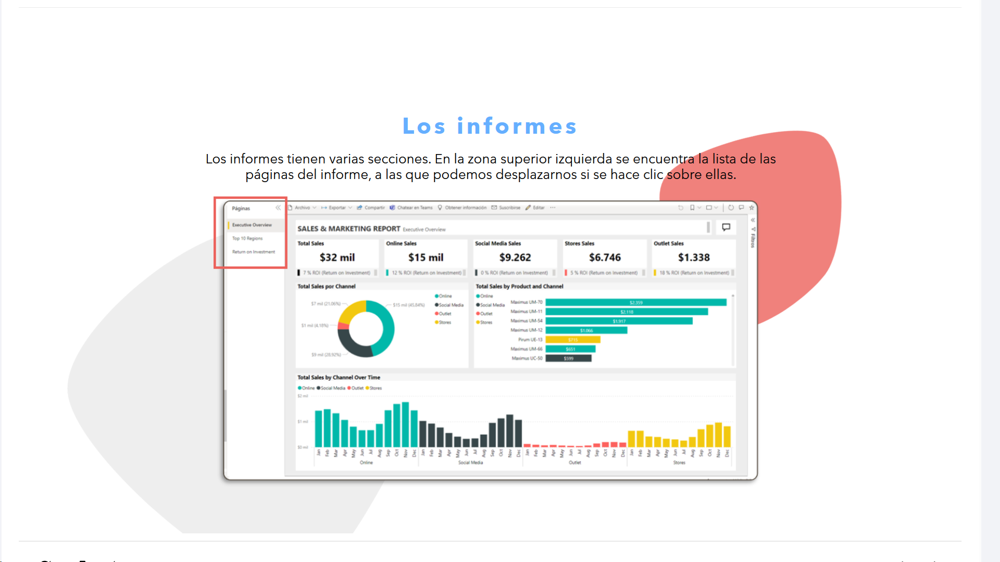

Los informes tienen varias secciones. En la zona superior izquierda se encuentra la lista de las páginas del informe, a las que podemos desplazarnos si se hace clic sobre ellas.

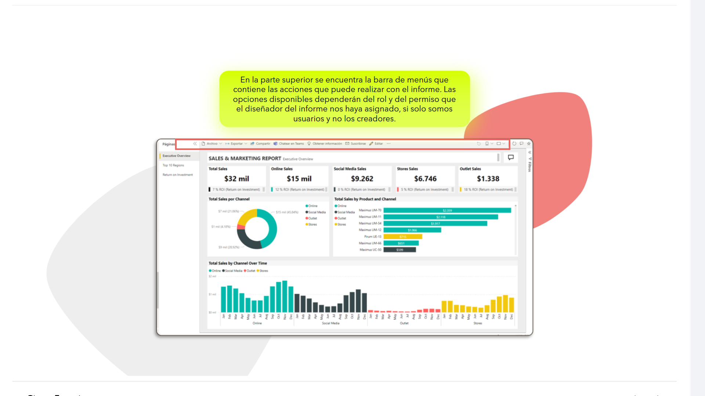

En la parte superior se encuentra la barra de menús que contiene las acciones que puede realizar con el informe. Las opciones disponibles dependerán del rol y del permiso que el diseñador del informe nos haya asignado, si solo somos usuarios y no los creadores.

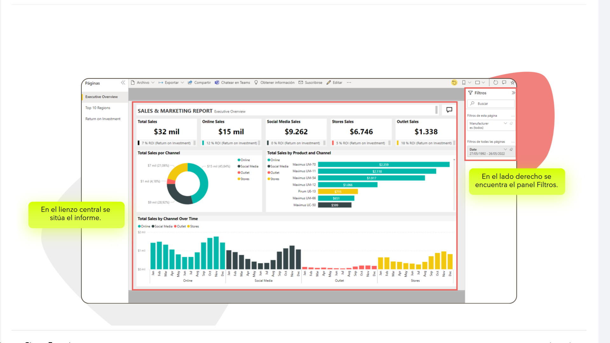

En el lienzo central se sitúa el informe. En el lado derecho se encuentra el panel Filtros.

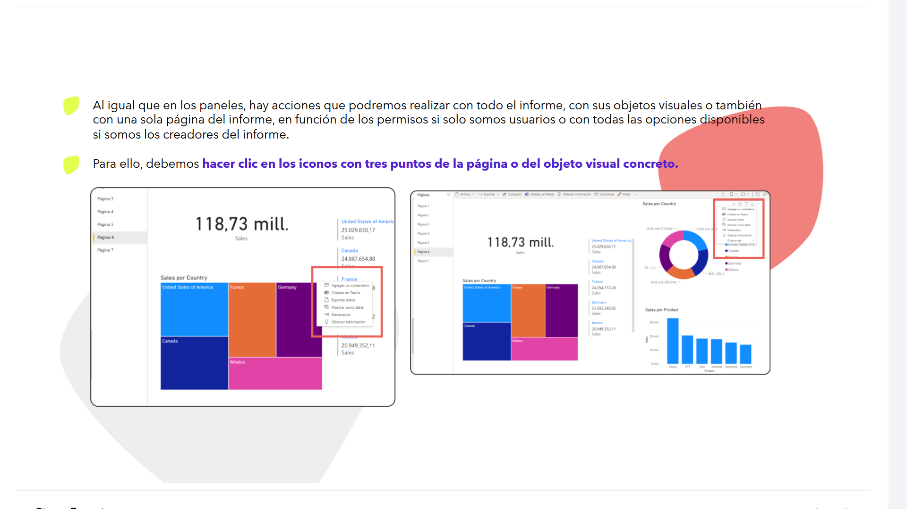

Al igual que en los paneles, hay acciones que podremos realizar con todo el informe, con sus objetos visuales o también con una sola página del informe, en función de los permisos si solo somos usuarios o con todas las opciones disponibles si somos los creadores del informe.

Para ello, debemos **hacer clic en los iconos con tres puntos de la página o del objeto visual concreto.**

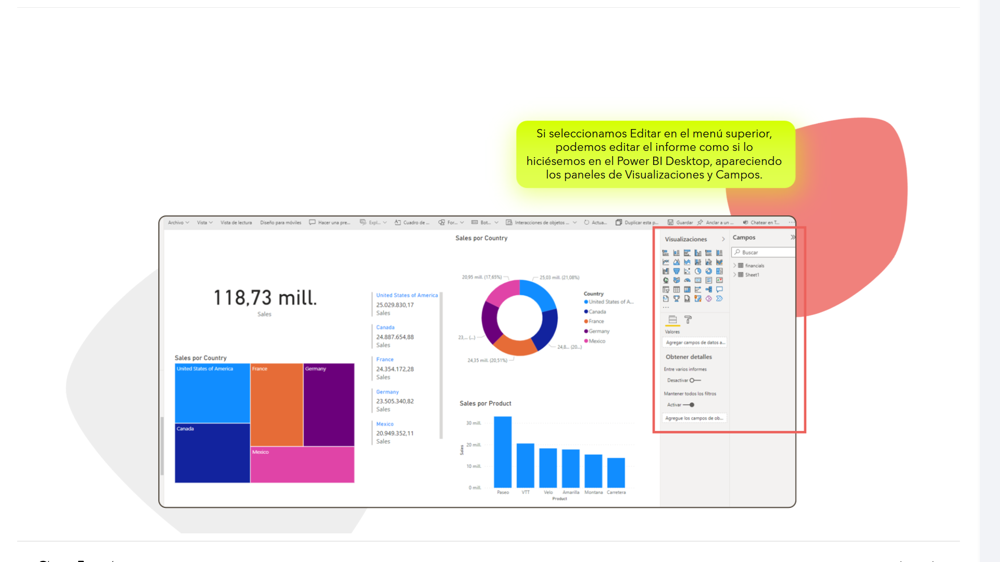

Si seleccionamos Editar en el menú superior, podemos editar el informe como si lo hiciésemos en el Power BI Desktop, apareciendo los paneles de Visualizaciones y Campos.

---

## Crear paneles a partir de los informes

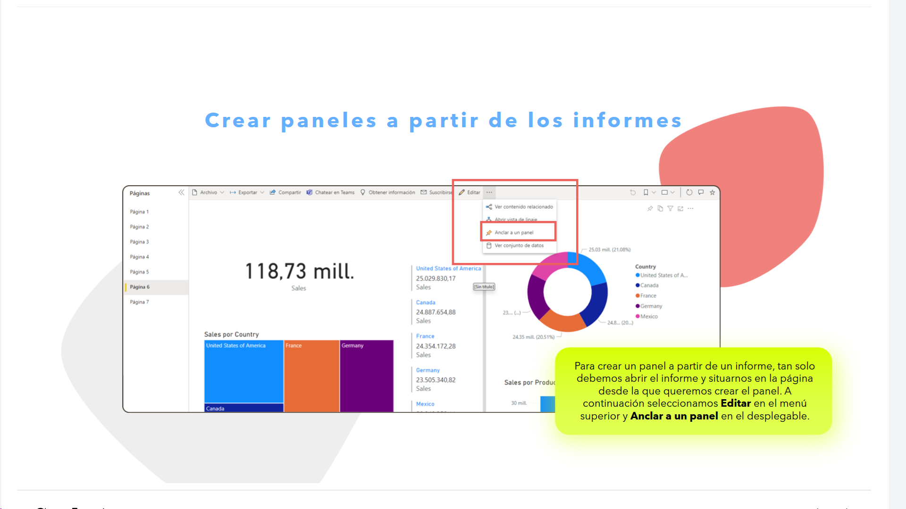

Para crear un panel a partir de un informe, tan solo debemos abrir el informe y situarnos en la página desde la que queremos crear el panel. A continuación seleccionamos **Editar** en el menú superior y **Anclar a un panel** en el desplegable.

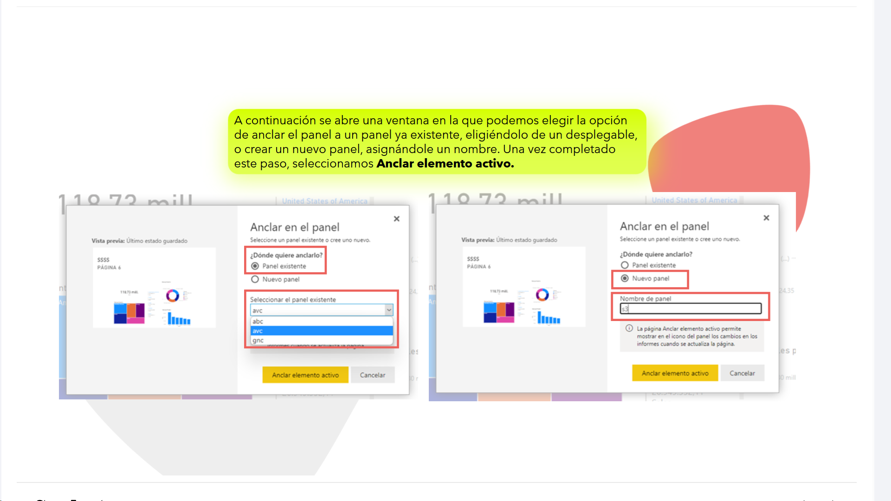

A continuación se abre una ventana en la que podemos elegir la opción de anclar el panel a un panel ya existente, eligiéndolo de un desplegable, o crear un nuevo panel, asignándole un nombre. Una vez completado este paso, seleccionamos **Anclar elemento activo**.

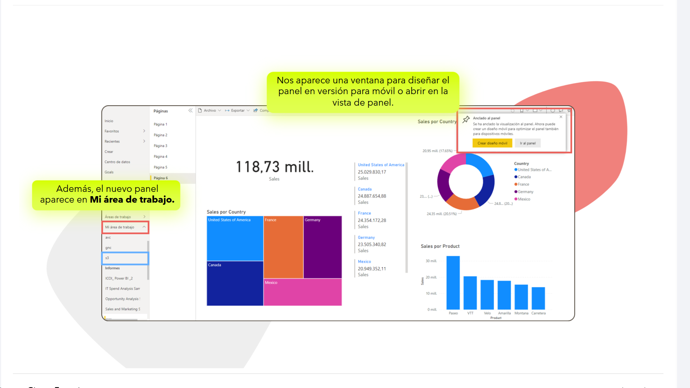

Nos aparece una ventana para diseñar el panel en versión para móvil o abrir en la vista de panel.

Además, el nuevo panel aparece en **Mi área de trabajo**.