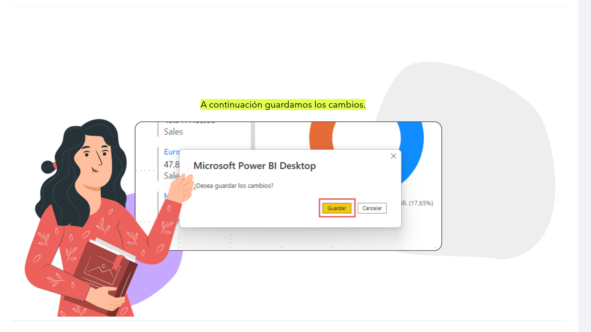
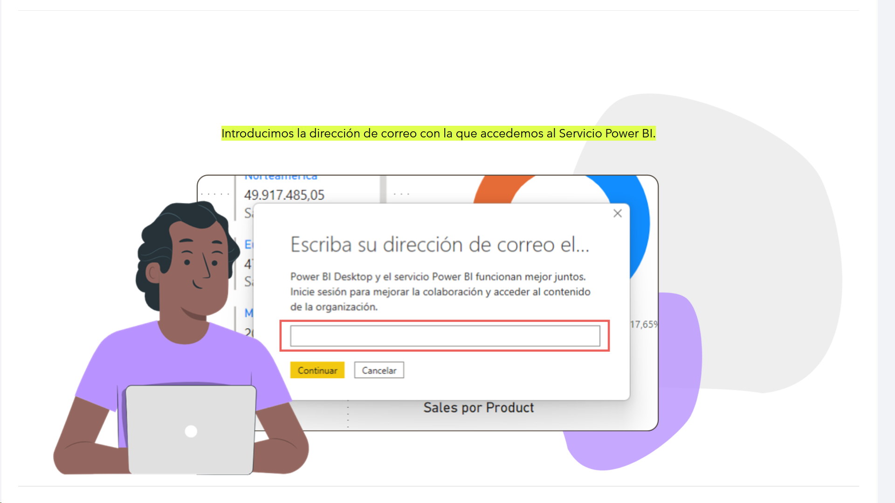
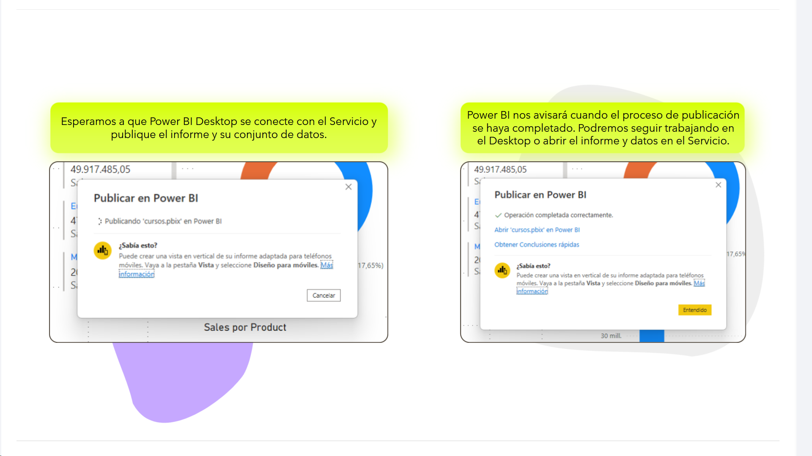
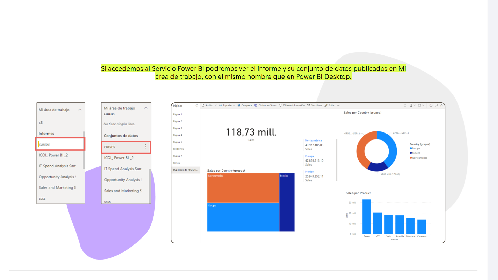
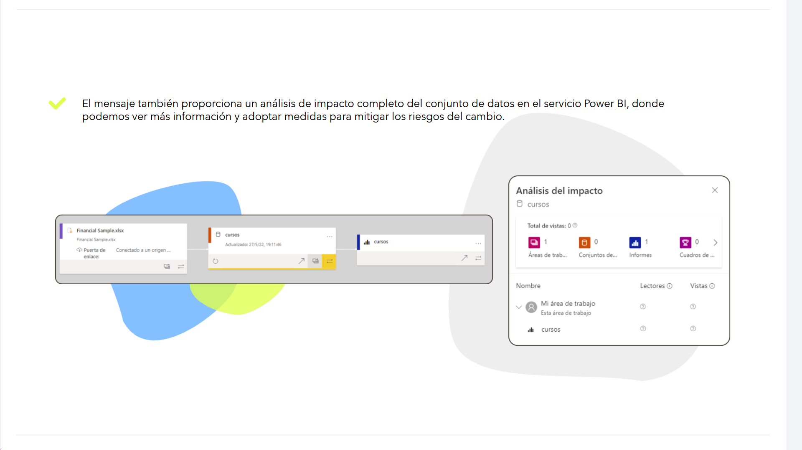

# 08-006:	Publicar Informes/Conjuntos de datos

Al publicar un archivo de Power BI Desktop en el Servicio Power BI, se publican los datos del modelo en el área de trabajo de Servicio Power BI. Lo mismo sucede con los informes creados en la vista Informes. Una vez publicados, podremos ver el nuevo conjunto de datos y los informes, con el mismo nombre, en *Mi área de trabajo*.

La publicación de conjuntos de datos e informes desde Power BI Desktop tiene el mismo efecto que usar *Obtener datos* en Power BI para conectar y cargar un archivo de Power BI Desktop.

---

## Pasos para publicar conjuntos de datos e informes

En Power BI Desktop nos situamos, con el informe que queremos publicar abierto, en el menú **Inicio** y seleccionamos **Publicar**.

A continuación guardamos los cambios.

Introducimos la dirección de correo con la que accedemos al Servicio Power BI.

Seleccionamos el destino, dentro de Servicio Power BI. Lo recomendable es seleccionar Mi área de trabajo.

Esperamos a que Power BI Desktop se conecte con el Servicio y publique el informe y su conjunto de datos.  

Power BI nos avisará cuando el proceso de publicación se haya completado. Podremos seguir trabajando en el Desktop o abrir el informe y datos en el Servicio.  

Si accedemos al Servicio Power BI podremos ver el informe y su conjunto de datos publicados en Mi área de trabajo, con el mismo nombre que en Power BI Desktop.

---

PUBLICAR CONJUNTOS DE DATOS E INFORMES ES UN PROCESO SENCILLO, PERO DEBEMOS TENER EN CUENTA LAS SIGUIENTES CONDICIONES:  

* Cuando volvamos a publicar el archivo de Power BI Desktop, el conjunto de datos del Servicio Power BI se reemplazará por el conjunto de datos actualizado desde el archivo de Power BI Desktop.
* Antes de publicar un nuevo archivo desde Power BI Desktop debemos asegurarnos que no tenemos ya publicado un archivo con el mismo nombre, ya que puede ser errónea la publicación o reescribirse sobre el archivo ya publicado, perdiendo la información contenida.
* Si cambiamos el nombre o eliminamos una columna o medida en el Desktop, las visualizaciones que ya tengamos en el Servicio Power BI con ese campo podrían interrumpirse.
* El Servicio Power BI omite los cambios de formato de las columnas existentes en el Desktop.
* Si tenemos una programación de actualización configurada para el conjunto de datos existente en Servicio Power BI, al agregar nuevos orígenes de datos al archivo en el Desktop y volver a publicarlo, tendremos que iniciar sesión en estos antes de la siguiente actualización programada.
* Si volvemos a publicar un conjunto de datos publicado antes desde Power BI Desktop y se define una programación de actualización, se inicia una actualización del conjunto de datos en cuanto se vuelve a publicar.

ADEMÁS...

* Si realizamos un cambio en un conjunto de datos y luego volvemos a publicarlo, en un mensaje se nos mostrará el número de áreas de trabajo, informes y paneles potencialmente afectados por el cambio y se nos pedirá que confirmemos que queremos reemplazar el conjunto de datos publicado actual por el que ha modificado.

* El mensaje también proporciona un análisis de impacto completo del conjunto de datos en el servicio Power BI, donde podemos ver más información y adoptar medidas para mitigar los riesgos del cambio.

#### Recuerda...

**Aunque el uso habitual de Power BI tiene el siguiente flujo de actividad:**

1. Integrar datos en Power BI Desktop.
2. Modelar los datos.
3. Crear un informe.
4. Publicarlo en el Servicio Power BI.
5. Crear paneles.
6. Compartir los informes y paneles con otros usuarios.
7. Ver informes y paneles compartidos e interactuar con ellos en aplicaciones de Power BI Mobile, también se pueden crear informes directamente en el Servicio Power BI.