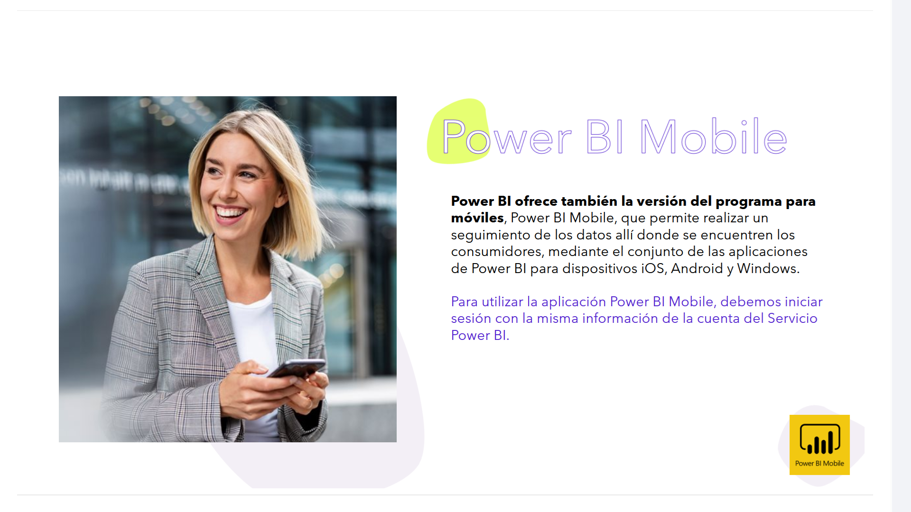
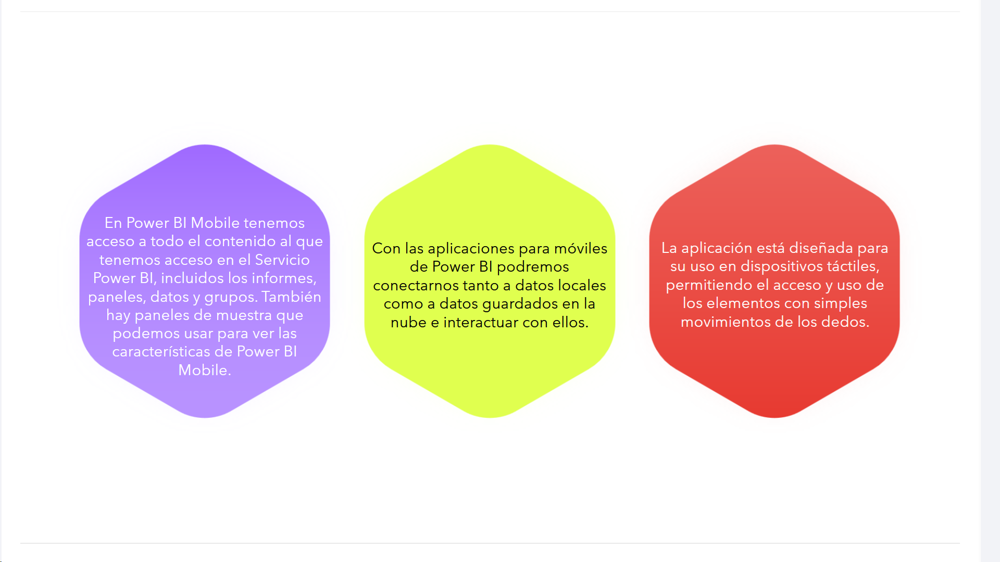
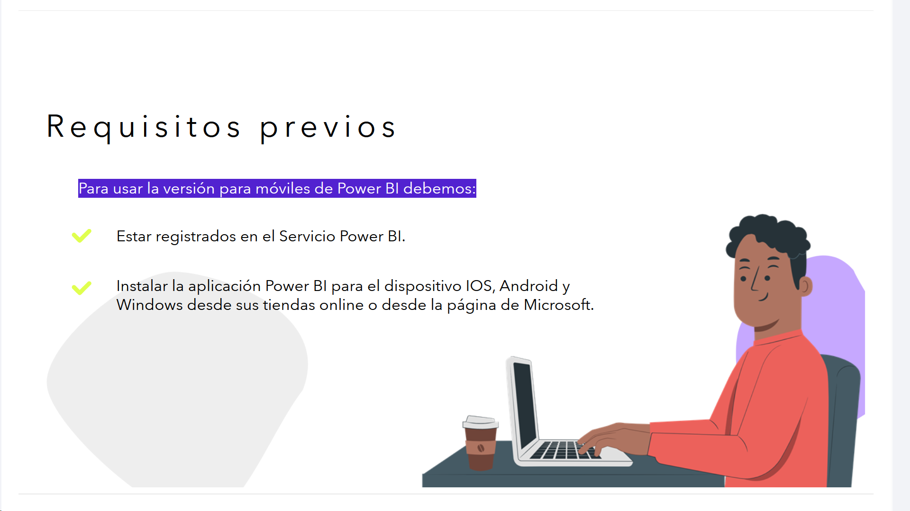
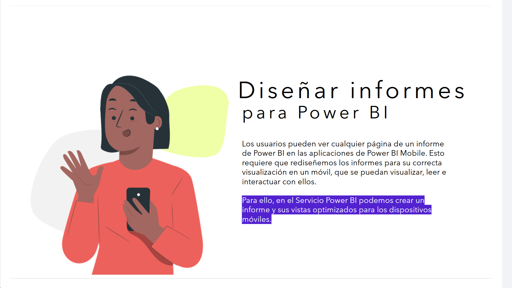
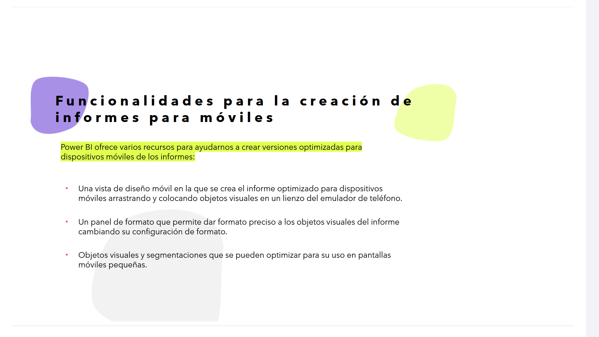

# 08-007:	PowerBI Mobile

**Power BI ofrece también la versión del programa para móviles**, Power BI Mobile, que permite realizar un seguimiento de los datos allí donde se encuentren los consumidores, mediante el conjunto de las aplicaciones de Power BI para dispositivos iOS, Android y Windows.  

Para utilizar la aplicación Power BI Mobile, debemos iniciar sesión con la misma información de la cuenta del Servicio Power BI.  

---

* En Power BI Mobile tenemos acceso a todo el contenido al que tenemos acceso en el Servicio Power BI, incluidos los informes, paneles, datos y grupos. También hay paneles de muestra que podemos usar para ver las características de Power BI Mobile.
* Con las aplicaciones para móviles de Power BI podremos conectarnos tanto a datos locales como a datos guardados en la nube e interactuar con ellos.
* La aplicación está diseñada para su uso en dispositivos táctiles, permitiendo el acceso y uso de los elementos con simples movimientos de los dedos.

---

### Requisitos previos

**Para usar la versión para móviles de Power BI debemos:**

* Estar registrados en el Servicio Power BI.
* Instalar la aplicación Power BI para el dispositivo IOS, Android y Windows desde sus tiendas online o desde la página de Microsoft.

---

## Diseñar informes para Power BI

Los usuarios pueden ver cualquier página de un informe de Power BI en las aplicaciones de Power BI Mobile. Esto requiere que rediseñemos los informes para su correcta visualización en un móvil, que se puedan visualizar, leer e interactuar con ellos.  

Para ello, en el Servicio Power BI podemos crear un informe y sus vistas optimizados para los dispositivos móviles.  

---

### Funcionalidades para la creación de informes para móviles

Power BI ofrece varios recursos para ayudarnos a crear versiones optimizadas para dispositivos móviles de los informes:  

* Una vista de diseño móvil en la que se crea el informe optimizado para dispositivos móviles arrastrando y colocando objetos visuales en un lienzo del emulador de teléfono.
* Un panel de formato que permite dar formato preciso a los objetos visuales del informe cambiando su configuración de formato.
* Objetos visuales y segmentaciones que se pueden optimizar para su uso en pantallas móviles pequeñas.

---

