# 08-008:	Diseñar informes para Power BI Mobile

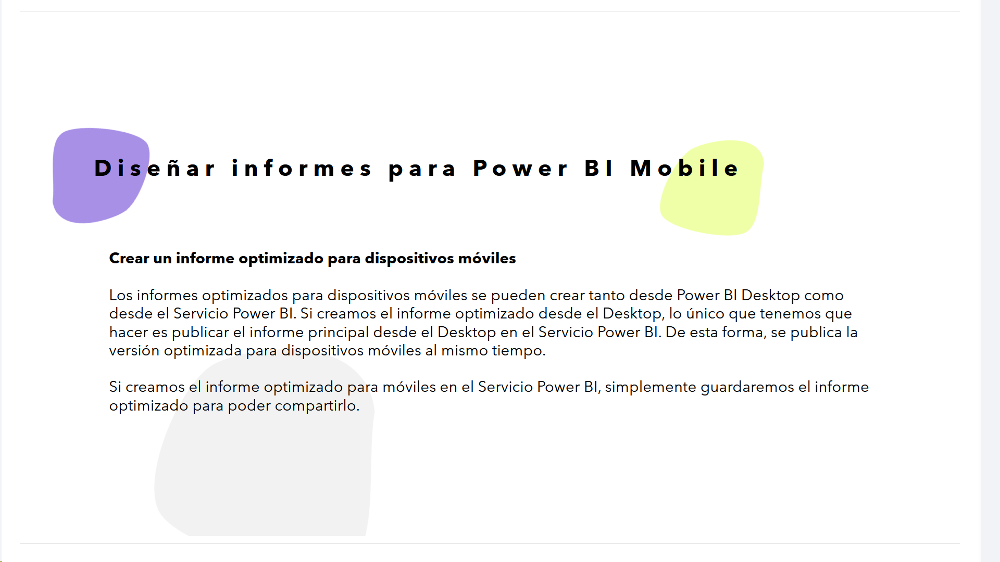

**Crear un informe optimizado para dispositivos móviles**

Los informes optimizados para dispositivos móviles se pueden crear tanto desde Power BI Desktop como desde el Servicio Power BI. Si creamos el informe optimizado desde el Desktop, lo único que tenemos que hacer es publicar el informe principal desde el Desktop en el Servicio Power BI. De esta forma, se publica la versión optimizada para dispositivos móviles al mismo tiempo.  

Si creamos el informe optimizado para móviles en el Servicio Power BI, simplemente guardaremos el informe optimizado para poder compartirlo.  

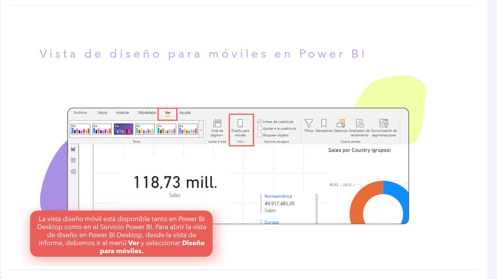

Vista de diseño para móviles en Power BI  

La vista diseño móvil está disponible tanto en Power BI Desktop como en el Servicio Power BI. Para abrir la vista de diseño en Power BI Desktop, desde la vista de informe, debemos ir al menú **Ver** y seleccionar **Diseño para móviles**.  

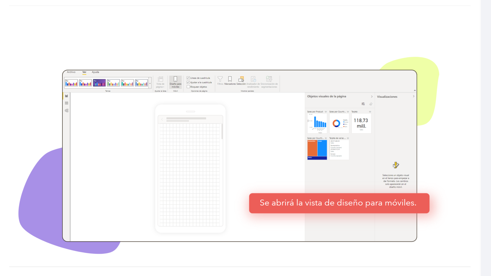

Se abrirá la vista de diseño para móviles.  

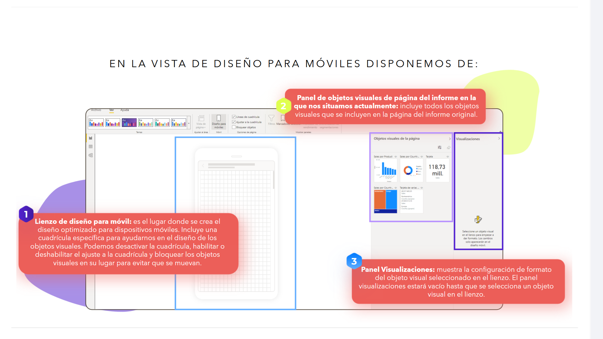
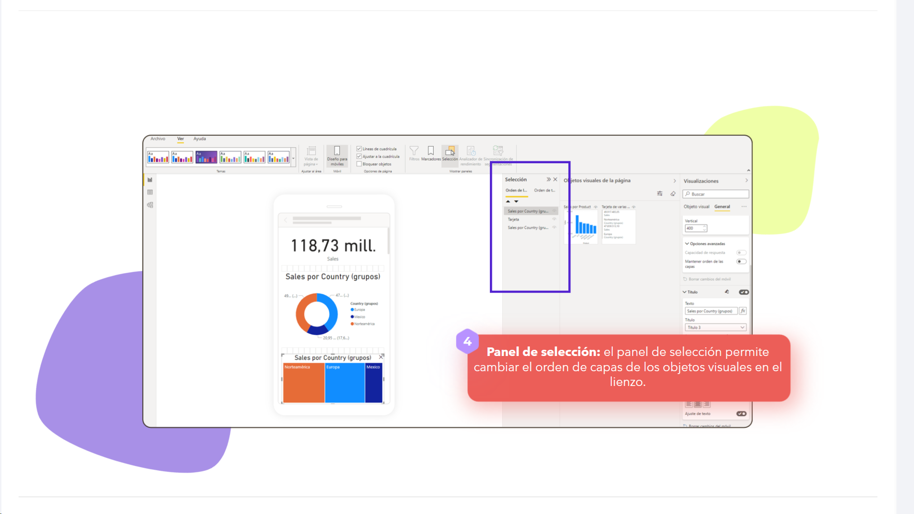
EN LA VISTA DE DISEÑO PARA MÓVILES DISPONEMOS DE:  

	1. 	**Lienzo de diseño para móvil:** es el lugar donde se crea el diseño optimizado para dispositivos móviles. Incluye una cuadrícula específica para ayudarnos en el diseño de los objetos visuales. Podemos desactivar la cuadrícula, habilitar o deshabilitar el ajuste a la cuadrícula y bloquear los objetos visuales en su lugar para evitar que se muevan.
	2. 	**Panel de objetos visuales de página del informe en la que nos situamos actualmente:** incluye todos los objetos visuales que se incluyen en la página del informe original.
	3. 	**Panel Visualizaciones:** muestra la configuración de formato del objeto visual seleccionado en el lienzo. El panel visualizaciones estará vacío hasta que se selecciona un objeto visual en el lienzo.
	4. 	**Panel de selección:** el panel de selección permite cambiar el orden de capas de los objetos visuales en el lienzo.

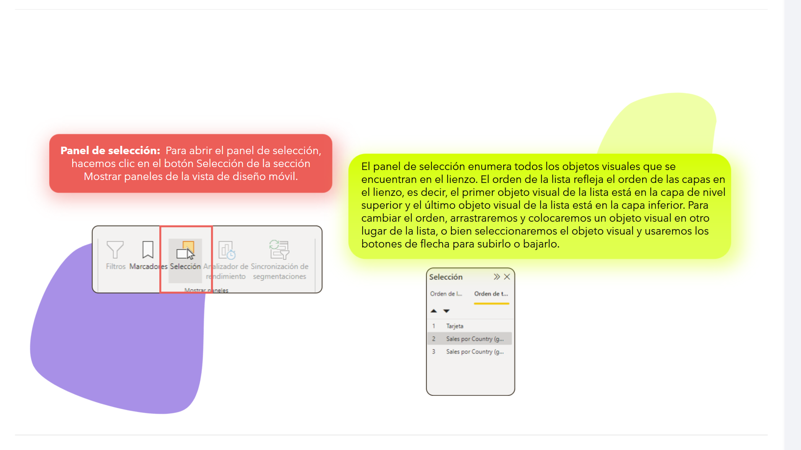

**Panel de selección:** Para abrir el panel de selección, hacemos clic en el botón Selección de la sección Mostrar paneles de la vista de diseño móvil.  

El panel de selección enumera todos los objetos visuales que se encuentran en el lienzo. El orden de la lista refleja el orden de las capas en el lienzo, es decir, el primer objeto visual de la lista está en la capa de nivel superior y el último objeto visual de la lista está en la capa inferior. Para cambiar el orden, arrastraremos y colocaremos un objeto visual en otro lugar de la lista, o bien seleccionaremos el objeto visual y usaremos los botones de flecha para subirlo o bajarlo.  

---

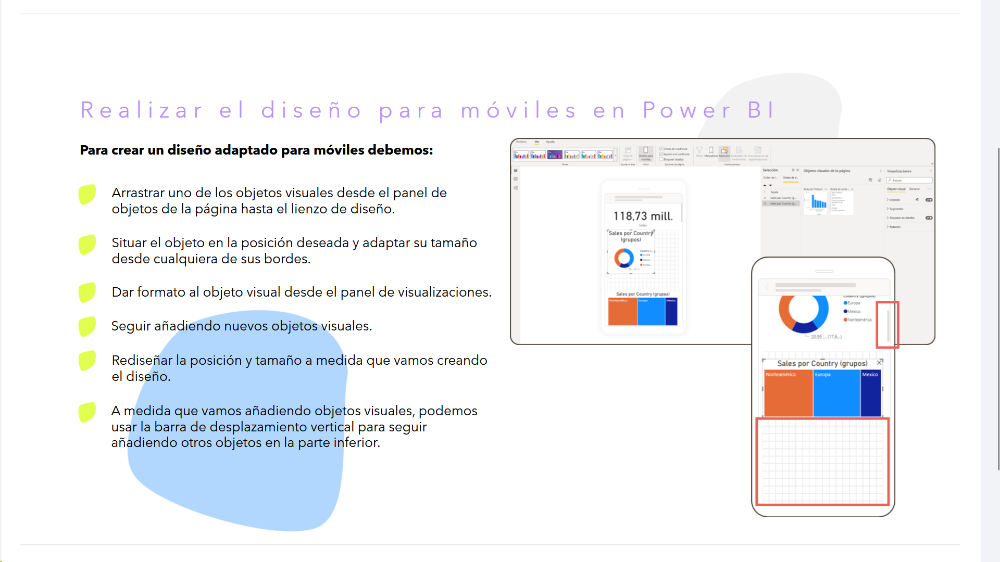

## Realizar el diseño para móviles en Power BI

**Para crear un diseño adaptado para móviles debemos:**

* Arrastrar uno de los objetos visuales desde el panel de objetos de la página hasta el lienzo de diseño.
* Situar el objeto en la posición deseada y adaptar su tamaño desde cualquiera de sus bordes.
* Dar formato al objeto visual desde el panel de visualizaciones.
* Seguir añadiendo nuevos objetos visuales.
* Rediseñar la posición y tamaño a medida que vamos creando el diseño.
* A medida que vamos añadiendo objetos visuales, podemos usar la barra de desplazamiento vertical para seguir añadiendo otros objetos en la parte inferior.

---

### Capas de objetos

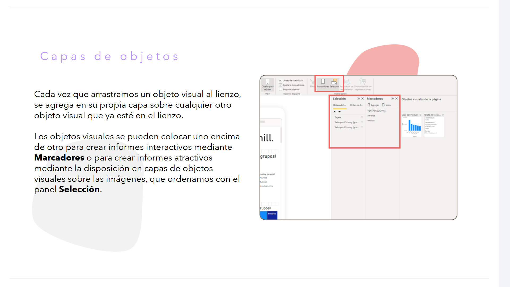

Cada vez que arrastramos un objeto visual al lienzo, se agrega en su propia capa sobre cualquier otro objeto visual que ya esté en el lienzo.  

Los objetos visuales se pueden colocar uno encima de otro para crear informes interactivos mediante **Marcadores** o para crear informes atractivos mediante la disposición en capas de objetos visuales sobre las imágenes, que ordenamos con el panel **Selección**.  

---

## Eliminación de objetos visuales del lienzo de diseño móvil

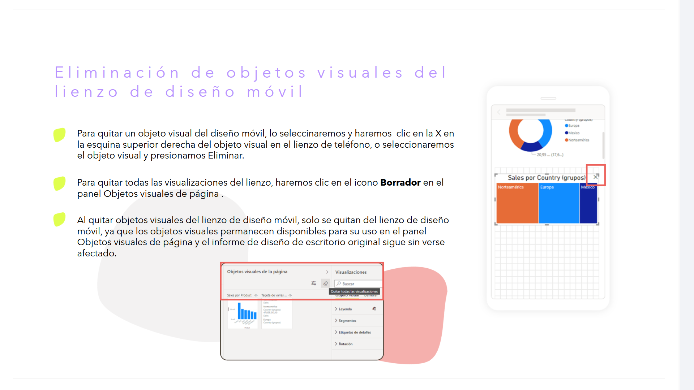

* Para quitar un objeto visual del diseño móvil, lo seleccionaremos y haremos clic en la X en la esquina superior derecha del objeto visual en el lienzo de teléfono, o seleccionaremos el objeto visual y presionamos Eliminar.
* Para quitar todas las visualizaciones del lienzo, haremos clic en el icono **Borrador** en el panel Objetos visuales de página.
* Al quitar objetos visuales del lienzo de diseño móvil, solo se quitan del lienzo de diseño móvil, ya que los objetos visuales permanecen disponibles para su uso en el panel Objetos visuales de página y el informe de diseño de escritorio original sigue sin verse afectado.

---

### Guardar el diseño del informe para móviles

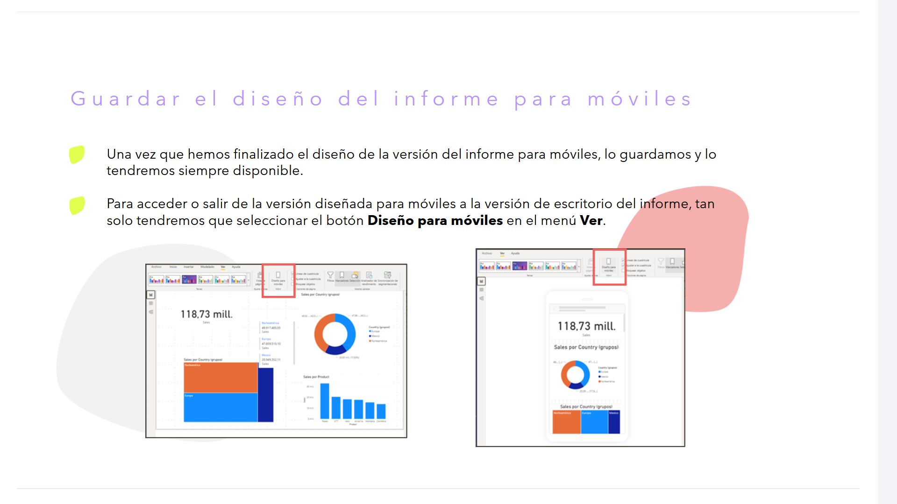

* Una vez que hemos finalizado el diseño de la versión del informe para móviles, lo guardamos y lo tendremos siempre disponible.
* Para acceder o salir de la versión diseñada para móviles a la versión de escritorio del informe, tan solo tendremos que seleccionar el botón **Diseño para móviles** en el menú **Ver**.

---

## Vista de diseño para móviles en Power BI

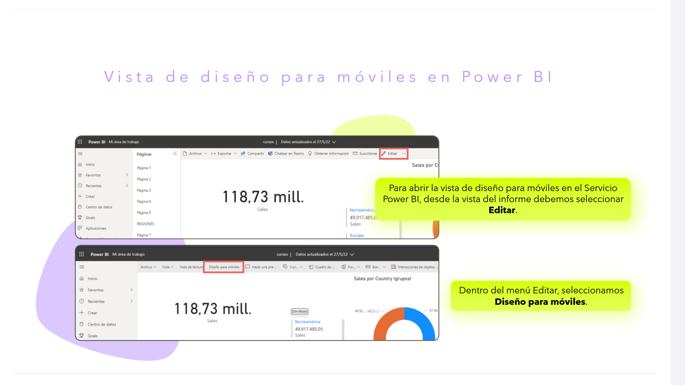

Para abrir la vista de diseño para móviles en el Servicio Power BI, desde la vista del informe debemos seleccionar **Editar**.

Dentro del menú Editar, seleccionamos **Diseño para móviles**.

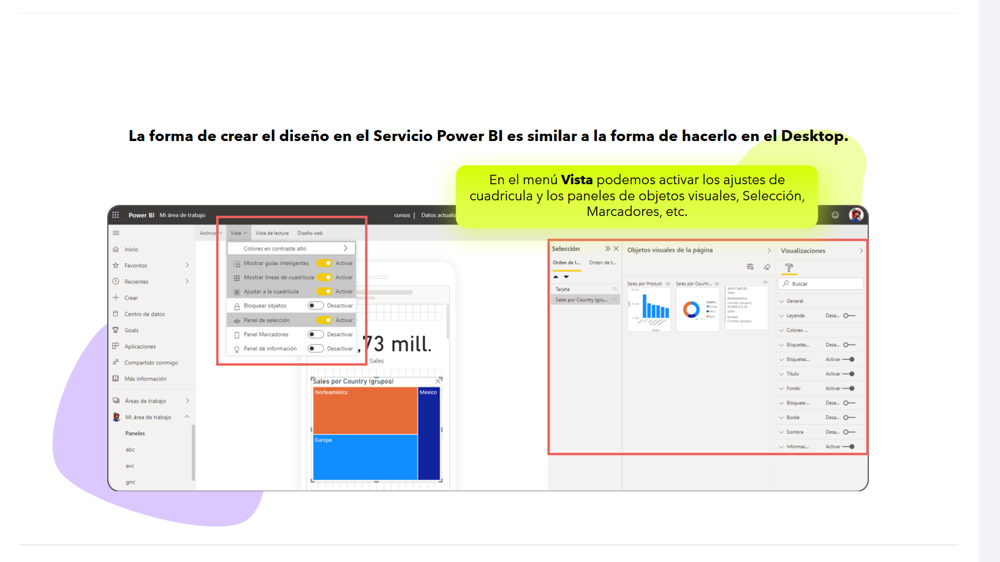

La forma de crear el diseño en el Servicio Power BI es similar a la forma de hacerlo en el Desktop.  

En el menú **Vista** podemos activar los ajustes de cuadrícula y los paneles de objetos visuales, Selección, Marcadores, etc.  

---

## Diseñar paneles para Power BI Mobile

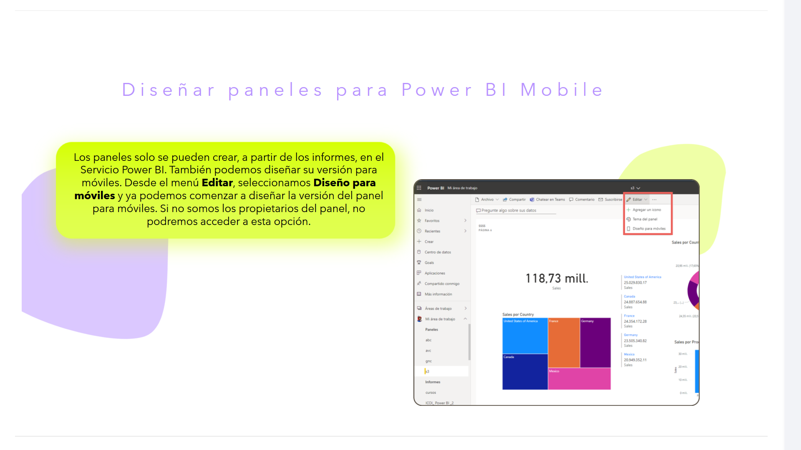

Los paneles solo se pueden crear, a partir de los informes, en el Servicio Power BI. También podemos diseñar su versión para móviles. Desde el menú **Editar**, seleccionamos **Diseño para móviles** y ya podemos comenzar a diseñar la versión del panel para móviles. Si no somos los propietarios del panel, no podremos acceder a esta opción.  

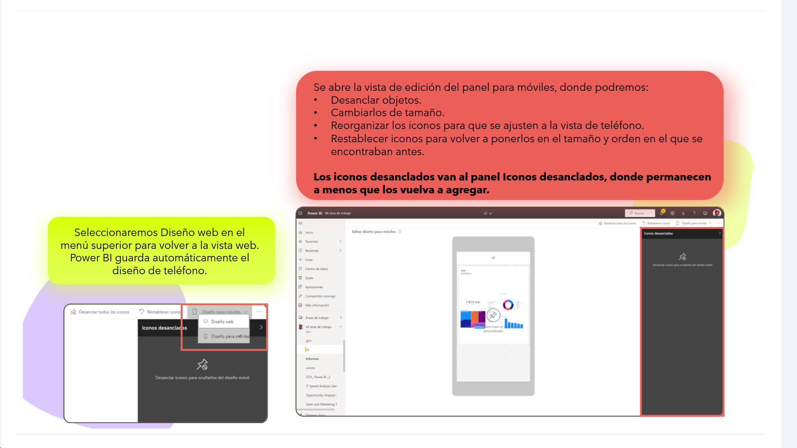

Se abre la vista de edición del panel para móviles, donde podremos:  
* Desanclar objetos.
* Cambiarlos de tamaño.
* Reorganizar los iconos para que se ajusten a la vista de teléfono.
* Restablecer iconos para volver a ponerlos en el tamaño y orden en el que se encontraban antes.

**Los iconos desanclados van al panel Iconos desanclados, donde permanecen a menos que los vuelva a agregar.**

Seleccionaremos Diseño web en el menú superior para volver a la vista web. Power BI guarda automáticamente el diseño de teléfono.  

---

## Visualización de informes y paneles en Power BI Mobile

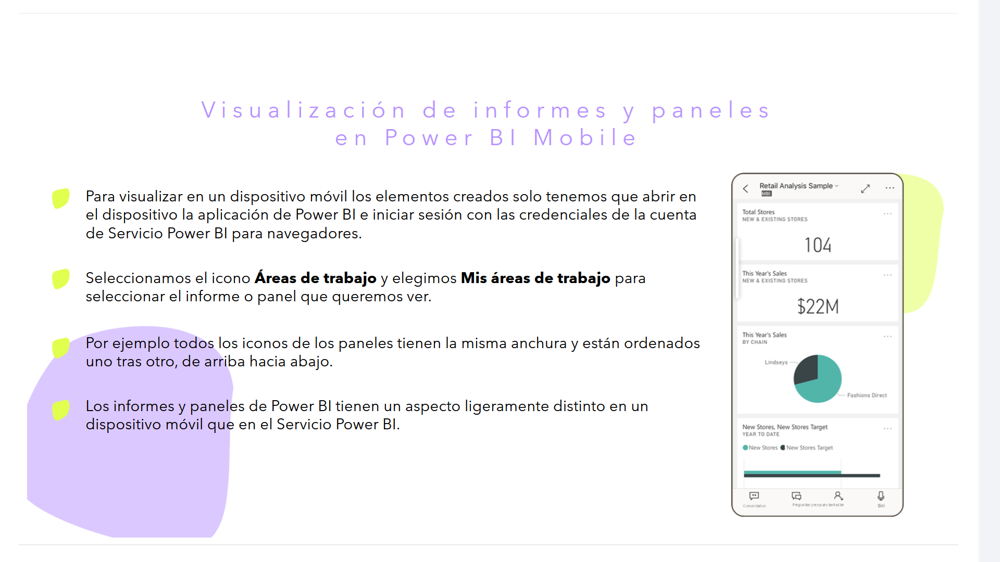

* Para visualizar en un dispositivo móvil los elementos creados solo tenemos que abrir en el dispositivo la aplicación de Power BI e iniciar sesión con las credenciales de la cuenta de Servicio Power BI para navegadores.
* Seleccionamos el icono **Áreas de trabajo** y elegimos **Mis áreas de trabajo** para seleccionar el informe o panel que queremos ver.
* Por ejemplo todos los iconos de los paneles tienen la misma anchura y están ordenados uno tras otro, de arriba hacia abajo.
* Los informes y paneles de Power BI tienen un aspecto ligeramente distinto en un dispositivo móvil que en el Servicio Power BI.

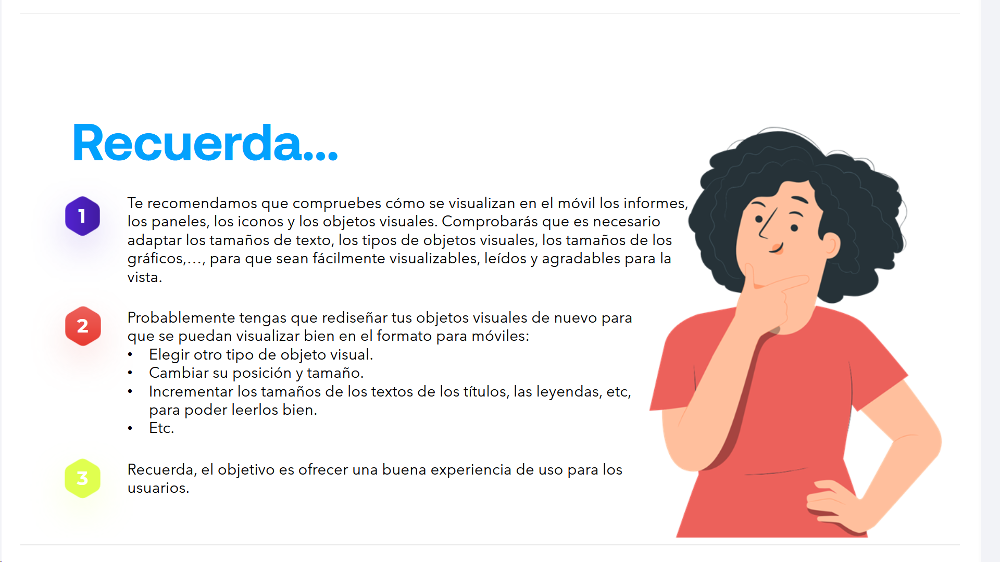
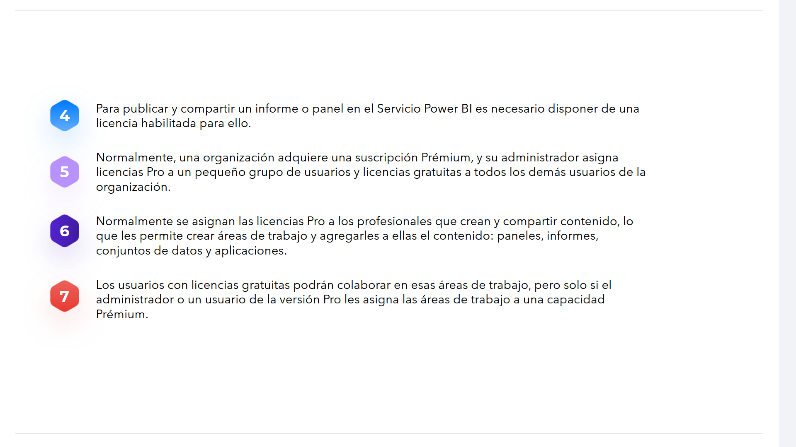

1. Te recomendamos que compruebes cómo se visualizan en el móvil los informes, los paneles, los iconos y los objetos visuales. Comprobarás que es necesario adaptar los tamaños de texto, los tipos de objetos visuales, los tamaños de los gráficos,..., para que sean fácilmente visualizables, leídos y agradables para la vista.
2. Probablemente tengas que rediseñar tus objetos visuales de nuevo para que se puedan visualizar bien en el formato para móviles:
    * Elegir otro tipo de objeto visual.
    * Cambiar su posición y tamaño.
    * Incrementar los tamaños de los textos de los títulos, las leyendas, etc, para poder leerlos bien.
    * Etc.
3. Recuerda, el objetivo es ofrecer una buena experiencia de uso para los usuarios.
4. Para publicar y compartir un informe o panel en el Servicio Power BI es necesario disponer de una licencia habilitada para ello.
5. Normalmente, una organización adquiere una suscripción Prémium, y su administrador asigna licencias Pro a un pequeño grupo de usuarios y licencias gratuitas a todos los demás usuarios de la organización.
6. Normalmente se asignan las licencias Pro a los profesionales que crean y compartir contenido, lo que les permite crear áreas de trabajo y agregarles a ellas el contenido: paneles, informes, conjuntos de datos y aplicaciones.
7. Los usuarios con licencias gratuitas podrán colaborar en esas áreas de trabajo, pero solo si el administrador o un usuario de la versión Pro les asigna las áreas de trabajo a una capacidad Prémium.

---

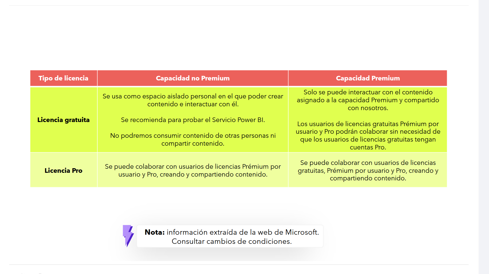

| Tipo de licencia | Capacidad no Premium | Capacidad Premium |
| --- | --- | --- |
| **Licencia gratuita** | Se usa como espacio aislado personal en el que poder crear contenido e interactuar con él.  Se recomienda para probar el Servicio Power BI.  No podremos consumir contenido de otras personas ni compartir contenido. | Solo se puede interactuar con el contenido asignado a la capacidad Premium y compartido con nosotros.  Los usuarios de licencias gratuitas Prémium por usuario y Pro podrán colaborar sin necesidad de que los usuarios de licencias gratuitas tengan cuentas Pro. |
| **Licencia Pro** | Se puede colaborar con usuarios de licencias Prémium por usuario y Pro, creando y compartiendo contenido. | Se puede colaborar con usuarios de licencias gratuitas, Prémium por usuario y Pro, creando y compartiendo contenido. |

> **Nota:** información extraída de la web de Microsoft. Consultar cambios de condiciones.