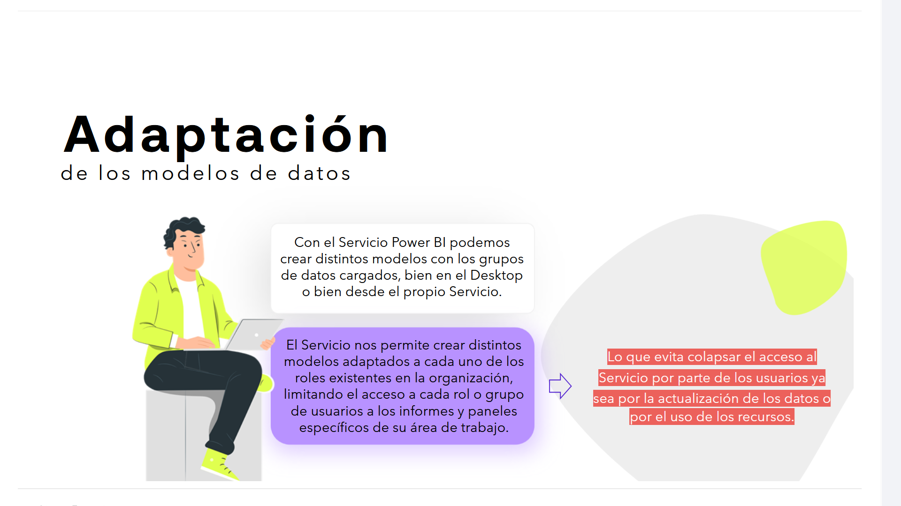
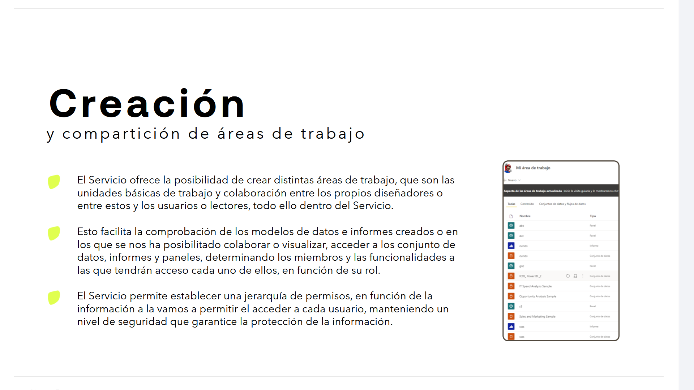
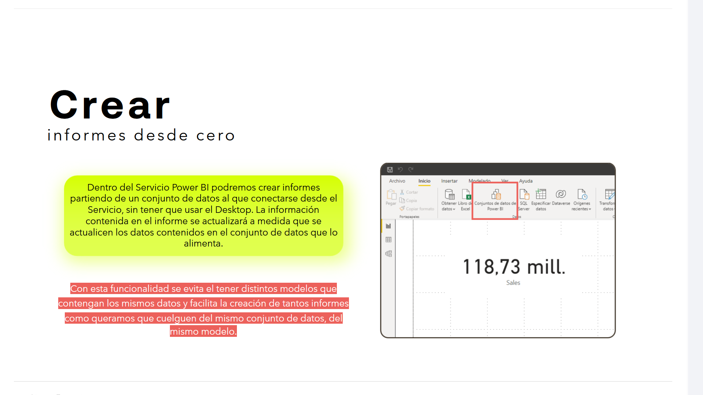
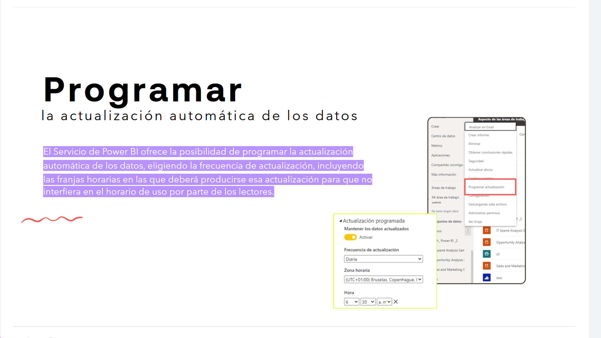
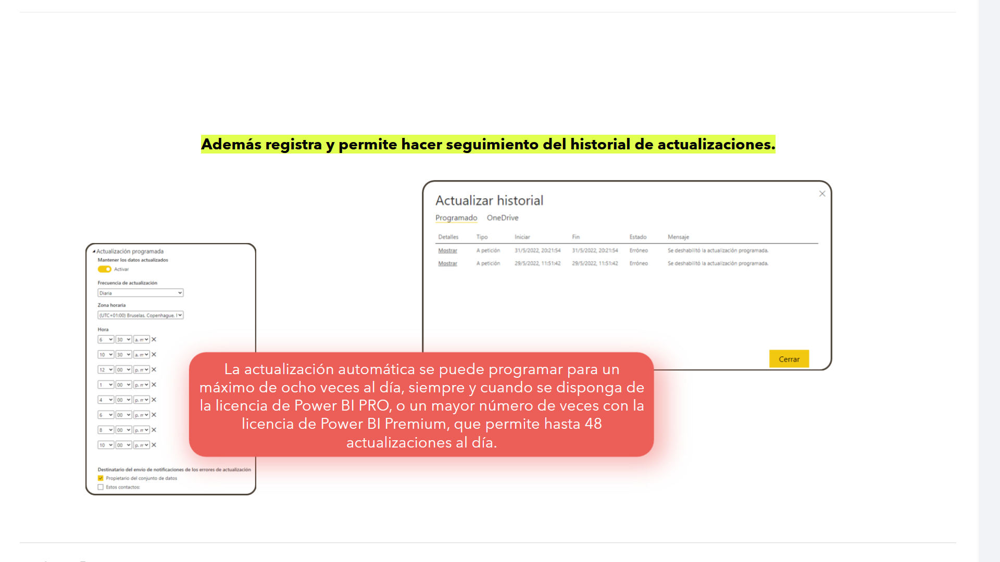

# 08-009:	Funcionalidades del Servicio Power BI

- Integración con ecosistema MS
- Administración de los grupos de datos
- Áreas de Trabajo
- Creación y Edición de Informes
- Programación de Informes

---

Las funcionalidades que nos ofrece el Servicio Power BI son variadas, desde las más básicas a otras más avanzadas.

Vamos a realizar un recorrido por varias de ellas.

---

## Integración de todas las aplicaciones de Microsoft

En función del tipo de licencia disponible, podremos tener acceso al resto de aplicaciones de Microsoft, integrando sus propias funcionalidades y facilitando la interconexión.

---

## Administración de los grupos de datos

> Da acceso al conjunto de datos cargados en Desktop, además de poder crear nuevos modelos de datos desde el servicio online

El Servicio Power BI nos permite administrar el modelo de datos empleado para la creación de los informes, desde la carga hasta la publicación, pasando por su edición; que se podrá publicar desde el Servicio Power BI o desde un propio archivo .pbix en el que hayamos trabajado en nuestro equipo local.

Una vez publicado el modelo de datos, lo tendremos disponible en el Servicio Power BI.

---

## Adaptación de los modelos de datos

> Desde aquí también se pueden editar y adaptar los modelos de datos

Con el Servicio Power BI podemos crear distintos modelos con los grupos de datos cargados, bien en el Desktop o bien desde el propio Servicio.

El Servicio nos permite crear distintos modelos adaptados a cada uno de los roles existentes en la organización, limitando el acceso a cada rol o grupo de usuarios a los informes y paneles específicos de su área de trabajo.

Lo que evita colapsar el acceso al Servicio por parte de los usuarios ya sea por la actualización de los datos o por el uso de los recursos.

---

## Creación y compartición de áreas de trabajo

> Son los elementos del servicio desde donde se puede colaborar con otros usuarios, o trabajar en informes de manera privada antes de comunicarlos

* 	El Servicio ofrece la posibilidad de crear distintas áreas de trabajo, que son las unidades básicas de trabajo y colaboración entre los propios diseñadores o entre estos y los usuarios o lectores, todo ello dentro del Servicio.

* 	Esto facilita la comprobación de los modelos de datos e informes creados o en los que se nos ha posibilitado colaborar o visualizar, acceder a los conjunto de datos, informes y paneles, determinando los miembros y las funcionalidades a las que tendrán acceso cada uno de ellos, en función de su rol.
* 	El Servicio permite establecer una jerarquía de permisos, en función de la información a la vamos a permitir el acceder a cada usuario, manteniendo un nivel de seguridad que garantice la protección de la información.

---

## Control del uso de conjuntos de datos entre áreas de trabajo

> Con las áreas de trabajo se tiene el control sobre quién interactúa en las colaboraciones y publicaciones 

El uso de conjuntos de datos entre áreas de trabajo permite impulsar la transparencia y el uso de los datos dentro de una organización. Pero en ciertas ocasiones, a los administradores les interesará restringir el flujo de información dentro de de Power BI.

El Servicio Power BI permite restringir la reutilización de los conjunto de datos, ya sea de forma completa o parcial, por los distintos grupos de usuarios.

**De esta forma, se puede, entre otros:**

* 	Evitar la copia de informes.
* 	Evitar la edición de informes.
* 	Restringir la visualización de conjuntos de datos correspondientes solo a los informes existentes dentro de un área específica.
* 	Evitar la apertura de archivos .pbix con una conexión dinámica a un conjunto de datos fuera del área de trabajo de que es miembro un usuario.

---

## Conectar el Servicio Power BI a conjuntos de datos en Excel 

> Garantiza una complementariedad excelente con MS Excel

Una funcionalidad al publicar en el conjunto de datos es poder analizar la información en Excel. Es decir, podemos mantener una hoja de excel conectada al modelo y cada vez que se actualicen sus datos, lo harán también los datos del Servicio.

---

## Crear informes desde cero

> Aunque lo habitual sea crear Informes desde Desktop, desde el servicio on-line también se pueden crear o editar

Dentro del Servicio Power BI podremos crear informes partiendo de un conjunto de datos al que conectarse desde el Servicio, sin tener que usar el Desktop. La información contenida en el informe se actualizará a medida que se actualicen los datos contenidos en el conjunto de datos que lo alimenta.

Con esta funcionalidad se evita el tener distintos modelos que contengan los mismos datos y facilita la creación de tantos informes como queramos que cuelguen del mismo conjunto de datos, del mismo modelo.

---

## Programar la actualización automática de los datos

> La programación permite automatizar procesos, incluyendo la periocidad con la que se actualizan los orígenes de datos

El Servicio de Power BI ofrece la posibilidad de programar la actualización automática de los datos, eligiendo la frecuencia de actualización, incluyendo las franjas horarias en las que deberá producirse esa actualización para que no interfiera en el horario de uso por parte de los lectores.

Además registra y permite hacer seguimiento del historial de actualizaciones.

La actualización automática se puede programar para un máximo de ocho veces al día, siempre y cuando se disponga de la licencia de Power BI PRO, o un mayor número de veces con la licencia de Power BI Premium, que permite hasta 48 actualizaciones al día.

---
