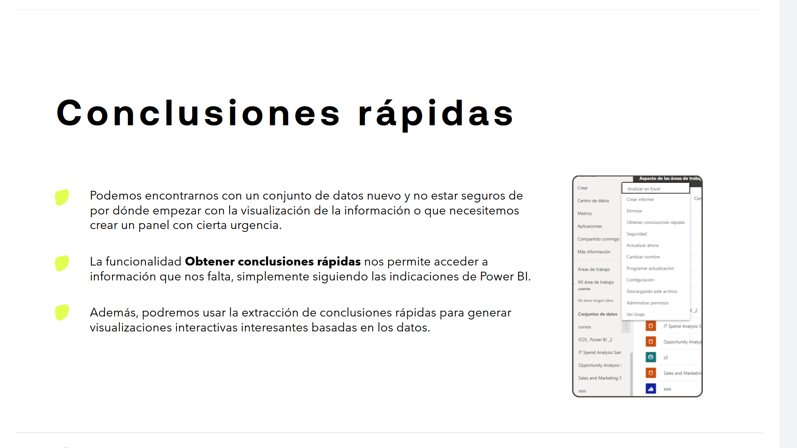
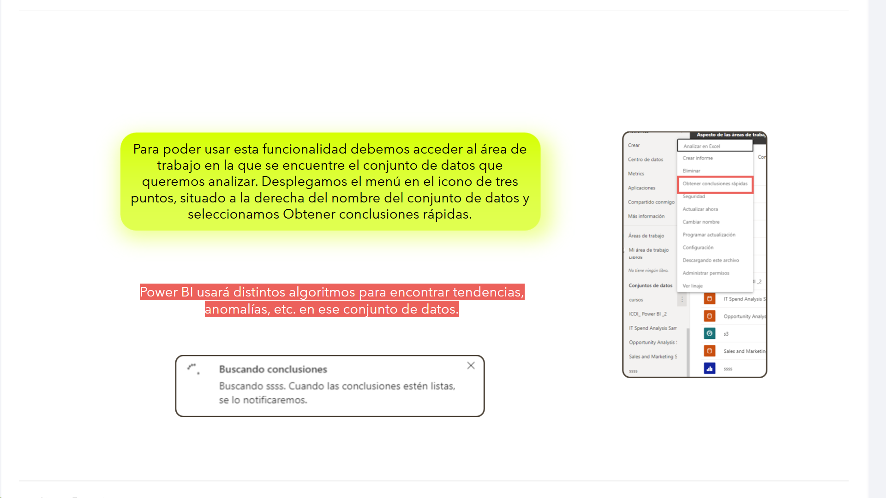
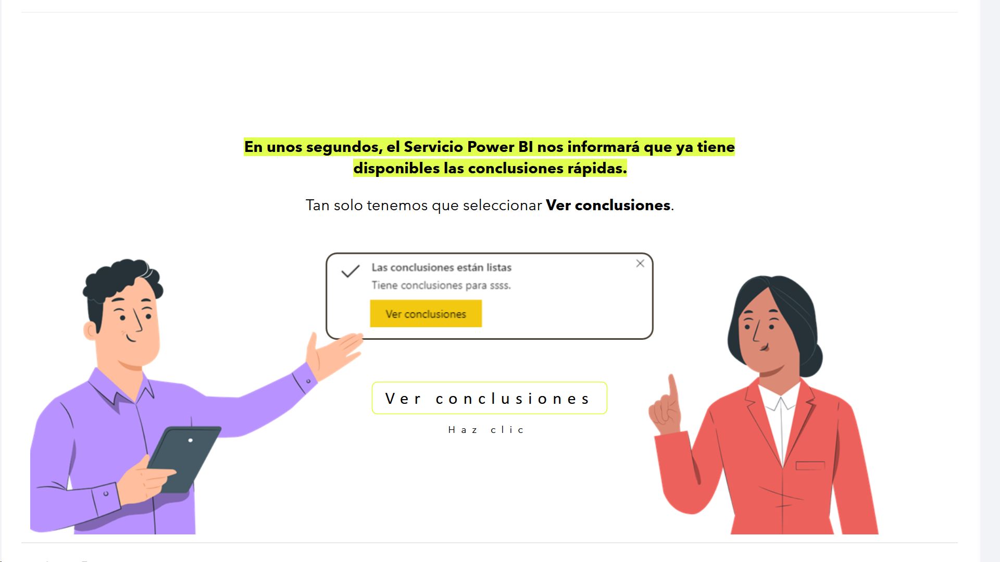
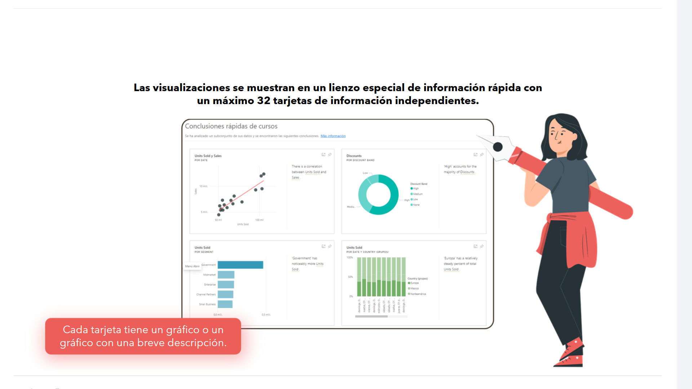
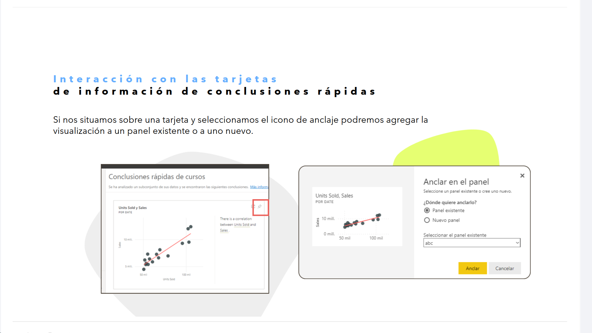
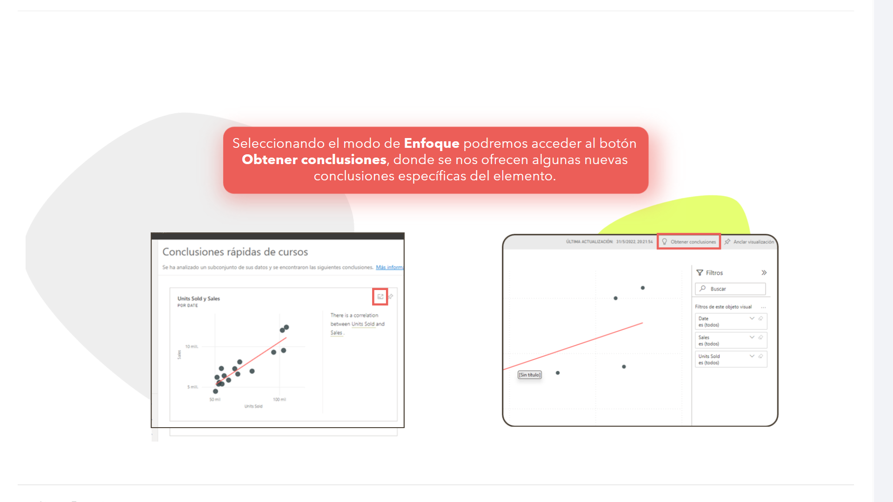
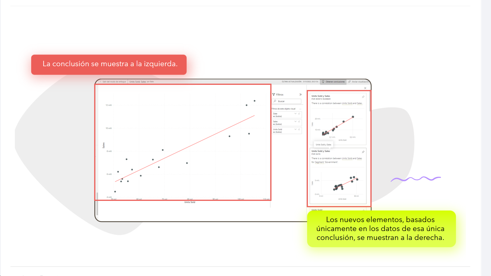
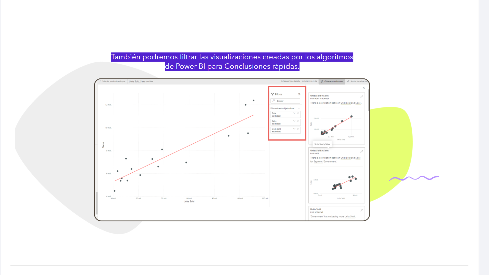

# 08-010:	Conclusiones Rápidas

> Cuando usamos datos nuevos, quizás no tenemos una perspectiva real; 'Conclusiones rápidas' puede ayudar a poder obtenerla

* Podemos encontrarnos con un conjunto de datos nuevo y no estar seguros de por dónde empezar con la visualización de la información o que necesitemos crear un panel con cierta urgencia.
* La funcionalidad **Obtener conclusiones rápidas** nos permite acceder a información que nos falta, simplemente siguiendo las indicaciones de Power BI.
* Además, podremos usar la extracción de conclusiones rápidas para generar visualizaciones interactivas interesantes basadas en los datos.

Para poder usar esta funcionalidad debemos acceder al área de trabajo en la que se encuentre el conjunto de datos que queremos analizar. Desplegamos el menú en el icono de tres puntos, situado a la derecha del nombre del conjunto de datos y seleccionamos Obtener conclusiones rápidas.

Power BI usará distintos algoritmos para encontrar tendencias, anomalías, etc. en ese conjunto de datos.

**En unos segundos, el Servicio Power BI nos informará que ya tiene disponibles las conclusiones rápidas.**

Tan solo tenemos que seleccionar **Ver conclusiones**.

**Las visualizaciones se muestran en un lienzo especial de información rápida con un máximo 32 tarjetas de información independientes.**

- Cada tarjeta tiene un gráfico o un gráfico con una breve descripción.

---

## Interacción con las tarjetas de información de Conclusiones Rápidas

> Una vez realizada la primera propuesta de objetos visuales para la analítica de datos, podemos editarlos y modificarlos

Si nos situamos sobre una tarjeta y seleccionamos el icono de anclaje podremos agregar la visualización a un panel existente o a uno nuevo.

> Conclusiones Rápidas muestra todos los elementos creados en el objeto visual que nos proponen, incluídos los filtros usados

- Seleccionando el modo de **Enfoque** podremos acceder al botón **Obtener conclusiones**, donde se nos ofrecen algunas nuevas conclusiones específicas del elemento.

> Incluso sus algortimos nos muestran conclusiones e información relevante

- La conclusión se muestra a la izquierda.

- Los nuevos elementos, basados únicamente en los datos de esa única conclusión, se muestran a la derecha.

También podremos filtrar las visualizaciones creadas por los algoritmos de Power BI para Conclusiones rápidas.

---

