## 08-011	Funcionalidades de PowerBI (2)

- Alerta de datos
- Exportación de datos
- Añadir comentarios
- Métricas de Uso
- Vista

## Alertas de datos

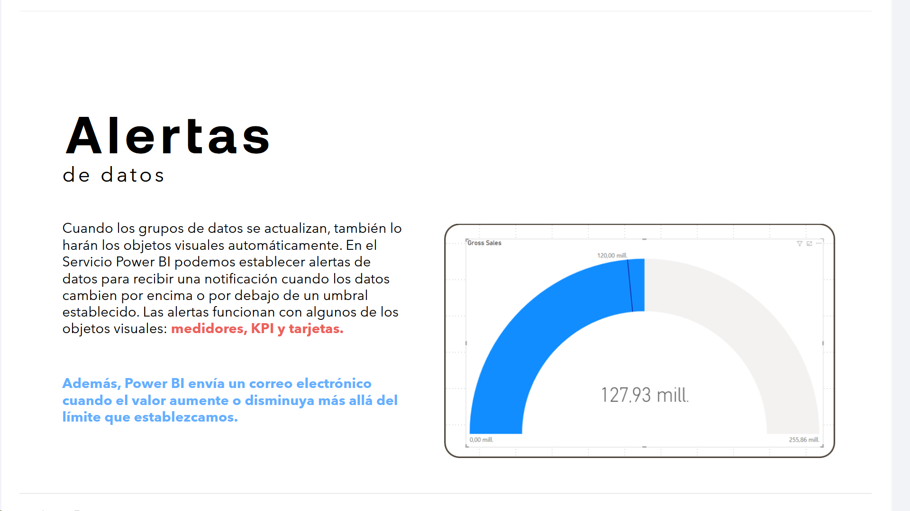

Cuando los grupos de datos se actualizan, también lo harán los objetos visuales automáticamente. En el Servicio Power BI podemos establecer alertas de datos para recibir una notificación cuando los datos cambien por encima o por debajo de un umbral establecido. Las alertas funcionan con algunos de los objetos visuales: **medidores, KPI y tarjetas.**

**Además, Power BI envía un correo electrónico cuando el valor aumente o disminuya más allá del límite que establezcamos.**

---

## Exportación de datos a Excel

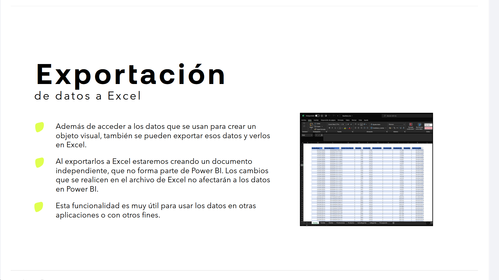

* Además de acceder a los datos que se usan para crear un objeto visual, también se pueden exportar esos datos y verlos en Excel.
* Al exportarlos a Excel estaremos creando un documento independiente, que no forma parte de Power BI. Los cambios que se realicen en el archivo de Excel no afectarán a los datos en Power BI.
* Esta funcionalidad es muy útil para usar los datos en otras aplicaciones o con otros fines.

---

## Exportación de datos a Power Point y PDF

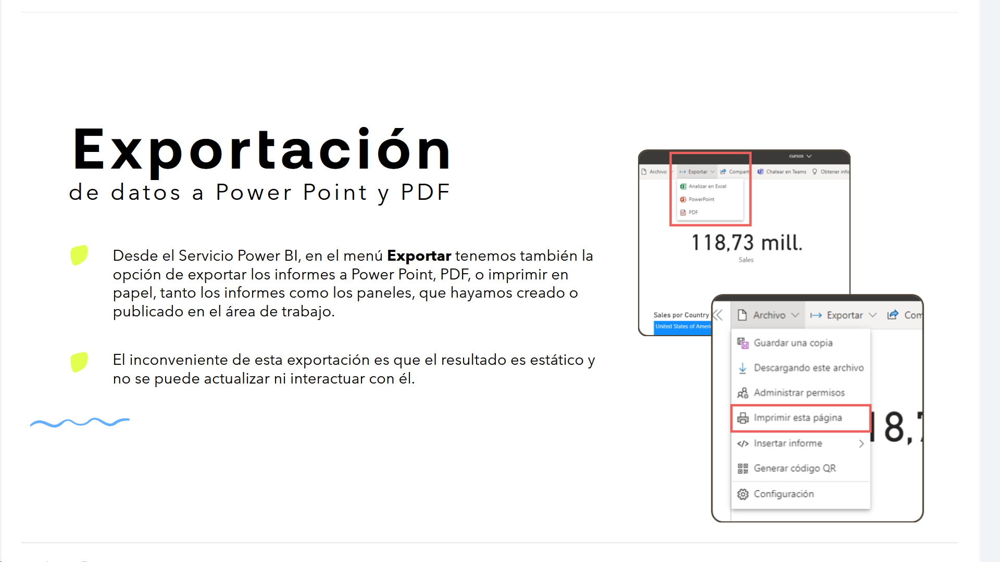

* Desde el Servicio Power BI, en el menú **Exportar** tenemos también la opción de exportar los informes a Power Point, PDF, o imprimir en papel, tanto los informes como los paneles, que hayamos creado o publicado en el área de trabajo.
* El inconveniente de esta exportación es que el resultado es estático y no se puede actualizar ni interactuar con él.

---

## Añadir comentarios

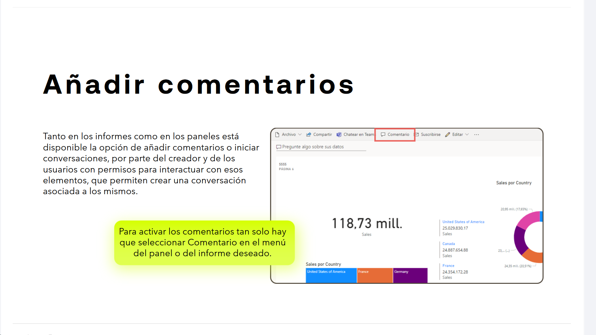

Tanto en los informes como en los paneles está disponible la opción de añadir comentarios o iniciar conversaciones, por parte del creador y de los usuarios con permisos para interactuar con esos elementos, que permiten crear una conversación asociada a los mismos.

> Para activar los comentarios tan solo hay que seleccionar Comentario en el menú del panel o del informe deseado.

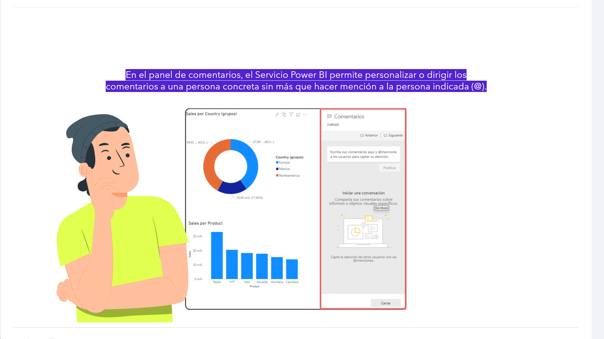

En el panel de comentarios, el Servicio Power BI permite personalizar o dirigir los comentarios a una persona concreta sin más que hacer mención a la persona indicada (@).

---

## Métricas de uso

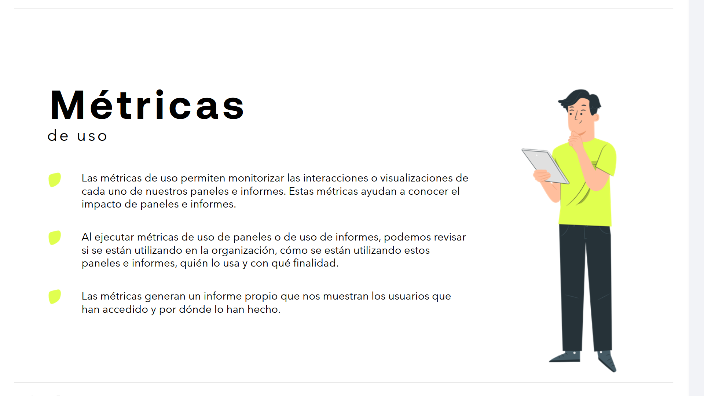

* Las métricas de uso permiten monitorizar las interacciones o visualizaciones de cada uno de los paneles e informes. Estas métricas ayudan a conocer el impacto de paneles e informes.
* Al ejecutar métricas de uso de paneles o de uso de informes, podemos revisar si se están utilizando en la organización, cómo se están utilizando estos paneles e informes, quién lo usa y con qué finalidad.
* Las métricas generan un informe propio que nos muestran los usuarios que han accedido y por dónde lo han hecho.

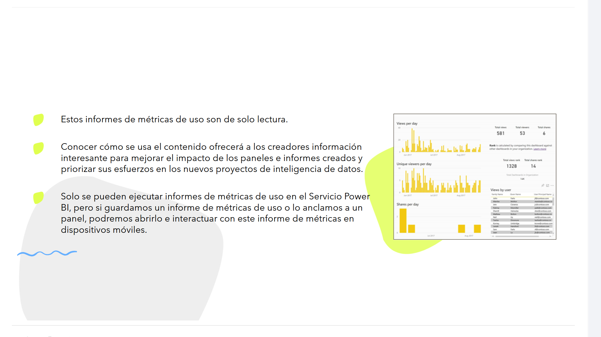

* Estos informes de métricas de uso son de solo lectura.
* Conocer cómo se usa el contenido ofrecerá a los creadores información interesante para mejorar el impacto de los paneles e informes creados y priorizar sus esfuerzos en los nuevos proyectos de inteligencia de datos.
* Solo se pueden ejecutar informes de métricas de uso en el Servicio Power BI, pero si guardamos un informe de métricas de uso o lo anclamos a un panel, podremos abrirlo e interactuar con este informe de métricas en dispositivos móviles.

## ¿Qué métricas se incluyen en el informe?

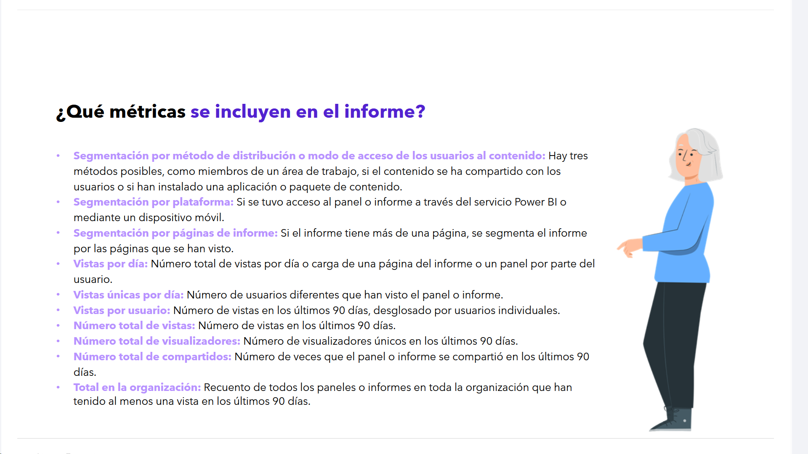

* **Segmentación por método de distribución o modo de acceso de los usuarios al contenido:** Hay tres métodos posibles, como miembros de un área de trabajo, si el contenido se ha compartido con los usuarios o si han instalado una aplicación o paquete de contenido.
* **Segmentación por plataforma:** Si se tuvo acceso al panel o informe a través del servicio Power BI o mediante un dispositivo móvil.
* **Segmentación por páginas de informe:** Si el informe tiene más de una página, se segmenta el informe por las páginas que se han visto.
* **Vistas por día:** Número total de vistas por día o carga de una página del informe o un panel por parte del usuario.
* **Vistas únicas por día:** Número de usuarios diferentes que han visto el panel o informe.
* **Vistas por usuario:** Número de vistas en los últimos 90 días, desglosado por usuarios individuales.
* **Número total de vistas:** Número de vistas en los últimos 90 días.
* **Número total de visualizadores:** Número de visualizadores únicos en los últimos 90 días.
* **Número total de compartidos:** Número de veces que el panel o informe se compartió en los últimos 90 días.
* **Total en la organización:** Recuento de todos los paneles o informes en toda la organización que han tenido al menos una vista en los últimos 90 días.

## Restricciones para el acceso a métricas

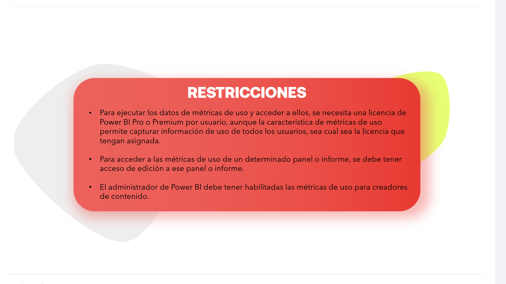

* Para ejecutar los datos de métricas de uso y acceder a ellos, se necesita una licencia de Power BI Pro o Premium por usuario, aunque la característica de métricas de uso permite capturar información de uso de todos los usuarios, sea cual sea la licencia que tengan asignada.
* Para acceder a las métricas de uso de un determinado panel o informe, se debe tener acceso de edición a ese panel o informe.
* El administrador de Power BI debe tener habilitadas las métricas de uso para creadores de contenido.

---

## Vista

### Ajustar las dimensiones de pantalla

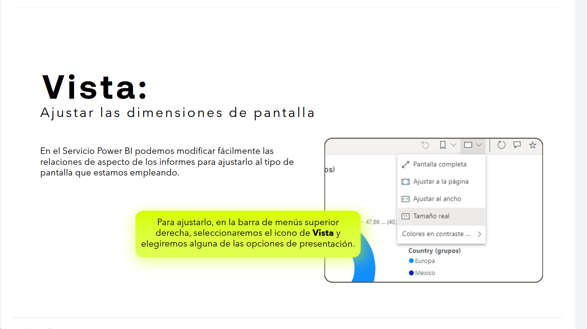

En el Servicio Power BI podemos modificar fácilmente las relaciones de aspecto de los informes para ajustarlo al tipo de pantalla que estamos empleando.

> Para ajustarlo, en la barra de menús superior derecha, seleccionaremos el icono de **Vista** y elegiremos alguna de las opciones de presentación.

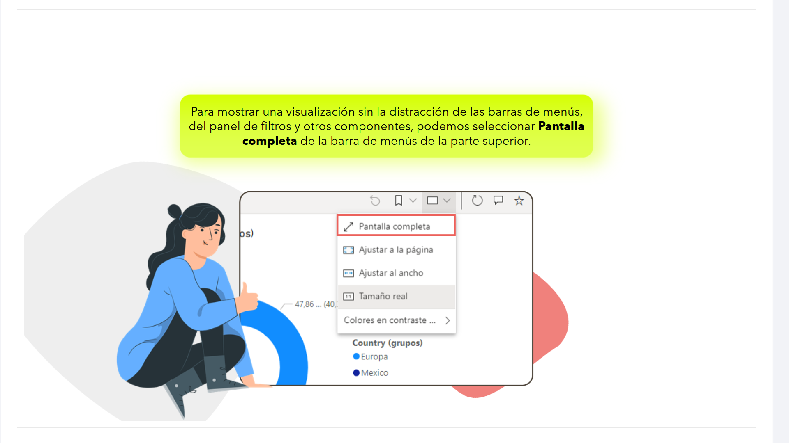

> Para mostrar una visualización sin la distracción de las barras de menús, del panel de filtros y otros componentes, podemos seleccionar **Pantalla completa** de la barra de menús de la parte superior.

### Visualización de la interconexión de los objetos visuales de una página

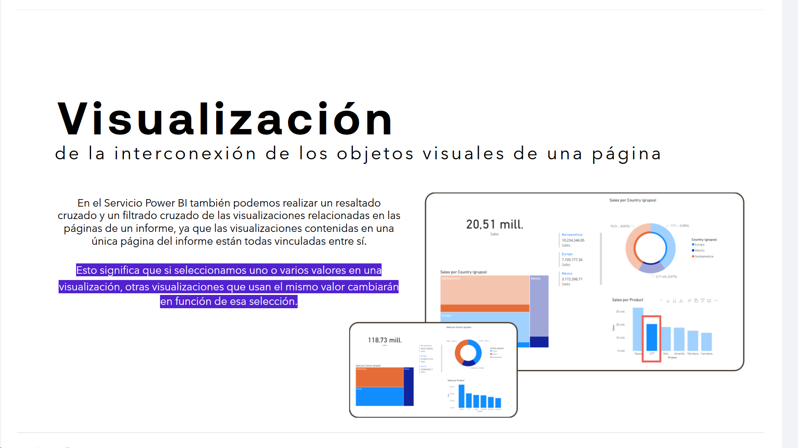

En el Servicio Power BI también podemos realizar un resaltado cruzado y un filtrado cruzado de las visualizaciones relacionadas en las páginas de un informe, ya que las visualizaciones contenidas en una única página del informe están todas vinculadas entre sí.

Esto significa que si seleccionamos uno o varios valores en una visualización, otras visualizaciones que usan el mismo valor cambiarán en función de esa selección.

### Acercar la imagen en objetos visuales individuales

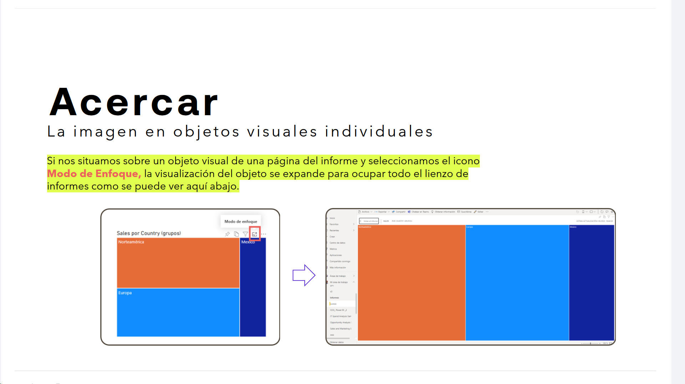

Si nos situamos sobre un objeto visual de una página del informe y seleccionamos el icono **Modo de Enfoque**, la visualización del objeto se expande para ocupar todo el lienzo de informes como se puede ver aquí abajo.

### Mostrar los datos utilizados para crear una visualización

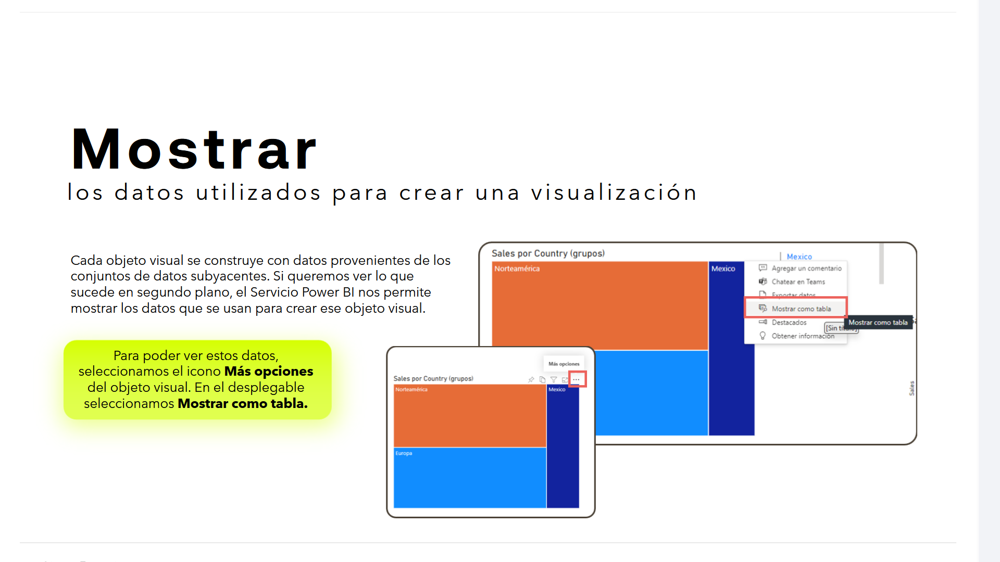
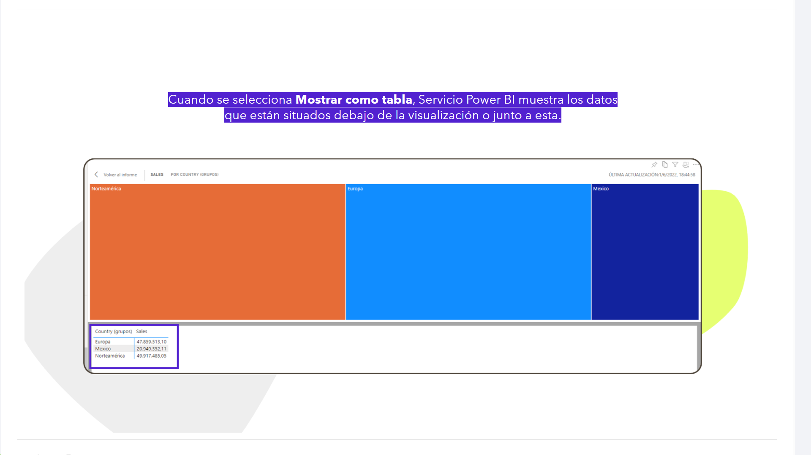

Cada objeto visual se construye con datos provenientes de los conjuntos de datos subyacentes. Si queremos ver lo que sucede en segundo plano, el Servicio Power BI nos permite mostrar los datos que se usan para crear ese objeto visual.

> Para poder ver estos datos, seleccionamos el icono **Más opciones** del objeto visual. En el desplegable seleccionamos **Mostrar como tabla**.

Cuando se selecciona **Mostrar como tabla**, Servicio Power BI muestra los datos que están situados debajo de la visualización o junto a esta.

---

