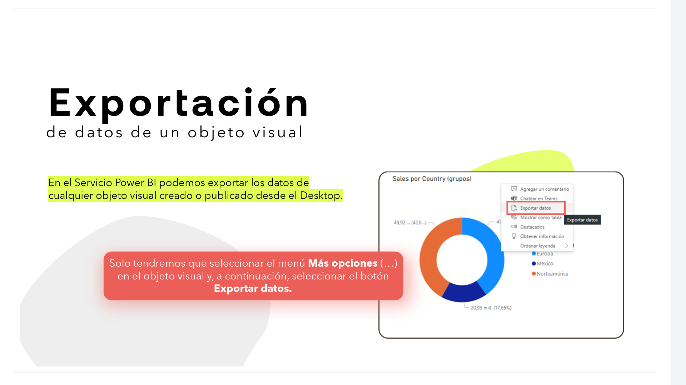
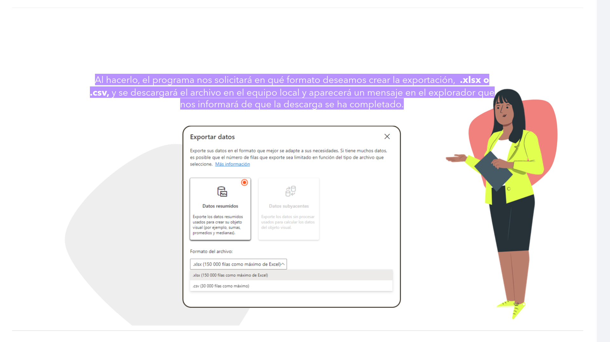
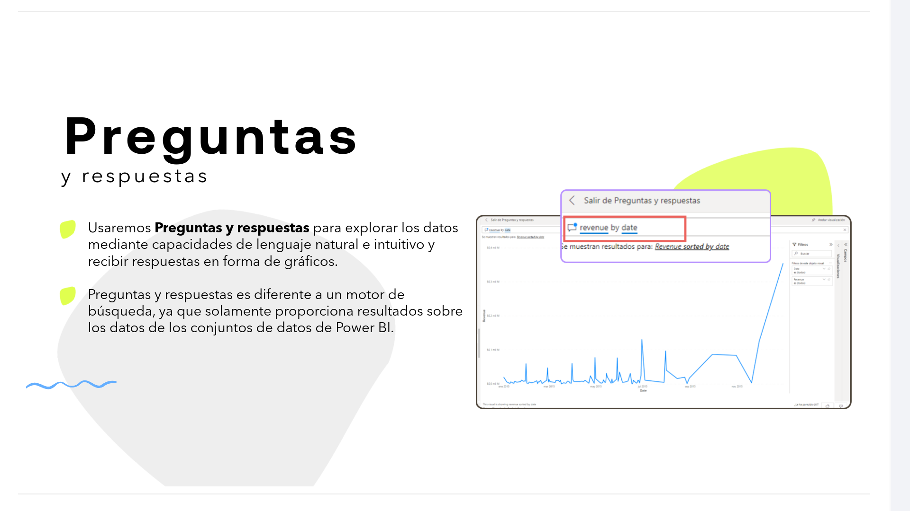
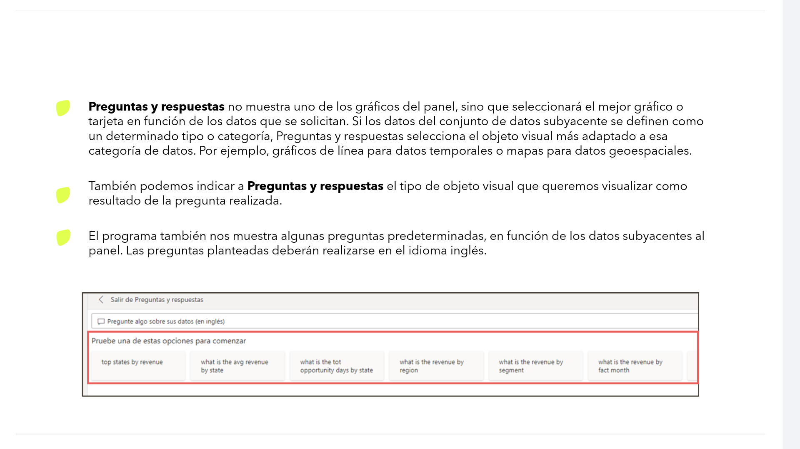
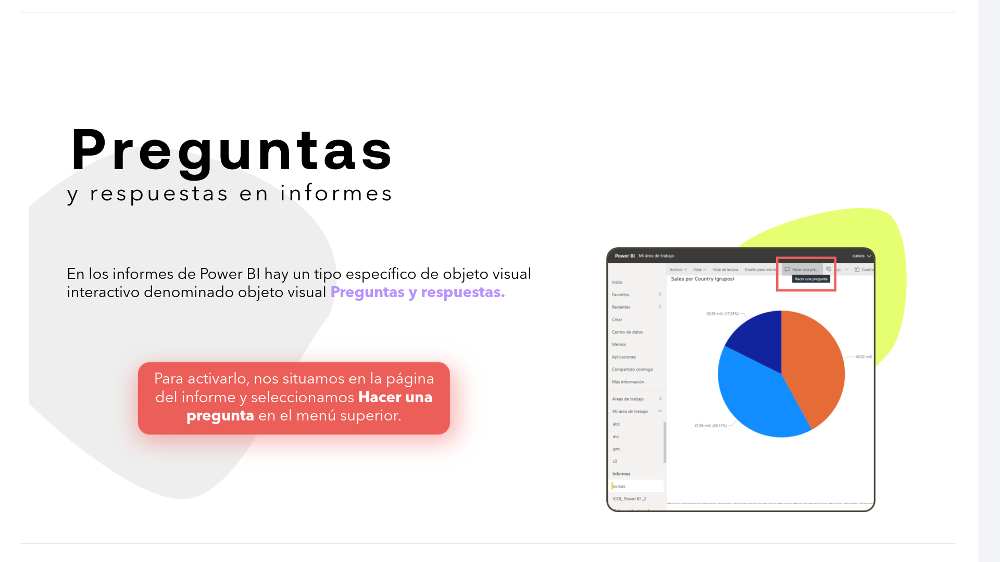
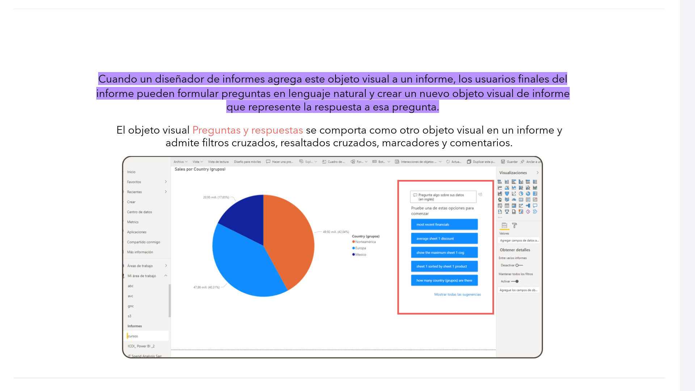
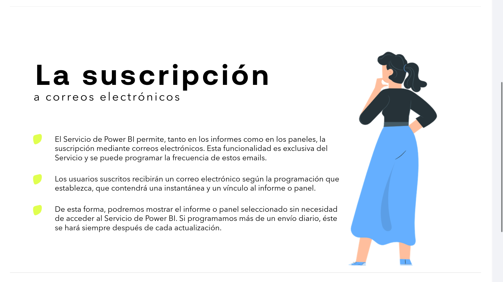
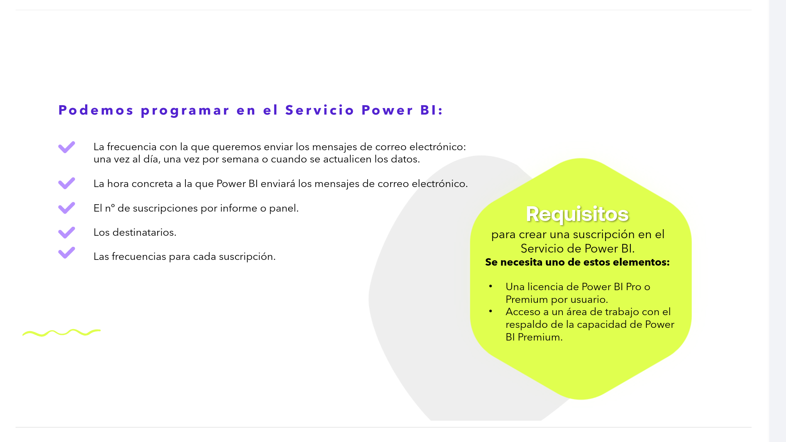
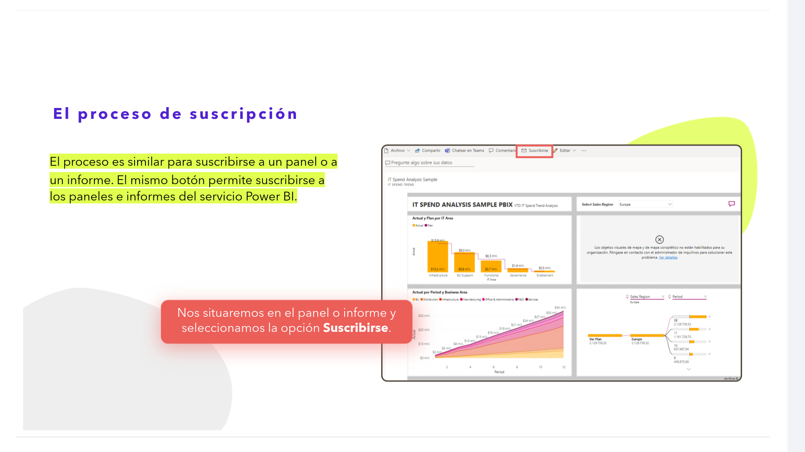
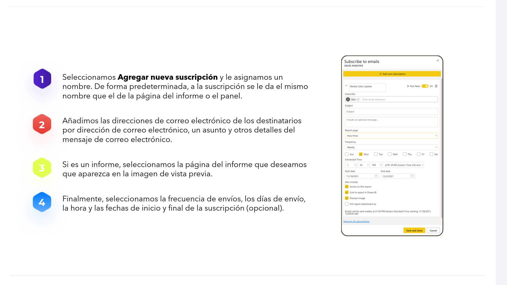

# 08-012	Funcionalidades de PowerBI (3)

- Exportación de datos de Objetos visuales
- Preguntas y Respuestas
- Suscripción a Correo Electrónico

## Exportación de datos de un objeto visual

En el Servicio Power BI podemos exportar los datos de cualquier objeto visual creado o publicado desde el Desktop.

Solo tendremos que seleccionar el menú **Más opciones (...)** en el objeto visual y, a continuación, seleccionar el botón **Exportar datos**.

Al hacerlo, el programa nos solicitará en qué formato deseamos crear la exportación, **.xlsx o .csv**, y se descargará el archivo en el equipo local y aparecerá un mensaje en el explorador que nos informará de que la descarga se ha completado.

---

## Preguntas y Respuestas

* Usaremos **Preguntas y respuestas** para explorar los datos mediante capacidades de lenguaje natural e intuitivo y recibir respuestas en forma de gráficos.

* Preguntas y respuestas es diferente a un motor de búsqueda, ya que solamente proporciona resultados sobre los datos de los conjuntos de datos de Power BI.

* Usaremos **Preguntas y respuestas** para explorar los datos mediante capacidades de lenguaje natural e intuitivo y recibir respuestas en forma de gráficos.

* Preguntas y respuestas es diferente a un motor de búsqueda, ya que solamente proporciona resultados sobre los datos de los conjuntos de datos de Power BI.

### Preguntas y Respuestas, en informes

En los informes de Power BI hay un tipo específico de objeto visual interactivo denominado objeto visual **Preguntas y respuestas**.

*   Para activarlo, nos situamos en la página del informe y seleccionamos **Hacer una pregunta** en el menú superior.

Cuando un diseñador de informes agrega este objeto visual a un informe, los usuarios finales del informe pueden formular preguntas en lenguaje natural y crear un nuevo objeto visual de informe que represente la respuesta a esa pregunta.  

El objeto visual Preguntas y respuestas se comporta como otro objeto visual en un informe y admite filtros cruzados, resaltados cruzados, marcadores y comentarios.  

---

## Suscripción a Correo Electrónico

*   El Servicio de Power BI permite, tanto en los informes como en los paneles, la suscripción mediante correos electrónicos. Esta funcionalidad es exclusiva del Servicio y se puede programar la frecuencia de estos emails.

*   Los usuarios suscritos recibirán un correo electrónico según la programación que establezca, que contendrá una instantánea y un vínculo al informe o panel.

*   De esta forma, podremos mostrar el informe o panel seleccionado sin necesidad de acceder al Servicio de Power BI. Si programamos más de un envío diario, éste se hará siempre después de cada actualización.

- **Podemos programar en el Servicio Power BI:**

    *   La frecuencia con la que queremos enviar los mensajes de correo electrónico: una vez al día, una vez por semana o cuando se actualicen los datos.
    *   La hora concreta a la que Power BI enviará los mensajes de correo electrónico.
    *   El n.º de suscripciones por informe o panel.
    *   Los destinatarios.
    *   Las frecuencias para cada suscripción.

### Requisitos para crear una suscripción en el Servicio de Power BI

- **Se necesita uno de estos elementos:**

    *   Una licencia de Power BI Pro o Premium por usuario.
    *   Acceso a un área de trabajo con el respaldo de la capacidad de Power BI Premium.

### Proceso de suscripción

El proceso es similar para suscribirse a un panel o a un informe. El mismo botón permite suscribirse a los paneles e informes del servicio Power BI.

Nos situaremos en el panel o informe y seleccionamos la opción **Suscribirse**.

1.  Seleccionamos **Agregar nueva suscripción** y le asignamos un nombre. De forma predeterminada, a la suscripción se le da el mismo nombre que el de la página del informe o el panel.

2.  Añadimos las direcciones de correo electrónico de los destinatarios por dirección de correo electrónico, un asunto y otros detalles del mensaje de correo electrónico.

3.  Si es un informe, seleccionamos la página del informe que deseamos que aparezca en la imagen de vista previa.

4.  Finalmente, seleccionamos la frecuencia de envíos, los días de envío, la hora y las fechas de inicio y final de la suscripción (opcional).
