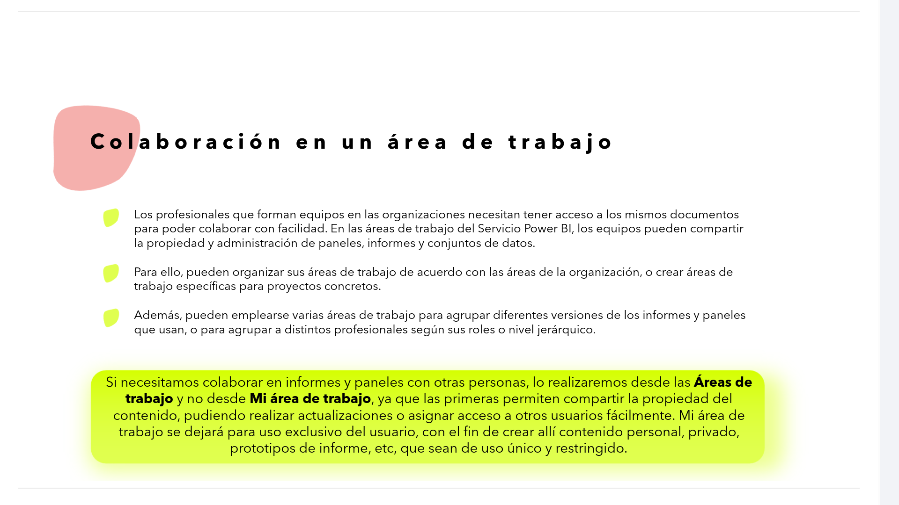
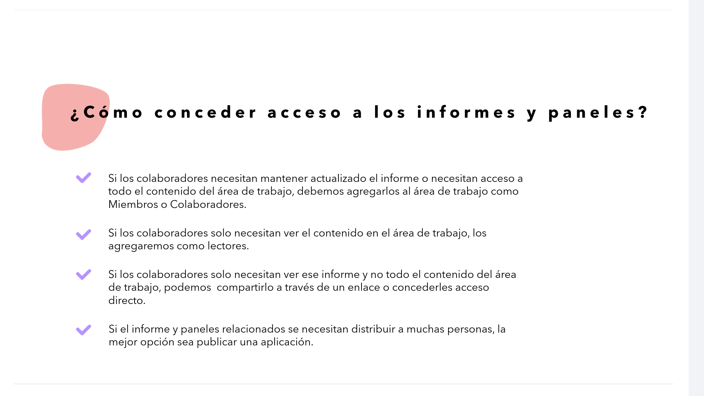
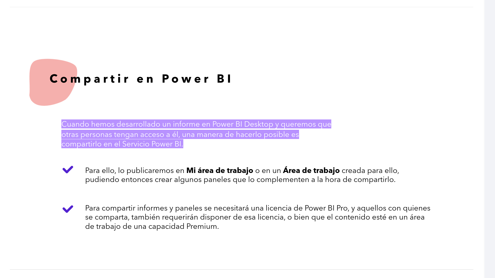
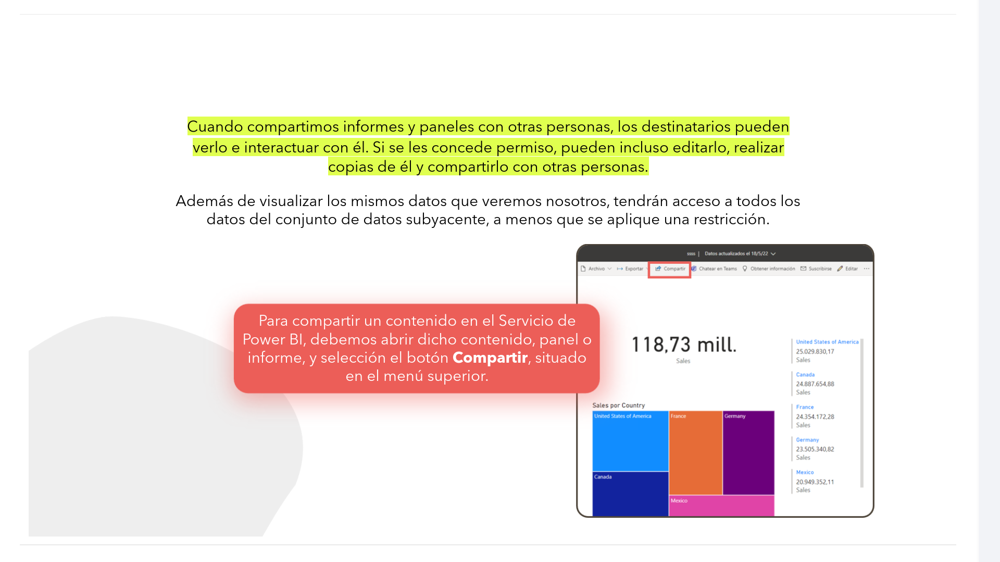
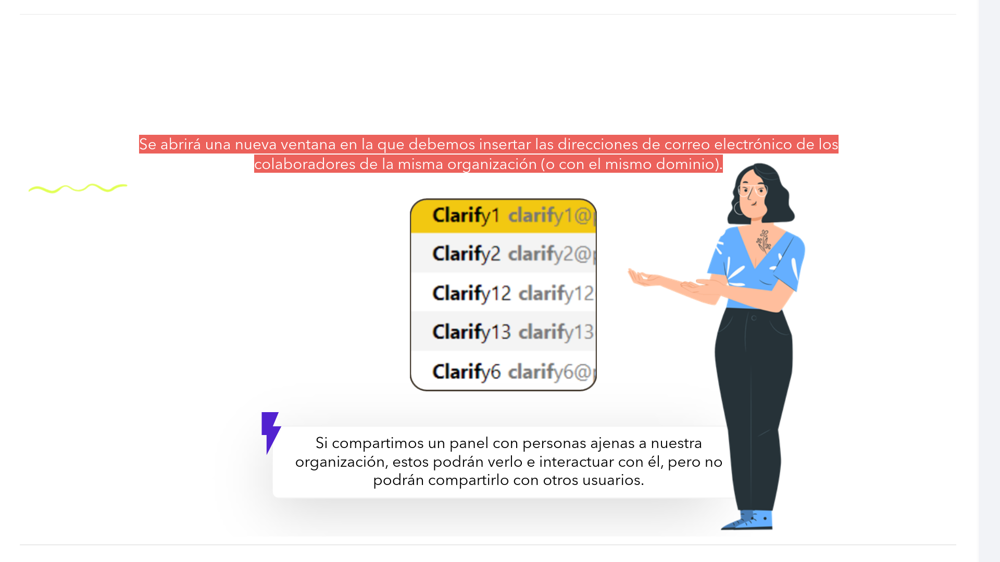
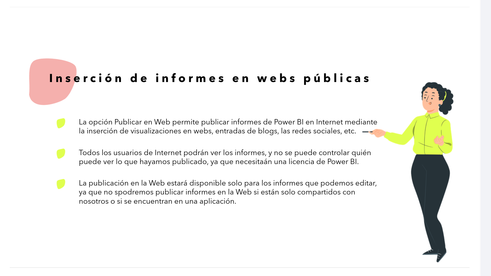
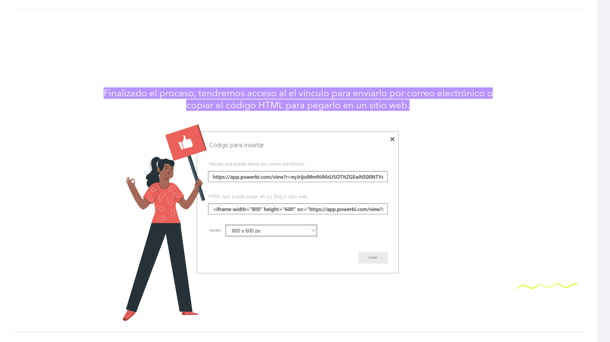
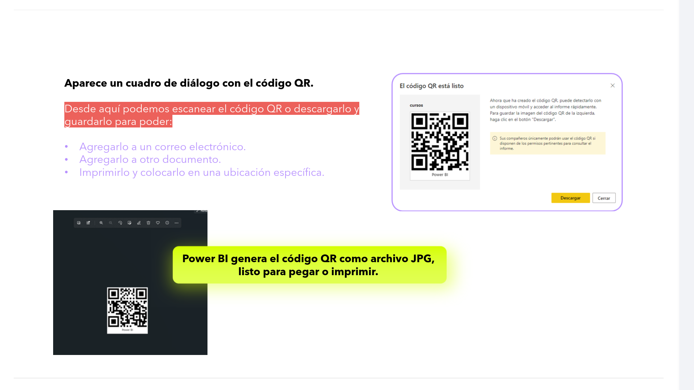
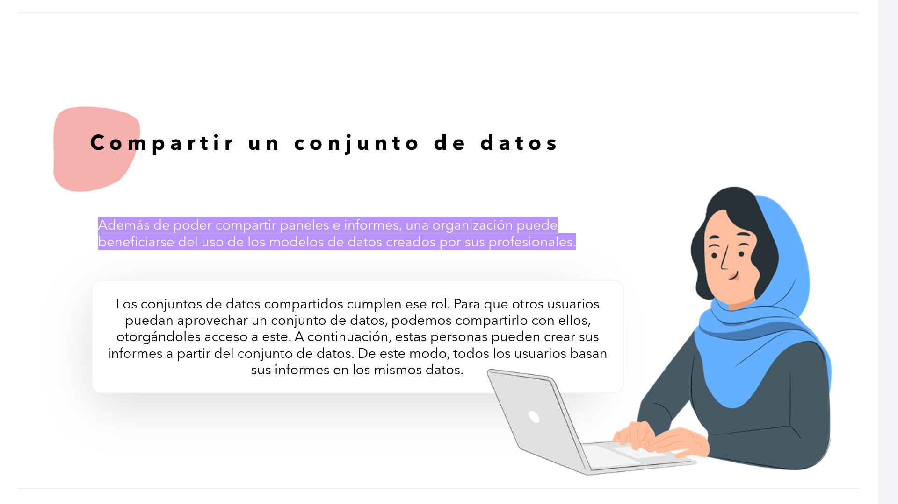
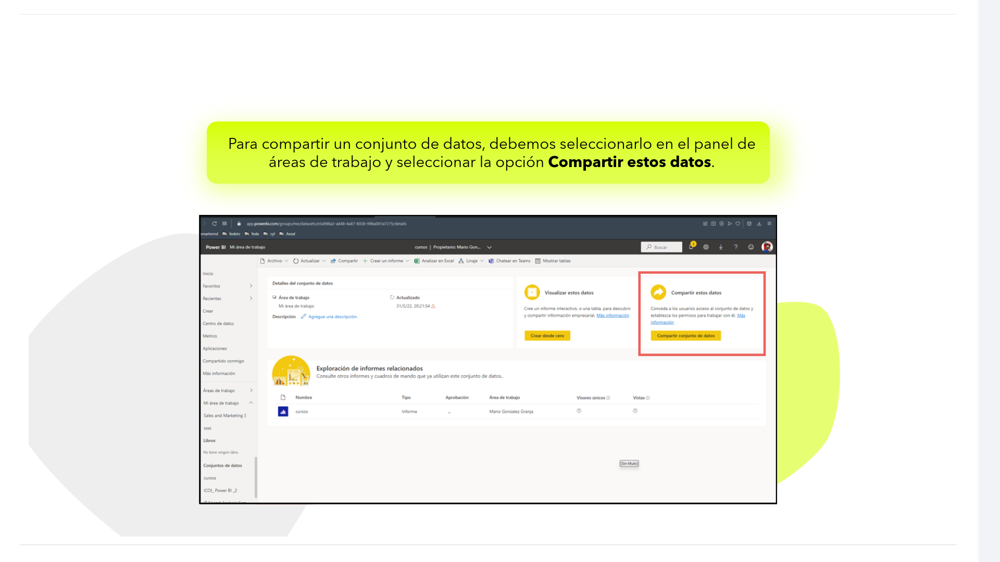

# 08-013	Funcionalidades de PowerBI (4)

-   Colaborar y Compartir en PowerBI
-   Colaborar en un Área de trabajo
-   Condecer Acceso y Permisos
-   Compartir un Área de trabajo
-   Compartir usando HTML
-   Compartir usando QR
-   Compartir los DataSets

## Colaborar y compartir en Power BI

Una vez que hemos creado informes o paneles en Power BI, podemos **compartirlos y colaborar** en ellos con otros compañeros. O **distribuirlos** entre un público más amplio.

---

### Colaborar en un área de trabajo

*   Los profesionales que forman equipos en las organizaciones necesitan tener acceso a los mismos documentos para poder **colaborar con facilidad**. En las áreas de trabajo del Servicio Power BI, los equipos pueden **compartir la propiedad y administración** de paneles, informes y conjuntos de datos.

*   Para ello, pueden **organizar sus áreas de trabajo** de acuerdo con las áreas de la organización, o crear áreas de trabajo **específicas para proyectos concretos**.

*   Además, pueden emplearse varias áreas de trabajo para **agrupar diferentes versiones** de los informes y paneles que usan, o para **agrupar a distintos profesionales** según sus roles o nivel jerárquico.

>   Si necesitamos colaborar en informes y paneles con otras personas, lo realizaremos desde las **Áreas de trabajo** y **no** desde **Mi área de trabajo**, ya que las primeras permiten **compartir la propiedad** del contenido, pudiendo realizar actualizaciones o asignar acceso a otros usuarios fácilmente. 
>
> Mi área de trabajo se dejará para **uso exclusivo del usuario**, con el fin de crear allí contenido personal, privado, prototipos de informe, etc., que sean de **uso único y restringido**.

#### Conceder Acceso y Permisos a los paneles

1.   Si los colaboradores necesitan **mantener actualizado el informe** o necesitan **acceso a todo el contenido** del área de trabajo, debemos agregarlos al área de trabajo como **Miembros** o **Colaboradores**.

2.  Si los colaboradores **solo necesitan ver** el contenido en el área de trabajo, los agregaremos como **lectores**.

3.  Si los colaboradores **solo necesitan ver ese informe** y **no todo el contenido** del área de trabajo, podemos **compartirlo a través de un enlace** o **concederles acceso directo**.

4.  Si el informe y paneles relacionados se necesitan **distribuir a muchas personas**, la mejor opción sea **publicar una aplicación**.

---

### Compartir un área de trabajo

Cuando hemos desarrollado un informe en Power BI Desktop y queremos que otras personas tengan acceso a él, una manera de hacerlo posible es **compartirlo en el Servicio Power BI**.

*   Para ello, lo publicaremos en **Mi área de trabajo** o en un **Área de trabajo** creada para ello, pudiendo entonces crear algunos paneles que lo complementen a la hora de compartirlo.

*   Para compartir informes y paneles **se necesitará una licencia de Power BI Pro**, y aquellos con quienes se comparta, también requerirán disponer de esa licencia, o bien que el contenido esté en un área de trabajo de una **capacidad Premium** (Aunque actualmente, 2026, PowerBI/Microsoft Fabric sí permite compartir espacios de trabajo con cuentas gratuítas).

*   Cuando **compartimos informes y paneles** con otras personas, los destinatarios pueden **verlo e interactuar con él**. Si se les concede permiso, pueden incluso **editarlo, realizar copias de él y compartirlo** con otras personas.  

*   Además de visualizar los mismos datos que veremos nosotros, **tendrán acceso a todos los datos del conjunto de datos subyacente**, a menos que se aplique una restricción.  

> Para compartir un contenido en el Servicio de Power BI, debemos abrir dicho contenido, panel o informe, y selección el botón **Compartir**, situado en el menú superior.

*   Se abrirá una nueva ventana en la que debemos **insertar las direcciones de correo electrónico** de los colaboradores de la **misma organización** (o con el mismo dominio).

> Si compartimos un panel con personas **ajenas a nuestra organización**, estos podrán **verlo e interactuar con él**, pero **no podrán compartirlo** con otros usuarios.

---

### Insertar Informes en webs públicas con código HTML

*   La opción **Publicar en Web** permite publicar informes de Power BI en Internet mediante la **inserción de visualizaciones** en webs, entradas de blogs, las redes sociales, etc.

*   **Todos los usuarios de Internet podrán ver los informes**, y **no se puede controlar quién puede ver** lo que hayamos publicado, ya que necesitaán una licencia de Power BI.

*   La publicación en la Web estará disponible **solo para los informes que podemos editar**, ya que no spodremos publicar informes en la Web si están solo compartidos con nosotros o si se encuentran en una aplicación.

#### Creación dlel cógigo HTML para compartir en web

Publicar en la web está disponible en informes que se pueden **editar en áreas de trabajo personales o de grupo**.  

>   Debemos abrir el informe en un área de trabajo que pueda editar y seleccionar en el menú **Archivo** la opción **Insertar informe** y **Publicar en la web (público)** .

*   Finalizado el proceso, tendremos acceso al **vínculo para enviarlo por correo electrónico** o **copiar el código HTML** para pegarlo en un sitio web.

---

### Compartir usando un QR

Podemos **crear un código QR** en el **Servicio Power BI** para **informes, paneles o iconos** contenidos en cualquier panel o informe, **incluso en los que no podamos editar**. Luego podemos **pegar ese código QR** en un correo electrónico, una web, imprimirlo, etc.

*   También se puede **digitalizar el código QR** para **acceder al icono directamente** desde dispositivos móviles.

#### Generando el QR

1.  Abriremos en primer lugar el **informe en el Servicio Power BI**. 

2.  Luego seleccionamos el icono **Generar un código QR** de la lista desplegable del menú **Archivo**.

3.  Aparece un **cuadro de diálogo** con el código QR.

4.  Desde aquí podemos **escanear el código QR** o **descargarlo y guardarlo** para poder:

    * **Agregarlo a un correo electrónico**.
    * **Agregarlo a otro documento**.
    * **Imprimirlo y colocarlo** en una ubicación específica.

> **Power BI genera el código QR como archivo JPG**, listo para integrar, pegar o imprimir.

---

## Compartir un conjunto de datos

Además de poder compartir paneles e informes, una organización puede **beneficiarse del uso de los modelos de datos creados por sus profesionales**.  

Los **conjuntos de datos compartidos** cumplen ese rol. Para que otros usuarios puedan aprovechar un conjunto de datos, podemos **compartirlo con ellos, otorgándoles acceso a este**.  

A continuación, estas personas pueden **crear sus informes a partir del conjunto de datos**. De este modo, todos los usuarios basan sus informes en los mismos datos.  

> Para compartir un conjunto de datos, debemos **seleccionarlo en el panel de áreas de trabajo** y seleccionar la opción **Compartir estos datos**.

