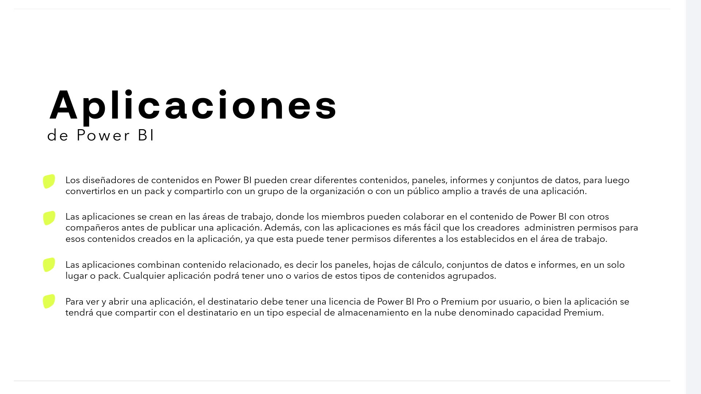
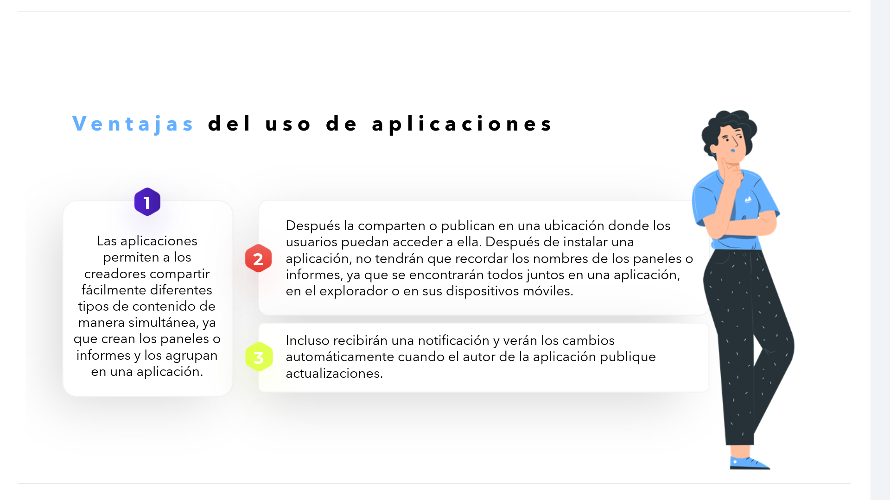
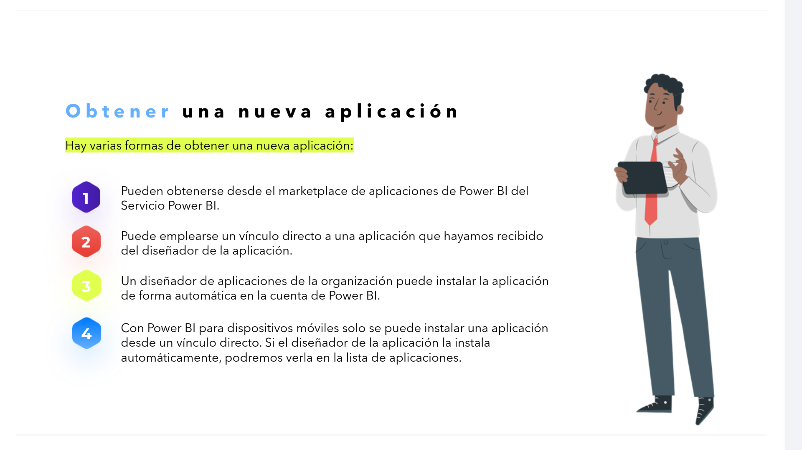
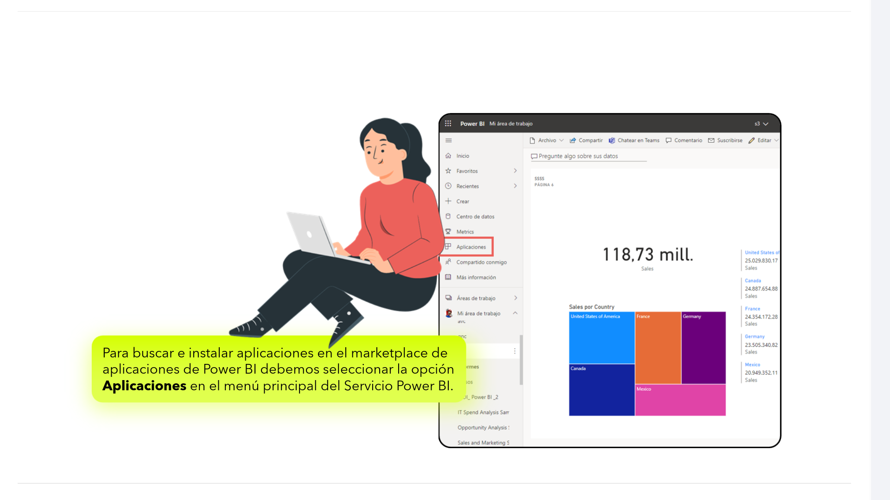
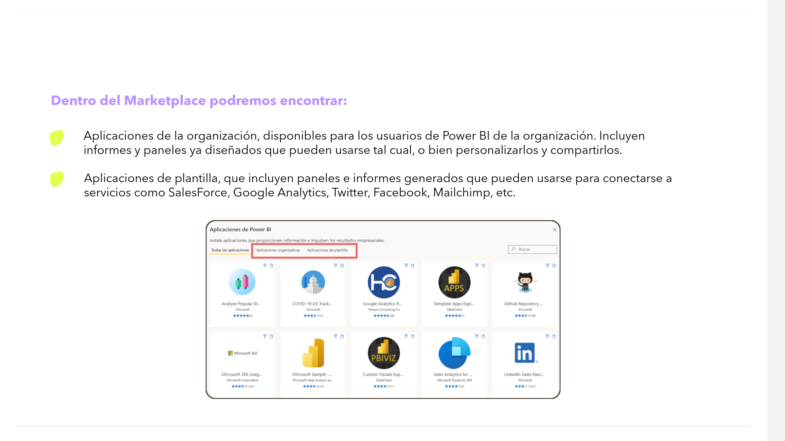

# 08-014	Aplicaciones de PowerBI

## Apps de PowerBi

> Son el verdadero negocio de PowerBI después de los datos, siendo en su mayoría aplicaciones de pago externo a la propia licencia de PowerBI.

*   Los diseñadores de contenidos en Power BI pueden crear diferentes contenidos, paneles, informes y conjuntos de datos, para luego **convertirlos en un pack y compartirlo** con un grupo de la organización o con un público amplio a través de una aplicación.

*   Las aplicaciones se crean en las áreas de trabajo, donde los miembros pueden **colaborar en el contenido de Power BI** con otros compañeros antes de publicar una aplicación. Además, con las aplicaciones es más fácil que los creadores **administren permisos** para esos contenidos creados en la aplicación, ya que esta puede tener permisos diferentes a los establecidos en el área de trabajo.

*   Las aplicaciones **combinan contenido relacionado**, es decir los paneles, hojas de cálculo, conjuntos de datos e informes, en un solo lugar o pack. Cualquier aplicación podrá tener uno o varios de estos tipos de contenidos agrupados.

*   Para ver y abrir una aplicación, el destinatario debe tener una **licencia de Power BI Pro o Premium por usuario**, o bien la aplicación se tendrá que compartir con el destinatario en un tipo especial de almacenamiento en la nube denominado **capacidad Premium**.

### Ventajas del uso de aplicaciones

1. Las aplicaciones **permiten a los creadores compartir fácilmente** diferentes tipos de contenido de manera simultánea, ya que crean los paneles o informes y los **agrupan en una aplicación**.

2. Después la comparten o publican en una **ubicación donde los usuarios puedan acceder a ella**. Después de instalar una aplicación, **no tendrán que recordar los nombres** de los paneles o informes, ya que se encontrarán todos juntos en una aplicación, en el explorador o en sus dispositivos móviles.

3. Incluso **recibirán una notificación** y verán los **cambios automáticamente** cuando el autor de la aplicación publique actualizaciones.

---

### Obtener una nueva aplicación

**Hay varias formas de obtener una nueva aplicación:**

1.  Pueden obtenerse desde el **marketplace de aplicaciones** de Power BI del Servicio Power BI.

2.  Puede emplearse un **vínculo directo** a una aplicación que hayamos recibido del diseñador de la aplicación.

3.  Un diseñador de aplicaciones de la organización puede **instalar la aplicación de forma automática** en la cuenta de Power BI.

4.  Con Power BI para dispositivos móviles solo se puede instalar una aplicación desde un vínculo directo. Si el diseñador de la aplicación la instala automáticamente, podremos verla en la lista de aplicaciones.

> Para buscar e instalar aplicaciones en el marketplace de aplicaciones de Power BI debemos seleccionar la opción **Aplicaciones** en el menú principal del Servicio Power BI.

-   **Dentro del Marketplace podremos encontrar:**

    *   **Aplicaciones de la organización**, disponibles para los usuarios de Power BI de la organización. Incluyen informes y paneles ya diseñados que pueden usarse tal cual, o bien personalizarlos y compartirlos.

    *   **Aplicaciones de plantilla**, que incluyen paneles e informes generados que pueden usarse para conectarse a servicios como SalesForce, Google Analytics, Twitter, Facebook, Mailchimp, etc.
