# 08-015	Actualizar datos en PowerBI

- Actualización Manual
- Actualización Programada
-   Programar actualizaciones
- Actualización desde OneDrive o SharePoint
- Notifficacines de Error en las actualizaciones
- Actualizar SOLAMENTE ciertas páginas de un informe

## Actualizar los DataSets en Power BI es el proceso más importante

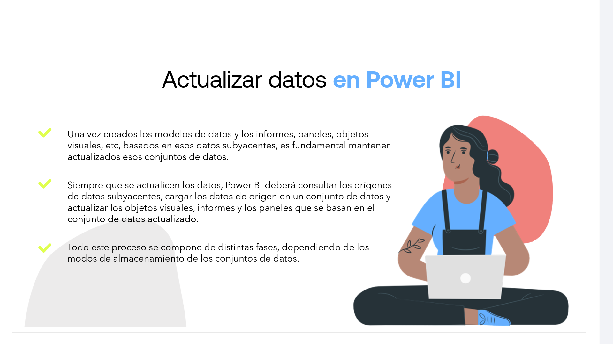

* Una vez creados los modelos de datos y los informes, paneles, objetos visuales, etc, basados en esos datos subyacentes, es fundamental mantener actualizados esos conjuntos de datos.

* Siempre que se actualicen los datos, Power BI deberá consultar los orígenes de datos subyacentes, cargar los datos de origen en un conjunto de datos y actualizar los objetos visuales, informes y los paneles que se basan en el conjunto de datos actualizado.

* Todo este proceso se compone de distintas fases, dependiendo de los modos de almacenamiento de los conjuntos de datos.

---

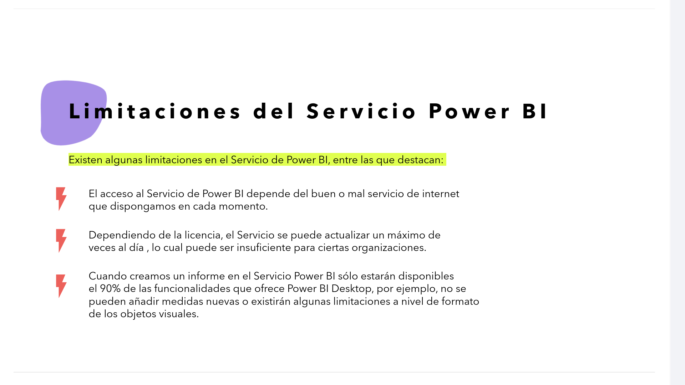

### Limitaciones del Servicio Power BI

**Existen algunas limitaciones en el Servicio de Power BI, entre las que destacan:**

* El acceso al Servicio de Power BI depende del buen o mal servicio de internet que dispongamos en cada momento.
* Dependiendo de la licencia, el Servicio se puede actualizar un máximo de veces al día, lo cual puede ser insuficiente para ciertas organizaciones.
* Cuando creamos un informe en el Servicio Power BI sólo estarán disponibles el 90% de las funcionalidades que ofrece Power BI Desktop, por ejemplo, no se pueden añadir medidas nuevas o existirán algunas limitaciones a nivel de formato de los objetos visuales.

---

## Proceso de Actualización de datos

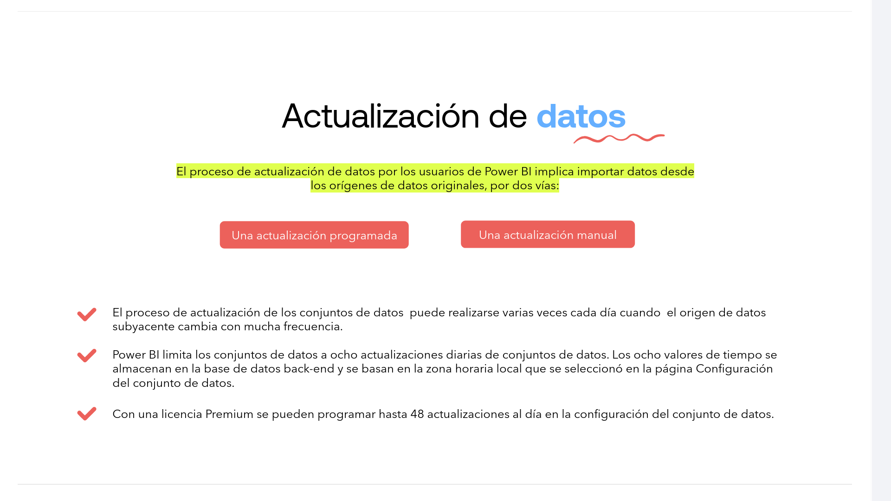

*   **El proceso de actualización de datos por los usuarios de Power BI implica importar datos desde los orígenes de datos originales, por dos vías:**

    1.  **Actualización programada**
    2.  **Actualización manual**

*   El proceso de actualización de los conjuntos de datos puede realizarse varias veces cada día cuando el origen de datos subyacente cambia con mucha frecuencia.

*   Power BI limita los conjuntos de datos a ocho actualizaciones diarias de conjuntos de datos. Los ocho valores de tiempo se almacenan en la base de datos back-end y se basan en la zona horaria local que se seleccionó en la página Configuración del conjunto de datos.

*   Con una licencia Premium se pueden programar hasta 48 actualizaciones al día en la configuración del conjunto de datos.

---

### Actualización **Manual**

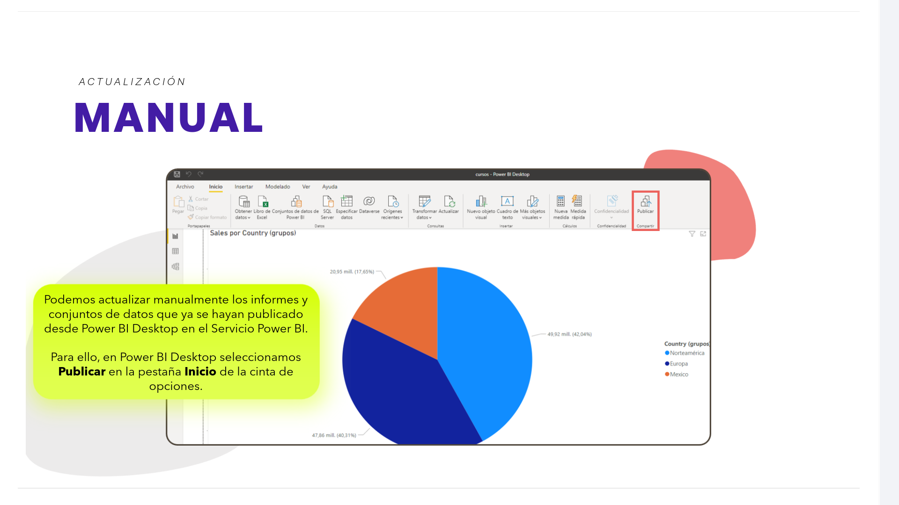

Podemos actualizar manualmente los informes y conjuntos de datos que ya se hayan publicado desde Power BI Desktop en el Servicio Power BI. Para ello... 

1.  en Power BI Desktop seleccionamos **Publicar** en la pestaña **Inicio** de la cinta de opciones.

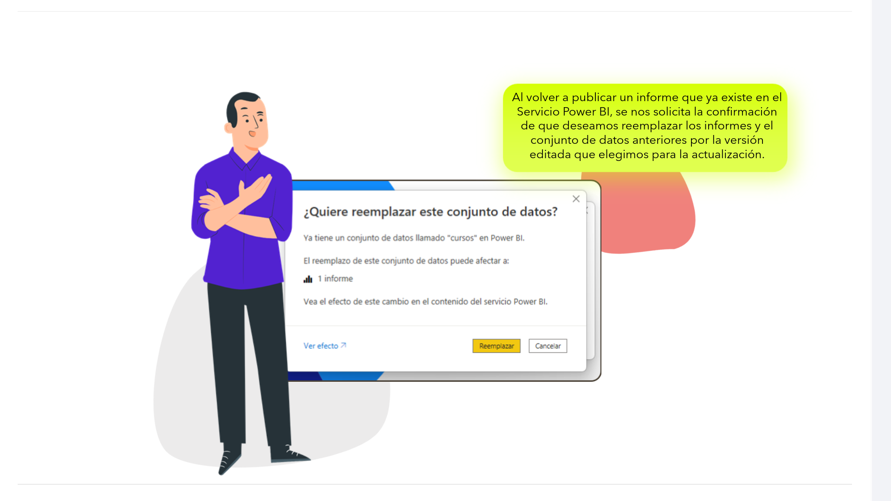

2.    Al volver a publicar un informe que ya existe en el Servicio Power BI, se nos solicita la confirmación de que deseamos reemplazar los informes y el conjunto de datos anteriores por la versión editada que elegimos para la actualización.

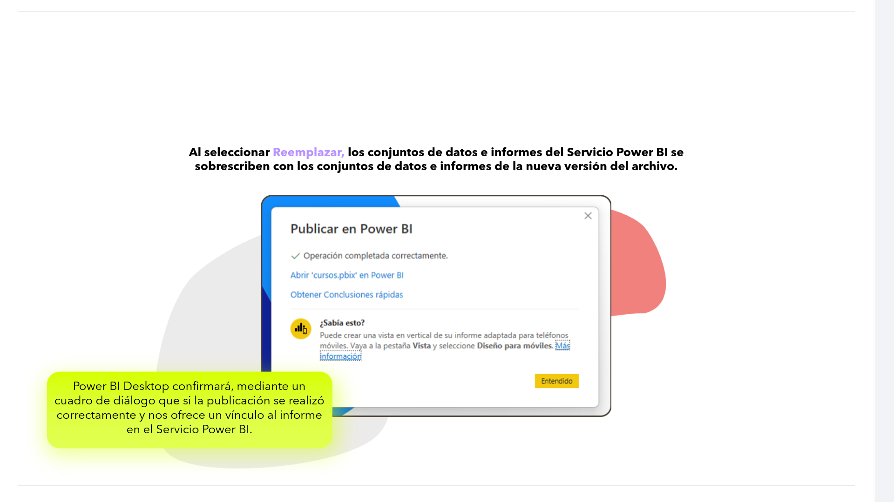

3.  **Al seleccionar Reemplazar, los conjuntos de datos e informes del Servicio Power BI se sobrescriben con los conjuntos de datos e informes de la nueva versión del archivo.**

Power BI Desktop confirmará, mediante un cuadro de diálogo que si la publicación se realizó correctamente y nos ofrece un vínculo al informe en el Servicio Power BI.

---

### Actualización **Programada**

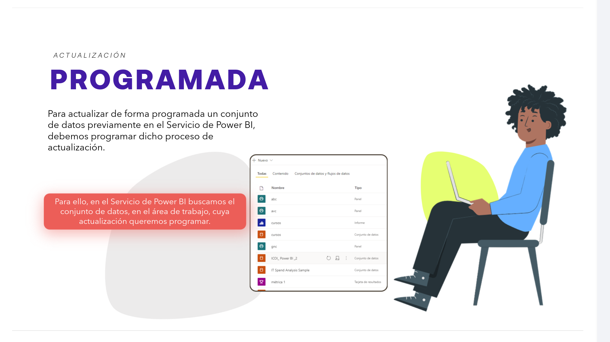

Para actualizar de forma programada un conjunto de datos previamente en el Servicio de Power BI, debemos programar dicho proceso de actualización. Para ello...:

1.  En el Servicio de Power BI buscamos el conjunto de datos, en el área de trabajo, cuya actualización queremos programar.

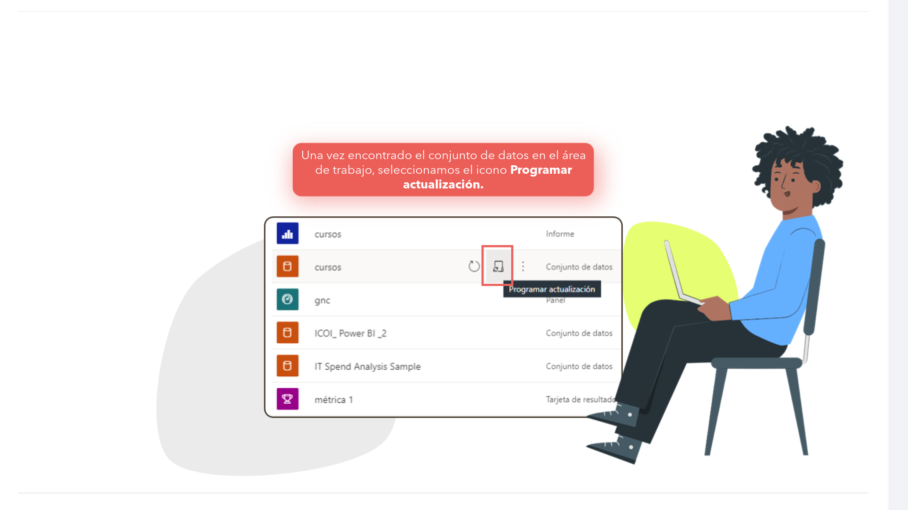

2.  Una vez encontrado el conjunto de datos en el área de trabajo, seleccionamos el icono **Programar actualización**.

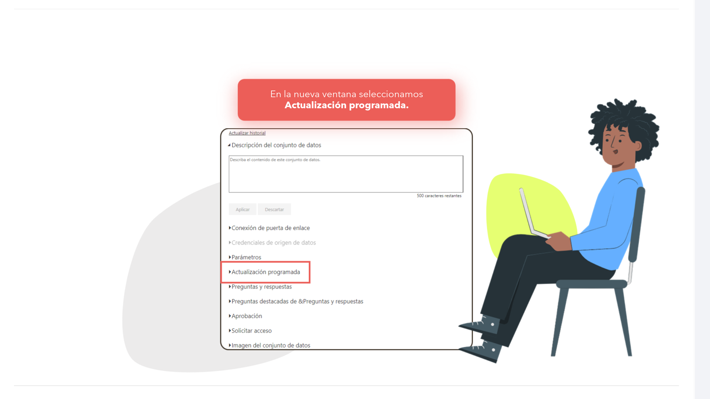

3.  En la nueva ventana seleccionamos **Actualización programada**.

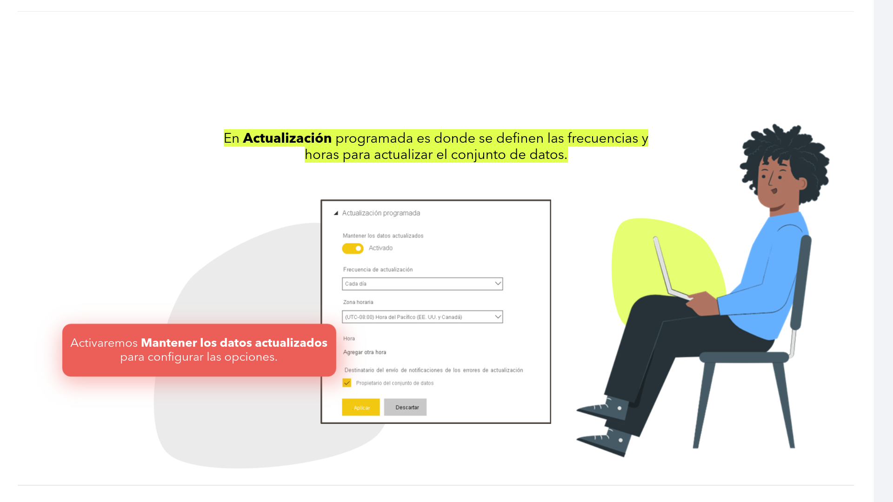

4.  En **Actualización programada** es donde se definen las frecuencias y horas para actualizar el conjunto de datos.

5.  Activaremos **Mantener los datos actualizados** para configurar las opciones.

---

#### Establecer una programación de actualización

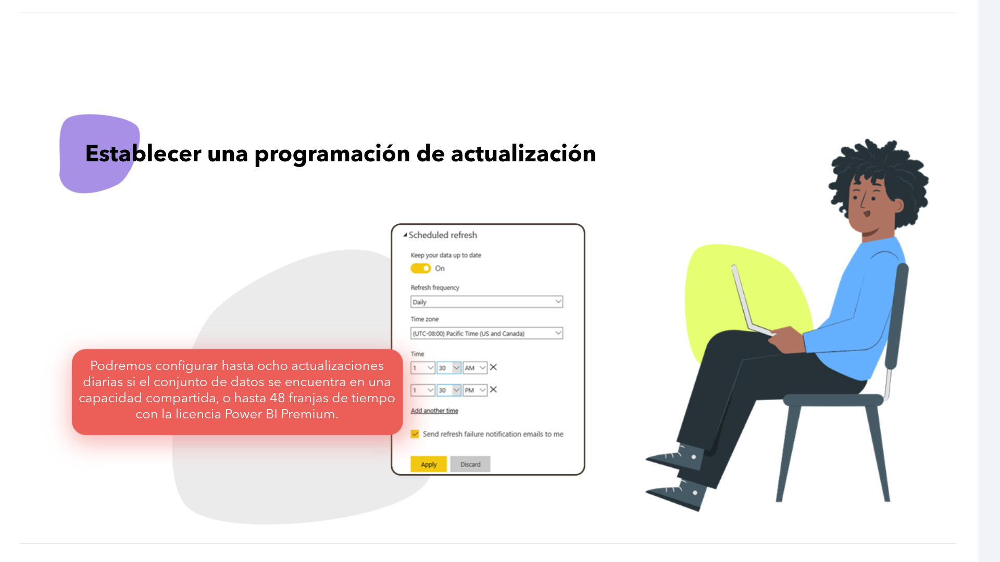

> Podremos configurar hasta ocho actualizaciones diarias si el conjunto de datos se encuentra en una capacidad compartida, o hasta 48 franjas de tiempo con la licencia Power BI Premium.

---

### Actualización desde OneDrive o SharePoint Online

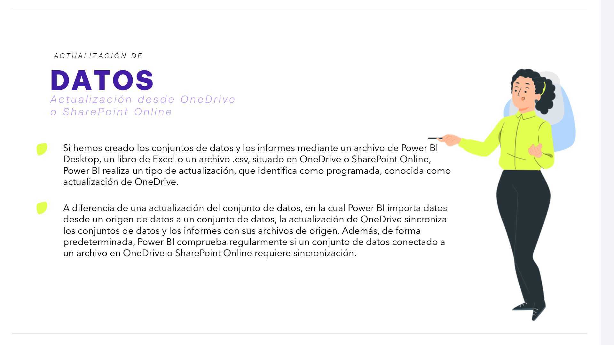

Si hemos creado los conjuntos de datos y los informes mediante un archivo de Power BI Desktop, un libro de Excel o un archivo .csv, situado en OneDrive o SharePoint Online, Power BI realiza un tipo de actualización, que identifica como programada, conocida como **actualización de OneDrive**.

A diferencia de una actualización del conjunto de datos, en la cual Power BI importa datos desde un origen de datos a un conjunto de datos...  

* La actualización de OneDrive **sincroniza los conjuntos de datos y los informes con sus archivos de origen.**

*   Además, **de forma predeterminada, Power BI comprueba regularmente** si un conjunto de datos conectado a un archivo en OneDrive o SharePoint Online requiere sincronización.

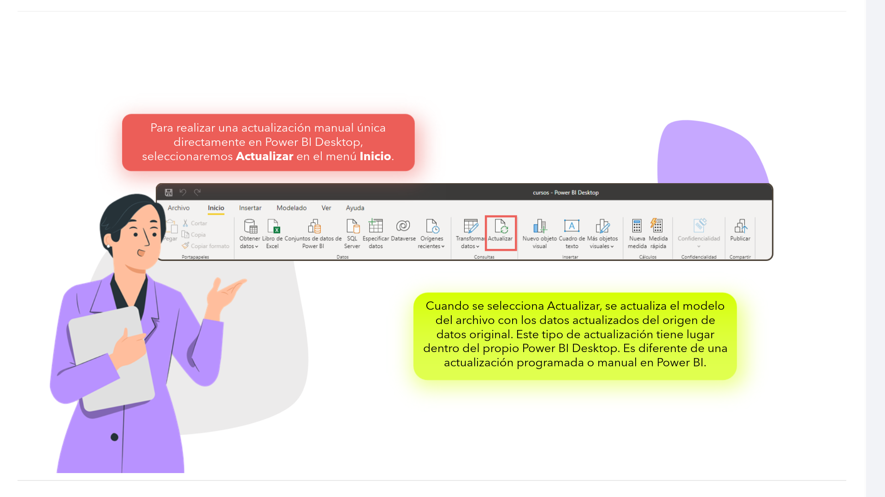

Para realizar una actualización manual única directamente en Power BI Desktop...:

1.  Seleccionaremos **Actualizar** en el menú **Inicio**.

2.  Cuando se selecciona Actualizar, se actualiza el modelo del archivo con los datos actualizados del origen de datos original. Este tipo de actualización tiene lugar dentro del propio Power BI Desktop. Es diferente de una actualización programada o manual en Power BI.

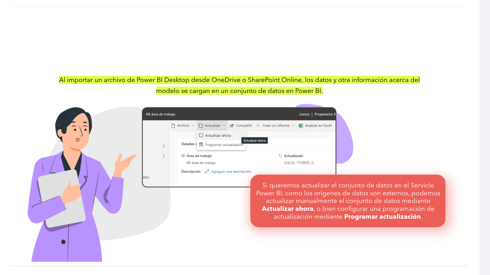

3.  **Al importar un archivo de Power BI Desktop desde OneDrive o SharePoint Online, los datos y otra información acerca del modelo se cargan en un conjunto de datos en Power BI.**

4.  Si queremos actualizar el conjunto de datos en el Servicio Power BI, como los orígenes de datos son externos, podemos actualizar manualmente el conjunto de datos mediante **Actualizar ahora**, o bien configurar una programación de actualización mediante **Programar actualización**.

---

#### **Notificaciones de error** *de las actualizaciones programadas*

*   Power BI enviará notificaciones de error de las actualizaciones, por medio de un correo electrónico al propietario del conjunto de datos, en caso de que se produzcan errores de actualización, o cuando el Servicio Power BI deshabilita la programación debido a errores consecutivos.

*   Se puede programar el envío de notificaciones de error de actualización a otros usuarios, además de al propietario del conjunto de datos, para garantizar que los problemas se detectan y se abordan a tiempo.

*   Además, Power BI también envía notificaciones de errores de actualización cuando el Servicio Power BI detiene una actualización programada debido a su inactividad, que es cuando ningún usuario ha visitado un panel o informe generado para el conjunto de datos en un plazo de dos meses.

*   En esta situación, Power BI envía automáticamente un mensaje de correo electrónico al propietario del conjunto de datos en el que comunica que el Servicio ha pausado la programación de la actualización de ese conjunto de datos específico.

Para ello:  

1.  Seleccionando el icono de advertencia se puede obtener información adicional, incluyendo detalles del error en **Ver detalles**.

2.  **El Servicio Power BI ofrece la funcionalidad Solución de problemas específica para los fallos de actualización de datos.**

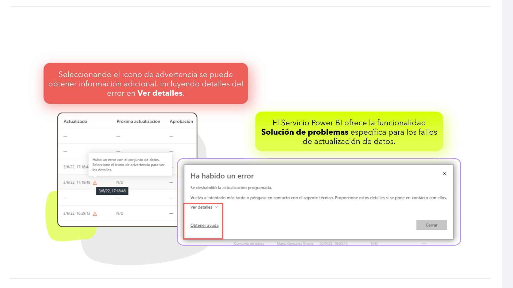

3.  Si disponemos del rol de administradores de los conjuntos de datos podremos acceder al historial de actualizaciones, que permite revisar el estado de los últimos ciclos de sincronización.

4.  En el historial de actualizaciones se muestran las actualizaciones realizadas y también cuándo una actualización afectada ha vuelto a funcionar de nuevo.

---

#### **Actualización automática** *de páginas*

Otra funcionalidad que ofrece Power BI en el proceso de actualización de datos es la actualización automática de páginas, que funciona en el nivel de página de informes, y permite a los creadores de informes establecer un intervalo de actualización de los objetos visuales situados dentro de una página concreta de un informe que solo está activo cuando la página se está usando.  

La actualización automática de páginas **solo estará disponible en orígenes de datos de DirectQuery y el intervalo de actualización mínimo dependerá del tipo de área de trabajo en la que el informe se haya publicado y de la configuración de administración** Premium.

---

### Procedimientos recomendados

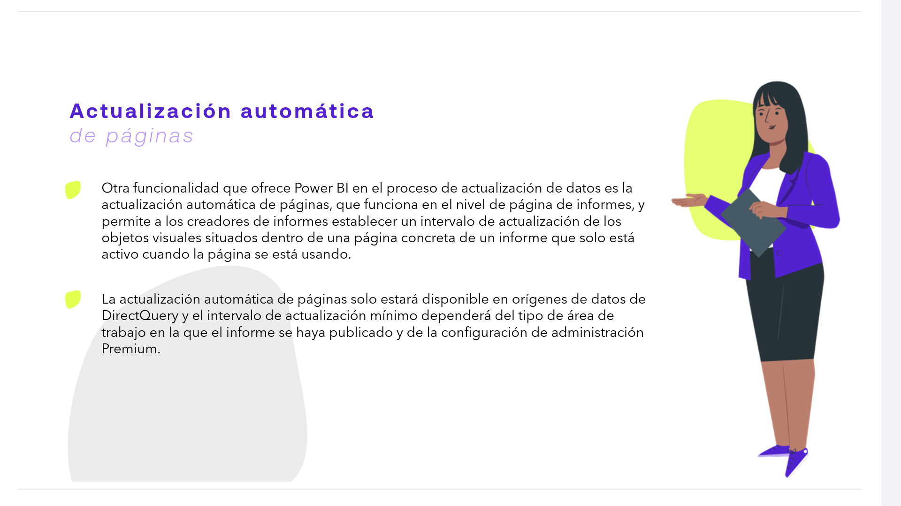

*   Comprobar el historial de actualizaciones de los conjuntos de datos con regularidad para asegurarse de que los informes y los paneles emplean datos actualizados.

*   Si se detectan problemas de actualización, solucionarlos con rapidez y realizar un seguimiento con el propietario del conjunto de datos.

*   Programar las actualizaciones en las horas menos frecuentadas por los usuarios.

*   Tener presentes los límites de actualización y analizar alternativas.

*   Optimizar los conjuntos de datos para que incluyan solo las tablas y columnas que se utilizan los informes y paneles.

*   Limitar el número de objetos visuales en los paneles, ya que un número excesivo de iconos por panel puede aumentar considerablemente la duración de la actualización.

*   Aplicar la misma configuración de privacidad que en Power BI Desktop para asegurarse de que Power BI pueda generar consultas eficaces a los orígenes de datos.

*   Comprobar que Power BI puede enviar notificaciones de error de actualización a nuestro correo, evitando que se desvíen a la bandeja de spam.

---

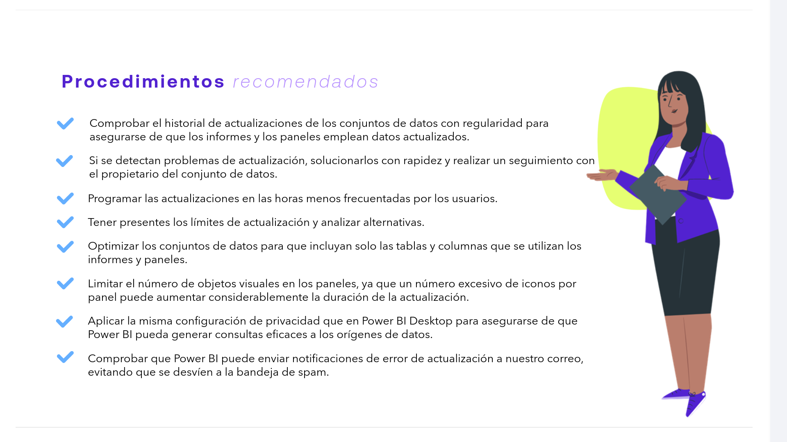

**Para poder actualizar los datos en el Servicio Power BI:**

1.  Debemos contar con una licencia de Power BI Pro.
2.  Acceder al Servicio de Power BI con la cuenta Pro.
