# 08-016	Métricas, Objetivos, Cuadros de Mando

## Métricas, objetivos y cuadros **en Power BI**

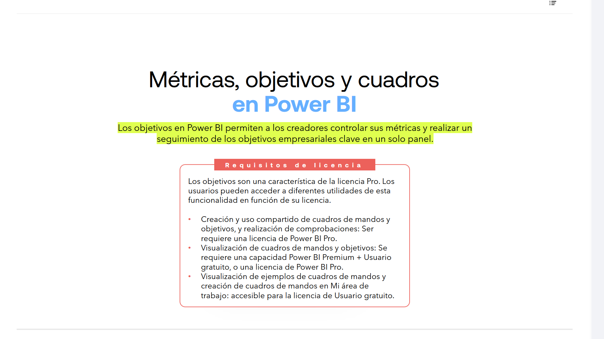

Los objetivos en Power BI permiten a los creadores controlar sus métricas y realizar un seguimiento de los objetivos empresariales clave en un solo panel.

### **Requisitos de licencia**

Los objetivos son una característica de la licencia Pro. Los usuarios pueden acceder a diferentes utilidades de esta funcionalidad en función de su licencia.

* 	**Creación y uso compartido de cuadros de mandos y objetivos, y realización de comprobaciones**: Ser requiere una licencia de Power BI Pro.

* 	**Visualización de cuadros de mandos y objetivos**: Se requiere una capacidad Power BI Premium + Usuario gratuito, o una licencia de Power BI Pro.

* 	**Visualización de ejemplos de cuadros de mandos y creación de cuadros de mandos en Mi área de trabajo**: accesible para la licencia de Usuario gratuito.

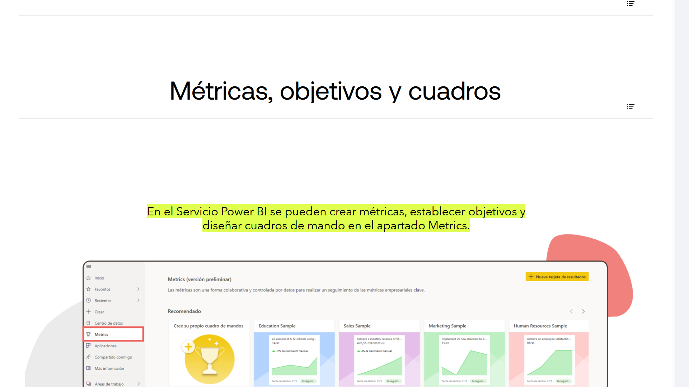

En el Servicio Power BI se pueden crear métricas, establecer objetivos y diseñar cuadros de mando en el apartado Metrics.

### Apartado **Recomendado**

En el apartado Metrics disponemos de una zona donde se recomiendan métricas y ejemplos de cuadros de mando o se nos permite crear nuestros propios cuadros de mando.

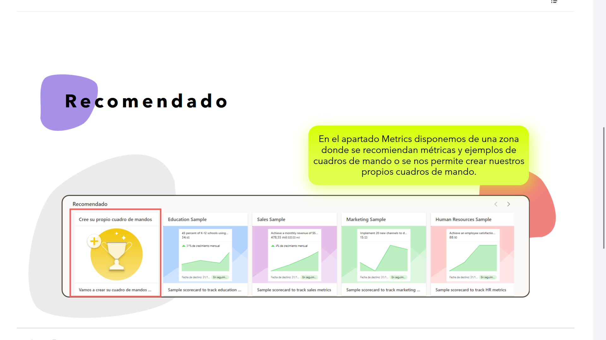

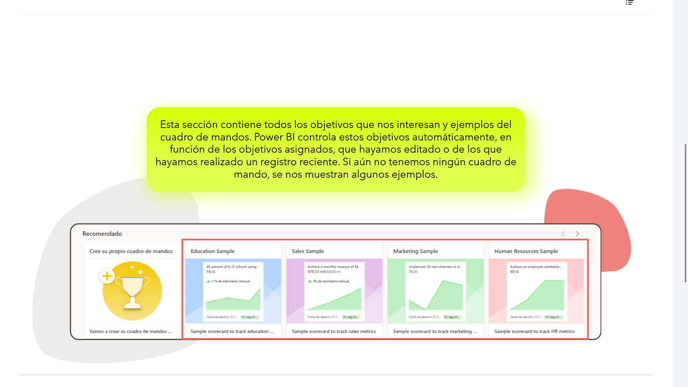

* Esta sección contiene todos los objetivos que nos interesan y ejemplos del cuadro de mandos. 

* Power BI controla estos objetivos automáticamente, en función de los objetivos asignados, que hayamos editado o de los que hayamos realizado un registro reciente.

* Si aún no tenemos ningún cuadro de mando, se nos muestran algunos ejemplos.

* Podemos acceder a algunos de los ejemplos mostrados para visualizar la información del cuadro de mando.

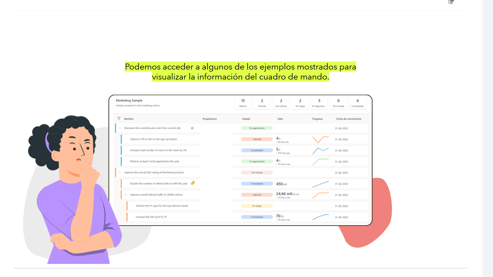

### Secciones **Recientes / Favoritos / Compartido conmigo / Todos los Cuadros de Mando**

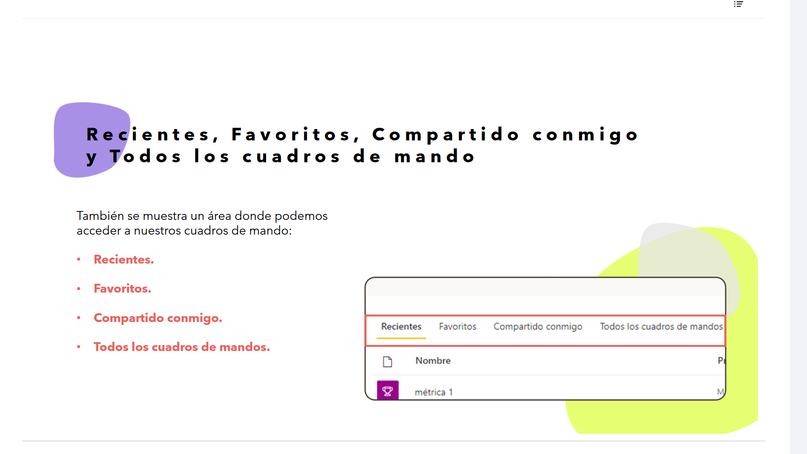

También se muestra un área donde podemos acceder a nuestros cuadros de mando:

* **Recientes.**
* **Favoritos.**
* **Compartido conmigo.**
* **Todos los cuadros de mandos.**

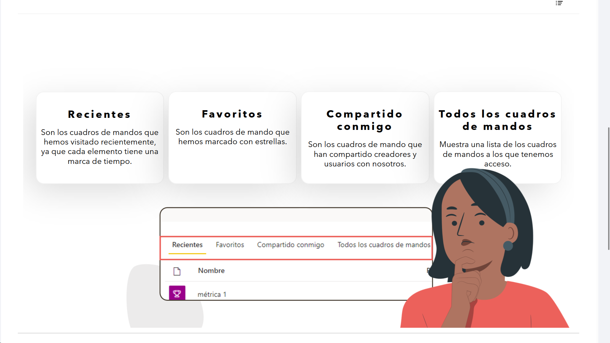

-	**Recientes** 
	Son los cuadros de mandos que hemos visitado recientemente, ya que cada elemento tiene una marca de tiempo.

-	**Favoritos**
	Son los cuadros de mando que hemos marcado con estrellas.

- **Compartido conmigo**
	Son los cuadros de mando que han compartido creadores y usuarios con nosotros.

- **Todos los Cuadros de Mando** 
	Muestra una lista de los cuadros de mandos a los que tenemos acceso.
	
	
---

## **Actualización de los objetivos en el cuadro de mando**

> Los cuadros de mando recogen información adicional, por lo que se actualizarán también en función de las necesidades de la organización

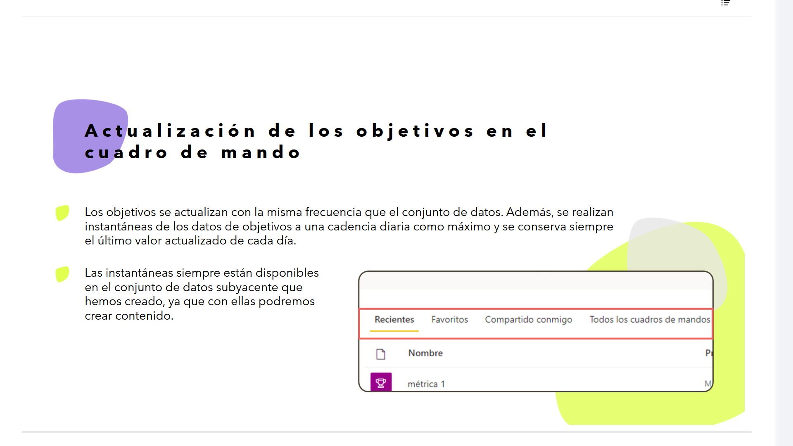

* Los objetivos se actualizan con la misma frecuencia que el conjunto de datos. Además, se realizan instantáneas de los datos de objetivos a una cadencia diaria como máximo y se conserva siempre el último valor actualizado de cada día.
* Las instantáneas siempre están disponibles en el conjunto de datos subyacente que hemos creado, ya que con ellas podremos crear contenido.

---

## **Creación de cuadros de mando y objetivos manuales**

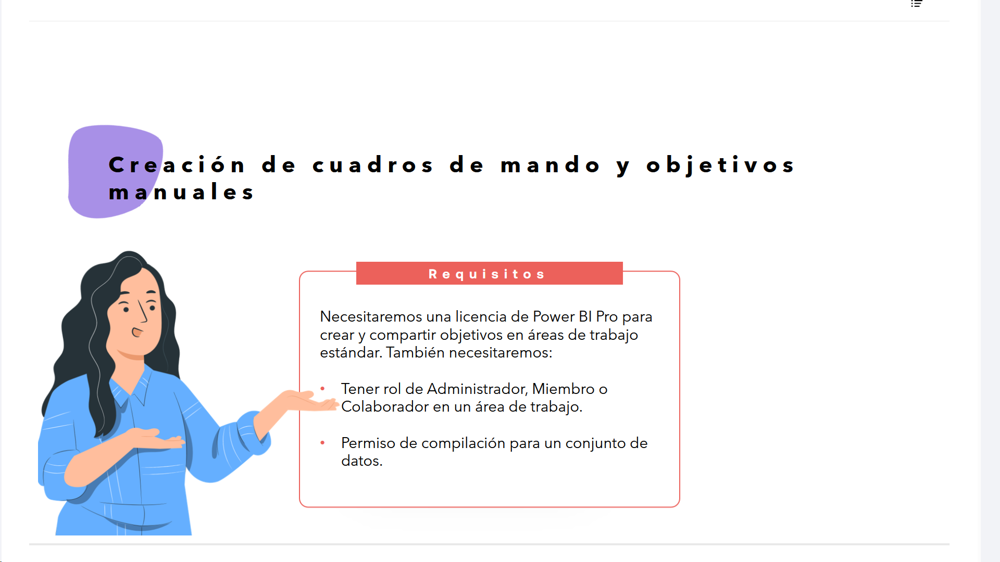

**Requisitos de Licencia**

- 	Necesitaremos una licencia de Power BI Pro para crear y compartir objetivos en áreas de trabajo estándar. 
- 	También necesitaremos:

	* 	Tener rol de Administrador, Miembro o Colaborador en un área de trabajo.
	* 	Permiso de compilación para un conjunto de datos.

### Pasos para **crear un Cuadro de Mando manual**

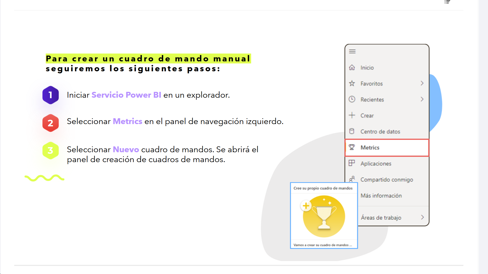
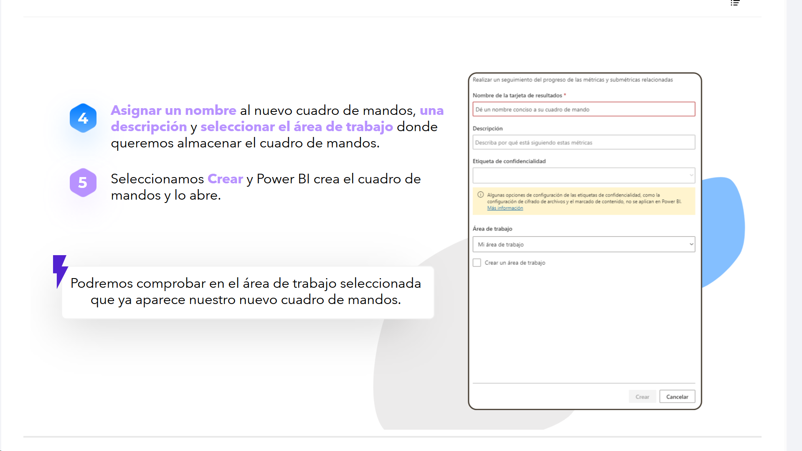

**Para crear un cuadro de mando manual seguiremos los siguientes pasos:**

1. 	Iniciar **Servicio Power BI** en un explorador.

2. 	Seleccionar **Metrics** en el panel de navegación izquierdo.

3. 	Seleccionar **Nuevo** cuadro de mandos. Se abrirá el panel de creación de cuadros de mandos.

4. 	**Asignar un nombre** al nuevo cuadro de mandos, **una descripción** y **seleccionar el área de trabajo** donde queremos almacenar el cuadro de mandos.

5. 	Seleccionamos **Crear** y Power BI crea el cuadro de mandos y lo abre.

> Podremos comprobar en el área de trabajo seleccionada que ya aparece nuestro nuevo cuadro de mandos.

---

### **Crear un objetivo manual**

> Una vez creado un cuadro de mando, es cuando creamos sus objetivos manualmente

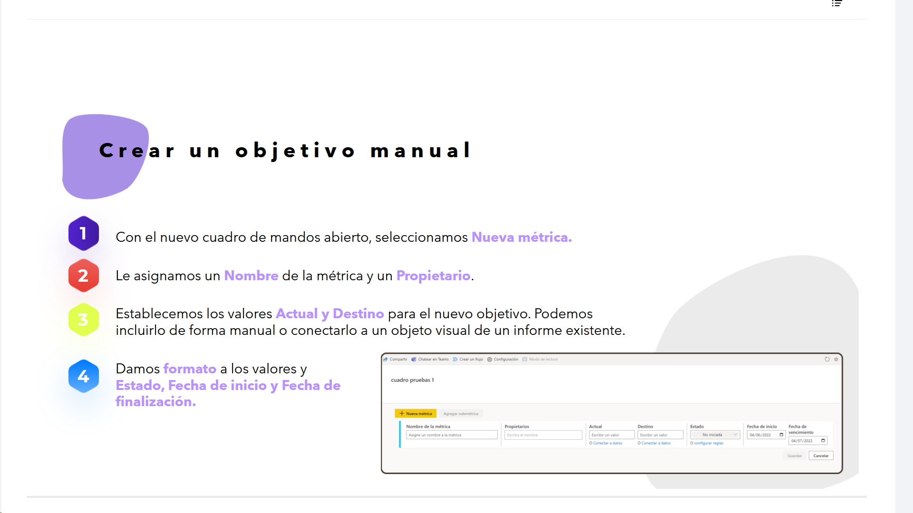
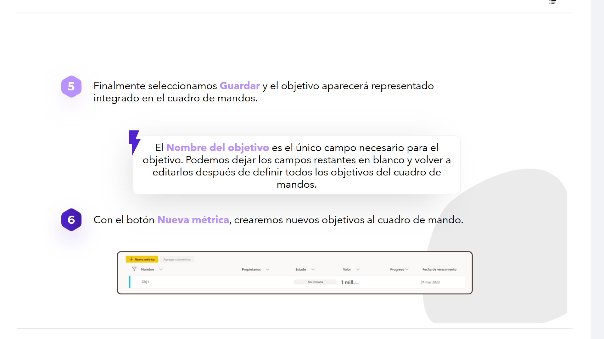

1. 	Con el nuevo cuadro de mandos abierto, seleccionamos **Nueva métrica**.

2. 	Le asignamos un **Nombre** de la métrica y un **Propietario**.

3. 	Establecemos los valores **Actual y Destino** para el nuevo objetivo. Podemos incluirlo de forma manual o conectarlo a un objeto visual de un informe existente.

4. 	Damos **formato** a los valores y **Estado, Fecha de inicio y Fecha de finalización**.

5. Finalmente seleccionamos **Guardar** y el objetivo aparecerá representado integrado en el cuadro de mandos.

	> El **Nombre del objetivo** es el único campo necesario para el objetivo. Podemos dejar los campos restantes en blanco y volver a editarlos después de definir todos los objetivos del cuadro de mandos.

6. Con el botón **Nueva métrica**, crearemos nuevos objetivos al cuadro de mando.

#### SUB-Objetivos

> Dentro de un Objetivo, se pueden crear **subobjetivos** más específicos

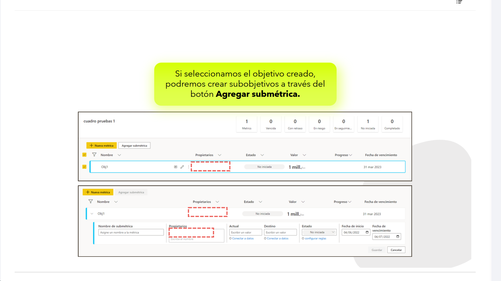

Si seleccionamos el objetivo creado, podremos crear subobjetivos a través del botón **Agregar submétrica**.

---

### **Crear un objetivo conectado**

> Los cuadrod de mando y objetivos pueden mantenerse actualizados conectándolos a las fuentes de datos subyacentes

Veamos ahora cómo conectar los valores de los objetivos creados en los cuadros de mando a los datos en un informe de Power BI existente. Los valores conectados cambiarán, en este caso, cada vez que se actualizan los datos subyacentes. **Los pasos son:**

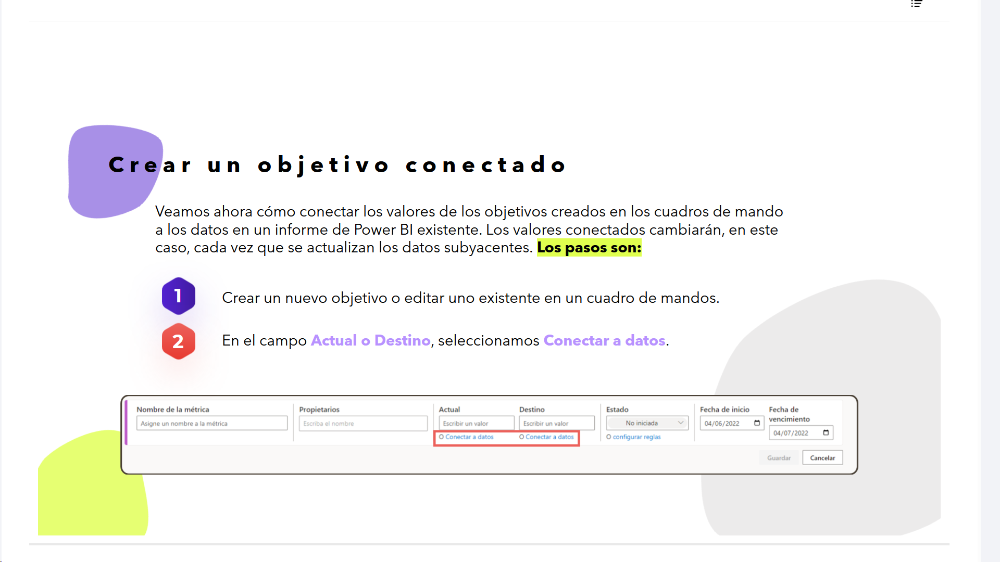
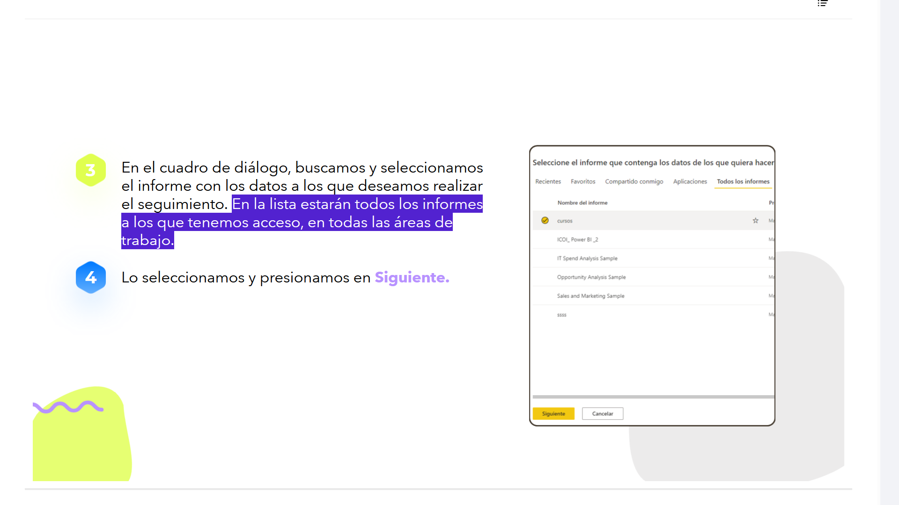
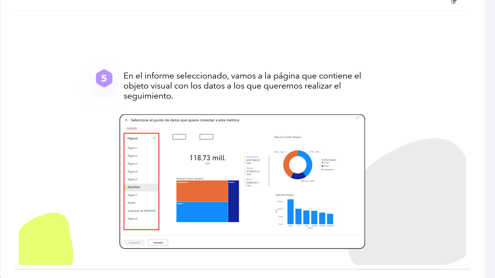
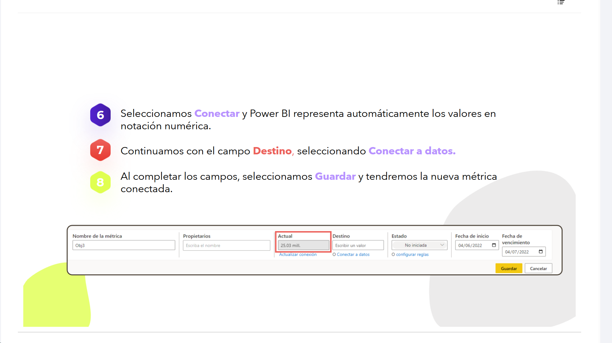

1. 	Crear un nuevo objetivo o editar uno existente en un cuadro de mandos.

2. 	En el campo **Actual o Destino**, seleccionamos **Conectar a datos**.

3. 	En el cuadro de diálogo, buscamos y seleccionamos el informe con los datos a los que deseamos realizar el seguimiento. **En la lista estarán todos los informes a los que tenemos acceso, en todas las áreas de trabajo.**

4. 	Lo seleccionamos y presionamos en **Siguiente.**

5. 	En el informe seleccionado, vamos a la página que contiene el objeto visual con los datos a los que queremos realizar el seguimiento.

6. 	Seleccionamos **Conectar** y Power BI representa automáticamente los valores en notación numérica.

7. 	Continuamos con el campo **Destino**, seleccionando **Conectar a datos.**

8. 	Al completar los campos, seleccionamos **Guardar** y tendremos la nueva métrica conectada.

---

### **Elección de medidas para los objetivos conectados**

> Los objetivos conectados **permiten calcular medidas con los datos**
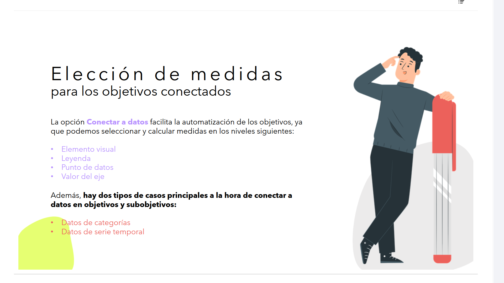

La opción **Conectar a datos** facilita la automatización de los objetivos, ya que podemos seleccionar y calcular medidas en los niveles siguientes:

* Elemento visual
* Leyenda
* Punto de datos
* Valor del eje

Además, **hay dos tipos de casos principales a la hora de conectar a datos en objetivos y subobjetivos:**

1.	Datos de CATEGORIAS
2.	Datos de SERIE TEMPORAL

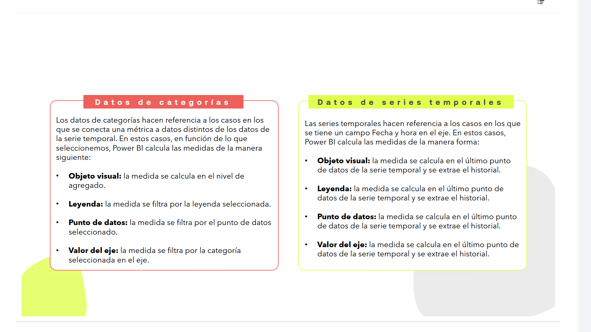

#### 1.	**Datos de categorías**
Los datos de categorías hacen referencia a los casos en los que se conecta una métrica a datos distintos de los datos de la serie temporal. En estos casos, en función de lo que seleccionemos, Power BI calcula las medidas de la manera siguiente:

* **Objeto visual:** la medida se calcula en el nivel de agregado.
* **Leyenda:** la medida se filtra por la leyenda seleccionada.
* **Punto de datos:** la medida se filtra por el punto de datos seleccionado.
* **Valor del eje:** la medida se filtra por la categoría seleccionada en el eje.

#### 2.	**Datos de series temporales**
Las series temporales hacen referencia a los casos en los que se tiene un campo Fecha y hora en el eje. En estos casos, Power BI calcula las medidas de la manera forma:

* **Objeto visual:** la medida se calcula en el último punto de datos de la serie temporal y se extrae el historial.
* **Leyenda:** la medida se calcula en el último punto de datos de la serie temporal y se extrae el historial.
* **Punto de datos:** la medida se calcula en el último punto de datos de la serie temporal y se extrae el historial.
* **Valor del eje:** la medida se calcula en el último punto de datos de la serie temporal y se extrae el historial.

---

### **Visualización de los Objetivos**

> Una vez creados los cuadros de mando, se pueden visualizar sus medidas a los largo del tiempo

Para poder acceder a la visualización de un objetivo, debemos abrir el cuadro de mando y seleccionar el objetivo:  

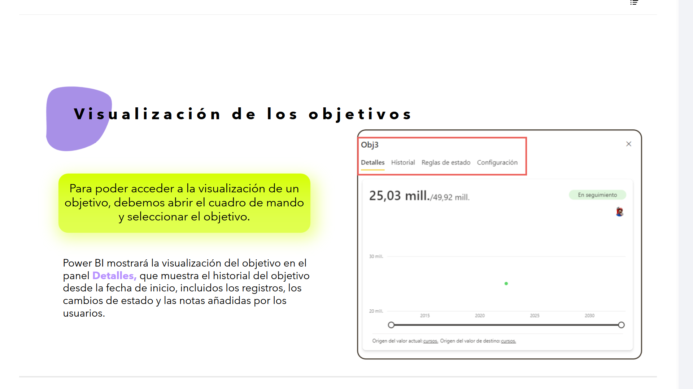

Power BI mostrará la visualización del objetivo en el panel **Detalles**, que muestra el historial del objetivo desde la fecha de inicio, incluidos los registros, los cambios de estado y las notas añadidas por los usuarios.

---

### **Incorporación o actualización de valores manuales**

> Ya en la fase de uso del cuadro de mando, se pueden establecer nuevos valores para el objetivo de forma manual

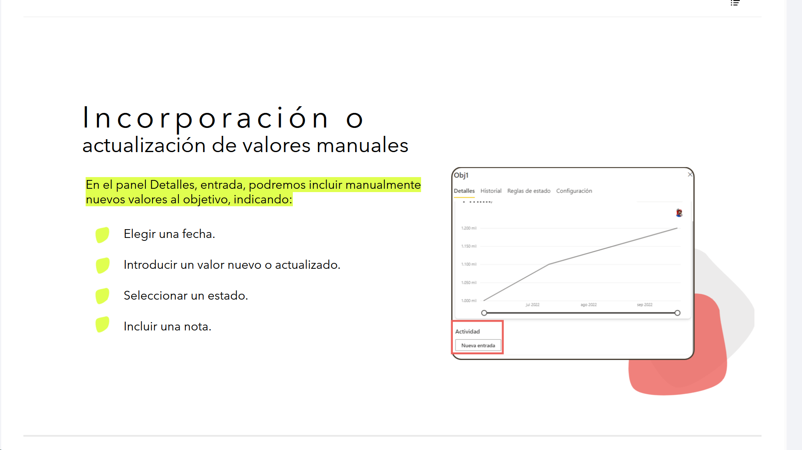

**En el panel Detalles, entrada, podremos incluir manualmente nuevos valores al objetivo, indicando:**

* Elegir una fecha.
* Introducir un valor nuevo o actualizado.
* Seleccionar un estado.
* Incluir una nota.

> Una vez introducidos los datos del nuevo valor, seleccionamos **Guardar** y el valor se incorpora al objetivo.

---

### **Incorporación o actualización de valores conectados**

> Los nuevos valores también pueden ser introducidos de manera automatizada mediante la conexión de los datasets

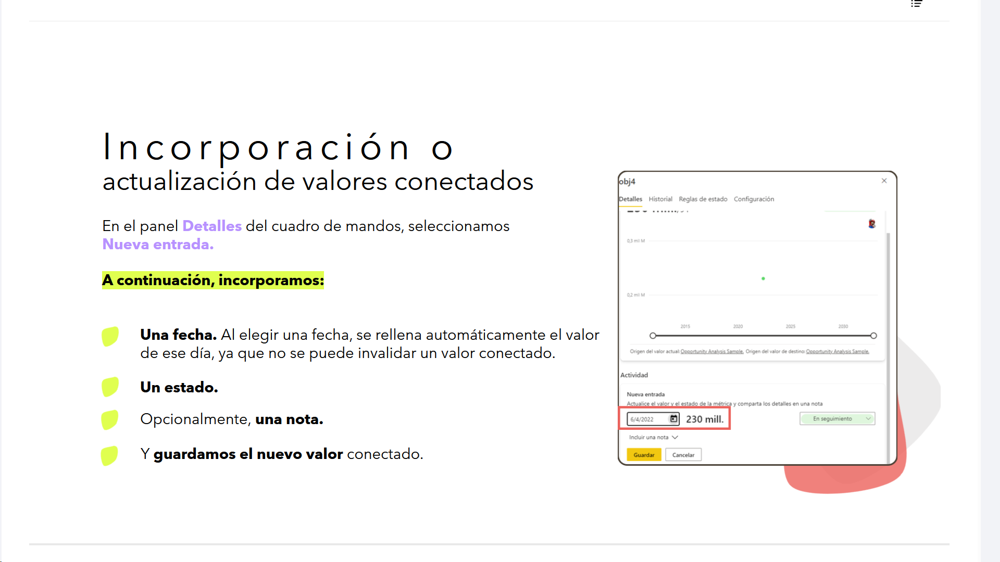

1.	En el panel **Detalles** del cuadro de mandos, seleccionamos **Nueva entrada.**

2.	**A continuación, incorporamos:**  

	- 	**Una fecha.** Al elegir una fecha, se rellena automáticamente el valor de ese día, ya que no se puede invalidar un valor conectado.
	-	**Un estado.**
	-	Opcionalmente, **una nota.**
	
3.	Y **guardamos el nuevo valor** conectado.

---

### **Crear reglas automatizadas**

> Son **reglas que condicionarán el objetivo**

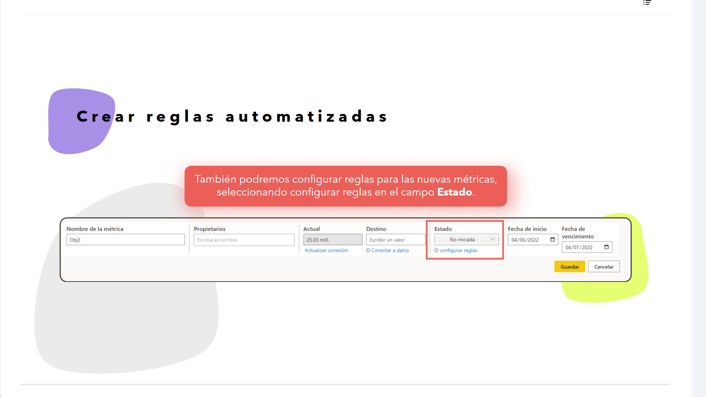

También podremos configurar reglas para las nuevas métricas, seleccionando configurar reglas en el campo **Estado**.

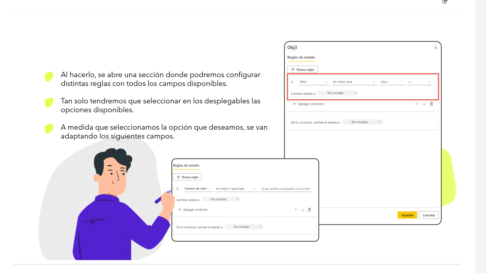

-	Al hacerlo, se abre una sección donde podremos configurar distintas reglas con todos los campos disponibles.

-	Tan solo tendremos que seleccionar en los desplegables las opciones disponibles.

-	A medida que seleccionamos la opción que deseamos, se van adaptando los siguientes campos.

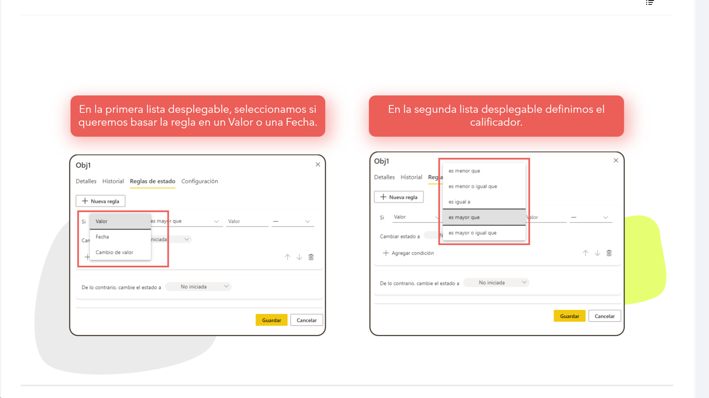

1.	En la primera lista desplegable, seleccionamos si queremos basar la regla en un Valor o una Fecha.

2.	En la segunda lista desplegable definimos el calificador.

3.	**El último valor se basa en la primera lista desplegable.**  

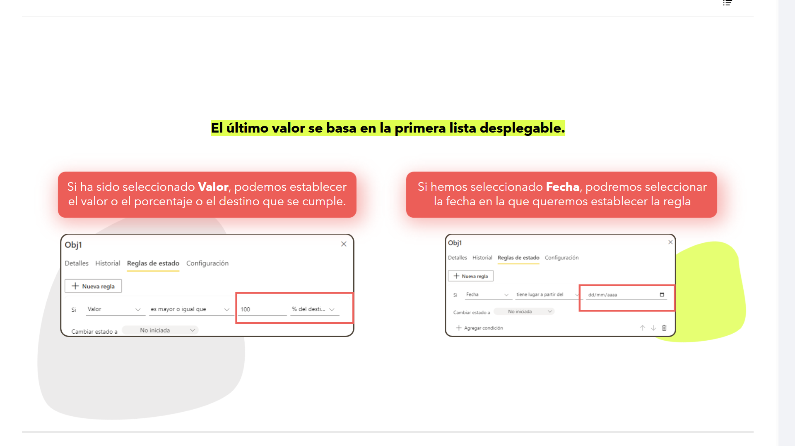

	-	 Si ha sido seleccionado **"Valor"**, podemos establecer el valor o el porcentaje o el destino que se cumple.

	-	 Si hemos seleccionado **"Fecha"**, podremos seleccionar la fecha en la que queremos establecer la regla

4.	Finalmente establecemos el estado que se debe mostrar cuando se cumplen las reglas y también el estado **"De lo contrario"**.

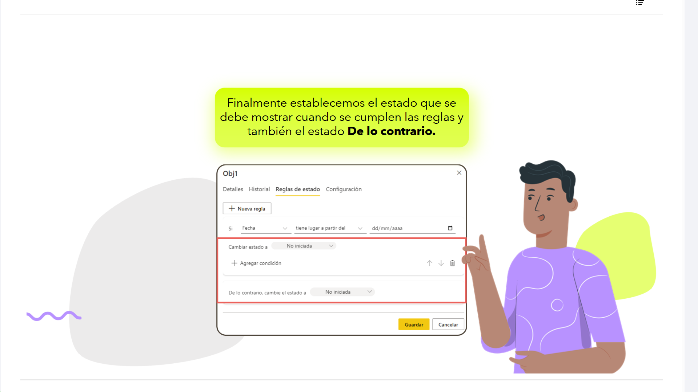

---

## **Compartir un cuadro de mando**

> Una vez creado el cuadro, ya está listo para publicar o ser compartido

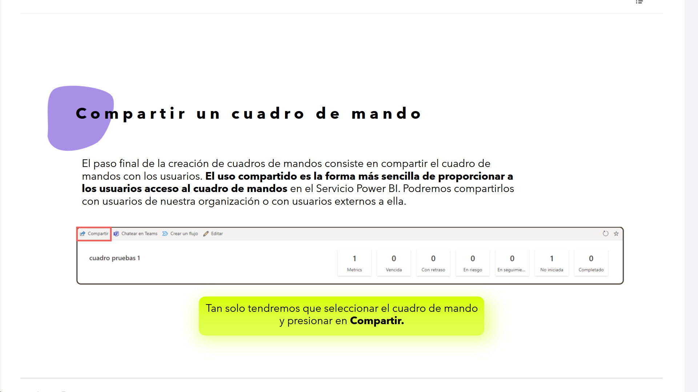

-	El paso final de la creación de cuadros de mandos consiste en compartir el cuadro de mandos con los usuarios. **El uso compartido es la forma más sencilla de proporcionar a los usuarios acceso al cuadro de mandos** en el Servicio Power BI. 

-	Podremos compartirlos con usuarios de nuestra organización o con usuarios externos a ella.

-	Tan solo tendremos que seleccionar el cuadro de mando y presionar en **Compartir**.